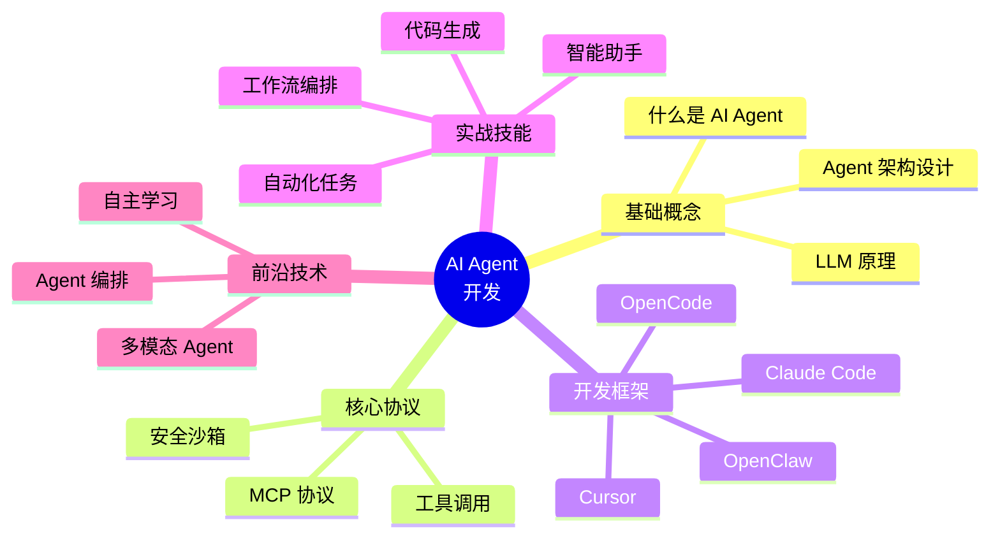

# 🤖 AI Agent 工程师学习笔记

> 从 UI 工程师转型 AI Agent 工程师的学习之路

## 简介

本仓库记录了从零开始学习 AI Agent 开发的过程，涵盖 AI 领域的最新技术、框架和实践。

## 学习路径

本系列文章将带领你系统学习 AI Agent 开发，涵盖以下主题：

## 文章目录

| 日期 | 主题 | 描述 |
|------|------|------|
| Day 1 | 什么是 AI Agent？ | AI Agent 核心概念与架构 |
| Day 2 | MCP 协议 | Model Context Protocol 深度解析 |

## 文章特点

- **图文并茂**：Mermaid 图表 + 代码示例
- **干货满满**：深入原理 + 实际应用
- **与时俱进**：跟随 AI 领域最新潮流
- **实战导向**：提供可运行的代码示例

## 适合人群

- UI/前端工程师想转型 AI 开发
- 对 AI Agent 感兴趣的开发者在
- 希望掌握最新 AI 编程技术的开发者

## 贡献

欢迎提交 Issue 和 PR 改进内容！

## 许可证

MIT License
