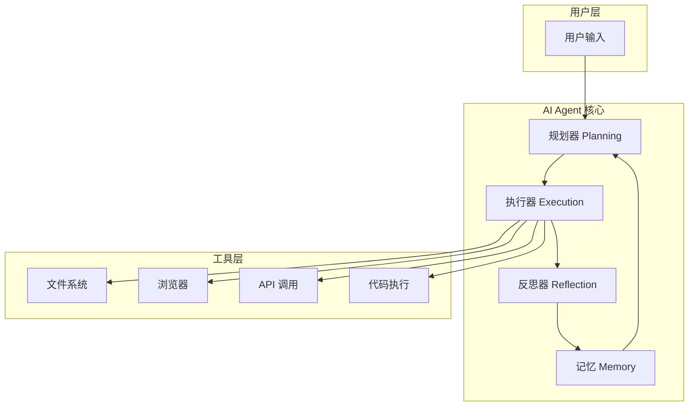
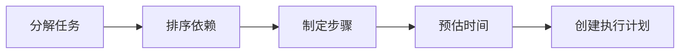
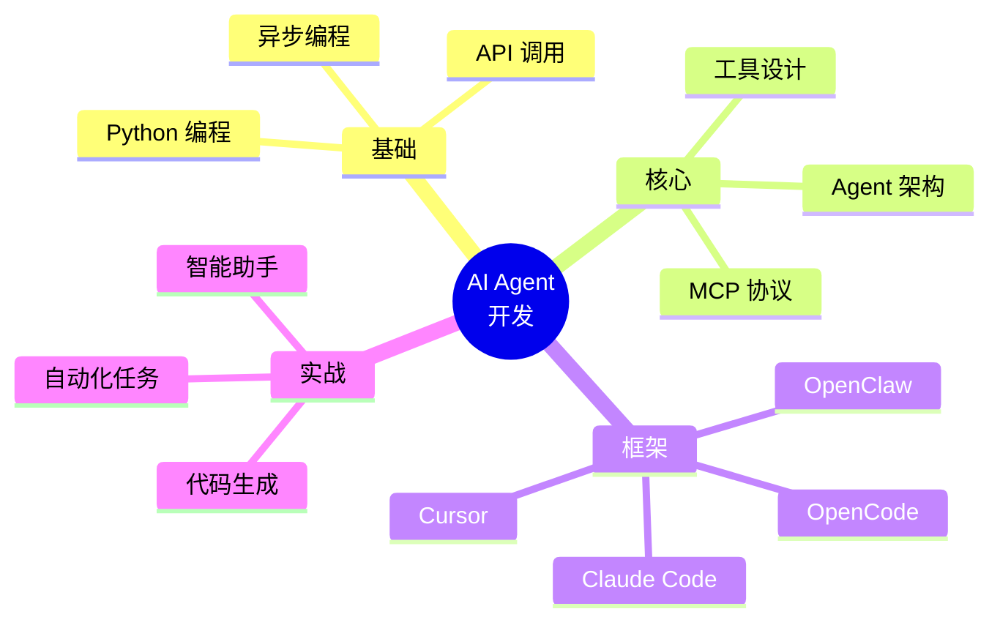

# Day 1: 什么是 AI Agent？

> 从 UI 工程师转型 AI Agent 工程师的第一课

## 什么是 AI Agent？

**AI Agent（AI 代理）** 是一种能够自主理解任务、规划执行步骤、调用工具并完成目标的智能系统。与传统的 AI 对话不同，Agent 具有**自主行动能力**。

## AI Agent 的核心架构



## AI Agent 的四大核心能力

### 1. 感知 (Perception)

```python
# AI Agent 感知层示例
class Perception:
    """感知用户输入和外部环境"""
    
    def __init__(self, model):
        self.model = model
    
    def understand(self, user_input):
        """理解用户意图"""
        prompt = f"""分析用户输入，提取：
        1. 任务目标
        2. 约束条件
        3. 期望结果
        
        用户输入: {user_input}"""
        
        return self.model.generate(prompt)
```

### 2. 规划 (Planning)



```python
# 任务规划示例
class Planner:
    """任务规划器"""
    
    def plan(self, task):
        # 1. 任务分解
        subtasks = self.decompose(task)
        
        # 2. 依赖排序
        ordered = self.sort_by_deps(subtasks)
        
        # 3. 生成执行计划
        return [{
            "step": i+1,
            "action": subtask,
            "tool": self.select_tool(subtask),
            "checkpoint": self.set_checkpoint(subtask)
        } for i, subtask in enumerate(ordered)]
```

### 3. 行动 (Action)

```python
# 执行器示例
class Executor:
    """执行器 - 调用各种工具"""
    
    def __init__(self):
        self.tools = {
            "file_read": file_reader,
            "file_write": file_writer,
            "bash": bash_executor,
            "web_fetch": web_fetcher,
            "browser": browser_controller
        }
    
    async def execute(self, plan_step):
        tool_name = plan_step["tool"]
        tool = self.tools[tool_name]
        
        result = await tool(**plan_step["params"])
        
        # 检查结果是否符合预期
        if self.validate(result, plan_step["checkpoint"]):
            return {"status": "success", "result": result}
        else:
            # 触发重试或调整
            return {"status": "needs_adjustment", "result": result}
```

### 4. 反思 (Reflection)

```python
# 反思器示例
class Reflector:
    """反思器 - 评估和改进"""
    
    def reflect(self, execution_result, original_task):
        # 1. 评估结果
        evaluation = self.evaluate(execution_result)
        
        # 2. 错误处理
        if evaluation.has_errors:
            return self.suggest_fix(evaluation)
        
        # 3. 总结经验
        if evaluation.is_successful:
            self.learn(original_task, execution_result)
        
        return evaluation
```

## AI Agent vs 传统 AI 对比

| 特性 | 传统 AI (ChatBot) | AI Agent |
|------|-------------------|----------|
| **交互方式** | 被动问答 | 主动执行 |
| **工具使用** | ❌ 无 | ✅ 有 |
| **状态管理** | 无状态 | 有状态/记忆 |
| **任务类型** | 单轮对话 | 多步骤复杂任务 |
| **执行流程** | 输入 → 输出 | 感知 → 规划 → 执行 → 反思 |
| **错误处理** | 需要用户重新输入 | 自动重试和调整 |

## 主流 AI Agent 框架

### 1. OpenClaw 🤖

本教程使用的 AI 助手框架，特点：
- 支持多种消息渠道
- 可扩展的 Skills 系统
- 内置记忆管理

```javascript
// OpenClaw Skill 示例
export default {
    name: "my-skill",
    description: "自定义 AI 技能",
    
    tools: {
        // 定义可用的工具
        my_tool: async (params) => {
            // 工具实现
            return { result: "success" };
        }
    },
    
    async handle(context) {
        // 处理用户请求
        const result = await context.callTool("my_tool", context.params);
        return result;
    }
}
```

### 2. Claude Code 💻

Anthropic 的 AI 编程助手，特点：
- 强大的代码理解和生成能力
- 安全优先的设计
- 深度集成开发环境

### 3. Cursor 🔥

AI 增强的 VS Code，特点：
- 实时代码补全
- 智能代码重构
- 对话式编程

### 4. OpenCode 🧑‍💻

开源 AI 编程工具，特点：
- 完全开源可定制
- 支持多种模型
- 本地部署能力强

### 5. MCP (Model Context Protocol) 🔗

让 AI Agent 能够安全调用外部工具的协议：
- 标准化工具接口
- 安全沙箱执行
- 可扩展工具生态

## 我们要学什么？

这个系列文章将涵盖：



## 明日预告

**Day 2: MCP (Model Context Protocol) - AI Agent 的万能接口**

明天我们将深入了解 MCP 协议，学习如何让 AI Agent 调用各种外部工具。

---

*关注我们，每天学习 AI Agent 开发知识！从 UI 工程师转型 AI Agent 工程师！*
