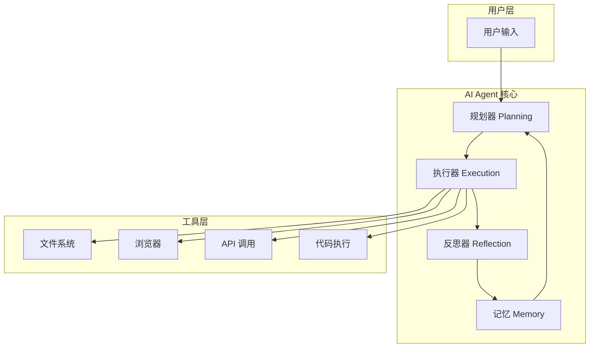
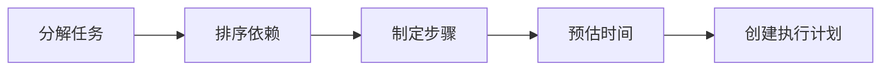
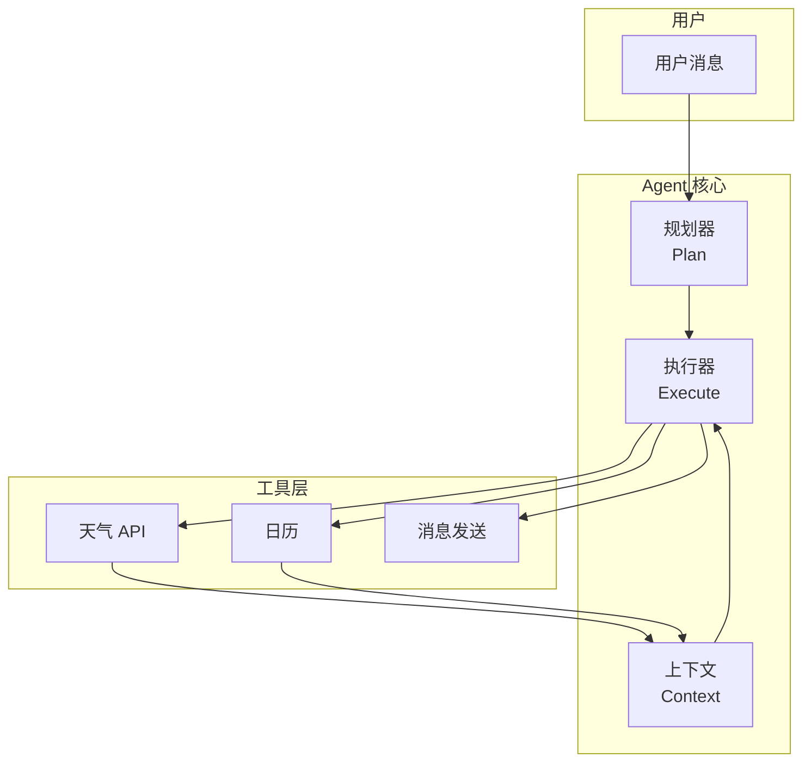
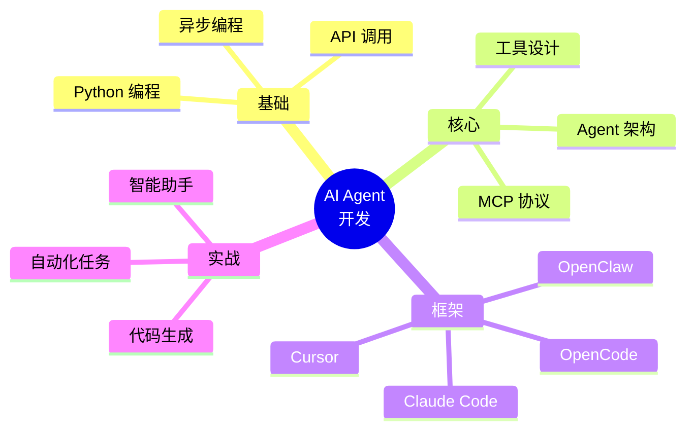

# Day 1: 什么是 AI Agent？

> 从 UI 工程师转型 AI Agent 工程师的第一课

## 什么是 AI Agent？

**AI Agent（AI 代理）** 是一种能够自主理解任务、规划执行步骤、调用工具并完成目标的智能系统。与传统的 AI 对话不同，Agent 具有**自主行动能力**。

## AI Agent 的核心架构



## AI Agent 的四大核心能力

### 1. 感知 (Perception)

AI Agent 通过感知层理解用户输入和环境信息。

```typescript
// TypeScript 示例：感知层
interface UserInput {
  content: string;
  context?: Record<string, unknown>;
}

interface ParsedIntent {
  task: string;           // 任务目标
  constraints: string[];   // 约束条件
  expectedResult: string; // 期望结果
}

class Perception {
  constructor(private llm: LLMClient) {}

  async understand(input: UserInput): Promise<ParsedIntent> {
    const prompt = `分析用户输入，提取：
1. 任务目标
2. 约束条件
3. 期望结果

用户输入: ${input.content}`;

    const result = await this.llm.generate(prompt);
    return this.parseResult(result);
  }

  private parseResult(result: string): ParsedIntent {
    // 解析 LLM 返回的结果
    // 实际实现中需要根据返回格式进行解析
    return {
      task: '',
      constraints: [],
      expectedResult: ''
    };
  }
}
```

```javascript
// JavaScript 示例：简化版感知函数
async function understandUserInput(llm, userMessage) {
  const prompt = `你是意图分析助手。分析以下用户输入，提取任务目标和参数。

用户输入: ${userMessage}

请用 JSON 格式返回：
{
  "intent": "任务类型",
  "entities": { "参数名": "参数值" },
  "confidence": 0.0-1.0
}`;

  const response = await llm.complete(prompt);
  return JSON.parse(response);
}

// 使用示例
const result = await understandUserInput(llm, "帮我查一下北京明天的天气");
console.log(result);
// { intent: "weather", entities: { city: "北京", date: "明天" }, confidence: 0.95 }
```

### 2. 规划 (Planning)

Agent 将复杂任务分解为可执行的步骤。



```typescript
// TypeScript 示例：任务规划器
interface TaskStep {
  id: number;
  description: string;
  tool: string;
  params: Record<string, unknown>;
  dependsOn: number[];
}

interface ExecutionPlan {
  steps: TaskStep[];
  estimatedTime: number;
}

class TaskPlanner {
  constructor(private llm: LLMClient) {}

  async plan(task: string): Promise<ExecutionPlan> {
    const prompt = `将以下任务分解为具体的执行步骤：

任务: ${task}

请用 JSON 格式返回步骤数组，每个步骤包含：
- description: 步骤描述
- tool: 需要的工具
- params: 工具参数
- dependsOn: 依赖的其他步骤ID`;

    const response = await this.llm.generate(prompt);
    const steps = this.parseSteps(response);

    return {
      steps,
      estimatedTime: this.estimateTime(steps)
    };
  }

  private parseSteps(response: string): TaskStep[] {
    // 解析步骤
    return JSON.parse(response);
  }

  private estimateTime(steps: TaskStep[]): number {
    // 简单估算：每步平均 30 秒
    return steps.length * 30;
  }
}
```

```javascript
// JavaScript 示例：简单任务分解
function decomposeTask(task) {
  // 常见任务的模板化分解
  const templates = {
    '天气查询': [
      { tool: 'extract_city', params: ['city'] },
      { tool: 'get_weather', params: ['city'] },
      { tool: 'format_response', params: ['weather'] }
    ],
    '文件处理': [
      { tool: 'read_file', params: ['path'] },
      { tool: 'process_content', params: ['content'] },
      { tool: 'save_file', params: ['path', 'content'] }
    ],
    '搜索信息': [
      { tool: 'search_web', params: ['query'] },
      { tool: 'fetch_content', params: ['url'] },
      { tool: 'summarize', params: ['content'] }
    ]
  };

  // 智能匹配
  for (const [key, steps] of Object.entries(templates)) {
    if (task.includes(key)) {
      return steps;
    }
  }

  // 默认：使用 LLM 动态分解
  return null;
}

// 使用示例
const steps = decomposeTask("帮我查一下上海明天天气");
console.log(steps);
// [
//   { tool: 'extract_city', params: ['city'] },
//   { tool: 'get_weather', params: ['city'] },
//   { tool: 'format_response', params: ['weather'] }
// ]
```

### 3. 行动 (Action)

Agent 通过调用工具来执行任务。

```typescript
// TypeScript 示例：执行器
interface Tool {
  name: string;
  description: string;
  execute(params: Record<string, unknown>): Promise<unknown>;
}

class Executor {
  private tools: Map<string, Tool> = new Map();

  registerTool(tool: Tool) {
    this.tools.set(tool.name, tool);
  }

  async execute(step: TaskStep): Promise<ExecutionResult> {
    const tool = this.tools.get(step.tool);
    if (!tool) {
      return { success: false, error: `Tool ${step.tool} not found` };
    }

    try {
      const result = await tool.execute(step.params);
      return { success: true, result };
    } catch (error) {
      return { success: false, error: String(error) };
    }
  }

  async executePlan(plan: ExecutionPlan): Promise<ExecutionResult[]> {
    const results: ExecutionResult[] = [];

    for (const step of plan.steps) {
      // 检查依赖是否满足
      const depsMet = step.dependsOn.every(
        depId => results[depId]?.success
      );

      if (!depsMet) {
        results.push({
          success: false,
          error: `Dependencies not met for step ${step.id}`
        });
        continue;
      }

      const result = await this.execute(step);
      results.push(result);
    }

    return results;
  }
}
```

```javascript
// JavaScript 示例：简单执行器
class SimpleExecutor {
  constructor(tools = {}) {
    this.tools = tools;
  }

  // 注册工具
  register(name, fn) {
    this.tools[name] = fn;
  }

  // 执行单个步骤
  async executeStep(step) {
    const { tool, params = {} } = step;

    if (!this.tools[tool]) {
      throw new Error(`未知工具: ${tool}`);
    }

    console.log(`🔧 执行: ${step.description || tool}`);
    const result = await this.tools[tool](params);
    console.log(`✅ 完成: ${tool}`);

    return result;
  }

  // 执行计划
  async executePlan(steps) {
    const results = [];

    for (const step of steps) {
      try {
        const result = await this.executeStep(step);
        results.push({ success: true, result });
      } catch (error) {
        results.push({ success: false, error: error.message });
        // 可选择停止或继续
        // break;
      }
    }

    return results;
  }
}

// 使用示例
const executor = new SimpleExecutor({
  get_weather: async ({ city }) => {
    // 模拟天气 API
    return { temp: 20, condition: '晴', city };
  },
  format_response: async ({ weather }) => {
    return `${weather.city}今天天气${weather.condition}，${weather.temp}度`;
  }
});

const plan = [
  { tool: 'get_weather', params: { city: '北京' } },
  { tool: 'format_response', params: {} }
];

const results = await executor.executePlan(plan);
```

### 4. 反思 (Reflection)

Agent 评估执行结果，从错误中学习并改进。

```typescript
// TypeScript 示例：反思器
interface ExecutionResult {
  success: boolean;
  result?: unknown;
  error?: string;
  stepId: number;
}

interface Reflection {
  evaluation: 'success' | 'needs_fix' | 'failed';
  suggestions?: string[];
  learnedLessons?: string[];
}

class Reflector {
  constructor(private llm: LLMClient) {}

  async reflect(
    results: ExecutionResult[],
    originalTask: string
  ): Promise<Reflection> {
    // 1. 检查是否有失败
    const failures = results.filter(r => !r.success);

    if (failures.length === 0) {
      return {
        evaluation: 'success',
        learnedLessons: ['任务成功完成']
      };
    }

    // 2. 分析失败原因
    const analysis = await this.llm.generate(
      `分析以下执行失败的原因，并给出修复建议：

任务: ${originalTask}
失败步骤: ${JSON.stringify(failures)}`
    );

    // 3. 返回反思结果
    return {
      evaluation: failures.length > 0 ? 'needs_fix' : 'failed',
      suggestions: this.parseSuggestions(analysis)
    };
  }

  private parseSuggestions(analysis: string): string[] {
    // 解析 LLM 返回的建议
    return analysis.split('\n').filter(s => s.trim());
  }
}
```

```javascript
// JavaScript 示例：简单反思机制
class SimpleReflector {
  constructor(maxRetries = 3) {
    this.maxRetries = maxRetries;
    this.retryCount = new Map();
  }

  // 检查结果是否成功
  checkResult(result) {
    if (result.success) {
      return { needsRetry: false, reason: null };
    }

    const count = (this.retryCount.get(result.stepId) || 0) + 1;
    this.retryCount.set(result.stepId, count);

    if (count < this.maxRetries) {
      return {
        needsRetry: true,
        reason: `尝试 ${count}/${this.maxRetries}，错误: ${result.error}`
      };
    }

    return { needsRetry: false, reason: '超过最大重试次数' };
  }

  // 生成修复建议
  generateFix(result, context) {
    const suggestions = {
      'network_error': '检查网络连接，或稍后重试',
      'timeout': '增加超时时间或简化请求',
      'invalid_params': '检查参数格式和必填项',
      'not_found': '确认资源是否存在',
      'permission_denied': '检查权限设置'
    };

    const errorType = this.classifyError(result.error);
    return suggestions[errorType] || '请检查错误信息并重试';
  }

  // 错误分类
  classifyError(errorMsg) {
    if (errorMsg.includes('network')) return 'network_error';
    if (errorMsg.includes('timeout')) return 'timeout';
    if (errorMsg.includes('param')) return 'invalid_params';
    if (errorMsg.includes('not found')) return 'not_found';
    if (errorMsg.includes('permission')) return 'permission_denied';
    return 'unknown';
  }
}

// 使用示例
const reflector = new SimpleReflector();

const result = { success: false, error: 'network timeout', stepId: 1 };
const check = reflector.checkResult(result);
console.log(check);
// { needsRetry: true, reason: '尝试 1/3，错误: network timeout' }

const fix = reflector.generateFix(result, {});
console.log(fix);
// '检查网络连接，或稍后重试'
```

## 🎯 实战：一个完整的 JavaScript AI Agent

让我们用一个完整的示例来展示 AI Agent 的工作流程：

```javascript
// 完整的 JavaScript AI Agent 示例

// 1. 定义工具
const tools = {
  // 天气查询工具
  getWeather: async ({ city }) => {
    const weatherDb = {
      '北京': { temp: 15, condition: '晴', humidity: 40 },
      '上海': { temp: 18, condition: '多云', humidity: 65 },
      '广州': { temp: 24, condition: '雨', humidity: 80 },
      '深圳': { temp: 26, condition: '晴', humidity: 70 }
    };
    return weatherDb[city] || { temp: 0, condition: '未知', humidity: 0 };
  },

  // 发送消息工具
  sendMessage: async ({ message, channel }) => {
    console.log(`📤 发送到 ${channel}: ${message}`);
    return { success: true, sent: message };
  },

  // 日历查询工具
  getCalendar: async ({ date }) => {
    return {
      events: [
        { time: '10:00', title: '团队会议' },
        { time: '14:00', title: '代码审查' }
      ]
    };
  }
};

// 2. 任务规划器
async function planTask(userMessage) {
  // 简单规则：基于关键词匹配
  if (userMessage.includes('天气')) {
    const city = userMessage.match(/([北京上海广州深圳]+)/)?.[1] || '北京';
    return [
      { tool: 'getWeather', params: { city } },
      {
        tool: 'sendMessage',
        params: { channel: '用户', message: '{weather}' }
      }
    ];
  }

  if (userMessage.includes('日程') || userMessage.includes('会议')) {
    return [
      { tool: 'getCalendar', params: { date: '今天' } },
      {
        tool: 'sendMessage',
        params: { channel: '用户', message: '{calendar}' }
      }
    ];
  }

  // 默认：直接回复
  return [
    {
      tool: 'sendMessage',
      params: { channel: '用户', message: '我明白您的意思了！' }
    }
  ];
}

// 3. 执行器
class AgentExecutor {
  constructor(tools) {
    this.tools = tools;
  }

  async executeStep(step, context = {}) {
    const { tool, params } = step;

    // 替换占位符
    const resolvedParams = {};
    for (const [key, value] of Object.entries(params)) {
      if (typeof value === 'string' && value.startsWith('{') && value.endsWith('}')) {
        const dataKey = value.slice(1, -1);
        resolvedParams[key] = context[dataKey] || value;
      } else {
        resolvedParams[key] = value;
      }
    }

    return await this.tools[tool](resolvedParams);
  }

  async executePlan(plan) {
    const context = {};

    for (const step of plan) {
      const result = await this.executeStep(step, context);
      // 保存结果到上下文
      const toolName = step.tool.toLowerCase();
      if (toolName.includes('weather')) {
        context.weather = `${result.city}今天${result.condition}，${result.temp}度`;
      } else if (toolName.includes('calendar')) {
        context.calendar = result.events.map(e => `${e.time} - ${e.title}`).join('\n');
      }
    }

    return context;
  }
}

// 4. 运行 Agent
async function runAgent(userMessage) {
  console.log(`\n👤 用户: ${userMessage}`);

  // 规划
  const plan = await planTask(userMessage);
  console.log('📋 计划:', plan.map(s => s.tool).join(' → '));

  // 执行
  const executor = new AgentExecutor(tools);
  const result = await executor.executePlan(plan);

  return result;
}

// 测试
(async () => {
  await runAgent('北京天气怎么样？');
  await runAgent('今天有什么日程？');
})();
```

**输出示例：**

```
👤 用户: 北京天气怎么样？
📋 计划: getWeather → sendMessage
🔧 执行: getWeather
✅ 完成: getWeather
📤 发送到 用户: 北京今天晴，15度

👤 用户: 今天有什么日程？
📋 计划: getCalendar → sendMessage
🔧 执行: getCalendar
✅ 完成: getCalendar
📤 发送到 用户: 10:00 - 团队会议
14:00 - 代码审查
```



## AI Agent vs 传统 AI 对比

| 特性 | 传统 AI (ChatBot) | AI Agent |
|------|-------------------|----------|
| **交互方式** | 被动问答 | 主动执行 |
| **工具使用** | ❌ 无 | ✅ 有 |
| **状态管理** | 无状态 | 有状态/记忆 |
| **任务类型** | 单轮对话 | 多步骤复杂任务 |
| **执行流程** | 输入 → 输出 | 感知 → 规划 → 执行 → 反思 |
| **错误处理** | 需要用户重新输入 | 自动重试和调整 |

## 主流 AI Agent 框架

### 1. OpenClaw 🤖

本教程使用的 AI 助手框架，特点：
- 支持多种消息渠道
- 可扩展的 Skills 系统
- 内置记忆管理

```javascript
// OpenClaw Skill 示例
export default {
    name: "my-skill",
    description: "自定义 AI 技能",
    
    tools: {
        // 定义可用的工具
        my_tool: async (params) => {
            // 工具实现
            return { result: "success" };
        }
    },
    
    async handle(context) {
        // 处理用户请求
        const result = await context.callTool("my_tool", context.params);
        return result;
    }
}
```

### 2. Claude Code 💻

Anthropic 的 AI 编程助手，特点：
- 强大的代码理解和生成能力
- 安全优先的设计
- 深度集成开发环境

### 3. Cursor 🔥

AI 增强的 VS Code，特点：
- 实时代码补全
- 智能代码重构
- 对话式编程

### 4. OpenCode 🧑‍💻

开源 AI 编程工具，特点：
- 完全开源可定制
- 支持多种模型
- 本地部署能力强

### 5. MCP (Model Context Protocol) 🔗

让 AI Agent 能够安全调用外部工具的协议：
- 标准化工具接口
- 安全沙箱执行
- 可扩展工具生态

## 我们要学什么？

这个系列文章将涵盖：



## 明日预告

**Day 2: MCP (Model Context Protocol) - AI Agent 的万能接口**

明天我们将深入了解 MCP 协议，学习如何让 AI Agent 调用各种外部工具。

---

*关注我们，每天学习 AI Agent 开发知识！从 UI 工程师转型 AI Agent 工程师！*
