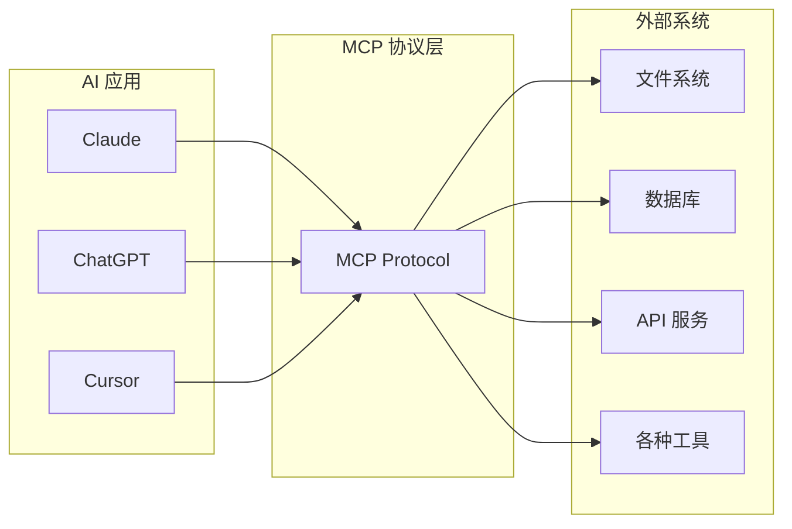
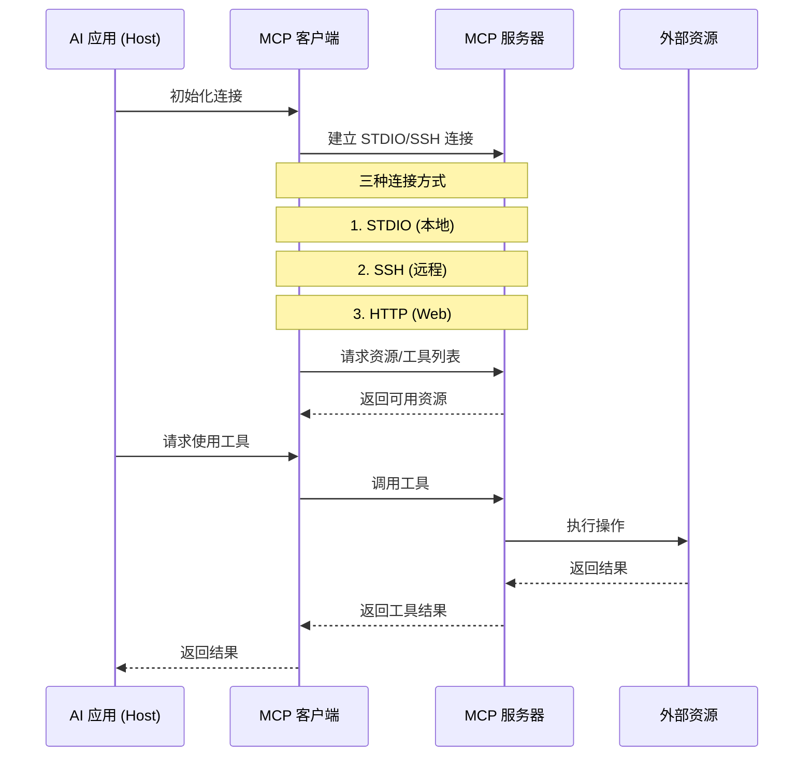
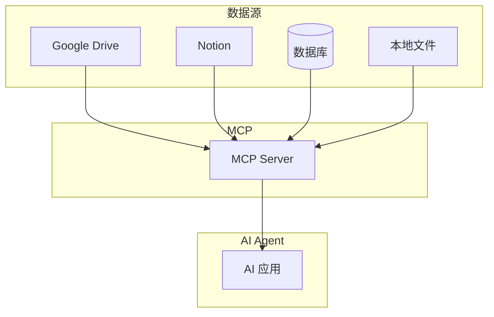
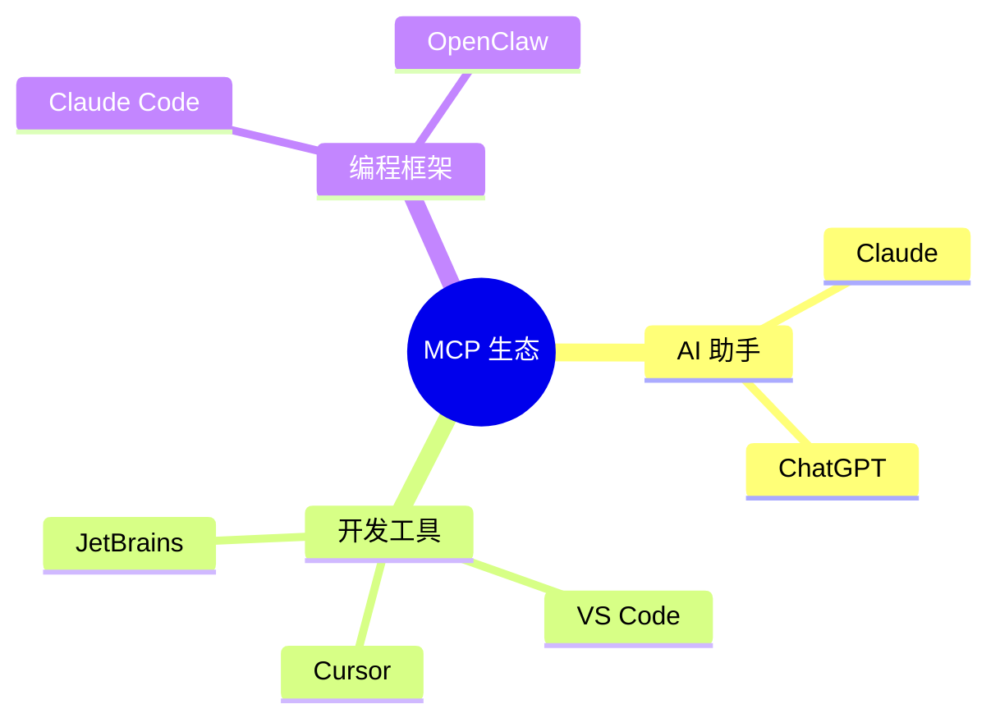
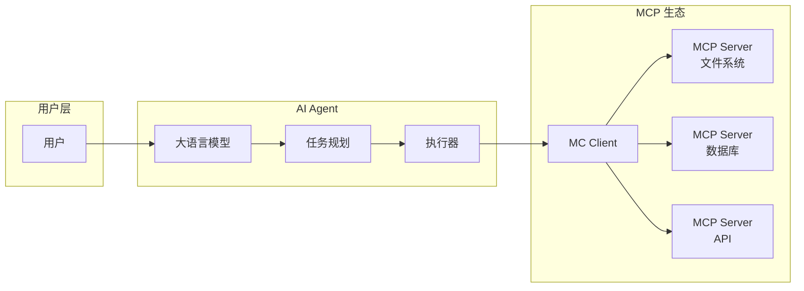

# Day 2: MCP (Model Context Protocol) - AI Agent 的万能接口

> 让 AI 连接世界的神奇协议

## 什么是 MCP？

**MCP (Model Context Protocol)** 是一个开放标准，用于将 AI 应用连接到外部系统。就像 **USB-C** 一样 —— USB-C 提供了连接电子设备的标准化方式，MCP 则提供了连接 AI 应用与外部系统的标准化方式。



## MCP 的核心概念

MCP 采用 **客户端-服务器架构**：



## MCP 能做什么？

### 1. 访问数据源



**实际案例：**
- AI 可以读取 Google Drive 中的设计文档
- AI 可以查询 Notion 数据库中的项目信息
- AI 可以访问企业级数据库进行数据分析

### 2. 调用工具

```typescript
// MCP 工具调用示例 - TypeScript SDK
import { Client } from '@modelcontextprotocol/sdk-client';

// 连接 MCP 服务器
const client = new Client({
  transport: 'stdio',
  command: 'npx',
  args: ['-y', '@modelcontextprotocol/server-filesystem', '/tmp']
});

// 列出可用工具
const tools = await client.listTools();
console.log(tools);
// 输出: ['read_file', 'write_file', 'list_directory', ...]

// 调用工具
const result = await client.callTool('read_file', {
  path: '/path/to/file.txt'
});
console.log(result);
```

```javascript
// JavaScript 示例：MCP 客户端基础使用
import { Client } from '@modelcontextprotocol/sdk-client/index.js';

// 创建 MCP 客户端
const mcpClient = new Client({
  name: 'my-mcp-client',
  version: '1.0.0'
});

// 连接本地 MCP 服务器
await mcpClient.connect({
  transport: 'stdio',
  command: 'npx',
  args: ['-y', '@modelcontextprotocol/server-filesystem', './']
});

// 列出可用资源
const resources = await mcpClient.listResources();
console.log('可用资源:', resources);

// 调用工具
async function readFile(path) {
  const result = await mcpClient.callTool({
    name: 'read_file',
    arguments: { path }
  });
  return result;
}

// 使用示例
const content = await readFile('./README.md');
```

### 3. 自动化工作流

```python
# 创建 MCP 服务器示例
from mcp.server import MCPServer
from mcp.types import Tool, Resource

server = MCPServer(
    name="my-server",
    version="1.0.0"
)

# 定义工具
@server.tool()
def send_email(to: str, subject: str, body: str):
    """发送邮件工具"""
    # 实现发送邮件逻辑
    return {"success": True, "message": "邮件已发送"}

# 定义资源
@server.resource("user://{user_id}")
def get_user(user_id: str):
    """获取用户信息"""
    return {"id": user_id, "name": "示例用户"}

# 运行服务器
server.run()
```

## 主流 MCP 客户端支持



| 客户端 | MCP 支持 | 说明 |
|--------|----------|------|
| **Claude** | ✅ 官方支持 | Anthropic 主力推荐 |
| **ChatGPT** | ✅ 官方支持 | OpenAI 集成中 |
| **Cursor** | ✅ 官方支持 | AI 增强 IDE |
| **VS Code** | ✅ 官方支持 | Microsoft 集成 |
| **Claude Code** | ✅ 官方支持 | CLI 编程工具 |
| **OpenClaw** | ✅ 支持 | 中文 AI 框架 |

## MCP 服务器生态

MCP 官方维护着丰富的服务器生态：

### 1. 文件系统服务器

```bash
# 安装文件系统 MCP 服务器
npm install -g @modelcontextprotocol/server-filesystem

# 配置
{
  "mcpServers": {
    "filesystem": {
      "command": "npx",
      "args": ["-y", "@modelcontextprotocol/server-filesystem", "/path/to/allowed directory"]
    }
  }
}
```

### 2. GitHub 服务器

```bash
# 安装 GitHub MCP 服务器
npm install -g @modelcontextprotocol/server-github

# 配置使用
{
  "mcpServers": {
    "github": {
      "command": "npx",
      "args": ["-y", "@modelcontextprotocol/server-github"],
      "env": {
        "GITHUB_TOKEN": "your-token"
      }
    }
  }
}
```

### 3. 数据库服务器

```bash
# PostgreSQL MCP 服务器
npm install -g @modelcontextprotocol/server-postgres

# MySQL MCP 服务器  
npm install -g @modelcontextprotocol/server-mysql
```

### 4. 更多服务器

| 服务器 | 功能 |
|--------|------|
| `server-brave-search` | Brave 搜索 |
| `server-google-drive` | Google Drive |
| `server-slack` | Slack 消息 |
| `server-sentry` | Sentry 错误追踪 |
| `server-memory` | 知识图谱 |

## 实战：构建自己的 MCP 服务器

### 1. 使用 TypeScript SDK（推荐）

```typescript
// my-mcp-server.ts
import { MCPServer } from "@modelcontextprotocol/typescript-sdk";
import { Tool, Resource } from "@modelcontextprotocol/sdk/types.js";

const server = new MCPServer({
  name: "weather-server",
  version: "1.0.0"
});

// 定义天气查询工具
server.addTool({
  name: "get_weather",
  description: "获取指定城市的天气信息",
  inputSchema: {
    type: "object",
    properties: {
      city: {
        type: "string",
        description: "城市名称"
      }
    },
    required: ["city"]
  },
  handler: async ({ city }) => {
    // 调用天气 API
    const weatherData: Record<string, { temp: number; condition: string }> = {
      '北京': { temp: 15, condition: '晴' },
      '上海': { temp: 18, condition: '多云' },
      '广州': { temp: 24, condition: '雨' },
      '深圳': { temp: 26, condition: '晴' }
    };

    const data = weatherData[city];
    if (!data) {
      return {
        content: [{
          type: "text",
          text: `不支持查询 ${city} 的天气`
        }]
      };
    }

    return {
      content: [{
        type: "text",
        text: `${city}今天${data.condition}，温度${data.temp}°C`
      }]
    };
  }
});

// 定义资源
server.addResource({
  uri: "weather://cities",
  name: "Supported Cities",
  mimeType: "application/json",
  handler: async () => {
    return {
      uri: "weather://cities",
      mimeType: "application/json",
      text: JSON.stringify(["北京", "上海", "广州", "深圳"])
    };
  }
});

server.run();
```

### 2. 使用 JavaScript/Node.js

```javascript
// weather-server.js (纯 JavaScript 版本)
import { Server } from '@modelcontextprotocol/sdk/server/index.js';
import { StdioServerTransport } from '@modelcontextprotocol/sdk/server/stdio.js';
import { CallToolResult, ListToolsResult } from '@modelcontextprotocol-sdk/types.js';

const server = new Server(
  { name: 'weather-server', version: '1.0.0' },
  { capabilities: { tools: {} } }
);

// 天气数据
const weatherData = {
  '北京': { temp: 15, condition: '晴', humidity: 40 },
  '上海': { temp: 18, condition: '多云', humidity: 65 },
  '广州': { temp: 24, condition: '雨', humidity: 80 },
  '深圳': { temp: 26, condition: '晴', humidity: 70 }
};

// 列出可用工具
server.setRequestHandler('tools/list', async (): Promise<ListToolsResult> => {
  return {
    tools: [
      {
        name: 'get_weather',
        description: '获取指定城市的天气信息',
        inputSchema: {
          type: 'object',
          properties: {
            city: {
              type: 'string',
              description: '城市名称'
            }
          },
          required: ['city']
        }
      },
      {
        name: 'list_cities',
        description: '列出所有支持的城市',
        inputSchema: {
          type: 'object',
          properties: {}
        }
      }
    ]
  };
});

// 处理工具调用
server.setRequestHandler('tools/call', async (request): Promise<CallToolResult> => {
  const { name, arguments: args } = request.params;

  if (name === 'get_weather') {
    const { city } = args;
    const data = weatherData[city];

    if (!data) {
      return {
        content: [{
          type: 'text',
          text: `不支持查询 ${city} 的天气`
        }]
      };
    }

    return {
      content: [{
        type: 'text',
        text: JSON.stringify({ city, ...data })
      }]
    };
  }

  if (name === 'list_cities') {
    return {
      content: [{
        type: 'text',
        text: JSON.stringify(Object.keys(weatherData))
      }]
    };
  }

  throw new Error(`Unknown tool: ${name}`);
});

// 启动服务器
const transport = new StdioServerTransport();
await server.connect(transport);
```

### 3. 使用 Python SDK

```python
# weather_server.py
from mcp.server import Server
from mcp.types import Tool, TextContent
from mcp.server.stdio import stdio_server
import asyncio

server = Server("weather-server")

@server.list_tools()
async def list_tools() -> list[Tool]:
    return [
        Tool(
            name="get_weather",
            description="获取指定城市的天气信息",
            inputSchema={
                "type": "object",
                "properties": {
                    "city": {
                        "type": "string",
                        "description": "城市名称"
                    }
                },
                "required": ["city"]
            }
        )
    ]

@server.call_tool()
async def call_tool(name: str, arguments: dict) -> list[TextContent]:
    if name == "get_weather":
        city = arguments["city"]
        # 这里调用天气 API
        weather_data = {"temp": 20, "condition": "晴"}
        
        return [TextContent(
            type="text",
            text=f"{city}当前天气：{weather_data['condition']}，温度{weather_data['temp']}°C"
        )]
    
    raise ValueError(f"Unknown tool: {name}")

async def main():
    async with stdio_server() as streams:
        await server.run(
            streams[0],
            streams[1],
            server.create_initialization_options()
        )

if __name__ == "__main__":
    asyncio.run(main())
```

## MCP 在 AI Agent 中的应用



**典型工作流程：**

1. **用户请求**："帮我分析这个项目的代码质量"
2. **LLM 理解**：需要读取文件、执行命令、分析代码
3. **MCP 调用**：通过文件系统 MCP 读取代码
4. **执行反馈**：返回结果给 LLM
5. **生成报告**：LLM 生成分析报告

## 为什么开发者应该学习 MCP？

| 角色 | MCP 的价值 |
|------|------------|
| **AI 开发者** | 快速构建 Agent 应用 |
| **工具开发者** | 让 AI 能用你的工具 |
| **企业开发者** | 安全连接内部系统 |
| **个人开发者** | 打造个性化 AI 助手 |

## 明日预告

**Day 3: Claude Code - AI 编程助手的极致体验**

明天我们将深入了解 Anthropic 的 Claude Code，学习如何用它来提升开发效率。

---

*关注我们，每天学习 AI Agent 开发知识！从 UI 工程师转型 AI Agent 工程师！*
