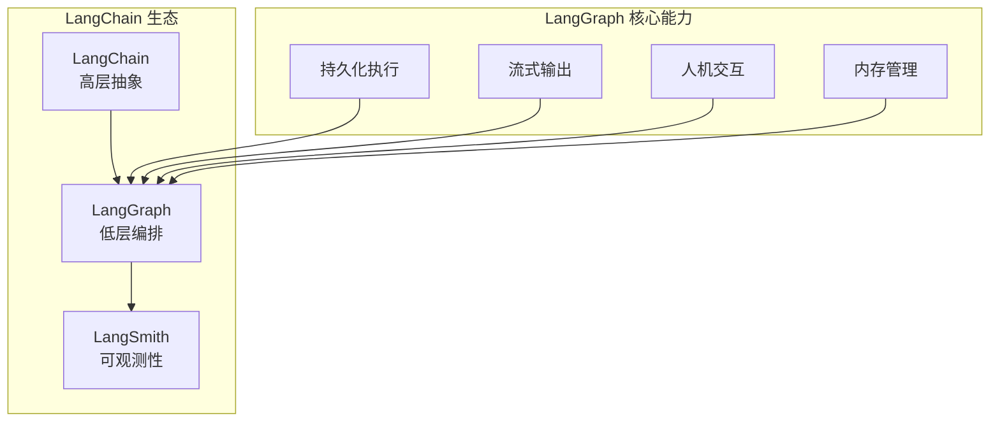
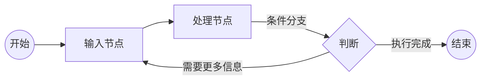
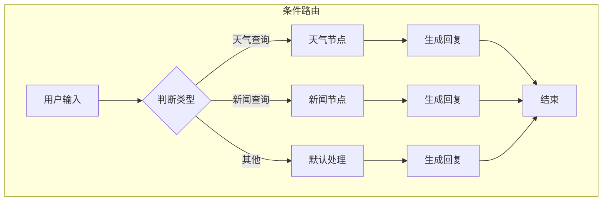
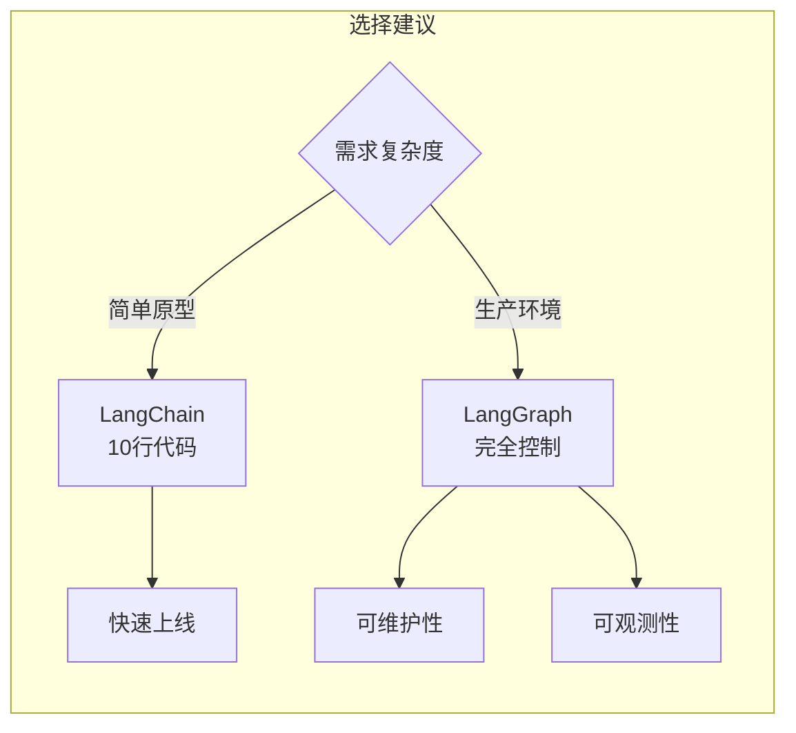
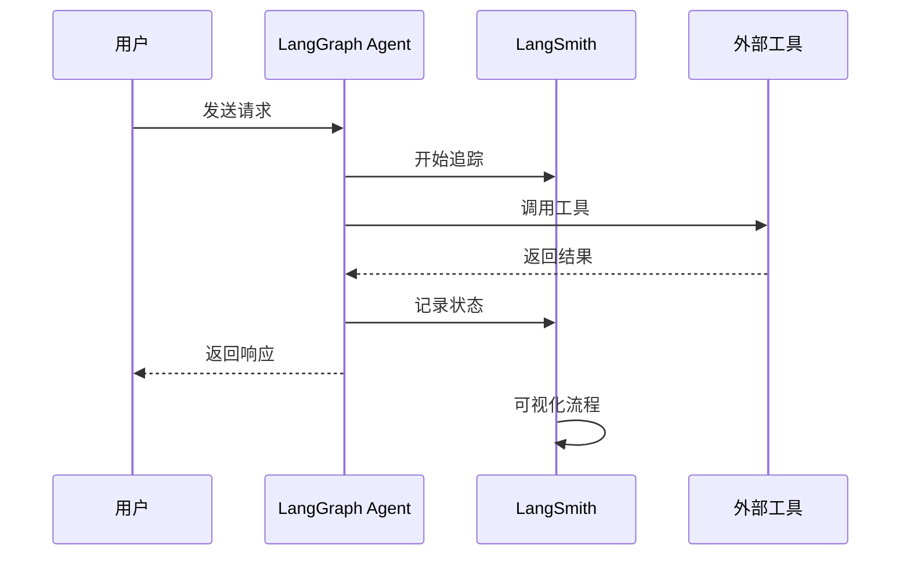

# Day 4: LangGraph - 生产级 AI Agent 的构建框架

> 构建可靠、可观测、可部署的 AI Agent

## 什么是 LangGraph？

**LangGraph** 是 LangChain 团队推出的低层编排框架，专为构建**生产级**AI Agent 而设计。与 LangChain 的高层抽象不同，LangGraph 让你完全控制 Agent 的工作流。



## 为什么要学 LangGraph？

| 特性 | LangChain | LangGraph |
|------|-----------|-----------|
| **抽象级别** | 高层 | 低层 |
| **控制力** | 有限 | 完全掌控 |
| **适用场景** | 快速原型 | 生产环境 |
| **工作流** | 线性 | 循环/条件分支 |
| **状态管理** | 基础 | 高级 |

## LangGraph 核心概念

### 1. State（状态）

状态是贯穿整个 Agent 的数据流：

```python
from typing import TypedDict, Annotated
from langgraph.graph import StateGraph, MessagesState

# 定义 Agent 状态
class AgentState(TypedDict):
    """Agent 的状态定义"""
    messages: list  # 对话历史
    context: str    # 外部上下文
    next_action: str  # 下一步动作
```

### 2. Nodes（节点）

节点是执行特定任务的函数：

```python
# 定义一个简单的处理节点
def process_input(state: AgentState) -> AgentState:
    """处理用户输入"""
    user_message = state["messages"][-1]
    
    return {
        "messages": state["messages"],
        "context": f"处理了: {user_message['content']}",
        "next_action": "analyze"
    }

# 定义分析节点
def analyze_task(state: AgentState) -> AgentState:
    """分析任务并决定下一步"""
    return {
        "next_action": "execute"
    }
```

### 3. Edges（边）

边定义了节点之间的连接关系：



```python
from langgraph.graph import StateGraph, START, END

# 创建图
graph = StateGraph(AgentState)

# 添加节点
graph.add_node("process", process_input)
graph.add_node("analyze", analyze_task)

# 定义边
graph.add_edge(START, "process")
graph.add_edge("process", "analyze")
graph.add_edge("analyze", END)

# 编译图
agent = graph.compile()
```

## 实战：构建一个天气查询 Agent

### 完整代码示例

```python
from typing import TypedDict
from langgraph.graph import StateGraph, START, END
from langchain_openai import ChatOpenAI
from langchain_core.messages import HumanMessage, AIMessage

# ============== 1. 定义状态 ==============
class WeatherAgentState(TypedDict):
    """天气查询 Agent 状态"""
    messages: list              # 对话历史
    city: str | None           # 查询的城市
    weather: str | None        # 天气结果
    needs_more_info: bool      # 是否需要更多信息

# ============== 2. 创建 LLM ==============
llm = ChatOpenAI(model="gpt-4o")

# ============== 3. 定义节点函数 ==============
def extract_city(state: WeatherAgentState) -> WeatherAgentState:
    """从用户输入中提取城市信息"""
    last_message = state["messages"][-1]["content"]
    
    # 简单的城市提取（实际可用 NLP）
    cities = ["北京", "上海", "广州", "深圳", "杭州", "成都"]
    
    found_city = None
    for city in cities:
        if city in last_message:
            found_city = city
            break
    
    return {
        "city": found_city,
        "needs_more_info": found_city is None
    }

def fetch_weather(state: WeatherAgentState) -> WeatherAgentState:
    """调用天气 API 获取天气信息"""
    city = state["city"]
    
    # 模拟天气 API 调用
    weather_data = {
        "北京": "晴，15°C",
        "上海": "多云，18°C",
        "广州": "雨，22°C",
        "深圳": "晴，24°C",
        "杭州": "阴，16°C",
        "成都": "多云，14°C"
    }
    
    weather = weather_data.get(city, "未知")
    
    return {"weather": weather}

def ask_for_city(state: WeatherAgentState) -> WeatherAgentState:
    """请求用户补充城市信息"""
    return {
        "messages": state["messages"] + [
            {"role": "ai", "content": "请告诉我您想查询哪个城市的天气？"}
        ]
    }

def generate_response(state: WeatherAgentState) -> WeatherAgentState:
    """生成最终回复"""
    city = state["city"]
    weather = state["weather"]
    
    response = f"{city}的天气情况：{weather}"
    
    return {
        "messages": state["messages"] + [
            {"role": "ai", "content": response}
        ]
    }

# ============== 4. 构建图 ==============
graph = StateGraph(WeatherAgentState)

# 添加节点
graph.add_node("extract_city", extract_city)
graph.add_node("fetch_weather", fetch_weather)
graph.add_node("ask_for_city", ask_for_city)
graph.add_node("generate_response", generate_response)

# 添加边
graph.add_edge(START, "extract_city")

# 条件边：根据是否需要更多信息决定分支
def route_based_on_info(state: WeatherAgentState) -> str:
    if state["needs_more_info"]:
        return "ask_for_city"
    return "fetch_weather"

graph.add_conditional_edges(
    "extract_city",
    route_based_on_info,
    {
        "ask_for_city": "ask_for_city",
        "fetch_weather": "fetch_weather"
    }
)

# 循环边：询问城市后重新提取
graph.add_edge("ask_for_city", "extract_city")
graph.add_edge("fetch_weather", "generate_response")
graph.add_edge("generate_response", END)

# ============== 5. 编译并运行 ==============
weather_agent = graph.compile()

# 运行 Agent
result = weather_agent.invoke({
    "messages": [{"role": "user", "content": "北京天气怎么样？"}],
    "city": None,
    "weather": None,
    "needs_more_info": False
})

print(result["messages"])
```

## 条件逻辑与分支

LangGraph 的强大之处在于支持复杂的条件分支：



```python
from langgraph.graph import StateGraph, START
from enum import Enum

class QueryType(str, Enum):
    WEATHER = "weather"
    NEWS = "news"
    GENERAL = "general"

def classify_query(state: AgentState) -> AgentState:
    """分类用户查询"""
    query = state["messages"][-1]["content"]
    
    if "天气" in query:
        query_type = QueryType.WEATHER
    elif "新闻" in query:
        query_type = QueryType.NEWS
    else:
        query_type = QueryType.GENERAL
    
    return {"query_type": query_type}

def route_query(state: AgentState) -> str:
    """根据查询类型路由"""
    return state["query_type"].value

# 使用条件边
graph.add_conditional_edges(
    "classify",
    route_query,
    {
        "weather": "weather_node",
        "news": "news_node", 
        "general": "general_node"
    }
)
```

## 持久化与状态恢复

LangGraph 支持 Agent 状态持久化，这在长时间运行的 Agent 中非常重要：

```python
from langgraph.checkpoint.sqlite import SqliteSaver
import sqlite3

# 创建持久化存储
conn = sqlite3.connect("agent_state.db", check_same_thread=False)
memory = SqliteSaver(conn)

# 编译带持久化的 Agent
agent = graph.compile(checkpointer=memory)

# 首次运行
config = {"configurable": {"thread_id": "user-123"}}
result = agent.invoke(
    {"messages": [{"role": "user", "content": "我的名字是小明"}]},
    config
)

# 后续运行（状态自动恢复）
result = agent.invoke(
    {"messages": [{"role": "user", "content": "你知道我叫什么吗？"}]},
    config
)
```

## 人机交互（Human-in-the-Loop）

在生产环境中，有时需要人类介入：

```python
from langgraph.types import interrupt

def human_review(state: AgentState) -> AgentState:
    """请求人工审核"""
    # 中断执行，等待人类确认
    human_feedback = interrupt({
        "task": "审核以下内容",
        "content": state.get("pending_content"),
        "options": ["批准", "拒绝", "修改"]
    })
    
    return {
        "human_feedback": human_feedback,
        "status": "reviewed"
    }

def process_approval(state: AgentState) -> AgentState:
    """根据人工反馈处理"""
    if state["human_feedback"] == "批准":
        return {"final_status": "approved"}
    elif state["human_feedback"] == "拒绝":
        return {"final_status": "rejected"}
    else:
        return {"final_status": "needs_revision"}
```

## LangGraph 与 LangChain 的选择



| 场景 | 推荐 |
|------|------|
| 快速原型验证 | LangChain |
| 需要精细控制执行流程 | LangGraph |
| 需要多轮对话状态 | LangGraph |
| 需要人类审核节点 | LangGraph |
| 需要持久化恢复 | LangGraph |
| 生产级部署 | LangGraph |

## 可观测性：LangSmith

LangGraph 与 LangSmith 无缝集成：

```python
import os
os.environ["LANGSMITH_TRACING"] = "true"
os.environ["LANGSMITH_API_KEY"] = "your-api-key"

# 运行 Agent 后，在 LangSmith dashboard 查看：
# - 每个节点的执行时间
# - 状态转换流程
# - 错误详情
# - Token 消耗
```



## 明日预告

**Day 5: OpenClaw - 构建你的专属 AI 助手**

明天我们将学习如何用 OpenClaw 构建自定义 AI 助手，这是我们本系列的核心框架！

---

*关注我们，每天学习 AI Agent 开发知识！从 UI 工程师转型 AI Agent 工程师！*
