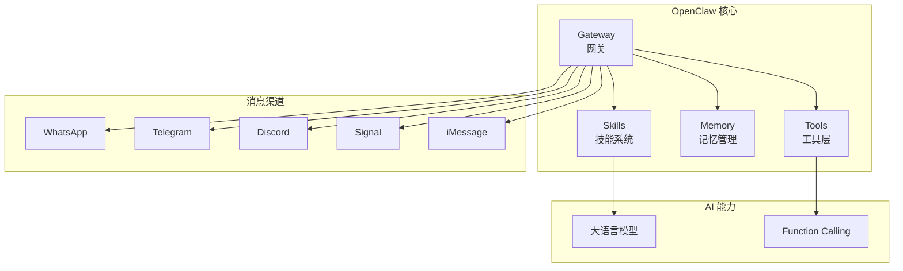
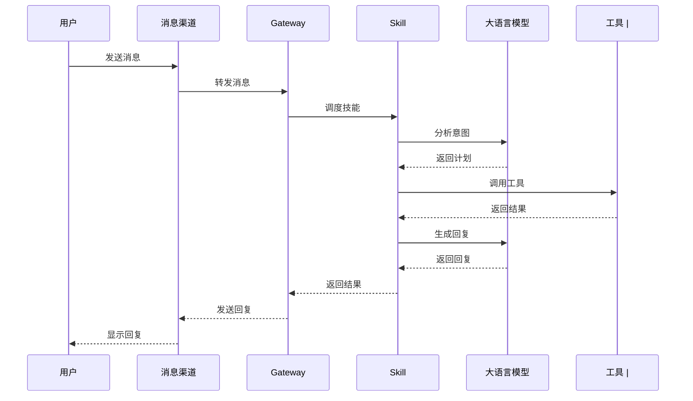
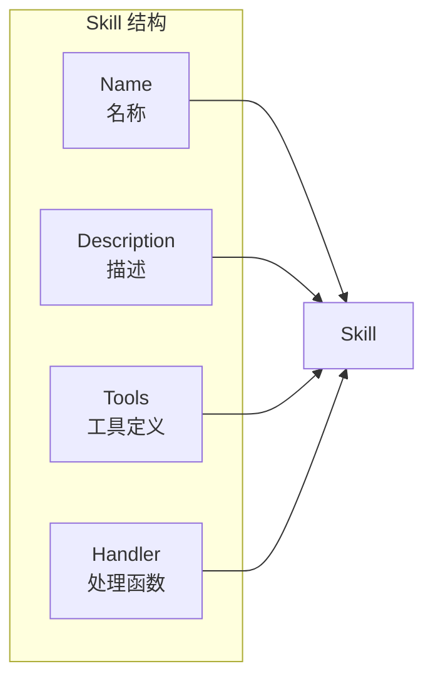
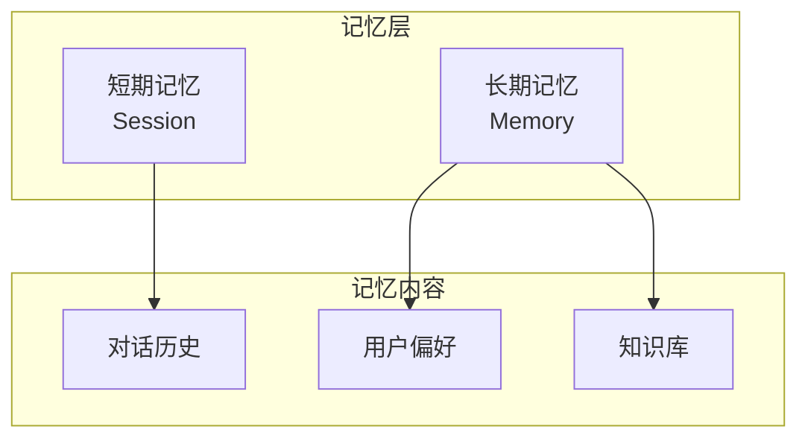
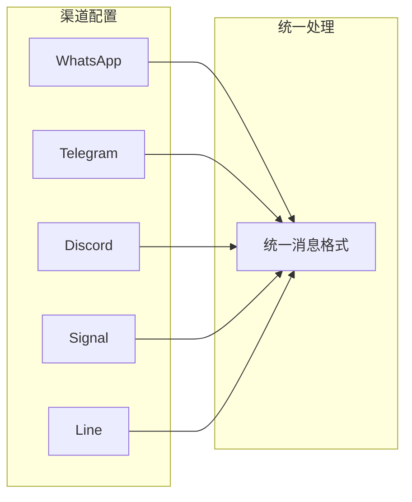
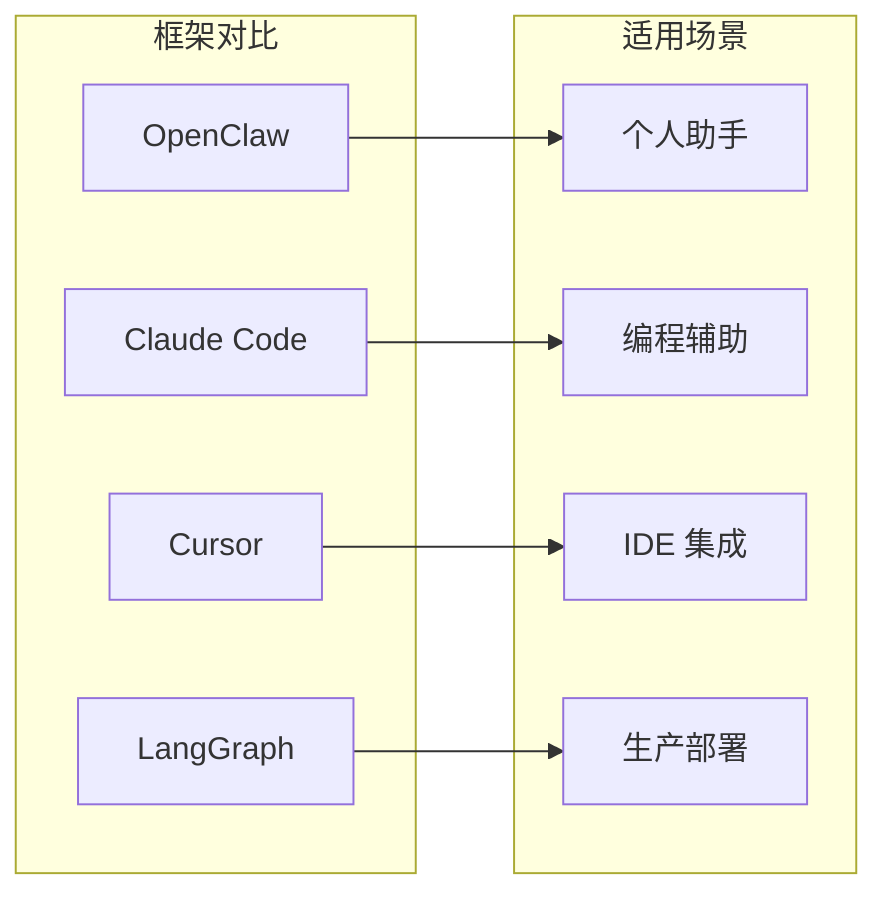
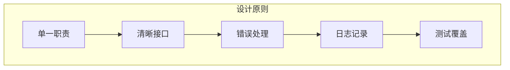

# Day 5: OpenClaw - 构建你的专属 AI 助手

> 本教程核心框架，中文开源 AI Agent 平台

## 什么是 OpenClaw？

**OpenClaw** 是一个功能强大、可扩展的 AI Agent 框架，专为中文开发者设计。它支持多种消息渠道、可扩展的 Skills 系统、内置记忆管理和强大的工具调用能力。



## 为什么选择 OpenClaw？

| 特性 | 说明 |
|------|------|
| **中文优化** | 专为中文开发者设计 |
| **多渠道** | 支持 WhatsApp、Telegram、Discord 等 |
| **Skills 系统** | 可扩展的插件架构 |
| **记忆管理** | 内置长期记忆和短期记忆 |
| **开源免费** | MIT 许可证 |

## OpenClaw 核心架构

### 1. Gateway（网关）

Gateway 是 OpenClaw 的核心，负责：
- 消息路由
- 会话管理
- 技能调度



### 2. Skills（技能系统）

Skills 是 OpenClaw 的可扩展模块，每个 Skill 是一个独立的功能单元：



## OpenClaw 实战：构建天气查询助手

### 1. 安装 OpenClaw

```bash
# 使用 npm 安装
npm install -g openclaw-cn

# 或使用 npx
npx openclaw-cn
```

### 2. 创建项目

```bash
# 初始化新项目
openclaw init my-agent

# 目录结构
my-agent/
├── skills/
│   └── weather/
│       ├── SKILL.md
│       └── index.js
├── memory/
├── config.yaml
└── README.md
```

### 3. 定义 Skill

```javascript
// skills/weather/index.js
export default {
    // Skill 名称
    name: "weather",
    
    // Skill 描述
    description: "查询城市天气信息",
    
    // 可用工具
    tools: {
        // 定义天气查询工具
        get_weather: async ({ city }) => {
            // 调用天气 API（这里使用模拟数据）
            const weatherData = {
                "北京": { temp: 15, condition: "晴", humidity: 40 },
                "上海": { temp: 18, condition: "多云", humidity: 65 },
                "广州": { temp: 22, condition: "雨", humidity: 80 },
                "深圳": { temp: 24, condition: "晴", humidity: 70 },
                "杭州": { temp: 16, condition: "阴", humidity: 55 },
                "成都": { temp: 14, condition: "多云", humidity: 75 }
            };
            
            const data = weatherData[city];
            
            if (!data) {
                return { 
                    success: false, 
                    message: `抱歉，暂时不支持查询 ${city} 的天气` 
                };
            }
            
            return {
                success: true,
                city,
                temp: data.temp,
                condition: data.condition,
                humidity: data.humidity,
                advice: getAdvice(data.condition, data.temp)
            };
        }
    },
    
    // 处理用户请求
    async handle(context) {
        const { message, params } = context;
        
        // 提取城市参数
        const city = params.city || extractCityFromMessage(message);
        
        if (!city) {
            return {
                message: "请告诉我您想查询哪个城市的天气？",
                params: { waiting_for: "city" }
            };
        }
        
        // 调用工具获取天气
        const weather = await context.callTool("get_weather", { city });
        
        // 生成回复
        if (weather.success) {
            return {
                message: `${weather.city}今日天气：${weather.condition}，温度 ${weather.temp}°C，湿度 ${weather.humidity}%。${weather.advice}`
            };
        } else {
            return { message: weather.message };
        }
    }
};

// 辅助函数：根据天气状况给出建议
function getAdvice(condition, temp) {
    if (condition === "雨") {
        return "记得带伞哦！";
    } else if (condition === "晴") {
        return "适合户外活动，注意防晒。";
    } else if (temp > 25) {
        return "天气较热，注意补水。";
    } else if (temp < 10) {
        return "天气较凉，注意保暖。";
    }
    return "";
}

// 从消息中提取城市
function extractCityFromMessage(message) {
    const cities = ["北京", "上海", "广州", "深圳", "杭州", "成都"];
    for (const city of cities) {
        if (message.includes(city)) {
            return city;
        }
    }
    return null;
}
```

### 4. SKILL.md 文档

```markdown
# Weather Skill

## 描述
查询城市天气信息

## 工具
- `get_weather(city: string)` - 获取城市天气

## 使用示例
- "北京天气怎么样"
- "上海今天天气"
- "查询广州天气"
```

### 5. 配置 Skill

```yaml
# config.yaml
skills:
  - path: ./skills/weather
    enabled: true
```

## OpenClaw 的记忆系统

OpenClaw 内置强大的记忆管理功能：



### 使用记忆

```javascript
// 在 Skill 中使用记忆
export default {
    name: "remember",
    description: "记住用户信息",
    
    async handle(context) {
        const { message, memory } = context;
        
        // 读取用户偏好
        const preferences = await memory.get("preferences");
        
        // 存储用户信息
        await memory.set("last_city", message.city);
        
        // 搜索相关记忆
        const related = await memory.search("喜欢的餐厅");
        
        return { 
            message: "我已经记住您的偏好了！",
            memory: { preferences, related }
        };
    }
};
```

## 多渠道支持

OpenClaw 支持多种消息渠道：



### 配置 WhatsApp

```yaml
# config.yaml
channels:
  whatsapp:
    enabled: true
    qr_code: true  # 显示二维码连接
    
  telegram:
    enabled: true
    bot_token: "${TELEGRAM_BOT_TOKEN}"
```

### 配置 Telegram

```yaml
# config.yaml
channels:
  telegram:
    enabled: true
    bot_token: "your-bot-token"
    
    # 可选：配置命令
    commands:
      - command: /start
        description: 开始使用
      - command: /help
        description: 帮助信息
```

## OpenClaw 的工具生态

OpenClaw 提供了丰富的内置工具：

### 1. 文件操作

```javascript
// 读取文件
const content = await context.tools.file.read({
    path: "./README.md"
});

// 写入文件
await context.tools.file.write({
    path: "./output.txt",
    content: "Hello World"
});
```

### 2. 执行命令

```javascript
// 运行 shell 命令
const result = await context.tools.bash({
    command: "ls -la",
    timeout: 30
});
```

### 3. 网页抓取

```javascript
// 获取网页内容
const content = await context.tools.web_fetch({
    url: "https://example.com",
    maxChars: 5000
});
```

### 4. 浏览器控制

```javascript
// 控制浏览器
await context.tools.browser({
    action: "open",
    url: "https://google.com"
});

// 截图
const screenshot = await context.tools.browser({
    action: "screenshot"
});
```

## 构建更复杂的 Agent

### 1. 任务规划 Agent

```javascript
// skills/planner/index.js
export default {
    name: "planner",
    description: "智能任务规划助手",
    
    async handle(context) {
        const { message, tools } = context;
        
        // 使用 LLM 分析任务
        const plan = await context.llm.analyze(message, {
            system: `你是一个任务规划助手。
            将用户请求分解为具体的执行步骤。
            每个步骤需要指定：动作、工具、参数`
        });
        
        // 执行计划
        const results = [];
        for (const step of plan.steps) {
            const result = await tools[step.tool](step.params);
            results.push({ step: step.name, result });
            
            // 检查是否需要调整
            if (result.needs_adjustment) {
                plan = await context.llm.adjust(plan, result);
            }
        }
        
        // 生成最终回复
        return await context.llm.summarize(message, results);
    }
};
```

### 2. 多轮对话 Agent

```javascript
// skills/conversation/index.js
export default {
    name: "conversation",
    description: "多轮对话助手",
    
    // 定义对话状态
    state: {
        waiting_for: null,  // 等待用户输入什么
        context: {},        // 对话上下文
        history: []         // 对话历史
    },
    
    async handle(context) {
        const { message, state } = context;
        
        // 检查是否等待特定输入
        if (state.waiting_for) {
            return await this.handlePendingInput(context);
        }
        
        // 理解用户意图
        const intent = await context.llm.classify(message);
        
        // 根据意图处理
        switch (intent) {
            case "weather_query":
                return await this.handleWeather(context);
            case "news_query":
                return await this.handleNews(context);
            case "general":
            default:
                return await this.handleGeneral(context);
        }
    },
    
    async handleWeather(context) {
        const city = extractCity(context.message);
        
        if (!city) {
            // 需要更多信息
            context.state.waiting_for = "city";
            return { 
                message: "请问您想查询哪个城市的天气？",
                state: context.state
            };
        }
        
        // 获取天气
        const weather = await context.callTool("get_weather", { city });
        
        return {
            message: formatWeather(weather),
            state: { ...context.state, waiting_for: null }
        };
    }
};
```

## OpenClaw 与其他框架对比



| 特性 | OpenClaw | Claude Code | Cursor | LangGraph |
|------|----------|-------------|--------|-----------|
| **定位** | 通用 Agent 平台 | AI 编程助手 | AI 增强 IDE | Agent 编排框架 |
| **学习曲线** | 低 | 中 | 低 | 高 |
| **扩展性** | 高 | 中 | 低 | 高 |
| **中文支持** | 优秀 | 一般 | 一般 | 一般 |
| **多渠道** | 丰富 | 无 | 无 | 无 |

## OpenClaw 的最佳实践

### 1. Skill 设计原则



### 2. 错误处理

```javascript
// 良好的错误处理
export default {
    name: "safe-skill",
    
    async handle(context) {
        try {
            // 业务逻辑
            const result = await riskyOperation();
            return { success: true, data: result };
            
        } catch (error) {
            // 记录错误
            console.error("Skill error:", error);
            
            // 返回友好错误信息
            return {
                success: false,
                message: "抱歉，处理您的请求时出现了问题，请稍后再试。",
                error: process.env.DEBUG ? error.message : undefined
            };
        }
    }
};
```

### 3. 配置管理

```yaml
# 环境配置
environment:
  NODE_ENV: development
  
# 敏感信息使用环境变量
secrets:
  api_key: "${OPENAI_API_KEY}"
  telegram_token: "${TELEGRAM_BOT_TOKEN}"
  
# 可配置参数
settings:
  max_retries: 3
  timeout: 30000
  default_language: zh-CN
```

## 明日预告

**Day 6: Multi-Agent 系统 - 多个 AI Agent 协同工作**

明天我们将学习如何构建多 Agent 协作系统，让多个 AI Agent 协同完成复杂任务！

---

*关注我们，每天学习 AI Agent 开发知识！从 UI 工程师转型 AI Agent 工程师！*
