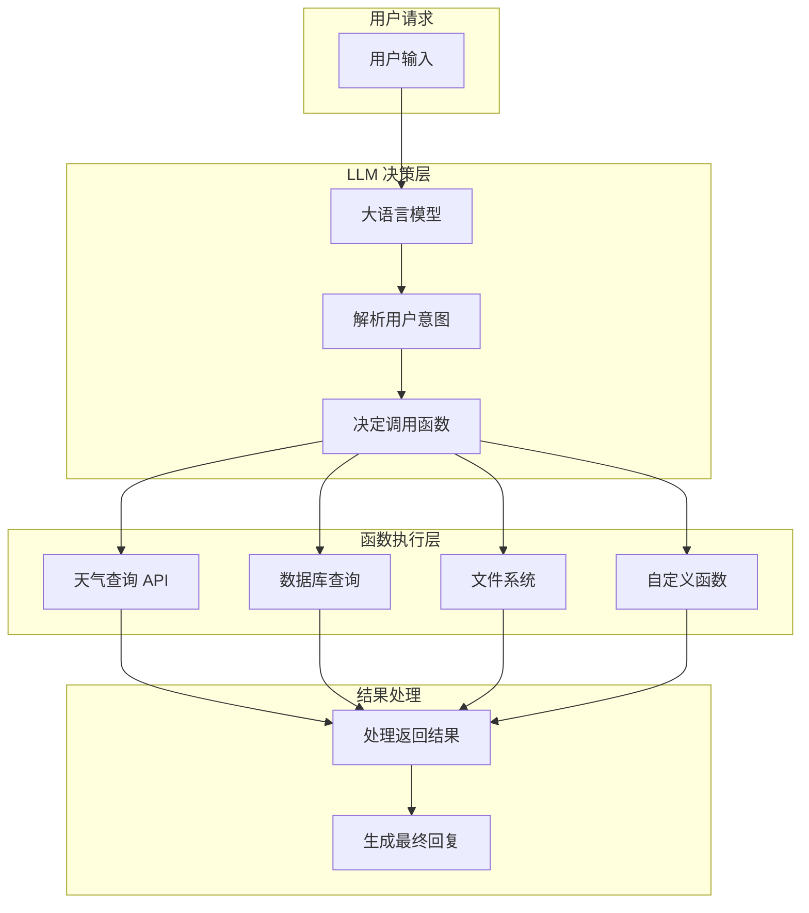
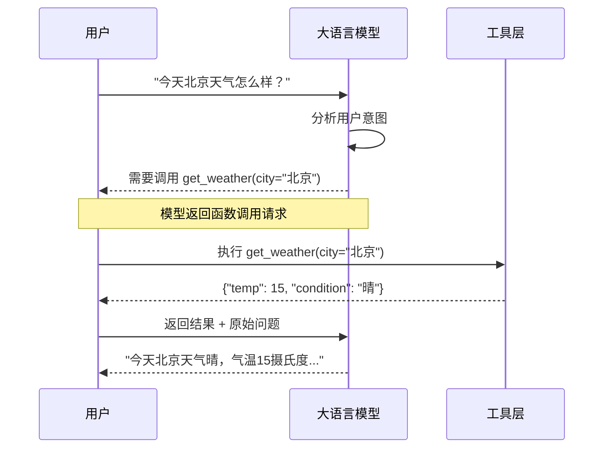
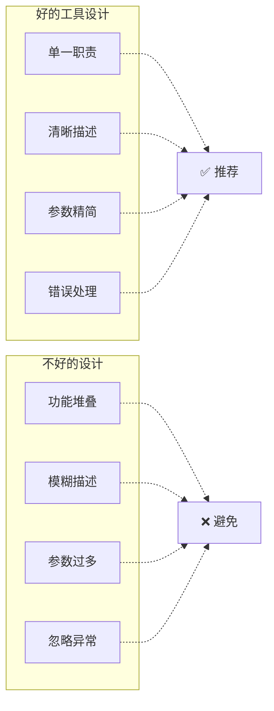
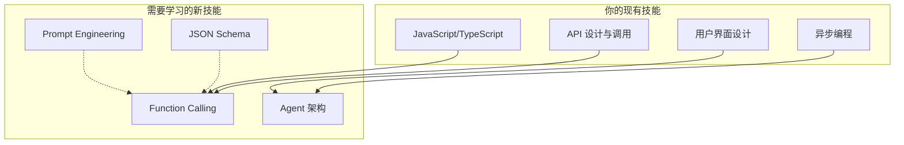

# Day 6: Function Calling - AI Agent 的工具调用核心

> 深入理解 LLM 与外部世界交互的桥梁

## 什么是 Function Calling？

**Function Calling（函数调用）** 是 LLM 与外部世界交互的核心能力。它让 AI 能够：
- 调用外部 API 获取实时数据
- 执行特定操作（如发送邮件、查询数据库）
- 访问文件系统、浏览器等系统工具
- 动态决定需要调用哪些工具

简单来说，Function Calling 就是让 LLM 能够"行动"而不仅仅是"思考"。



## Function Calling 的工作原理

### 1. 函数定义（Tool Schema）

首先，我们需要定义可用的函数。LLM 通过函数 schema 理解每个函数的功能：

```json
{
  "name": "get_weather",
  "description": "获取指定城市的天气信息",
  "parameters": {
    "type": "object",
    "properties": {
      "city": {
        "type": "string",
        "description": "城市名称，如北京、上海"
      },
      "unit": {
        "type": "string",
        "enum": ["celsius", "fahrenheit"],
        "description": "温度单位"
      }
    },
    "required": ["city"]
  }
}
```

### 2. LLM 决策流程



## 主流 LLM 的 Function Calling

### OpenAI GPT-4

```python
from openai import OpenAI
import json

client = OpenAI(api_key="your-api-key")

# 定义工具
tools = [
    {
        "type": "function",
        "function": {
            "name": "get_weather",
            "description": "获取城市天气",
            "parameters": {
                "type": "object",
                "properties": {
                    "city": {"type": "string", "description": "城市名"}
                },
                "required": ["city"]
            }
        }
    }
]

# 第一次调用 - 让模型决定是否调用函数
response = client.chat.completions.create(
    model="gpt-4",
    messages=[{"role": "user", "content": "北京天气怎么样？"}],
    tools=tools
)

# 检查是否有函数调用
if response.choices[0].message.tool_calls:
    # 提取函数名和参数
    call = response.choices[0].message.tool_calls[0]
    func_name = call.function.name
    args = json.loads(call.function.arguments)
    
    print(f"调用函数: {func_name}")
    print(f"参数: {args}")
    
    # 执行函数并获取结果
    if func_name == "get_weather":
        # 这里调用实际的天气 API
        result = {"temp": 18, "condition": "晴朗"}
    
    # 第二次调用 - 将结果返回给模型
    final_response = client.chat.completions.create(
        model="gpt-4",
        messages=[
            {"role": "user", "content": "北京天气怎么样？"},
            {"role": "assistant", "tool_calls": [call]},
            {"role": "tool", "content": json.dumps(result), "tool_call_id": call.id}
        ]
    )
    
    print(final_response.choices[0].message.content)
```

### Anthropic Claude

Claude 通过 **Tool Use** 实现类似功能：

```python
from anthropic import Anthropic

client = Anthropic(api_key="your-api-key")

# 定义工具（Claude 格式）
tools = [
    {
        "name": "get_weather",
        "description": "获取指定城市的天气信息",
        "input_schema": {
            "type": "object",
            "properties": {
                "city": {"type": "string", "description": "城市名称"}
            },
            "required": ["city"]
        }
    }
]

# 发送消息
message = client.messages.create(
    model="claude-sonnet-4-20250514",
    max_tokens=1024,
    tools=tools,
    messages=[{"role": "user", "content": "今天上海天气怎么样？"}]
)

# 检查是否需要工具调用
if message.stop_reason == "tool_use":
    for block in message.content:
        if block.type == "tool_use":
            print(f"调用工具: {block.name}")
            print(f"输入: {block.input}")
            
            # 执行工具
            result = {"temperature": 20, "condition": "多云"}
            
            # 将结果返回给模型
            message = client.messages.create(
                model="claude-sonnet-4-20250514",
                max_tokens=1024,
                tools=tools,
                messages=[
                    {"role": "user", "content": "今天上海天气怎么样？"},
                    {"role": "assistant", "content": message.content},
                    {
                        "role": "user",
                        "content": [
                            {
                                "type": "tool_result",
                                "tool_use_id": block.id,
                                "content": json.dumps(result)
                            }
                        ]
                    }
                ]
            )
            
            print(message.content[0].text)
```

### Google Gemini

```python
from google import genai

client = genai.Client(api_key="your-api-key")

# 定义函数声明
function_declarations = [
    {
        "name": "get_weather",
        "description": "获取城市天气",
        "parameters": {
            "type": "object",
            "properties": {
                "city": {"type": "string"}
            },
            "required": ["city"]
        }
    }
]

# 配置工具
config = {
    "tools": [{"function_declarations": function_declarations}]
}

# 发送消息
response = client.models.generate_content(
    model="gemini-2.0-flash",
    contents="北京天气如何？",
    config=config
)

# 检查函数调用
if response.candidates[0].content.parts[0].function_call:
    call = response.candidates[0].content.parts[0].function_call
    print(f"调用: {call.name}")
    print(f"参数: {call.args}")
```

## 实战：构建一个多功能 Agent

让我们构建一个完整的 Agent，支持多种工具调用：

```python
import json
from typing import List, Optional
from dataclasses import dataclass
from enum import Enum

# ============================================
# 1. 定义工具系统
# ============================================

@dataclass
class Tool:
    """工具定义"""
    name: str
    description: str
    parameters: dict
    handler: callable

# 模拟的外部服务
class WeatherService:
    """天气服务模拟"""
    def get(self, city: str) -> dict:
        weather_db = {
            "北京": {"temp": 15, "condition": "晴"},
            "上海": {"temp": 18, "condition": "多云"},
            "广州": {"temp": 25, "condition": "雨"},
        }
        return weather_db.get(city, {"temp": 0, "condition": "未知"})

class SearchService:
    """搜索服务模拟"""
    def search(self, query: str) -> List[str]:
        # 模拟搜索结果
        return [
            f"关于 {query} 的结果1",
            f"关于 {query} 的结果2", 
            f"关于 {query} 的结果3"
        ]

# 初始化服务
weather_service = WeatherService()
search_service = SearchService()

# 定义工具列表
TOOLS: List[Tool] = [
    Tool(
        name="get_weather",
        description="获取城市天气信息",
        parameters={
            "type": "object",
            "properties": {
                "city": {"type": "string", "description": "城市名称"}
            },
            "required": ["city"]
        },
        handler=lambda args: weather_service.get(args["city"])
    ),
    Tool(
        name="web_search",
        description="搜索互联网获取信息",
        parameters={
            "type": "object",
            "properties": {
                "query": {"type": "string", "description": "搜索关键词"}
            },
            "required": ["query"]
        },
        handler=lambda args: search_service.search(args["query"])
    ),
    Tool(
        name="calculate",
        description="执行数学计算",
        parameters={
            "type": "object",
            "properties": {
                "expression": {"type": "string", "description": "数学表达式"}
            },
            "required": ["expression"]
        },
        handler=lambda args: {"result": eval(args["expression"])}
    ),
]

# ============================================
# 2. 构建 Tool Executor
# ============================================

class ToolExecutor:
    """工具执行器"""
    
    def __init__(self, tools: List[Tool]):
        self.tools = {t.name: t for t in tools}
    
    def execute(self, tool_name: str, arguments: dict) -> dict:
        """执行工具并返回结果"""
        if tool_name not in self.tools:
            return {"error": f"未知工具: {tool_name}"}
        
        tool = self.tools[tool_name]
        try:
            result = tool.handler(arguments)
            return {"success": True, "data": result}
        except Exception as e:
            return {"success": False, "error": str(e)}
    
    def get_schema(self) -> list:
        """获取工具 schema（供 LLM 使用）"""
        return [
            {
                "type": "function",
                "function": {
                    "name": t.name,
                    "description": t.description,
                    "parameters": t.parameters
                }
            }
            for t in self.tools
        ]

# ============================================
# 3. 构建简单的 Agent
# ============================================

class SimpleAgent:
    """简单的 Function Calling Agent"""
    
    def __init__(self, llm_client, executor: ToolExecutor):
        self.llm = llm_client
        self.executor = executor
        self.conversation_history = []
    
    def chat(self, user_message: str) -> str:
        """处理用户消息"""
        # 添加用户消息到历史
        self.conversation_history.append({
            "role": "user", 
            "content": user_message
        })
        
        # 调用 LLM（这里需要替换为实际的 LLM 调用）
        # response = self.llm.chat(
        #     messages=self.conversation_history,
        #     tools=self.executor.get_schema()
        # )
        
        # 模拟 LLM 决策
        response = self._mock_llm_response(user_message)
        
        # 检查是否有函数调用
        if response.get("tool_calls"):
            for call in response["tool_calls"]:
                tool_name = call["name"]
                arguments = call["arguments"]
                
                # 执行工具
                result = self.executor.execute(tool_name, arguments)
                
                # 将结果添加到对话
                self.conversation_history.append({
                    "role": "assistant",
                    "content": None,
                    "tool_calls": [call]
                })
                self.conversation_history.append({
                    "role": "tool",
                    "content": json.dumps(result),
                    "tool_call_id": call["id"]
                })
            
            # 再次调用 LLM 生成最终回复
            # final_response = self.llm.chat(
            #     messages=self.conversation_history,
            #     tools=self.executor.get_schema()
            # )
            final_response = {"content": "工具调用完成，已返回结果。"}
            
            return final_response.get("content", "处理完成")
        
        return response.get("content", "好的，我明白了。")
    
    def _mock_llm_response(self, message: str) -> dict:
        """模拟 LLM 响应 - 实际使用时替换为真实 LLM 调用"""
        if "天气" in message:
            return {
                "tool_calls": [{
                    "id": "call_1",
                    "name": "get_weather",
                    "arguments": {"city": "北京"}
                }]
            }
        elif "搜索" in message:
            return {
                "tool_calls": [{
                    "id": "call_2", 
                    "name": "web_search",
                    "arguments": {"query": message.replace("搜索", "")}
                }]
            }
        elif "计算" in message or "等于" in message:
            import re
            match = re.search(r'(\d+[+\-*/]\d+)', message)
            if match:
                return {
                    "tool_calls": [{
                        "id": "call_3",
                        "name": "calculate",
                        "arguments": {"expression": match.group(1)}
                    }]
                }
        return {"content": "我明白了，还有什么可以帮您？"}

# ============================================
# 4. 使用示例
# ============================================

def demo():
    """演示 Agent 功能"""
    executor = ToolExecutor(TOOLS)
    
    # 创建一个 mock LLM 客户端
    class MockLLM:
        pass
    
    agent = SimpleAgent(MockLLM(), executor)
    
    # 测试各种场景
    print("=" * 50)
    print("Agent 测试开始")
    print("=" * 50)
    
    test_inputs = [
        "北京天气怎么样？",
        "搜索 AI 的最新发展",
        "计算 100 + 200 等于多少"
    ]
    
    for user_input in test_inputs:
        print(f"\n👤 用户: {user_input}")
        response = agent.chat(user_input)
        print(f"🤖 Agent: {response}")

if __name__ == "__main__":
    demo()
```

## Function Calling 的最佳实践

### 1. 工具设计原则



| 原则 | 说明 | 示例 |
|------|------|------|
| **单一职责** | 每个工具只做一件事 | `get_weather` 而不是 `get_weather_and_send_email` |
| **清晰描述** | description 要能帮助 LLM 理解何时使用 | "获取城市天气，注意是真实数据" |
| **参数精简** | 只暴露必要参数 | 城市天气只需要 city，不需要 timezone |
| **类型明确** | 使用正确的 JSON Schema 类型 | "integer" 而不是 string |

### 2. 错误处理

```python
def safe_execute(tool_executor, tool_name: str, arguments: dict) -> dict:
    """安全的工具执行包装"""
    try:
        result = tool_executor.execute(tool_name, arguments)
        
        # 检查执行结果
        if not result.get("success"):
            return {
                "status": "error",
                "message": f"工具执行失败: {result.get('error')}",
                "recoverable": True  # 可恢复错误可以重试
            }
        
        return {
            "status": "success",
            "data": result.get("data")
        }
        
    except Exception as e:
        return {
            "status": "error", 
            "message": f"执行异常: {str(e)}",
            "recoverable": False
        }
```

### 3. 递归调用防护

```python
MAX_TOOL_CALLS = 10  # 最大工具调用次数

def chat_with_limit(agent, user_message: str, max_calls: int = MAX_TOOL_CALLS):
    """带调用次数限制的对话"""
    call_count = 0
    
    while call_count < max_calls:
        response = agent.step(user_message)
        
        if response.needs_tool_call():
            tool_call = response.get_tool_call()
            result = execute_tool(tool_call)
            
            # 将结果返回给 agent
            agent.feed_tool_result(tool_call.id, result)
            call_count += 1
        else:
            # 没有更多工具调用，返回最终响应
            return response.get_content()
    
    return "已达到最大调用次数限制，请重新描述您的需求。"
```

## UI 工程师的转型路径

作为 UI 工程师，你已经具备了很好的基础：



### 学习资源推荐

1. **官方文档**
   - [OpenAI Function Calling](https://platform.openai.com/docs/guides/function-calling)
   - [Anthropic Tool Use](https://docs.anthropic.com/en/docs/tool-use)
   - [Google Gemini Tools](https://ai.google.dev/docs/tool_concepts)

2. **实践项目**
   - 尝试为一个天气 API 构建 Function Calling
   - 创建一个支持数据库查询的 Agent
   - 集成多个工具构建多功能助手

3. **关键概念**
   - JSON Schema：理解参数定义
   - ReAct 模式：Reasoning + Acting
   - Tool Selection：让 LLM 选择合适的工具

## 总结

Function Calling 是 AI Agent 的核心能力，它让 LLM 从"只会说"变成"能做"。作为 UI 工程师：

- 你已经熟悉 API 调用和异步编程
- Function Calling 本质上是一种特殊的 API 调用
- 关键是理解如何设计好的工具 schema
- 多实践，从简单工具开始逐步增加复杂度

下一篇文章我们将深入探讨 **RAG (Retrieval-Augmented Generation)**，给 AI Agent 装上知识库，让它拥有"长期记忆"和"专业知识"。

---

*本文是 AI Agent 工程师学习系列的一部分，适合有编程基础但对 AI 开发感兴趣的 UI 工程师。*
