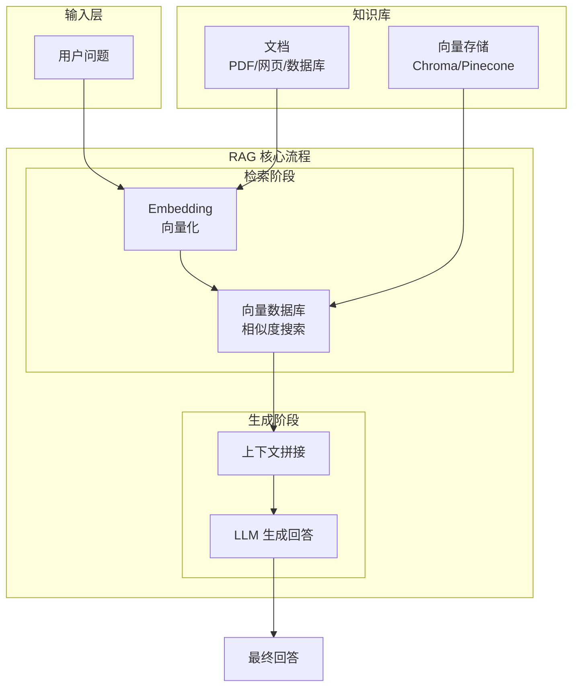

# Day 7: RAG (Retrieval-Augmented Generation) - 给 AI Agent 装上知识库

> 让 AI Agent 拥有"长期记忆"和"专业知识"

## 什么是 RAG？

**RAG (Retrieval-Augmented Generation，检索增强生成)** 是一种让 AI 模型在生成回答时能够访问外部知识库的技术。简单来说：

- **传统 LLM**：靠"死记硬背"训练数据来回答问题
- **RAG**：先从知识库检索相关内容，再让 LLM 基于这些内容生成回答



## 为什么 AI Agent 需要 RAG？

作为 UI 工程师，你可以这样理解：

| 对比项 | 传统聊天机器人 | 基于 RAG 的 AI Agent |
|--------|----------------|---------------------|
| 知识来源 | 训练数据（固定） | 动态知识库 |
| 信息时效 | 取决于训练时间 | 实时更新 |
| 专业领域 | 通才 | 可定制专家 |
| 幻觉问题 | 严重（可能编造） | 可追溯 |

### 典型应用场景

1. **企业知识库** - 员工问答系统
2. **产品文档** - 智能客服
3. **代码库助手** - 项目文档问答
4. **个人笔记** - 第二大脑

## RAG 的核心组件

### 1. 文档加载器 (Document Loader)

```python
# 安装依赖
# pip install langchain langchain-community chromadb

from langchain_community.document_loaders import (
    TextLoader,      # 纯文本
    PyPDFLoader,     # PDF 文件
    WebBaseLoader,   # 网页
    DirectoryLoader, # 整个目录
)

# 加载 PDF 文档
pdf_loader = PyPDFLoader("公司知识库.pdf")
documents = pdf_loader.load()

# 加载网页
web_loader = WebBaseLoader(
    web_paths=["https://docs.example.com/guide"]
)
web_documents = web_loader.load()

# 加载整个目录
dir_loader = DirectoryLoader(
    path="./docs/",
    glob="**/*.md",      # 只加载 markdown
    loader_cls=TextLoader
)
all_docs = dir_loader.load()

print(f"加载了 {len(documents)} 个文档")
```

### 2. 文本分割器 (Text Splitter)

为什么要分割？因为 LLM 有上下文长度限制，而且**完整的文档往往包含太多无关信息**。

```python
from langchain.text_splitter import (
    RecursiveCharacterTextSplitter,
    MarkdownHeaderTextSplitter,
)

# 最常用的分割器 - 按字符递归分割
text_splitter = RecursiveCharacterTextSplitter(
    chunk_size=500,      # 每个块的大小
    chunk_overlap=50,    # 块之间的重叠（保持上下文连贯）
    separators=["\n\n", "\n", "。", ".", " "],  # 按优先级分割
)

# 分割文档
chunks = text_splitter.split_documents(documents)

# 也可以直接分割文本
text = "这是一段很长的文本..."
text_chunks = text_splitter.split_text(text)

print(f"分割成 {len(chunks)} 个块")
```

### 3. 向量化 (Embedding)

**这是 RAG 最核心的部分！** 把文本转换成向量，让计算机能够"理解"语义。

```python
from langchain_openai import OpenAIEmbeddings

# 使用 OpenAI 的 embedding 模型
embeddings = OpenAIEmbeddings(
    model="text-embedding-3-small"  # 最新且高效
)

# 也可以使用开源模型
# from langchain_community.embeddings import HuggingFaceEmbeddings
# embeddings = HuggingFaceEmbeddings(model_name="BAAI/bge-small-zh-v1.5")

# 将文本转为向量
text = "什么是人工智能？"
vector = embeddings.embed_query(text)

print(f"向量维度: {len(vector)}")
print(f"向量前5个值: {vector[:5]}")
```

### 4. 向量数据库 (Vector Store)

```python
from langchain_chroma import Chroma
from langchain_openai import OpenAIEmbeddings

# 初始化
embeddings = OpenAIEmbeddings(model="text-embedding-3-small")

# 创建向量数据库
vector_store = Chroma(
    collection_name="my-knowledge-base",
    embedding_function=embeddings,
    persist_directory="./chroma_db",  # 本地存储
)

# 添加文档到向量库
from langchain.docstore.document import Document

docs = [
    Document(
        page_content="Python 是一种高级编程语言。",
        metadata={"source": "python-guide.md", "category": "language"}
    ),
    Document(
        page_content="JavaScript 主要用于 Web 开发。",
        metadata={"source": "js-guide.md", "category": "language"}
    ),
]

# 添加到向量库
vector_store.add_documents(docs)

# 或者直接从文档加载
# vector_store.from_documents(documents, embeddings, persist_directory="./db")
```

### 5. 相似度搜索 (Retrieval)

```python
# 基本相似度搜索
query = "Python 编程语言有什么特点？"
results = vector_store.similarity_search(
    query=query,
    k=3  # 返回 top 3 最相似的文档块
)

for i, doc in enumerate(results):
    print(f"--- 结果 {i+1} ---")
    print(f"内容: {doc.page_content[:100]}...")
    print(f"来源: {doc.metadata.get('source')}")

# 带相似度分数的搜索
results_with_scores = vector_store.similarity_search_with_score(
    query=query,
    k=3
)

for doc, score in results_with_scores:
    print(f"相似度分数: {score:.4f}")
```

## 完整 RAG 流程实现

```python
from langchain_community.document_loaders import TextLoader
from langchain.text_splitter import RecursiveCharacterTextSplitter
from langchain_openai import OpenAIEmbeddings, ChatOpenAI
from langchain_chroma import Chroma
from langchain import hub
from langchain_core.runnables import RunnablePassthrough

# ========== 第一步：加载文档 ==========
loader = TextLoader("公司知识库.txt")
documents = loader.load()

# ========== 第二步：分割文本 ==========
splitter = RecursiveCharacterTextSplitter(
    chunk_size=300,
    chunk_overlap=30
)
chunks = splitter.split_documents(documents)

# ========== 第三步：向量化存储 ==========
embeddings = OpenAIEmbeddings(model="text-embedding-3-small")
vector_store = Chroma.from_documents(
    documents=chunks,
    embedding=embeddings,
    persist_directory="./knowledge_db"
)

# ========== 第四步：创建检索器 ==========
retriever = vector_store.as_retriever(
    search_type="similarity",  # 或 "mmr" (最大边际相关)
    search_kwargs={"k": 3}    # 检索 top 3
)

# ========== 第五步：创建 RAG 链 ==========
# 使用 langchain hub 的提示词（也可以自定义）
prompt = hub.pull("rlm/rag-prompt")

# 初始化 LLM
llm = ChatOpenAI(model="gpt-4o", temperature=0)

# 构建 RAG 链
def format_docs(docs):
    return "\n\n".join(doc.page_content for doc in docs)

rag_chain = (
    {"context": retriever | format_docs, "question": RunnablePassthrough()}
    | prompt
    | llm
)

# ========== 第六步：问答！ ==========
question = "公司的年假政策是什么？"
response = rag_chain.invoke(question)

print("=" * 50)
print(f"问题: {question}")
print(f"回答: {response.content}")
```

## 高级技巧：提升 RAG 效果

### 1. 混合搜索 (Hybrid Search)

结合关键词和向量搜索，效果更好：

```python
from langchain.retrievers import ContextualCompressionRetriever
from langchain.retrievers.document_compressors import LLMChainExtractor

# 使用 MMR (最大边际相关) 提升多样性
retriever = vector_store.as_retriever(
    search_type="mmr",
    search_kwargs={
        "k": 5,
        "fetch_k": 20,  # 先取 20 个，再选 5 个多样的
        "lambda_mult": 0.5  # 0=只考虑多样性，1=只考虑相关度
    }
)
```

### 2. 路由检索 (Routing)

根据问题类型选择不同的知识库：

```python
from langchain.retrievers.multi_query import MultiQueryRetriever
from langchain.schema import Document

class RouterRetriever:
    def __init__(self, retrievers, router_prompt):
        self.retrievers = retrievers  # {"tech": retriever1, "hr": retriever2}
        self.llm = ChatOpenAI()
        self.router_prompt = router_prompt
    
    def get_relevant_documents(self, query):
        # 用 LLM 判断应该用哪个知识库
        router_output = self.llm.invoke(
            self.router_prompt.format(query=query)
        )
        chosen_retriever = router_output.content.strip()
        
        # 调用对应的检索器
        return self.retrievers.get(chosen_retriever).get_relevant_documents(query)
```

### 3. 重新排序 (Re-ranking)

先用快 vector search 取 20 个，再用 LLM 排序选 3 个：

```python
from langchain_community.cross_encoders import HuggingFaceCrossEncoder
from langchain.retrievers import ContextualCompressionRetriever
from langchain.retrievers.document_compressors import CrossEncoderReranker

# 使用 cross-encoder 进行重新排序
cross_encoder = HuggingFaceCrossEncoder(
    model_name="BAAI/bge-reranker-base"
)

compressor = CrossEncoderReranker(
    model=cross_encoder,
    top_n=3
)

compression_retriever = ContextualCompressionRetriever(
    base_compressor=compressor,
    base_retriever=vector_store.as_retriever()
)
```

## UI 工程师的 RAG 实践

作为前端开发者，你可以这样快速上手：

### 1. 用 Next.js + Vercel 搭建 RAG 应用

```typescript
// app/api/chat/route.ts
import { NextRequest, NextResponse } from 'next/server';

export async function POST(req: NextRequest) {
  const { question } = await req.json();
  
  // 调用 RAG 链
  const response = await rag_chain.invoke(question);
  
  return NextResponse.json({ 
    answer: response.content 
  });
}
```

### 2. 给 OpenClaw 添加 RAG 能力

```python
# openclaw-skills/my-rag-skill/skill.py
from langchain.chains import RetrievalQA
from langchain.vectorstores import Chroma
from langchain.embeddings import OpenAIEmbeddings

class RagSkill:
    def __init__(self):
        self.embeddings = OpenAIEmbeddings()
        self.vectorstore = Chroma(
            persist_directory="./knowledge",
            embedding_function=self.embeddings
        )
    
    async def query(self, question: str) -> str:
        # 检索相关文档
        docs = self.vectorstore.similarity_search(question, k=3)
        
        # 拼接上下文
        context = "\n".join([d.page_content for d in docs])
        
        # 生成回答
        prompt = f"""基于以下知识库回答问题：
        
知识库：
{context}

问题：{question}

回答："""
        
        return await self.llm.agenerate([prompt])
```

## 常见问题与解决方案

### Q1: 检索不到相关内容？

- 调整 chunk_size（试试 200-800）
- 增加 chunk_overlap 保持上下文
- 检查 embedding 模型是否适合你的语言

### Q2: 回答不准确？

- 增加检索数量 (k)
- 使用 re-ranking
- 优化提示词模板

### Q3: 向量库太大？

- 使用父文档检索（Parent Document Retrieval）
- 按类别/标签分开存储

## 总结

RAG 是给 AI Agent 装备"知识库"的核心技术，让 AI：

1. **获取实时信息** - 不再局限于训练数据
2. **专业领域知识** - 成为特定领域的专家
3. **可追溯可验证** - 答案来自可查看的文档
4. **动态更新** - 知识库可以随时更新

作为 UI 工程师，学习 RAG 能让你：
- 快速构建智能知识库系统
- 为现有产品添加 AI 能力
- 理解 AI Agent 的数据流

## 下一步

- 尝试用自己的文档搭建一个 RAG 系统
- 探索更高级的 techniques 如 Agentic RAG
- 结合 Function Calling 让 RAG 更智能

---

> 📚 **练习题**：用自己的简历或技术文档，搭建一个"个人 AI 助手"，看看能否准确回答关于你的问题！
