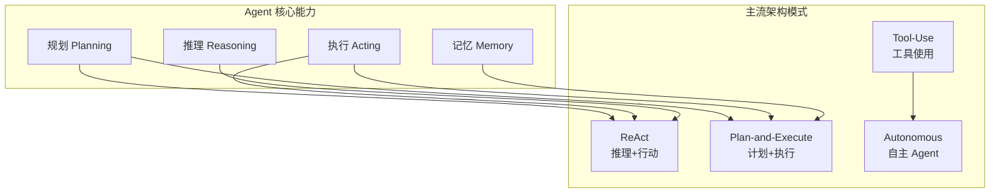
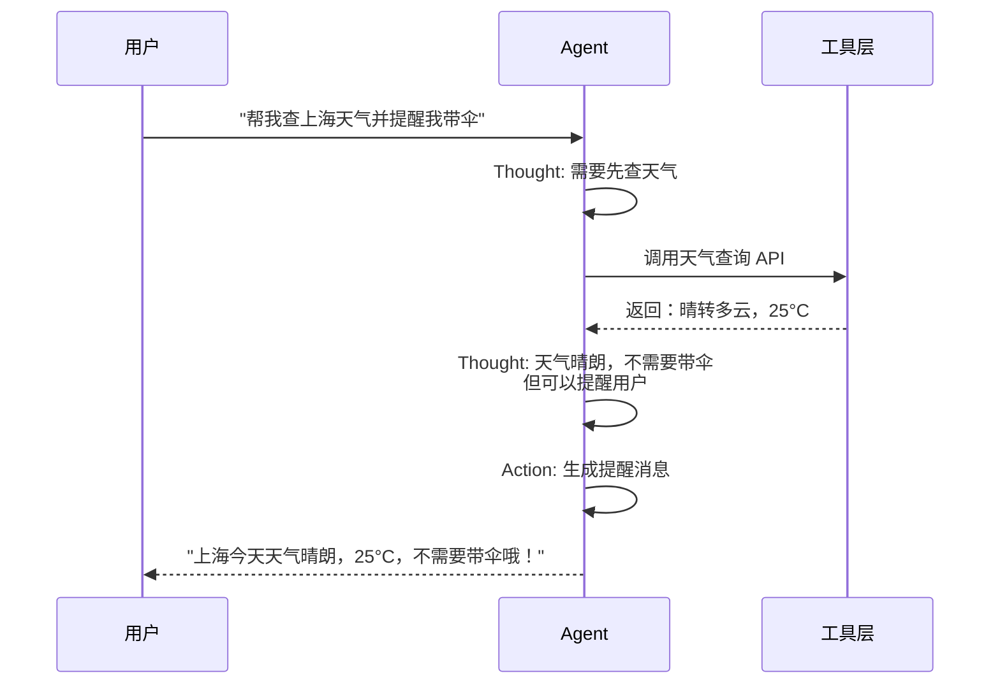
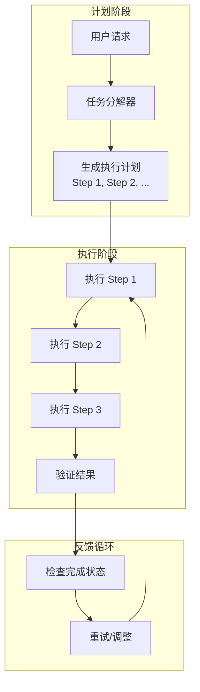
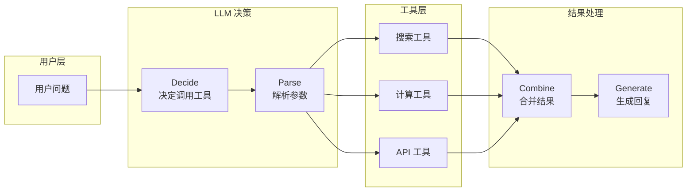
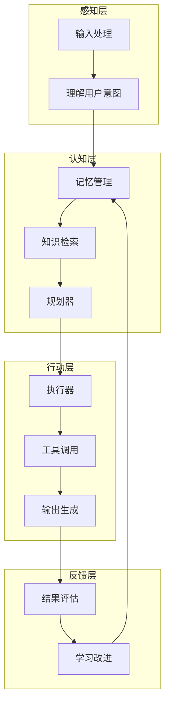
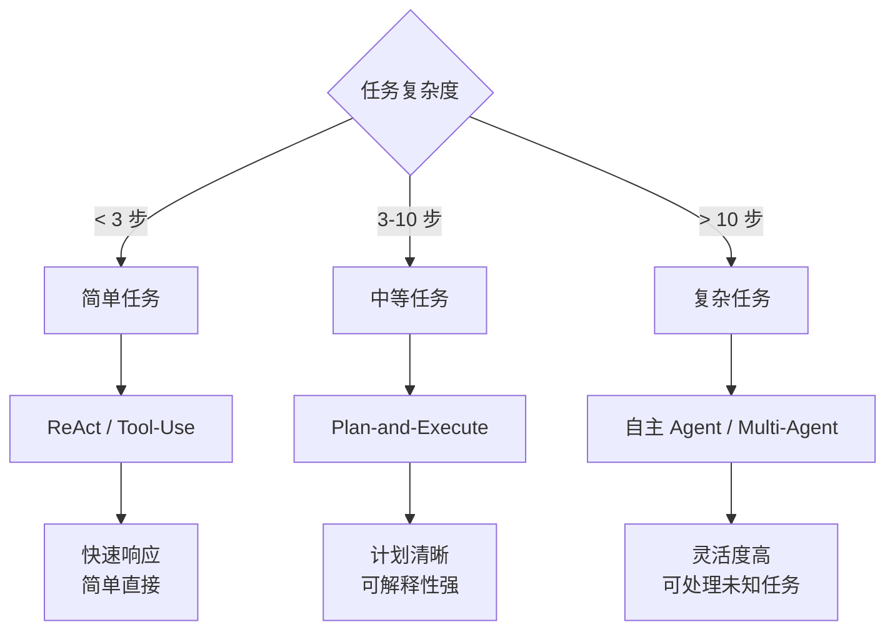

# Day 8: Agent 架构设计模式 — 让 AI 学会"思考"与"行动"

> 从 UI 工程师转型 AI Agent 工程师的进阶之路

## 昨日回顾

昨天我们学习了 [Day 7: RAG](./day07-rag.md)，掌握了给 AI Agent 装备知识库的方法。

## 明日预告

明天我们将探讨 **Multi-Agent 系统设计**，包括：多 Agent 协作模式、Agent 通信协议、任务分解与路由策略，以及如何构建高效的 Agent 团队。敬请期待！

## 什么是 Agent 架构设计模式？

在构建 AI Agent 时，**架构模式**决定了 Agent 如何：
- 理解用户请求
- 规划执行步骤
- 调用工具
- 处理结果

选择合适的架构模式，是构建可靠 Agent 的关键。



## 主流架构模式详解

### 1. ReAct 模式 (Reasoning + Acting)

**ReAct** 是最经典的 Agent 架构模式，核心思想是：**边想边做**，在执行过程中不断推理和调整。



#### ReAct 的核心循环

```python
# 典型的 ReAct Agent 循环
def react_agent(query, max_iterations=10):
    """ReAct 模式的伪代码实现"""
    
    # 1. 初始化状态
    state = {
        "query": query,
        "thoughts": [],      # 思考历史
        "actions": [],      # 执行历史  
        "observations": []  # 观察结果
    }
    
    for iteration in range(max_iterations):
        # 2. 推理 (Reasoning)
        thought = llm_reasoning(
            query=state["query"],
            history=state["thoughts"],
            actions=state["actions"],
            observations=state["observations"]
        )
        state["thoughts"].append(thought)
        
        # 3. 决定行动 (Acting)
        if should_finish(thought):
            return generate_response(thought)
        
        action = extract_action(thought)
        state["actions"].append(action)
        
        # 4. 执行并观察结果
        observation = execute_tool(action)
        state["observations"].append(observation)
    
    return "达到最大迭代次数"
```

#### LangChain 中的 ReAct 实现

```python
from langchain import hub
from langchain.agents import AgentExecutor, create_react_agent
from langchain_openai import ChatOpenAI

# 定义工具
def get_weather(city: str) -> str:
    """获取城市天气"""
    return f"{city}今天天气晴朗，25°C"

def calculate(expression: str) -> str:
    """数学计算"""
    return str(eval(expression))

# 创建 ReAct Agent
llm = ChatOpenAI(model="gpt-4")
tools = [get_weather, calculate]

# 使用 LangChain 内置的 ReAct prompt
prompt = hub.pull("hwchase17/react")

# 创建 Agent
agent = create_react_agent(llm, tools, prompt)
agent_executor = AgentExecutor(
    agent=agent, 
    tools=tools, 
    verbose=True,
    max_iterations=10
)

# 执行
result = agent_executor.invoke({
    "input": "上海今天天气怎么样？如果气温高于20度帮我算一下30*50等于多少"
})
print(result["output"])
```

### 2. Plan-and-Execute 模式

**Plan-and-Execute**（计划-执行）模式的核心是：**先规划，后执行**。先制定完整的执行计划，再按步骤依次执行。



#### Plan-and-Execute 的优势

| 特性 | ReAct | Plan-and-Execute |
|------|-------|------------------|
| **规划方式** | 逐步推理 | 预先规划 |
| **适用场景** | 简单任务 | 复杂多步骤任务 |
| **可解释性** | 中等 | 高（计划可见） |
| **错误恢复** | 即时调整 | 计划级重试 |
| **Token 消耗** | 较低 | 较高（需先生成计划） |

#### 代码实现

```python
from typing import TypedDict, List
from langgraph.graph import StateGraph, END

# 定义状态
class PlanExecuteState(TypedDict):
    """Plan-and-Execute 状态"""
    user_request: str          # 用户请求
    plan: List[str]            # 执行计划
    current_step: int          # 当前步骤
    step_results: List[str]    # 步骤结果
    final_response: str        # 最终响应

# 1. 任务规划节点
def plan_node(state: PlanExecuteState) -> PlanExecuteState:
    """生成执行计划"""
    prompt = f"""用户请求: {state['user_request']}
    
请将这个请求分解为具体的执行步骤。
每个步骤应该清晰、可执行。
    
输出格式（JSON）：
{{
    "steps": ["步骤1描述", "步骤2描述", ...]
}}"""
    
    response = llm.invoke(prompt)
    plan = parse_steps_from_response(response)  # 解析步骤
    
    return {
        "plan": plan,
        "current_step": 0,
        "step_results": []
    }

# 2. 执行节点
def execute_node(state: PlanExecuteState) -> PlanExecuteState:
    """执行当前步骤"""
    current_step = state["current_step"]
    plan = state["plan"]
    
    if current_step >= len(plan):
        return state
    
    step = plan[current_step]
    result = execute_step(step, state["step_results"])  # 执行步骤
    
    return {
        "step_results": state["step_results"] + [result],
        "current_step": current_step + 1
    }

# 3. 检查完成节点
def should_continue(state: PlanExecuteState) -> str:
    """判断是否继续执行"""
    if state["current_step"] < len(state["plan"]):
        return "execute"
    return "respond"

# 4. 生成响应节点
def respond_node(state: PlanExecuteState) -> PlanExecuteState:
    """生成最终响应"""
    response = synthesize_response(
        state["user_request"],
        state["step_results"]
    )
    return {"final_response": response}

# 构建图
graph = StateGraph(PlanExecuteState)
graph.add_node("plan", plan_node)
graph.add_node("execute", execute_node)
graph.add_node("respond", respond_node)

graph.set_entry_point("plan")
graph.add_edge("plan", "execute")
graph.add_conditional_edges(
    "execute",
    should_continue,
    {"execute": "execute", "respond": "respond"}
)
graph.add_edge("respond", END)

agent = graph.compile()
```

### 3. Tool-Use 模式 (Function Calling)

**Tool-Use** 模式是让 LLM 自主决定何时调用哪些工具。这是现代 Agent 的核心能力。



#### Tool-Use 实战

```python
from openai import OpenAI
from typing import List, Optional

# 定义工具
tools = [
    {
        "type": "function",
        "function": {
            "name": "search_docs",
            "description": "搜索技术文档",
            "parameters": {
                "type": "object",
                "properties": {
                    "query": {"type": "string", "description": "搜索关键词"},
                    "limit": {"type": "integer", "description": "返回结果数量"}
                },
                "required": ["query"]
            }
        }
    },
    {
        "type": "function",
        "function": {
            "name": "run_code",
            "description": "执行 Python 代码",
            "parameters": {
                "type": "object",
                "properties": {
                    "code": {"type": "string", "description": "要执行的代码"},
                    "language": {"type": "string", "description": "编程语言"}
                },
                "required": ["code"]
            }
        }
    }
]

# 创建 Client
client = OpenAI(api_key="your-api-key")

# 对话循环
messages = [
    {"role": "system", "content": "你是一个专业的 AI 助手，可以调用工具来完成任务。"}
]

def chat_loop():
    while True:
        user_input = input("You: ")
        if user_input.lower() in ["exit", "quit"]:
            break
            
        messages.append({"role": "user", "content": user_input})
        
        # 调用 LLM
        response = client.chat.completions.create(
            model="gpt-4",
            messages=messages,
            tools=tools,
            tool_choice="auto"  # 自动选择工具
        )
        
        # 处理响应
        message = response.choices[0].message
        
        # 如果有工具调用
        if message.tool_calls:
            for tool_call in message.tool_calls:
                tool_name = tool_call.function.name
                tool_args = json.loads(tool_call.function.arguments)
                
                # 执行工具
                result = execute_tool(tool_name, tool_args)
                
                # 将结果添加到对话
                messages.append({
                    "role": "assistant",
                    "tool_calls": [tool_call]
                })
                messages.append({
                    "role": "tool",
                    "tool_call_id": tool_call.id,
                    "content": result
                })
            
            # 再次调用 LLM 生成最终回复
            final_response = client.chat.completions.create(
                model="gpt-4",
                messages=messages
            )
            print(f"AI: {final_response.choices[0].message.content}")
        else:
            print(f"AI: {message.content}")
            messages.append({"role": "assistant", "content": message.content})
```

### 4. Autonomous Agent 模式

**自主 Agent** 是最高级的架构模式，Agent 可以自主决策、规划并执行复杂任务。



#### 自主 Agent 示例

```python
# 使用 LangChain 的自主 Agent
from langchain.agents import create_openai_functions_agent
from langchain.tools import Tool
from langchain_openai import ChatOpenAI
from langchain import hub

llm = ChatOpenAI(model="gpt-4", temperature=0.7)

# 定义工具
tools = [
    Tool(
        name="web_search",
        func=web_search,
        description="用于搜索网络信息"
    ),
    Tool(
        name="file_operations",
        func=file_ops,
        description="用于读写文件"
    ),
    Tool(
        name="code_executor",
        func=run_code,
        description="用于执行代码"
    )
]

# 获取 prompt
prompt = hub.pull("hwchase17/openai-functions-agent")

# 创建自主 Agent
agent = create_openai_functions_agent(llm, tools, prompt)
agent_executor = AgentExecutor(
    agent=agent,
    tools=tools,
    verbose=True,
    max_iterations=20,  # 允许更多迭代
    handle_parsing_errors=True  # 自动处理解析错误
)

# 执行复杂任务
result = agent_executor.invoke({
    "input": """研究并实现一个 Python 程序：
    1. 获取过去一年 AAPL 股票数据
    2. 计算简单移动平均线 (SMA)
    3. 生成可视化图表
    4. 将结果保存到报告文件"""
})
```

## 模式对比与选择指南



| 模式 | 适用场景 | 优点 | 缺点 |
|------|----------|------|------|
| **ReAct** | 简单查询、多轮对话 | 实现简单、响应快速 | 长任务表现不佳 |
| **Plan-and-Execute** | 复杂多步骤任务 | 计划清晰、可解释 | 灵活性较低 |
| **Tool-Use** | 需要调用外部 API | 灵活扩展能力强 | 需设计良好工具 |
| **Autonomous** | 开放域复杂任务 | 能力强大、灵活 | 难以控制、成本高 |

## UI 工程师的转型建议

作为 UI 工程师，你可以这样逐步掌握 Agent 架构：

### 阶段 1：理解原理 (1-2 周)
- 学习 ReAct 模式的基本原理
- 理解 LLM 的 Function Calling 机制
- 理解 LangChain 的 Agent 抽象

### 阶段 2：动手实践 (2-3 周)
- 使用 LangChain 实现简单 Agent
- 设计并实现自己的工具
- 调试 Agent 行为，理解输出

### 阶段 3：进阶优化 (3-4 周)
- 学习 Plan-and-Execute 模式
- 实现复杂任务的分解与执行
- 添加记忆管理和错误处理

### 阶段 4：生产部署 (持续)
- 学习 LangSmith 进行监控
- 实现 Multi-Agent 协作
- 优化性能与成本

## 实战案例：构建一个"编程助手"Agent

```python
"""
构建一个能够：
1. 理解编程问题
2. 搜索文档
3. 编写测试代码
4. 解释代码的编程助手 Agent
"""

from langchain.agents import AgentExecutor, create_react_agent
from langchain_openai import ChatOpenAI
from langchain import hub
from langchain.tools import Tool
import json

# 1. 定义工具
def search_documentation(query: str) -> str:
    """搜索官方文档"""
    # 这里可以接入真实的文档搜索 API
    return f"搜索结果: 找到 {query} 相关的文档"

def write_test_code(code: str) -> str:
    """生成测试代码"""
    return f"# 测试代码\ndef test_example():\n    assert True"

def explain_code(code: str) -> str:
    """解释代码功能"""
    return "这段代码实现了..."

tools = [
    Tool(
        name="search_docs",
        func=search_documentation,
        description="搜索编程文档和技术资料"
    ),
    Tool(
        name="write_tests",
        func=write_test_code,
        description="为代码编写单元测试"
    ),
    Tool(
        name="explain",
        func=explain_code,
        description="解释代码的功能和原理"
    )
]

# 2. 创建 Agent
llm = ChatOpenAI(model="gpt-4")
prompt = hub.pull("hwchase17/react")

agent = create_react_agent(llm, tools, prompt)
executor = AgentExecutor(
    agent=agent,
    tools=tools,
    verbose=True,
    max_iterations=10
)

# 3. 执行任务
result = executor.invoke({
    "input": """
    我有一个 Python 函数用于计算斐波那契数列，
    请帮我：
    1. 搜索最优实现方式
    2. 编写测试用例
    3. 解释时间复杂度
    """
})

print(result["output"])
```

## 总结

今天我们学习了 AI Agent 的四大核心架构模式：

1. **ReAct** - 边想边做，适合简单任务
2. **Plan-and-Execute** - 先计划后执行，适合复杂任务
3. **Tool-Use** - 自主调用工具，扩展 Agent 能力
4. **Autonomous** - 自主决策，适合开放域任务

选择合适的架构模式，是构建可靠 AI Agent 的第一步。

## 参考资料

- [LangChain Agents 文档](https://python.langchain.com/docs/concepts/agent_architectures/)
- [ReAct 论文](https://arxiv.org/abs/2210.03629)
- [LangSmith 监控平台](https://docs.smith.langchain.com/)
- [LangChain Hub - Prompts](https://smith.langchain.com/hub)

---

*明天我们将学习 Multi-Agent 系统设计，敬请期待！*
