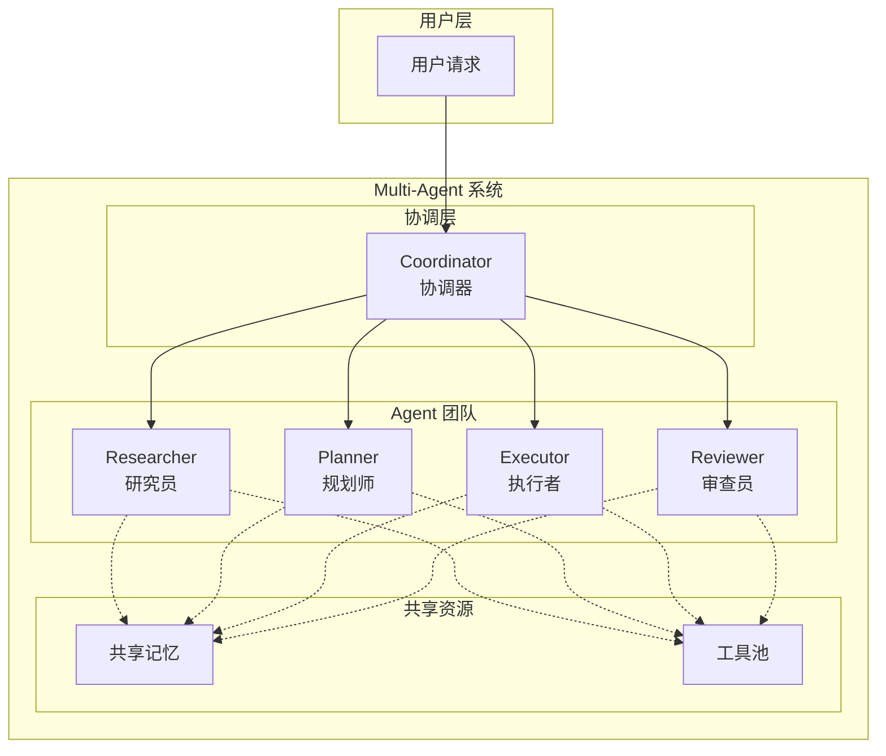
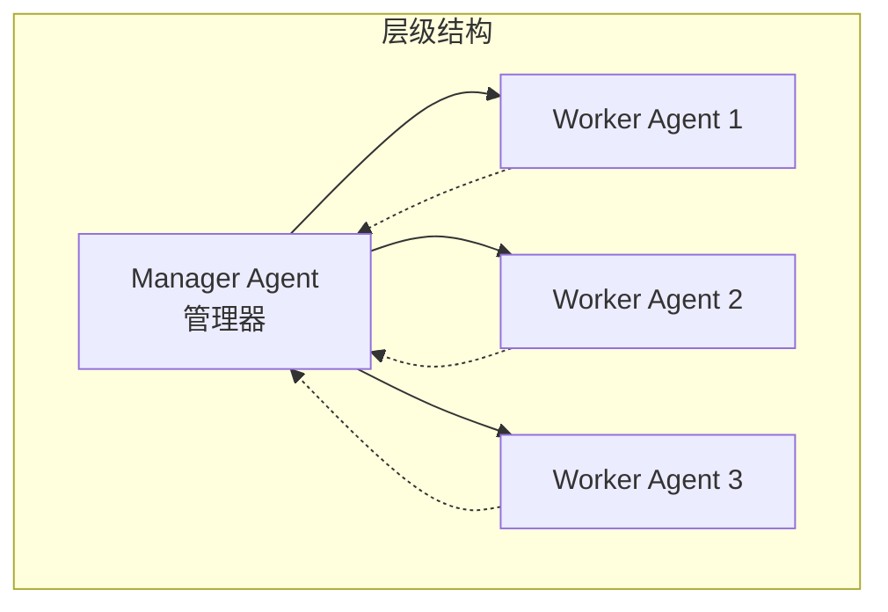
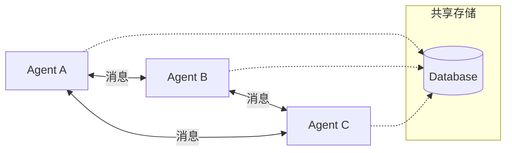
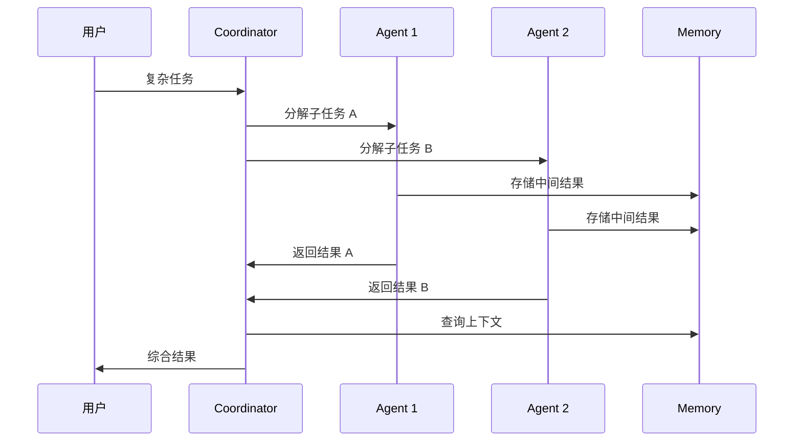
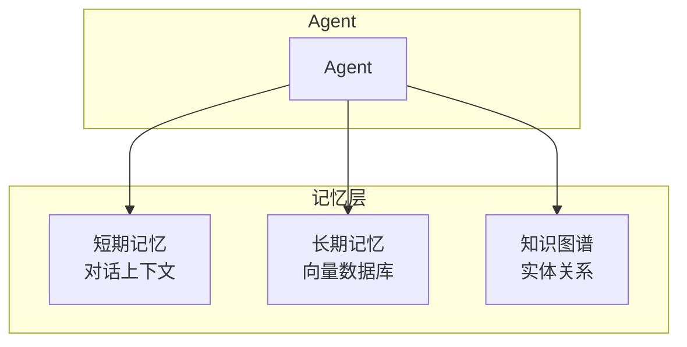

# Day 9: Multi-Agent 系统设计 — 构建 AI Agent 协作团队

> 从单兵作战到团队协作，让 AI Agent 学会"分工合作"

## 昨日回顾

昨天我们学习了 [Day 8: Agent 架构设计模式](./day08-agent-design-patterns.md)，掌握了单个 Agent 的核心设计原则。

## 明日预告

明天我们将探讨 **Agent 可观测性与调试**，包括：LangSmith 实战、Agent 执行轨迹追踪、性能监控与日志分析，以及生产环境调试技巧。敬请期待！

## 什么是 Multi-Agent 系统？

**Multi-Agent 系统**是由多个独立 Agent 组成的协作网络，每个 Agent 扮演特定角色，通过通信协议协同完成复杂任务。



### 为什么要用 Multi-Agent？

| 单 Agent 局限 | Multi-Agent 优势 |
|---------------|------------------|
| 能力单一 | 专业分工，各司其职 |
| 上下文膨胀 | 分散处理，减少 token 消耗 |
| 难以并行 | 任务并行，提升效率 |
| 错误累积 | 交叉验证，降低风险 |

## Multi-Agent 核心架构模式

### 1. 层级式 (Hierarchical)

最常见的模式，存在明确的上下级关系。



**适用场景**：需要严格流程控制的任务，如代码审查、内容审核。

### 2. 联邦式 (Federated)

Agent 之间平等协作，通过消息传递协调。



**适用场景**：去中心化任务，如分布式研究、多角度分析。

### 3. 鸡生蛋式 (Chicken-Egg)

两个 Agent 相互依赖，迭代协作直到收敛。

```mermaid
flowchart LR
    Generator[生成 Agent] -->|输出| Validator[验证 Agent]
    Validator -->|反馈| Generator
    
    loop
        Generator --> Validator
        Validator --> Generator
    end
```

**适用场景**：需要自我纠错的任务，如代码生成与测试、写作与编辑。

## CrewAI 实战：构建 Multi-Agent 团队

**CrewAI** 是最流行的 Multi-Agent 框架之一，专为构建协作 Agent 团队设计。

### 安装

```bash
pip install crewai crewai-tools
```

### 核心概念

| 概念 | 说明 |
|------|------|
| **Agent** | 具有角色、目标、背景故事的自主单元 |
| **Task** | Agent 需要完成的具体任务 |
| **Crew** | Agent 团队，负责协调任务执行 |
| **Process** | 任务执行策略（顺序、层级） |

### 完整示例：AI 新闻分析团队

```python
from crewai import Agent, Task, Crew, Process
from crewai_tools import SerperDevTool, WebsiteSearchTool
import os

# 设置 API Key
os.environ["OPENAI_API_KEY"] = "your-key-here"

# 创建工具
search_tool = SerperDevTool()
websearch_tool = WebsiteSearchTool()

# ========== 1. 定义 Agent ==========

# 研究员 Agent：负责搜集信息
researcher = Agent(
    role="AI News Researcher",
    goal="搜集 AI 领域的最新新闻和热点",
    backstory="""
        你是一位资深的 AI 技术记者，
        擅长发现行业热点和趋势。
        你能找到最权威的信息源。
    """,
    tools=[search_tool, websearch_tool],
    verbose=True
)

# 分析师 Agent：负责分析趋势
analyst = Agent(
    role="AI Trend Analyst",
    goal="分析 AI 新闻背后的趋势和影响",
    backstory="""
        你是一位数据分析师，
        擅长从海量信息中提取关键趋势。
        你的分析报告以深度著称。
    """,
    verbose=True
)

# 写手 Agent：负责撰写报告
writer = Agent(
    role="Tech Writer",
    goal="将分析结果写成通俗易懂的报告",
    backstory="""
        你是一位科技专栏作家，
        擅长用生动的语言解释复杂技术。
        你的文章深受读者喜爱。
    """,
    verbose=True
)

# ========== 2. 定义 Task ==========

# 研究任务
research_task = Task(
    description="""
        搜索过去一周 AI 领域的重大新闻，
        包括但不限于：
        - 新模型发布
        - 重要学术论文
        - 行业融资动态
        - 政策监管变化
    """,
    agent=researcher,
    expected_output="AI 新闻列表，包含标题、来源和摘要"
)

# 分析任务
analyze_task = Task(
    description="""
        基于研究员收集的新闻，
        分析：
        1. 最热门的趋势是什么？
        2. 对行业有什么影响？
        3. 未来可能的发展方向？
    """,
    agent=analyst,
    expected_output="趋势分析报告"
)

# 写作任务
write_task = Task(
    description="""
        将分析师的报告改写成面向大众的文章：
        - 标题吸引眼球
        - 内容通俗易懂
        - 适当使用比喻和例子
    """,
    agent=writer,
    expected_output="可发布的文章"
)

# ========== 3. 创建 Crew ==========

crew = Crew(
    agents=[researcher, analyst, writer],
    tasks=[research_task, analyze_task, write_task],
    process=Process.sequential,  # 顺序执行
    verbose=True
)

# ========== 4. 启动执行 ==========

result = crew.kickoff()
print(result)
```

### 层级式执行示例

对于更复杂的任务，可以使用层级式 Process。CrewAI 支持两种方式：

**方式一：使用 manager_llm（推荐）**

```python
# 只需指定 manager 使用的 LLM，CrewAI 自动创建 manager
crew = Crew(
    agents=[researcher, writer, editor],
    tasks=[research_task, write_task, edit_task],
    process=Process.hierarchical,  # 层级执行
    manager_llm="gpt-4o",           # 指定 manager 使用的 LLM
    verbose=True
)
```

**方式二：自定义 manager agent**

```python
# 先定义一个 manager agent
manager = Agent(
    role="Project Manager",
    goal="高效管理团队，确保高质量完成任务",
    backstory="你是一位经验丰富的项目经理，擅长 overseeing 复杂项目并指导团队成功。",
    allow_delegation=True,  # 允许委托任务
)

# 使用自定义 manager
crew = Crew(
    agents=[manager, researcher, writer, editor],
    tasks=[research_task, write_task, edit_task],
    process=Process.hierarchical,
    manager_agent=manager,  # 传入自定义 manager agent
    verbose=True
)
```

## Multi-Agent 通信协议

Agent 之间需要标准化的通信方式：



### 消息格式标准

```python
from dataclasses import dataclass
from typing import Optional, Dict, Any
from enum import Enum

class MessageType(Enum):
    REQUEST = "request"      # 请求
    RESPONSE = "response"    # 响应
    FEEDBACK = "feedback"    # 反馈
    BROADCAST = "broadcast"  # 广播

@dataclass
class AgentMessage:
    """Agent 之间的标准消息格式"""
    sender: str              # 发送者 ID
    receiver: str            # 接收者 ID（* 表示广播）
    type: MessageType        # 消息类型
    content: Any             # 消息内容
    metadata: Dict[str, Any] = None  # 元数据
    thread_id: str = None    # 线程 ID（关联多轮对话）
    
    def to_dict(self) -> dict:
        return {
            "sender": self.sender,
            "receiver": self.receiver,
            "type": self.type.value,
            "content": self.content,
            "metadata": self.metadata or {},
            "thread_id": self.thread_id
        }
```

### 消息传递示例

```python
class MessageBus:
    """简单的消息总线实现"""
    
    def __init__(self):
        self.subscribers: Dict[str, list] = {}
        self.message_queue: list = []
    
    def subscribe(self, agent_id: str, callback):
        """订阅消息"""
        if agent_id not in self.subscribers:
            self.subscribers[agent_id] = []
        self.subscribers[agent_id].append(callback)
    
    def publish(self, message: AgentMessage):
        """发布消息"""
        self.message_queue.append(message)
        
        # 推送给订阅者
        if message.receiver in self.subscribers:
            for callback in self.subscribers[message.receiver]:
                callback(message)
        
        # 广播给所有订阅者
        if message.receiver == "*":
            for agent_id, callbacks in self.subscribers.items():
                for callback in callbacks:
                    callback(message)
    
    def query_messages(self, thread_id: str) -> list:
        """查询线程历史"""
        return [m for m in self.message_queue 
                if m.thread_id == thread_id]
```

## 任务分解与路由策略

### 1. 任务分解 (Task Decomposition)

复杂任务需要分解为可执行的子任务：

```python
def decompose_task(task: str, llm) -> list[Task]:
    """使用 LLM 自动分解任务"""
    
    prompt = f"""
    将以下复杂任务分解为 3-7 个可执行的子任务：
    
    任务：{task}
    
    要求：
    1. 每个子任务应该是原子性的
    2. 子任务之间有明确的依赖关系
    3. 输出 JSON 数组格式
    
    示例格式：
    [
        {{"id": 1, "description": "...", "depends_on": []}},
        {{"id": 2, "description": "...", "depends_on": [1]}}
    ]
    """
    
    response = llm.invoke(prompt)
    # 解析并创建 Task 对象
    return parse_tasks(response)
```

### 2. 智能路由 (Smart Routing)

根据任务特征选择合适的 Agent：

```python
from typing import Callable

class AgentRouter:
    """基于规则的 Agent 路由器"""
    
    def __init__(self):
        self.rules: list[tuple[Callable, Agent]] = []
    
    def register(self, condition: Callable, agent: Agent):
        """注册路由规则"""
        self.rules.append((condition, agent))
    
    def route(self, task: Task) -> Agent:
        """根据任务特征路由到合适的 Agent"""
        for condition, agent in self.rules:
            if condition(task):
                return agent
        
        # 默认返回通用 Agent
        return self.default_agent

# 使用示例
router = AgentRouter()

# 注册规则
router.register(
    condition=lambda t: "research" in t.description.lower(),
    agent=researcher_agent
)

router.register(
    condition=lambda t: "write" in t.description.lower(),
    agent=writer_agent
)

router.register(
    condition=lambda t: "analyze" in t.description.lower(),
    agent=analyst_agent
)
```

### 3. 基于 LLM 的动态路由

```python
def llm_route(task: Task, agents: list[Agent], llm) -> Agent:
    """使用 LLM 智能选择 Agent"""
    
    agent_descriptions = "\n".join([
        f"- {agent.role}: {agent.goal}" 
        for agent in agents
    ])
    
    prompt = f"""
    根据任务描述，选择最合适的 Agent：
    
    任务：{task.description}
    
    可选 Agent：
    {agent_descriptions}
    
    输出格式：只需输出 Agent 的 role 名称
    """
    
    response = llm.invoke(prompt).content
    
    for agent in agents:
        if agent.role.lower() in response.lower():
            return agent
    
    return agents[0]  # 默认返回第一个
```

## 共享记忆与状态管理

Multi-Agent 系统中，共享记忆至关重要：

```python
from crewai import Memory

# 创建共享记忆
shared_memory = Memory(
    recency_weight=0.3,
    semantic_weight=0.5,
    importance_weight=0.2
)

# Agent 可以读取和写入共享记忆
researcher_agent = Agent(
    role="Researcher",
    goal="搜集信息",
    memory=shared_memory  # 共享记忆
)

writer_agent = Agent(
    role="Writer",
    goal="撰写内容",
    memory=shared_memory  # 共享记忆
)
```

### 分层记忆架构



## 实战项目：构建 AI 代码审查团队

```python
"""
AI 代码审查团队
- Reviewer: 代码审查
- Fixer: 问题修复
- QA: 质量验证
"""

from crewai import Agent, Task, Crew, Process

# 定义 Agent
code_reviewer = Agent(
    role="Senior Code Reviewer",
    goal="发现代码中的问题并提出改进建议",
    backstory="你是一位有 10 年经验的资深工程师...",
    tools=[/* 代码分析工具 */]
)

code_fixer = Agent(
    role="Code Fixer",
    goal="根据审查意见修复代码问题",
    backstory="你擅长快速理解和修改各种代码..."
)

qa_engineer = Agent(
    role="QA Engineer",
    goal="验证修复后的代码质量",
    backstory="你注重代码质量和测试覆盖..."
)

# 定义任务
review_task = Task(
    description="审查以下代码的 bug 和性能问题...",
    agent=code_reviewer,
    expected_output="详细的问题报告"
)

fix_task = Task(
    description="根据审查报告修复代码问题",
    agent=code_fixer,
    expected_output="修复后的代码"
)

qa_task = Task(
    description="验证修复并确保测试通过",
    agent=qa_engineer,
    expected_output="QA 报告"
)

# 创建团队
crew = Crew(
    agents=[code_reviewer, code_fixer, qa_engineer],
    tasks=[review_task, fix_task, qa_task],
    process=Process.sequential
)

# 执行
result = crew.kickoff()
```

## 最佳实践总结

| 原则 | 说明 |
|------|------|
| **角色清晰** | 每个 Agent 有明确定义的角色和目标 |
| **通信简洁** | 使用标准化消息格式，减少歧义 |
| **记忆共享** | 合理设计共享记忆，避免信息孤岛 |
| **错误处理** | 每个 Agent 需要有降级策略 |
| **可观测性** | 使用 LangSmith 等工具追踪执行 |

## 下一步

- 尝试用 CrewAI 构建自己的 Multi-Agent 团队
- 学习 LangGraph 的低层 Multi-Agent 编排
- 掌握 LangSmith 的调试和监控技巧

---

*持续学习，成为 AI Agent 工程师！*
