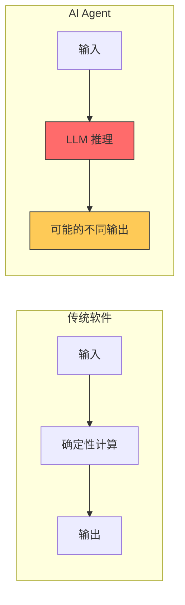
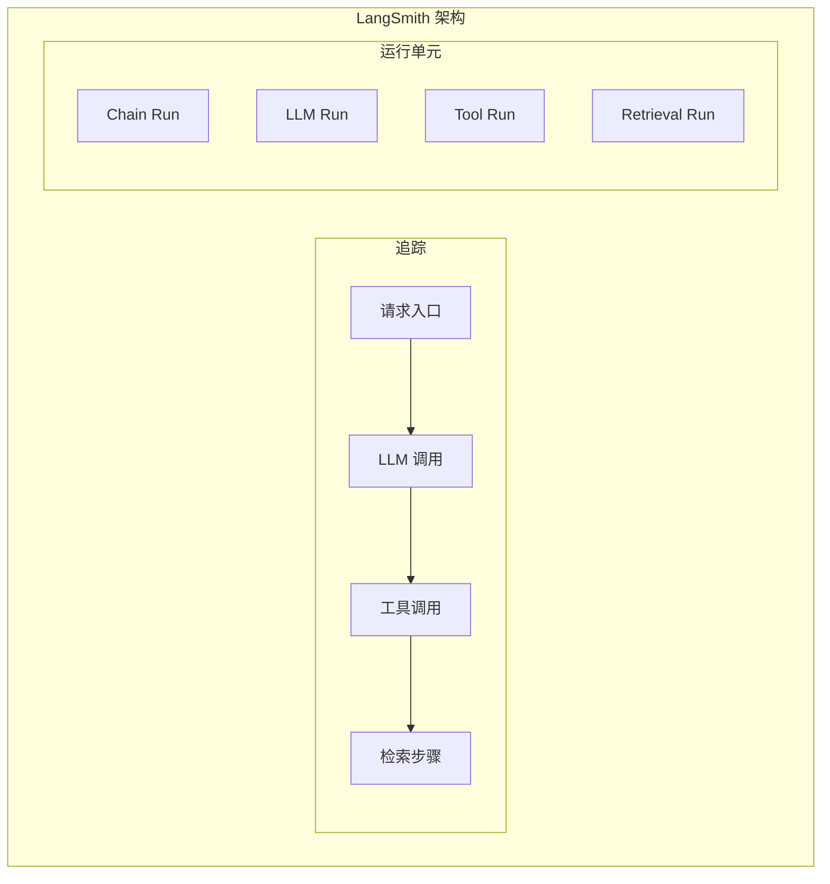
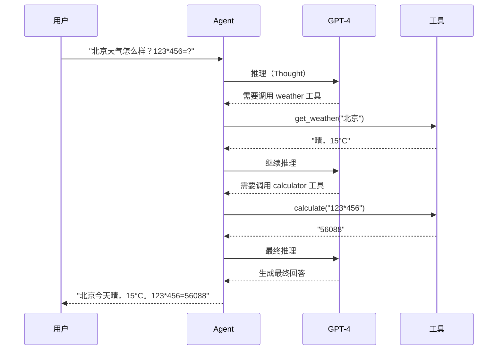
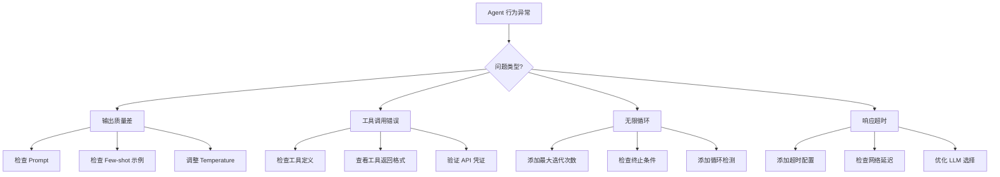
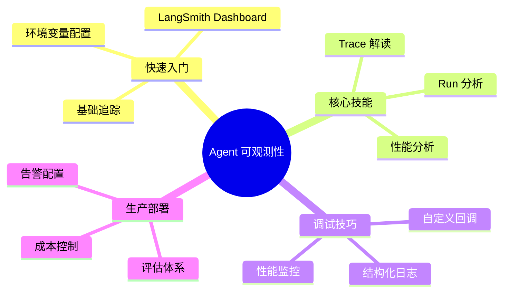

# Day 10: Agent 可观测性与调试 — 深入理解 AI Agent 的"黑盒"内部

> 当 AI Agent 行为不如预期时，如何快速定位问题？本文将带你掌握生产级 AI Agent 的可观测性必备技能

## 昨日回顾

昨天我们学习了 [Day 9: Multi-Agent 系统设计](./day09-multi-agent-systems.md)，掌握了构建 AI Agent 协作团队的核心原则。

## 今日预告

我们将探讨 **Agent 可观测性与调试**，这是将 AI Agent 投入生产环境的关键能力。没有可观测性，Agent 就是彻底的"黑盒"——你永远不知道它在想什么、为什么这样做。

## 为什么 Agent 可观测性如此重要？

AI Agent 与传统软件有本质区别：



**核心挑战：**
- **非确定性**：相同输入可能产生不同输出
- **黑盒推理**：无法直接观察 LLM 内部思考过程
- **多步执行**：Agent 执行轨迹复杂，涉及多轮工具调用
- **状态管理**：内存、上下文、工具调用状态难以追踪

## LangSmith 核心概念

在深入实战之前，我们需要理解 LangSmith 的几个核心概念：



| 概念 | 说明 |
|------|------|
| **Trace** | 完整的请求执行轨迹，记录从请求到响应的全过程 |
| **Run** | 轨迹中的单个操作单元，如 LLM 调用、工具执行 |
| **Span** | 嵌套的运行单元，记录执行时间和元数据 |

## 实战一：5 分钟快速集成 LangSmith

### 1.1 环境配置

```bash
# 创建项目目录
mkdir agent-observability-demo && cd agent-observability-demo

# 创建虚拟环境
python -m venv .venv
source .venv/bin/activate  # Linux/Mac
# .venv\Scripts\activate  # Windows

# 安装依赖
pip install langchain langsmith openai
```

### 1.2 配置环境变量

```bash
# 必需的环境变量
export LANGSMITH_TRACING=true
export LANGSMITH_API_KEY="ls_xxxxxxxxxxxxxxxxxxxxxxxxxxxxxxxx"

# 可选：指定项目名称
export LANGSMITH_PROJECT="my-agent-demo"

# LLM 提供商
export OPENAI_API_KEY="sk-xxxxxxxxxxxxxxxxxxxxxxxxxxxxxxxx"
```

### 1.3 基础追踪示例

```python
"""
LangSmith 基础追踪示例
演示如何追踪 LLM 调用链
"""
from langchain_openai import ChatOpenAI
from langchain_core.tracers import LangChainTracer
from langchain_core.tracers.context import tracing_v2_enabled
from langchain_core.messages import HumanMessage

# 方式一：环境变量自动追踪（最简单）
llm = ChatOpenAI(model="gpt-4")

# 方式二：手动控制追踪
def traced_completion():
    with tracing_v2_enabled(project_name="my-agent") as cb:
        # 所有 LangChain 操作都会被追踪
        result = llm.invoke([
            HumanMessage(content="Explain quantum computing in one sentence")
        ])
        print(f"响应: {result.content}")
    
    # 追踪数据会自动发送到 LangSmith

if __name__ == "__main__":
    traced_completion()
```

## 实战二：追踪复杂 Agent 执行轨迹

### 2.1 创建带工具调用的 Agent

```python
"""
带工具调用的 Agent 追踪示例
展示如何追踪多步推理和工具执行
"""
from langchain.agents import create_openai_functions_agent
from langchain.tools import Tool
from langchain_openai import ChatOpenAI
from langchain import hub

# 定义工具
def get_weather(city: str) -> str:
    """获取指定城市的天气信息"""
    # 实际应用中这里会调用天气 API
    weather_data = {
        "北京": "晴，15°C",
        "上海": "多云，18°C",
        "深圳": "雨，24°C"
    }
    return weather_data.get(city, "未知城市")

def calculate(expression: str) -> str:
    """数学计算工具"""
    try:
        result = eval(expression)
        return str(result)
    except Exception as e:
        return f"计算错误: {e}"

# 创建工具列表
tools = [
    Tool(
        name="weather",
        func=get_weather,
        description="获取城市天气信息。输入城市名称，返回天气和温度。"
    ),
    Tool(
        name="calculator",
        func=calculate,
        description="数学计算器。输入数学表达式，返回计算结果。"
    )
]

# 初始化 LLM
llm = ChatOpenAI(model="gpt-4")

# 创建 Agent（会自动追踪所有操作）
prompt = hub.pull("hwchase17/openai-functions-agent")
agent = create_openai_functions_agent(llm, tools, prompt)

# 执行并观察追踪
from langchain.agents import AgentExecutor

agent_executor = AgentExecutor(
    agent=agent,
    tools=tools,
    verbose=True,  # 本地 verbose 日志
    handle_parsing_errors=True
)

# 执行查询 - 观察 LangSmith 中的完整轨迹
response = agent_executor.invoke({
    "input": "北京今天天气怎么样？帮我计算一下 123 * 456 的结果。"
})

print(f"\n最终响应: {response['output']}")
```

### 2.2 LangSmith Dashboard 解读

执行上述代码后，访问 [LangSmith Dashboard](https://smith.langchain.com)，你将看到：



**在 LangSmith Dashboard 中你会看到：**
- 每一步 LLM 调用的输入/输出
- 工具调用的参数和返回值
- Token 消耗统计
- 执行时间分析

## 实战三：自定义追踪事件

### 3.1 使用 @trace 装饰器

```python
"""
自定义追踪示例
在关键业务逻辑中添加自定义追踪事件
"""
from langsmith import traceable
from langchain_openai import ChatOpenAI

llm = ChatOpenAI(model="gpt-4")

# @traceable 装饰器自动追踪函数
@traceable(
    project_name="custom-tracing-demo",
    tags=["product-search", "v2"],
    metadata={"version": "2.0"}
)
def search_products(query: str, category: str = None, limit: int = 10):
    """
    商品搜索函数
    - query: 搜索关键词
    category: 商品分类（可选）
    limit: 返回数量
    """
    # 模拟搜索逻辑
    products = [
        {"id": 1, "name": "iPhone 15 Pro", "price": 7999},
        {"id": 2, "name": "MacBook Pro M3", "price": 12999},
        {"id": 3, "name": "iPad Pro", "price": 5999},
    ]
    
    # 过滤结果
    results = [p for p in products if query.lower() in p["name"].lower()]
    return results[:limit]

@traceable(run_type="chain")
def rank_products(products: list, user_preferences: dict):
    """
    根据用户偏好对商品排序
    """
    # 模拟排序逻辑
    scored = []
    for p in products:
        score = 100  # 基础分数
        if user_preferences.get("prefer_premium"):
            score += 10
        scored.append({**p, "score": score})
    
    return sorted(scored, key=lambda x: x["score"], reverse=True)

@traceable(run_type="llm")
def generate_recommendation(products: list):
    """生成推荐理由"""
    product_names = ", ".join([p["name"] for p in products[:3]])
    prompt = f"为以下商品生成简短推荐理由: {product_names}"
    
    response = llm.invoke(prompt)
    return response.content

# 组合调用
def recommend_products(query: str, user_preferences: dict = None):
    """商品推荐主流程"""
    user_preferences = user_preferences or {}
    
    # 步骤 1: 搜索
    products = search_products(query)
    
    # 步骤 2: 排序
    ranked = rank_products(products, user_preferences)
    
    # 步骤 3: 生成推荐
    recommendation = generate_recommendation(ranked)
    
    return {
        "products": ranked,
        "recommendation": recommendation
    }

# 执行并观察 LangSmith
result = recommend_products(
    query="Pro",
    user_preferences={"prefer_premium": True}
)
```

### 3.2 手动创建追踪事件

```python
"""
手动追踪示例
在需要精确控制的场景使用
"""
from langsmith import Client
from langsmith.run_trees import RunTree

# 初始化客户端
client = Client()

# 创建自定义追踪
def custom_traced_execution():
    # 创建新的追踪树
    with client.create_run_tree(
        name="custom-workflow",
        run_type="chain",
        inputs={"query": "AI Agent"},
        metadata={"source": "api"}
    ) as run_tree:
        # 模拟工作流步骤
        run_tree.add_child(
            name="step-1-data-fetch",
            run_type="tool",
            inputs={"query": "AI Agent"},
            outputs={"data": [...]}
        )
        
        run_tree.add_child(
            name="step-2-processing", 
            run_type="chain",
            inputs={"data": [...]},
            outputs={"processed": True}
        )
        
        run_tree.add_child(
            name="step-3-response",
            run_type="llm",
            inputs={"prompt": "..."},
            outputs={"response": "..."}
        )
        
        return {"status": "success"}

custom_traced_execution()
```

## 实战四：生产环境调试技巧

### 4.1 常见问题与排查



### 4.2 调试配置示例

```python
"""
生产环境调试配置
包含超时、重试、日志等关键配置
"""
from langchain.agents import AgentExecutor
from langchain_core.callbacks import BaseCallbackHandler
import logging

# 自定义回调处理器
class DebugCallbackHandler(BaseCallbackHandler):
    """调试用回调处理器"""
    
    def on_llm_start(self, serialized, prompts, **kwargs):
        print(f"\n🔍 [LLM] 开始推理")
        print(f"   Prompt: {prompts[0][:200]}...")
    
    def on_llm_end(self, response, **kwargs):
        print(f"\n✅ [LLM] 推理完成")
        print(f"   Token 使用: {response.llm_output}")
    
    def on_tool_start(self, tool_name, tool_input, **kwargs):
        print(f"\n🔧 [工具] 开始执行: {tool_name}")
        print(f"   输入: {tool_input}")
    
    def on_tool_end(self, tool_output, **kwargs):
        print(f"\n🔧 [工具] 执行完成")
        print(f"   输出: {tool_output[:200]}...")
    
    def on_agent_action(self, action, **kwargs):
        print(f"\n🤔 [Agent] 思考: {action.log}")

# 配置 Agent Executor
agent_executor = AgentExecutor(
    agent=agent,
    tools=tools,
    max_iterations=10,        # 最大迭代次数，防止无限循环
    max_execution_time=60,    # 最大执行时间（秒）
    early_stopping_method="force",  # 强制停止
    handle_parsing_errors="抱歉，我遇到了问题: {error}",  # 解析错误处理
    callbacks=[DebugCallbackHandler()]  # 添加调试回调
)
```

### 4.3 日志与监控最佳实践

```python
"""
结构化日志配置
方便后续查询和分析
"""
import json
import logging
from datetime import datetime

class StructuredLogger:
    """结构化日志记录器"""
    
    def __init__(self, logger_name: str):
        self.logger = logging.getLogger(logger_name)
        self.logger.setLevel(logging.INFO)
        
        # 添加 JSON 格式的 handler
        handler = logging.StreamHandler()
        handler.setFormatter(logging.Formatter('%(message)s'))
        self.logger.addHandler(handler)
    
    def log_agent_run(self, event_type: str, data: dict):
        """记录 Agent 运行事件"""
        log_entry = {
            "timestamp": datetime.utcnow().isoformat(),
            "event_type": event_type,
            "data": data
        }
        self.logger.info(json.dumps(log_entry))

# 使用示例
logger = StructuredLogger("my-agent")

# 记录各种事件
logger.log_agent_run("agent_start", {"input": "用户查询"})
logger.log_agent_run("tool_call", {"tool": "weather", "args": {"city": "北京"}})
logger.log_agent_run("llm_call", {"model": "gpt-4", "tokens": 1500})
logger.log_agent_run("agent_end", {"output": "响应内容", "duration_ms": 2500})
```

## 实战五：性能监控与评估

### 5.1 LangSmith Evaluation 实战

```python
"""
使用 LangSmith 进行自动评估
评估 Agent 输出质量
"""
from langsmith.evaluation import evaluate

# 定义评估器
def correctness_evaluator(run, example):
    """正确性评估器"""
    # 从追踪中提取实际输出
    output = run.outputs.get("output", "")
    expected = example.outputs.get("answer", "")
    
    # 简单评估：检查关键词
    score = 0.5  # 基础分数
    if any(keyword in output for keyword in expected.split()):
        score = 1.0
    
    return {
        "key": "correctness",
        "score": score,
        "comment": "输出包含预期关键词" if score > 0.7 else "输出质量需要改进"
    }

def tool_usage_evaluator(run, example):
    """工具使用评估器"""
    # 检查是否正确使用了工具
    tool_calls = run.outputs.get("tool_calls", [])
    
    return {
        "key": "tool_usage",
        "score": 1.0 if len(tool_calls) > 0 else 0.0,
        "comment": "正确使用了工具" if len(tool_calls) > 0 else "未使用工具"
    }

# 运行评估
evaluation_results = evaluate(
    agent_executor.invoke,
    data="dataset-name",  # 评估数据集
    evaluators=[correctness_evaluator, tool_usage_evaluator],
    experiment_prefix="agent-v1-evaluation"
)

print(f"评估结果: {evaluation_results}")
```

### 5.2 自定义性能指标

```python
"""
自定义性能指标监控
追踪关键业务指标
"""
from dataclasses import dataclass
from typing import List
import time

@dataclass
class AgentMetrics:
    """Agent 性能指标"""
    total_requests: int = 0
    successful_requests: int = 0
    failed_requests: int = 0
    total_tokens: int = 0
    total_latency_ms: float = 0
    
    @property
    def success_rate(self) -> float:
        return self.successful_requests / self.total_requests if self.total_requests > 0 else 0
    
    @property
    def avg_latency_ms(self) -> float:
        return self.total_latency_ms / self.total_requests if self.total_requests > 0 else 0

# 全局指标收集器
metrics = AgentMetrics()

def track_request(func):
    """请求追踪装饰器"""
    def wrapper(*args, **kwargs):
        metrics.total_requests += 1
        start_time = time.time()
        
        try:
            result = func(*args, **kwargs)
            metrics.successful_requests += 1
            return result
        except Exception as e:
            metrics.failed_requests += 1
            raise
        finally:
            latency = (time.time() - start_time) * 1000
            metrics.total_latency_ms += latency
    
    return wrapper

# 使用
@track_request
def agent_invoke(query: str):
    """被追踪的 Agent 调用"""
    return agent_executor.invoke({"input": query})

# 模拟一些请求
for query in ["天气", "计算", "搜索"]:
    agent_invoke(query)

print(f"成功率: {metrics.success_rate:.1%}")
print(f"平均延迟: {metrics.avg_latency_ms:.0f}ms")
```

## 实战六：OpenClaw 中的可观测性

### 6.1 OpenClaw 内置追踪

OpenClaw 已经内置了完整的可观测性支持：

```python
"""
OpenClaw 可观测性配置
利用 OpenClaw 内置功能进行调试
"""
# 查看 session 历史
# OpenClaw 会自动记录所有会话

# 1. 查看当前 session 状态
# 使用 session_status 工具获取会话信息

# 2. 查看历史消息
# 使用 sessions_history 获取完整对话历史

# 3. 启用调试模式
# 在 OpenClaw 配置中开启 verbose logging
```

### 6.2 自定义 OpenClaw 回调

```python
"""
OpenClaw Agent 回调配置
添加自定义监控逻辑
"""

# OpenClaw 支持自定义回调处理
# 参考 OpenClaw 文档中的 callbacks 配置

# 典型配置示例
openclaw_config = {
    "observability": {
        "enabled": True,
        "langsmith": {
            "api_key": "${LANGSMITH_API_KEY}",
            "project": "openclaw-agent"
        },
        "callbacks": {
            "on_agent_start": "log_agent_start",
            "on_agent_end": "log_agent_end", 
            "on_tool_call": "log_tool_call"
        }
    }
}
```

## 总结与实战建议



### 给 UI 工程师的转型的建议

1. **从简单开始**：先用环境变量开启追踪，观察现有 Agent 的行为
2. **理解追踪结构**：LangSmith 的 Trace/Run 概念是基础
3. **自定义追踪**：在关键业务逻辑添加 @traceable 装饰器
4. **建立评估体系**：用评估数据集持续监控 Agent 质量
5. **成本意识**：追踪数据会消耗资源，注意优化和清理

### 下期预告

明天我们将探讨 **提示词工程进阶技巧**，包括：
- Chain of Thought 提示技巧
- ReAct 推理框架
- Self-Consistency 自洽性
- 实际项目中的提示词模板

敬请期待！

## 参考资料

- [LangSmith 官方文档](https://docs.langchain.com/langsmith/home)
- [LangSmith Tracing Quickstart](https://docs.langchain.com/langsmith/observability-quickstart)
- [LangChain 可观测性指南](https://python.langchain.com/docs/concepts/)
