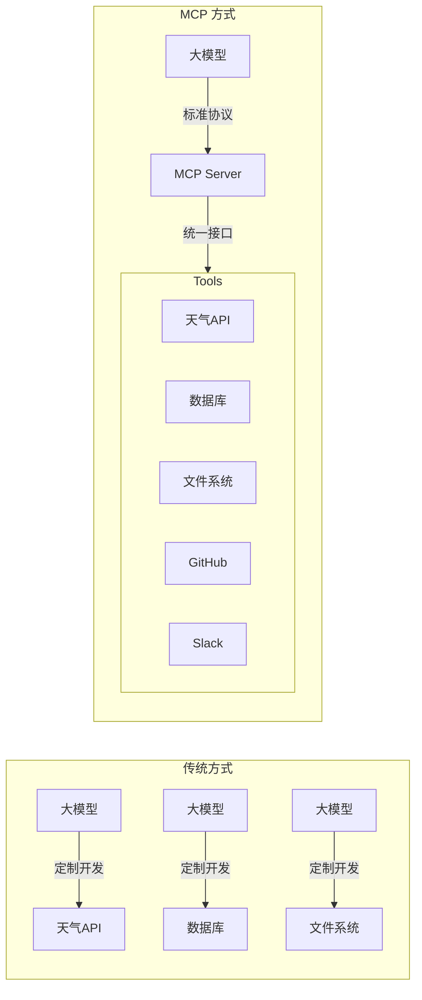
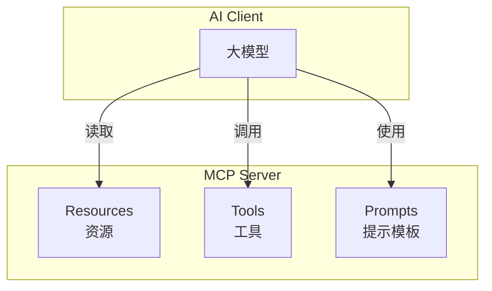
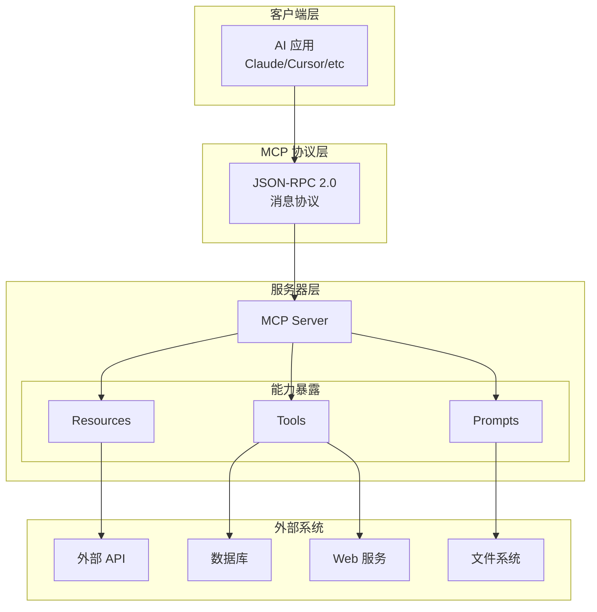
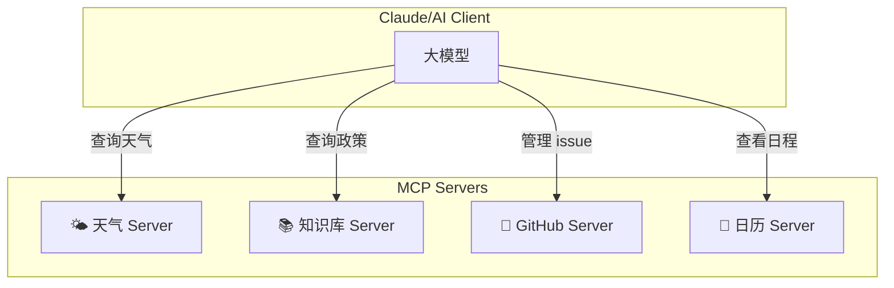
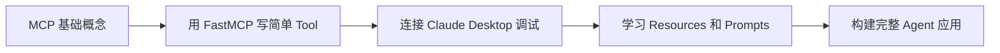

# Day 10: MCP (Model Context Protocol) — AI 时代的"USB-C"接口

> 打造 AI Agent 的标准化工具生态，让大模型真正"动"起来

## 昨日回顾

昨天我们学习了 [Day 9: Multi-Agent 系统设计](./day09-multi-agent-systems.md)，掌握了构建 AI Agent 协作团队的核心方法。

## 明日预告

明天我们将探讨 **Agent 可观测性与调试**，包括 LangSmith 实战、Agent 执行轨迹追踪、性能监控与日志分析。敬请期待！

## 什么是 MCP？

**MCP (Model Context Protocol，模型上下文协议)** 是一个开放标准，用于将 AI 应用连接到外部系统。

想象一下：**MCP 就是 AI 领域的"USB-C 接口"**。



### 为什么 MCP 如此重要？

| 角色 | MCP 的价值 |
|------|-------------|
| **开发者** | 再也不用为每个 AI 应用重复开发工具集成，一次开发，处处运行 |
| **AI 应用** | 获得一个丰富的工具生态系统，增强能力，提升用户体验 |
| **终端用户** | 更强大的 AI 应用，可以访问你的数据并代表你执行任务 |

### MCP 支持的三大能力



1. **Resources（资源）**：类似文件的数据，AI 可以读取（如 API 响应、文件内容）
2. **Tools（工具）**：AI 可以调用的函数（需要用户授权）
3. **Prompts（提示模板）**：预定义的提示模板，帮助用户完成特定任务

## MCP 技术架构深度解析

### 1. 整体架构



### 2. 通信模式

MCP 支持两种传输方式：

```mermaid
flowchart LR
    subgraph STDIO 模式（本地）
        Client1[AI Client] <-->|stdio| Server1[MCP Server]
    end
    
    subgraph HTTP 模式（远程）
        Client2[AI Client] <-->|HTTP/SSE| Server2[MCP Server]
    end
```

| 传输方式 | 适用场景 | 优点 |
|----------|----------|------|
| **STDIO** | 本地运行的应用 | 简单，无需网络配置 |
| **HTTP + SSE** | 远程服务 | 可分布式部署，支持生产环境 |

## 实战：从零构建 MCP Server

作为前端/UI 工程师，你完全可以快速上手 MCP 开发！我们以一个**天气查询 MCP Server** 为例，手把手教学。

### 1. 环境准备

```bash
# 安装 uv（现代化的 Python 包管理工具）
curl -LsSf https://astral.sh/uv/install.sh | sh

# 创建项目
uv init weather-mcp
cd weather-mcp

# 创建虚拟环境
uv venv
source .venv/bin/activate  # Linux/macOS
# .venv\Scripts\activate     # Windows

# 安装 MCP 依赖
uv add "mcp[cli]" httpx
```

### 2. 完整代码实现

```python
"""
MCP Weather Server - 天气查询服务
作者：AI Agent 工程师
功能：提供天气预警和天气预报查询
"""

from typing import Any
import httpx
from mcp.server.fastmcp import FastMCP

# ============================================================
# 初始化 MCP Server
# ============================================================
mcp = FastMCP("weather")

# 常量配置
NWS_API_BASE = "https://api.weather.gov"
USER_AGENT = "weather-mcp/1.0"


# ============================================================
# 辅助函数
# ============================================================

async def make_nws_request(url: str) -> dict[str, Any] | None:
    """
    向 NWS API 发送请求的辅助函数
    
    Args:
        url: 请求的 URL
        
    Returns:
        JSON 响应数据，或失败时返回 None
    """
    headers = {
        "User-Agent": USER_AGENT,
        "Accept": "application/geo+json"
    }
    async with httpx.AsyncClient() as client:
        try:
            response = await client.get(url, headers=headers, timeout=30.0)
            response.raise_for_status()
            return response.json()
        except Exception as e:
            print(f"请求失败: {e}", file=__import__('sys').stderr)
            return None


def format_alert(feature: dict) -> str:
    """
    格式化天气预警信息为可读字符串
    
    Args:
        feature: NWS API 返回的预警特征
        
    Returns:
        格式化的预警字符串
    """
    props = feature["properties"]
    return f"""
⚠️ 预警类型: {props.get("event", "未知")}
📍 影响区域: {props.get("areaDesc", "未知")}
🔴 严重程度: {props.get("severity", "未知")}
📝 详细描述: {props.get("description", "无描述")}
🛡️ 应对建议: {props.get("instruction", "无特殊建议")}
"""


# ============================================================
# MCP Tools（核心功能）
# ============================================================

@mcp.tool()
async def get_alerts(state: str) -> str:
    """
    获取美国指定州的天气预警
    
    这是一个 MCP Tool，AI 可以主动调用它来获取天气信息。
    函数签名和文档字符串会自动暴露给 AI。
    
    Args:
        state: 美国州代码，如 "CA", "NY", "TX"（必须是大写两字母）
        
    Returns:
        格式化的预警信息字符串
    """
    # 构建 API URL
    url = f"{NWS_API_BASE}/alerts/active/area/{state}"
    
    # 获取数据
    data = await make_nws_request(url)
    
    # 处理响应
    if not data or "features" not in data:
        return "❌ 无法获取预警数据，请稍后重试。"
    
    if not data["features"]:
        return f"✅ {state} 州目前没有活跃的天气预警。"
    
    # 格式化并返回预警
    alerts = [format_alert(feature) for feature in data["features"]]
    return "=" * 50 + "\n" + "\n---\n".join(alerts)


@mcp.tool()
async def get_forecast(latitude: float, longitude: float) -> str:
    """
    获取指定经纬度的天气预报
    
    Args:
        latitude: 纬度（-90 到 90）
        longitude: 经度（-180 到 180）
        
    Returns:
        格式化的天气预报字符串
    """
    # 第一步：获取预报网格端点
    points_url = f"{NWS_API_BASE}/points/{latitude},{longitude}"
    points_data = await make_nws_request(points_url)
    
    if not points_data:
        return "❌ 无法获取该位置的预报数据，请检查坐标是否正确。"
    
    # 第二步：从响应中获取预报 URL
    forecast_url = points_data["properties"]["forecast"]
    forecast_data = await make_nws_request(forecast_url)
    
    if not forecast_data:
        return "❌ 无法获取详细预报。"
    
    # 第三步：格式化预报结果
    periods = forecast_data["properties"]["periods"]
    forecasts = []
    
    for period in periods[:5]:  # 只显示接下来 5 个时段
        forecast = f"""
🌡️ {period["name"]}
   温度: {period["temperature"]}°{period["temperatureUnit"]}
   风向: {period["windSpeed"]} {period["windDirection"]}
   预报: {period["detailedForecast"]}
"""
        forecasts.append(forecast)
    
    location = points_data["properties"]["relativeLocation"]["properties"]
    location_str = f"{location['city']}, {location['state']}"
    
    return f"📍 {location_str} 的天气预报：\n" + "\n---\n".join(forecasts)


# ============================================================
# 启动服务
# ============================================================

def main():
    """启动 MCP Server"""
    print("🌤️  天气 MCP Server 启动中...", file=__import__('sys').stderr)
    mcp.run(transport="stdio")


if __name__ == "__main__":
    main()
```

### 3. 配置 Claude Desktop

```json
{
  "mcpServers": {
    "weather": {
      "command": "uv",
      "args": [
        "--directory",
        "/ABSOLUTE/PATH/TO/weather-mcp",
        "run",
        "weather.py"
      ]
    }
  }
}
```

### 4. 使用效果

配置完成后，你就可以这样和 Claude 对话：

> **你**：帮我查一下加州洛杉矶现在的天气  
> **Claude**：让我调用天气工具来获取最新预报...  
> （自动调用 `get_forecast` tool）  
> **Claude**：📍 Los Angeles, CA 的天气预报：
> 
> 🌡️ 今天下午  
>    温度: 72°F  
>    风向: 10 mph SW  
>    预报: 晴朗，下午部分多云...

## MCP 在 AI Agent 开发中的高级应用

### 1. 构建企业知识库助手

```python
"""
企业知识库 MCP Server
功能：让 AI 能够查询企业内部文档
"""

from mcp.server.fastmcp import FastMCP
from typing import Any
import json

mcp = FastMCP("enterprise-knowledge")

# 模拟知识库数据（实际项目中应该连接向量数据库）
KNOWLEDGE_BASE = {
    "hr_policy": {
        "title": "HR 政策",
        "content": "年假天数：一年以上员工 15 天/年，五年以上 20 天/年..."
    },
    "onboarding": {
        "title": "入职指南",
        "content": "新员工入职流程：1. 签署劳动合同 2. 开通企业账号..."
    },
    "expense": {
        "title": "报销政策",
        "content": "差旅报销：机票限经济舱，酒店限 500/晚..."
    }
}


@mcp.tool()
async def search_knowledge(keyword: str) -> str:
    """
    搜索企业知识库
    
    Args:
        keyword: 搜索关键词
        
    Returns:
        相关文档内容
    """
    results = []
    for key, doc in KNOWLEDGE_BASE.items():
        if keyword.lower() in doc["title"].lower() or keyword.lower() in doc["content"].lower():
            results.append(f"📄 {doc['title']}\n{doc['content']}")
    
    if not results:
        return "未找到相关内容，建议联系 HR 部门。"
    
    return "\n\n---\n\n".join(results)


@mcp.tool()
async def get_document(doc_id: str) -> str:
    """
    获取指定文档的完整内容
    
    Args:
        doc_id: 文档 ID (hr_policy, onboarding, expense)
        
    Returns:
        文档完整内容
    """
    if doc_id not in KNOWLEDGE_BASE:
        return f"❌ 文档不存在: {doc_id}"
    
    doc = KNOWLEDGE_BASE[doc_id]
    return f"# {doc['title']}\n\n{doc['content']}"
```

### 2. 多 MCP Server 组合使用



一个 AI Agent 可以同时连接多个 MCP Server，形成强大的工具生态！

## UI 工程师的 MCP 学习路径

作为前端/UI 工程师，你已经具备了很多优势：

| 你已有的技能 | MCP 开发所需能力 |
|--------------|------------------|
| ✅ JavaScript/TypeScript | Python 基础（很快能上手） |
| ✅ API 调用经验 | MCP 协议理解 |
| ✅ 组件化思维 | Tool/Resource 设计 |
| ✅ 用户体验意识 | Agent 交互设计 |

### 推荐学习顺序



1. **Day 1-2**：理解 MCP 概念，阅读官方文档
2. **Day 3-5**：跟着教程构建天气 Server
3. **Day 6-7**：尝试修改和扩展功能
4. **Day 8+**：构建自己的 MCP 工具生态

## 主流 MCP Server 推荐

| Server | 功能 | 场景 |
|--------|------|------|
| [Filesystem](https://github.com/modelcontextprotocol/server-filesystem) | 文件系统操作 | 读取/写入本地文件 |
| [GitHub](https://github.com/github/github-mcp-server) | GitHub 操作 | 管理 issue、PR、code review |
| [Brave Search](https://github.com/modelcontextprotocol/server-brave-search) | 网页搜索 | 实时信息查询 |
| [Puppeteer](https://github.com/modelcontextprotocol/server-puppeteer) | 浏览器自动化 | 网页抓取、自动化测试 |
| [Postgres](https://github.com/modelcontextprotocol/server-postgres) | 数据库操作 | SQL 查询、数据分析 |

## 总结

MCP 代表了 AI Agent 开发的未来方向：

> **"一次开发，处处运行"** —— 这是软件工程的理想，也是 MCP 正在实现的目标。

作为 UI 工程师：
- 你有良好的工程思维
- 你熟悉 API 和异步操作
- 你注重用户体验

这些正是开发优秀 MCP Server 所需的技能。MCP 降低了 AI 工具开发的门槛，让我们一起拥抱这个 AI 时代的新标准！

## 下一步

- 尝试运行本教程的天气 Server
- 阅读 MCP 官方文档了解更多细节
- 构建自己的第一个 MCP Tool

---

*持续学习，成为 AI Agent 工程师！*
