# Day 11: 构建高效 AI Agent 的实战指南

> 基于 Anthropic 一年多的实践经验，总结构建生产级 AI Agent 的核心原则

## 昨日回顾

昨天我们学习了 [Day 10: Agent 可观测性与调试](./day10-agent-observability-debugging.md)，掌握了生产环境调试的基本技能。

## 今日预告

我们将深入探讨 **构建高效 AI Agent 的最佳实践**，这是 Anthropic 与数十个团队合作一年多总结出的实战经验。这些原则将帮助我们避开"过度工程化"的陷阱，用简洁有效的模式构建生产级 Agent。

## 核心观点：简单才是王道

过去一年，我们与数十个行业的团队合作构建 LLM Agent。**最成功的实现并不是使用复杂的框架或专用库，而是使用简单、可组合的模式。**

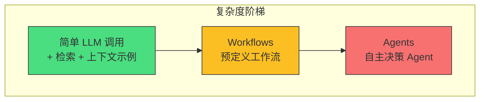

## 什么是 Agent？

"Agent" 有多种定义：

- **广义**：完全自主的系统，长时间独立运作，使用各种工具完成复杂任务
- **狭义**：遵循预定义工作流的更规范化实现

Anthropic 将这些统称为 **Agentic Systems**，但重要区分在于：

| 类型 | 特点 | 适用场景 |
|------|------|----------|
| **Workflows** | LLM 和工具通过预定义代码路径编排 | 任务边界清晰、可预测 |
| **Agents** | LLM 动态控制自己的流程和工具使用 | 需要灵活性、模型驱动决策 |

## 何时（以及何时不）使用 Agent

**关键原则：从最简单的方案开始，只在需要时增加复杂度。**

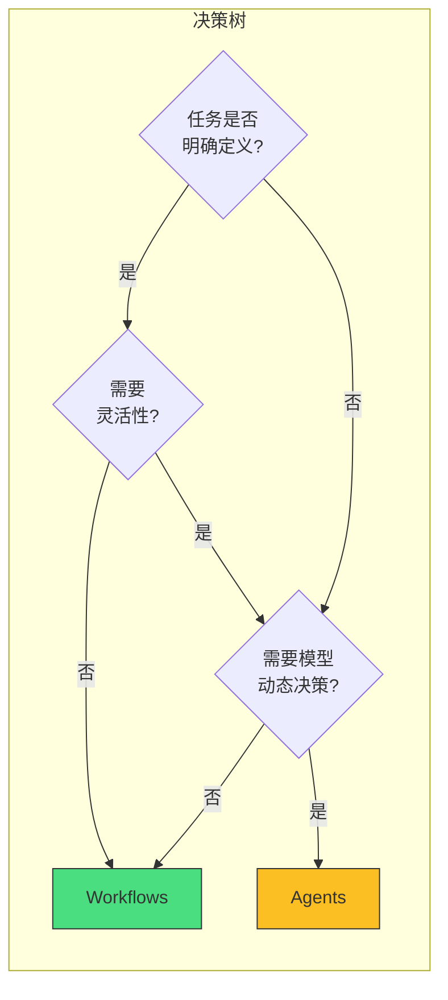

**重要权衡**：
- Agent 往往用**延迟和成本**换取更好的任务性能
- 优化单次 LLM 调用（检索 + 上下文示例）通常足够大部分应用场景

## Agent 架构模式详解

### 1. 基础构建块：增强型 LLM

Agent 的基本构建块是**增强型 LLM**，具备以下能力：

- **检索 (Retrieval)**：从外部知识库获取相关信息
- **工具 (Tools)**：调用外部 API 执行操作
- **记忆 (Memory)**：保留上下文信息

```python
# 增强型 LLM 的基本结构
class AugmentedLLM:
    def __init__(self, llm, retrieval, tools, memory):
        self.llm = llm           # 基础大语言模型
        self.retrieval = retrieval  # 检索系统
        self.tools = tools       # 工具集
        self.memory = memory     # 记忆系统
    
    def process(self, user_input):
        # 1. 检索相关上下文
        context = self.retrieval.search(user_input)
        
        # 2. 准备 prompt（包含上下文、工具描述、记忆）
        prompt = self._build_prompt(user_input, context)
        
        # 3. 调用 LLM
        response = self.llm.generate(prompt)
        
        # 4. 执行工具调用（如果有）
        if response.tool_calls:
            result = self._execute_tools(response.tool_calls)
            # 5. 将工具结果纳入下一步调用
            response = self.llm.generate(prompt, tool_results=result)
        
        # 6. 更新记忆
        self.memory.update(user_input, response)
        
        return response
```

**推荐实现方式**：使用 **MCP (Model Context Protocol)** 连接外部工具生态系统。

### 2. Workflow 模式一：Prompt Chaining（链式提示）

将任务分解为**顺序步骤**，每个 LLM 调用处理前一个的输出。

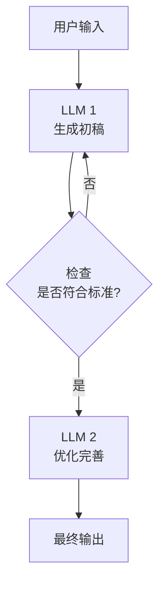

**适用场景**：
- 营销文案生成 → 翻译成不同语言
- 写大纲 → 检查大纲 → 根据大纲写文章

```python
# Prompt Chaining 示例：文章生成
def generate_article(topic):
    # Step 1: 生成大纲
    outline = llm.generate(f"为以下主题生成文章大纲：{topic}")
    
    # Step 2: 检查大纲质量
    is_valid = evaluate_outline(outline)
    
    if not is_valid:
        # 重新生成大纲（最多3次尝试）
        for _ in range(3):
            outline = llm.generate(f"请重新生成更合理的大纲：{topic}")
            if evaluate_outline(outline):
                break
    
    # Step 3: 根据大纲写文章
    article = llm.generate(f"根据以下大纲写文章：\n{outline}")
    
    return article
```

### 3. Workflow 模式二：Routing（路由）

**分类输入**并定向到专门的 follow-up 任务。

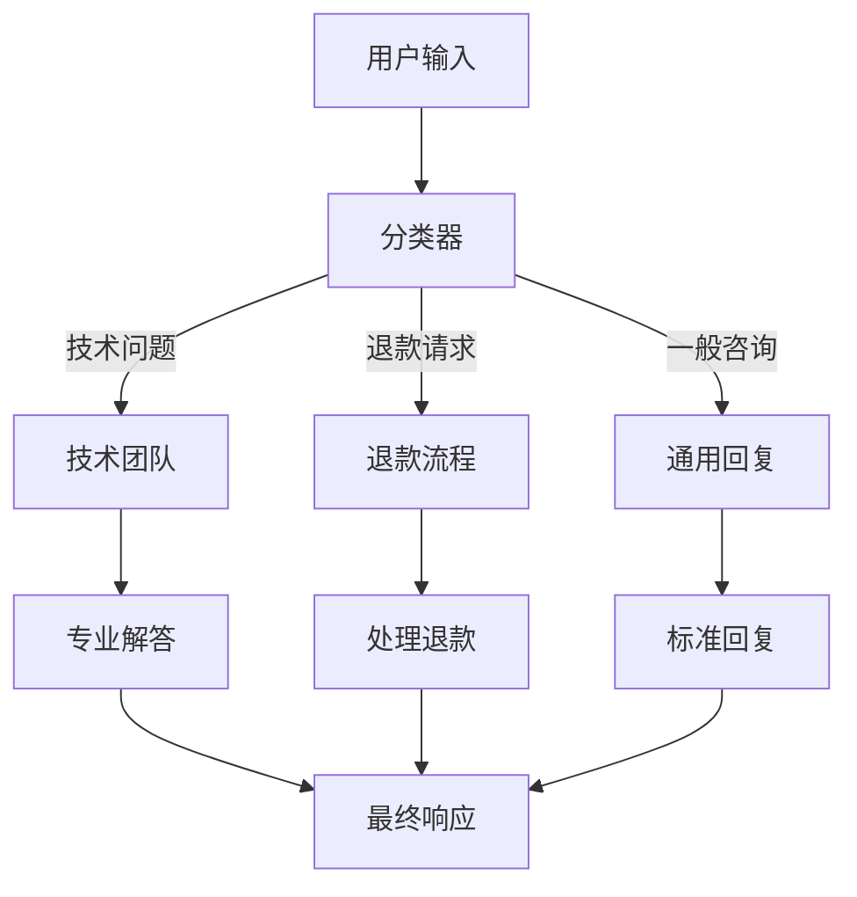

**适用场景**：
- 不同类型的客服查询 → 不同的处理流程
- 简单问题用小模型（Haiku），复杂问题用大模型（Sonnet/Opus）

```python
# Routing 示例：智能路由
def route_query(user_query):
    # 使用小模型进行分类
    category = haiku.classify(
        query=user_query,
        categories=["技术问题", "退款请求", "一般咨询", "其他"]
    )
    
    # 根据类别路由到不同处理流程
    if category == "技术问题":
        return handle_technical(user_query)
    elif category == "退款请求":
        return handle_refund(user_query)
    elif category == "一般咨询":
        return handle_general(user_query)
    else:
        return handle_other(user_query)

# 小模型处理简单问题，大模型处理复杂问题
def handle_general(query):
    # 简单问题用 Haiku（快速且便宜）
    return haiku.generate(f"简洁回答：{query}")

def handle_technical(query):
    # 技术问题用 Sonnet（更聪明）
    return sonnet.generate(f"详细技术解答：{query}")
```

### 4. Workflow 模式三：Parallelization（并行化）

LLM **同时处理子任务**，然后聚合结果。

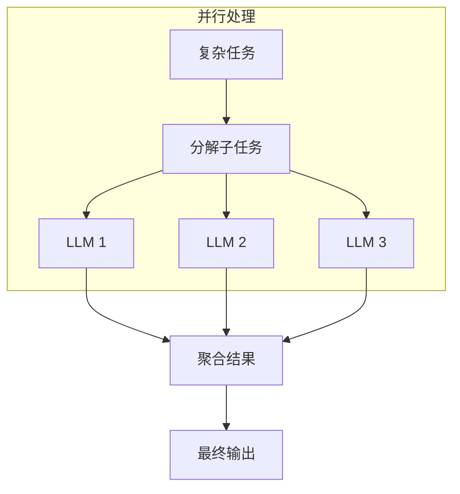

**两种形式**：

1. **Sectioning（分区）**：将任务分成独立子任务并行执行
2. **Voting（投票）**：多次运行同一任务获取多样化输出

```python
# Parallelization 示例：代码审查
import asyncio

async def parallel_code_review(code):
    # 定义多个审查维度
    review_prompts = [
        f"审查以下代码的安全漏洞：\n{code}",
        f"审查以下代码的性能问题：\n{code}",
        f"审查以下代码的代码规范：\n{code}",
        f"审查以下代码的潜在 Bug：\n{code}"
    ]
    
    # 并行执行所有审查
    tasks = [llm.generate(prompt) for prompt in review_prompts]
    results = await asyncio.gather(*tasks)
    
    # 聚合结果
    aggregated = aggregate_reviews(results)
    
    return aggregated

# Voting 示例：内容审核
def moderate_content(content):
    # 多次审核，取多数意见
    votes = []
    for _ in range(5):
        result = llm.generate(
            f"判断以下内容是否违规：{content}",
            options=["违规", "不违规"]
        )
        votes.append(result)
    
    # 统计投票结果
    violation_count = votes.count("违规")
    return violation_count >= 3  # 3/5 以上认为违规
```

### 5. Workflow 模式四：Orchestrator-Workers（编排器-工作者）

**中央 LLM 动态分解任务**，委派给工作者 LLM，然后综合结果。

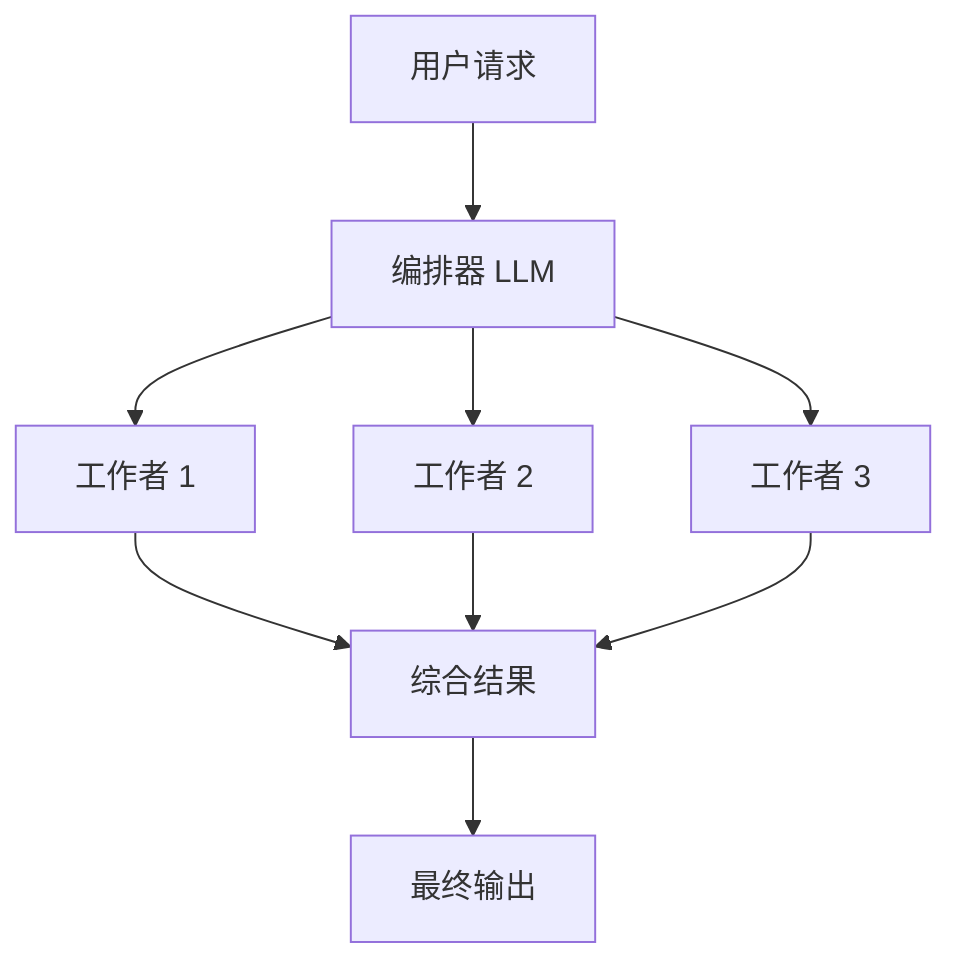

**关键区别**：与 Parallelization 不同，子任务是**动态确定**的，而非预定义。

**适用场景**：
- 编程任务：需要修改的文件数量和内容取决于具体任务
- 搜索任务：从多个来源收集和分析信息

```python
# Orchestrator-Workers 示例：自动化代码修复
async def fix_bug(bug_description):
    # 1. 编排器分析问题，确定需要修改的文件
    files_to_modify = await orchestrator.analyze(
        f"分析这个 bug：{bug_description}，确定需要修改哪些文件"
    )
    
    if not files_to_modify:
        return "无法确定需要修改的文件"
    
    # 2. 并行获取各文件内容
    file_contents = await fetch_files(files_to_modify)
    
    # 3. 委派给各个工作者并行修复
    tasks = []
    for file_path, content in file_contents.items():
        task = worker.fix_file(file_path, content, bug_description)
        tasks.append(task)
    
    results = await asyncio.gather(*tasks)
    
    # 4. 编排器综合结果
    final_result = await orchestrator.synthesize(
        bug_description, results
    )
    
    return final_result
```

### 6. Workflow 模式五：Evaluator-Optimizer（评估器-优化器）

**一个 LLM 生成响应，另一个提供评估和反馈，循环迭代。**

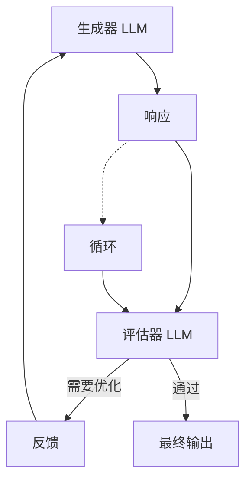

**适用场景**：
- 文学翻译：评估器指出细微差别
- 复杂搜索：多轮搜索和分析

```python
# Evaluator-Optimizer 示例：迭代优化翻译
def translate_iteratively(text, target_lang, max_iterations=3):
    current_translation = None
    
    for i in range(max_iterations):
        if current_translation is None:
            # 第一轮：生成初稿
            current_translation = translator.generate(
                f"翻译以下内容到 {target_lang}：\n{text}"
            )
        else:
            # 后续轮次：基于反馈优化
            current_translation = translator.generate(
                f"基于以下反馈优化翻译：\n"
                f"原文：{text}\n"
                f"当前翻译：{current_translation}\n"
                f"评估意见：{feedback}"
            )
        
        # 评估翻译质量
        evaluation = evaluator.evaluate(
            original=text,
            translation=current_translation,
            target_lang=target_lang
        )
        
        feedback = evaluation.get("feedback", "")
        is_acceptable = evaluation.get("acceptable", False)
        
        if is_acceptable:
            break
    
    return current_translation
```

### 7. Agent 模式：完全自主

当 LLM 在以下方面成熟时，Agent 开始进入生产环境：

- 理解复杂输入
- 推理和规划
- 可靠使用工具
- 从错误中恢复

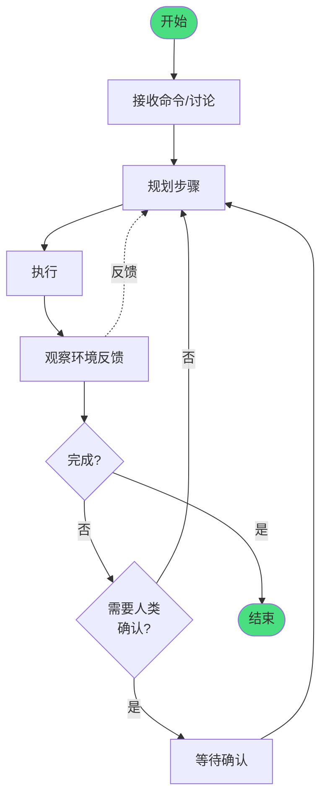

**Agent 的典型工作流程**：

```python
# 自主 Agent 示例
class AutonomousAgent:
    def __init__(self, llm, tools, max_iterations=20):
        self.llm = llm
        self.tools = tools
        self.max_iterations = max_iterations
    
    async def run(self, task, human_in_the_loop=True):
        self.history = []
        
        for iteration in range(self.max_iterations):
            # 1. 思考下一步行动
            thought = await self.llm.think(
                task=task,
                history=self.history,
                available_tools=self.tools
            )
            
            # 2. 如果需要行动，执行工具
            if thought.action:
                result = await self.execute_tool(thought.action)
                self.history.append({
                    "thought": thought,
                    "result": result
                })
                
                # 3. 检查是否需要人类确认
                if thought.requires_human_confirmation and human_in_the_loop:
                    human_feedback = await self.request_human_input(
                        thought, result
                    )
                    if human_feedback == "reject":
                        return {"status": "rejected", "history": self.history}
            
            # 4. 检查任务是否完成
            if self.is_complete(thought):
                return {"status": "completed", "result": thought.result}
        
        return {"status": "max_iterations", "history": self.history}
    
    def is_complete(self, thought):
        # 检查是否完成任务或达到终止条件
        return thought.is_complete or thought.has_blocker
```

## Agent-Computer Interface (ACI)：工具设计最佳实践

**核心原则**：把设计人机接口 (HCI) 的精力投入到 Agent-Computer Interface (ACI) 中。

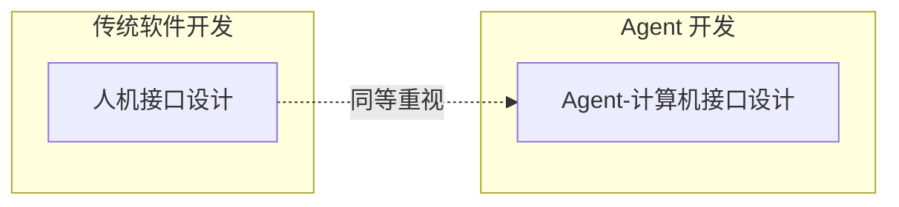

### ACI 最佳实践

**1. 给模型足够的"思考"空间**

```python
# ❌ 不好的设计：让模型"陷入困境"
# 模型需要在写代码前就知道要改多少行
{
    "name": "edit_file",
    "description": "Edit a file using a diff",
    "parameters": {
        "type": "object",
        "properties": {
            "path": {"type": "string"},
            "diff": {"type": "string", "description": "Diff format: -lines to remove, +lines to add"}
        }
    }
}

# ✅ 好的设计：让模型先读取，再编辑
{
    "name": "read_file",
    "description": "Read the full content of a file",
    "parameters": {
        "type": "object",
        "properties": {
            "path": {"type": "string", "description": "Absolute path to the file"}
        }
    }
}

{
    "name": "edit_file",
    "description": "Edit a specific section of a file by replacing old text with new text",
    "parameters": {
        "type": "object",
        "properties": {
            "path": {"type": "string", "description": "Absolute path to the file"},
            "old_string": {"type": "string", "description": "Exact text to find and replace"},
            "new_string": {"type": "string", "description": "New text to replace the old text"}
        }
    }
}
```

**2. 使用模型自然见过的格式**

```python
# ❌ 不好的设计：JSON 中嵌套代码
{
    "name": "create_file",
    "parameters": {
        "type": "object",
        "properties": {
            "content": {"type": "string", "description": "JSON-encoded file content"}
        }
    }
}

# ✅ 好的设计：直接用字符串
{
    "name": "create_file",
    "parameters": {
        "type": "object",
        "properties": {
            "content": {"type": "string", "description": "Full file content as string"}
        }
    }
}
```

**3. 减少格式开销**

```python
# ❌ 不好的设计：需要精确计算行号
{
    "name": "edit_lines",
    "parameters": {
        "type": "object",
        "properties": {
            "start_line": {"type": "integer"},
            "end_line": {"type": "integer"},
            "new_content": {"type": "string"}
        }
    }
}

# ✅ 好的设计：基于内容的编辑
{
    "name": "edit_file",
    "parameters": {
        "type": "object",
        "properties": {
            "file_path": {"type": "string"},
            "old_text": {"type": "string", "description": "Text to find (can be multi-line)"},
            "new_text": {"type": "string", "description": "Text to replace with"}
        }
    }
}
```

**4. Poka-yoke（防错）设计**

```python
# ❌ 不好的设计：容易用错
{
    "name": "search_files",
    "parameters": {
        "type": "object",
        "properties": {
            "path": {"type": "string"},
            "pattern": {"type": "string"},
            "use_regex": {"type": "boolean"}
        }
    }
}

# ✅ 好的设计：防止错误
{
    "name": "search_files",
    "description": "Search for text in files. Supports both literal text and regex patterns.",
    "parameters": {
        "type": "object",
        "properties": {
            "path": {"type": "string", "description": "Directory to search in (default: current directory)"},
            "query": {"type": "string", "description": "Text or regex pattern to search for"},
            "is_regex": {"type": "boolean", "description": "Set to true if query is a regex pattern (default: false)"}
        }
    }
}
```

## 三大核心原则总结

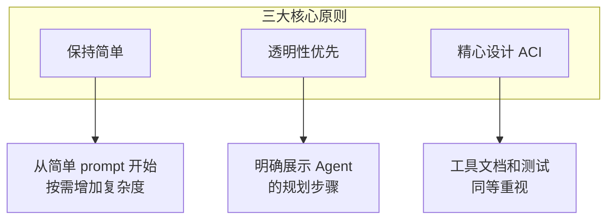

1. **保持简单**：Agent 设计越简单越好
2. **透明性**：明确展示 Agent 的规划步骤
3. **ACI**：像重视 HCI 一样重视 Agent-计算机接口

## 实际应用案例

### 案例一：智能客服

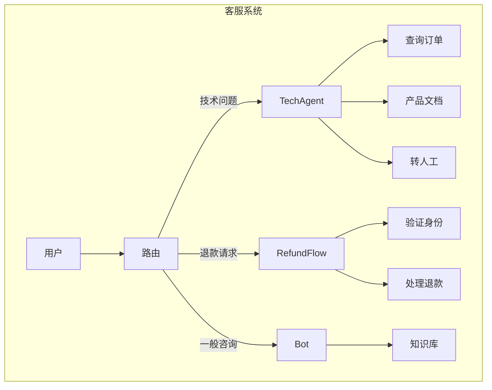

**客服 Agent 的优势**：
- 自然对话流程 + 外部信息访问
- 可集成客户数据、订单历史、知识库文章
- 可处理退款、更新工单等实际操作
- 成功标准明确（用户问题解决）

### 案例二：编程 Agent

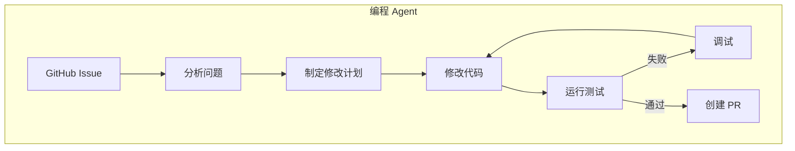

**编程 Agent 的优势**：
- 代码可通过自动化测试验证
- 可用测试结果作为反馈迭代
- 问题空间定义清晰、结构化
- 输出质量可客观测量

## 框架：何时使用

**可用的框架**：
- Claude Agent SDK
- AWS Strands Agents
- Rivet（拖拽式 GUI）
- Vellum（GUI 工具）

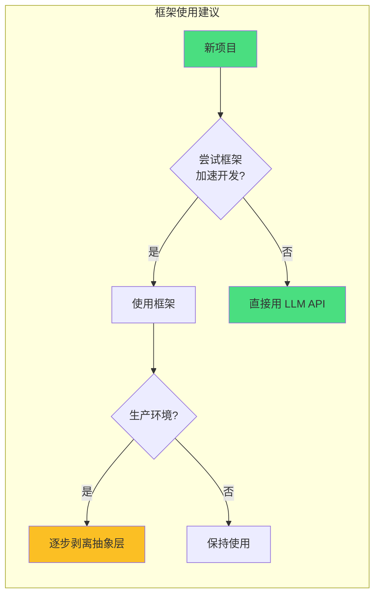

**框架的利弊**：
- ✅ 简化标准任务（调用 LLM、定义工具、链接调用）
- ❌ 增加抽象层，可能隐藏 prompt 和响应
- ❌ 可能诱惑添加不必要的复杂度

**建议**：从直接使用 LLM API 开始，许多模式只需几行代码实现。

## 明日预告

明天我们将探讨 **AI Agent 的安全与防护**，包括：Prompt Injection 防御、Agent 权限控制、工具调用安全边界，以及如何构建可信赖的 AI Agent 系统。敬请期待！

## 参考资料

- [Building Effective AI Agents - Anthropic Engineering](https://www.anthropic.com/engineering/building-effective-agents)
- [Claude Code Best Practices](https://code.claude.com/docs)
- [Model Context Protocol](https://modelcontextprotocol.io/)

---

*本文是 AI Agent 工程师学习路径的第 11 课。点击查看 [完整学习路径](./README.md)*
