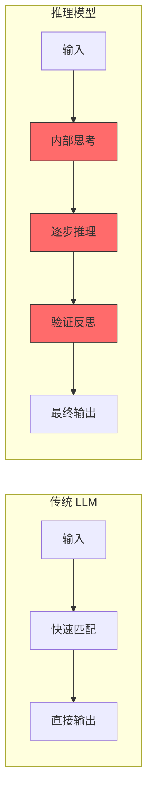
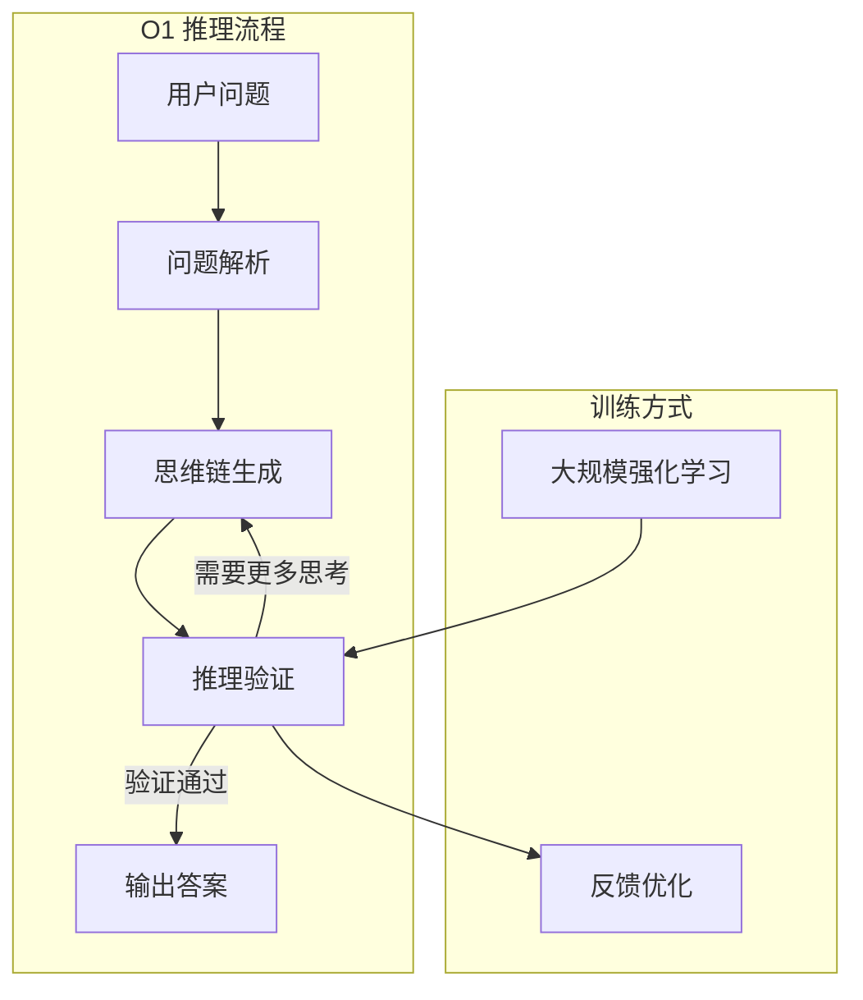
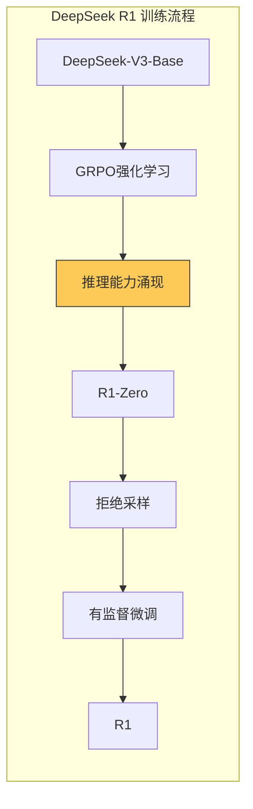
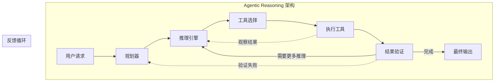
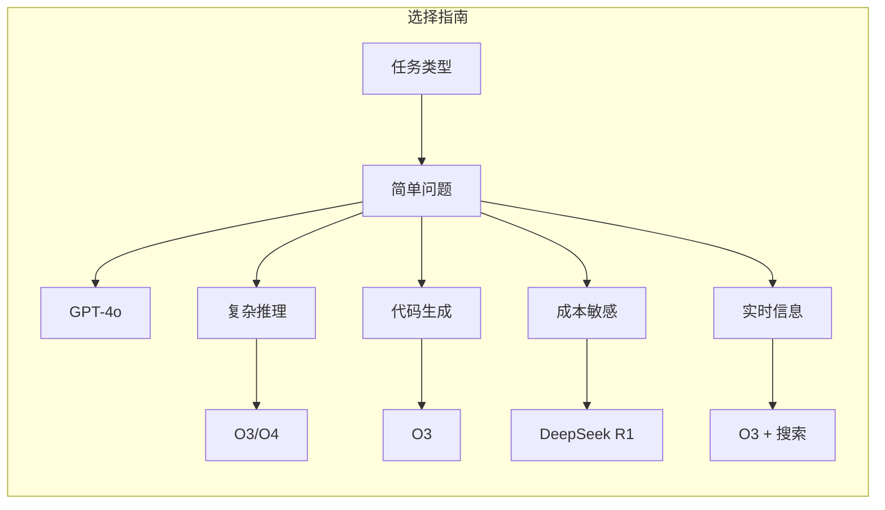

# Day 12: AI 推理模型与 Agentic Reasoning — 深入理解 O1/O3/O4 思维链革命

> 当 AI 不仅能回答问题，还能像人类一样"思考"时，Agent 的能力边界在哪里？本文将带你掌握最新推理模型的核心原理与实战技巧

## 昨日回顾

昨天我们学习了 [Day 11: 构建高效的 Agent](./day11-building-effective-agents.md)，掌握了 Agent 设计的核心原则。

## 今日预告

我们将探讨 **AI 推理模型与 Agentic Reasoning**，这是 2025-2026 年 AI 领域最激动人心的技术突破。OpenAI O1、O3、O4 以及 DeepSeek R1 等推理模型的诞生，标志着 AI 从"快速反应"转向"深度思考"。

## 为什么推理模型如此重要？

传统 LLM 采用的是 **System-1 思维**（快速、直觉、模式匹配），而推理模型引入了 **System-2 思维**（慢速、逻辑、深度推理）。



### 推理模型 vs 传统 LLM

| 特性 | 传统 LLM | 推理模型 |
|------|----------|----------|
| **响应速度** | 快（毫秒级） | 慢（秒级） |
| **思考过程** | 无 | 显式推理链 |
| **复杂任务** | 容易失败 | 显著提升 |
| **数学推理** | 基础 | 强大 |
| **代码编写** | 容易 hallucinate | 更可靠 |
| **Token 消耗** | 较少 | 显著增加 |

## 主流推理模型解析

### OpenAI O1/O3/O4 系列

OpenAI O1 于 2024 年 9 月发布，标志着 AI 推理的新时代：



**O1 系列特点：**
- **内部思维链**：模型在生成最终答案前，会进行内部推理
- **强化学习训练**：通过 RLHF 和 CoT（Chain of Thought）微调
- **数学/代码突破**：在数学竞赛、编程任务上显著超越传统 LLM
- **多模态推理**：O4 支持图像理解和视觉推理

### DeepSeek R1

DeepSeek R1 是中国团队开发的开源推理模型，具有重要的里程碑意义：



**核心创新：**
- **纯强化学习训练**：无需人工标注的思维链
- **推理能力涌现**：随着训练规模增大，推理能力自然出现
- **开源可部署**：企业可以自部署，成本可控
- **多语言支持**：中文推理效果优秀

## Agentic Reasoning：推理 + Agent 的完美结合

**Agentic Reasoning** 是将推理模型的深度思考能力与 Agent 的行动能力结合的新范式：



### 为什么 Agentic Reasoning 更强？

1. **推理指导行动**：推理模型可以规划复杂的工具调用序列
2. **自我验证**：模型可以验证工具返回的结果是否正确
3. **错误恢复**：推理模型可以在执行失败时重新规划
4. **深度思考 + 实时信息**：结合了推理能力和外部知识

## 实战：构建 Agentic Reasoning Agent

### 1. 环境配置

```bash
# 创建项目
mkdir agentic-reasoning-demo && cd agentic-reasoning-demo

# Python 3.10+
python -m venv venv
source venv/bin/activate  # Mac/Linux
# venv\Scripts\activate  # Windows

# 安装依赖
pip install openai deepseek-sdk langchain langgraph
```

### 2. 基础推理模型调用

```python
"""
基础推理模型调用示例
支持 OpenAI O1/O3 和 DeepSeek R1
"""
import os
from openai import OpenAI

# 配置 API
client = OpenAI(
    api_key=os.getenv("OPENAI_API_KEY")
)

def call_reasoning_model(prompt: str, model: str = "o3") -> str:
    """
    调用推理模型
    
    Args:
        prompt: 用户输入
        model: 模型名称 o1, o3, o4-mini, o4
    
    Returns:
        模型的推理结果
    """
    response = client.chat.completions.create(
        model=model,
        messages=[
            {
                "role": "user", 
                "content": prompt
            }
        ],
        # 推理模型特有参数
        reasoning_effort="high" if model.startswith("o3") or model.startswith("o4") else "medium"
    )
    
    return response.choices[0].message.content

# 测试
result = call_reasoning_model(
    "如何用 Python 实现一个高效的排序算法？考虑时间复杂度和空间复杂度。"
)
print(result)
```

### 3. DeepSeek R1 调用

```python
"""
DeepSeek R1 调用示例
开源推理模型，支持自部署
"""
from deepseek import DeepSeek

def call_deepseek_r1(prompt: str, base_url: str = None, api_key: str = None) -> str:
    """
    调用 DeepSeek R1
    
    Args:
        prompt: 用户输入
        base_url: 自部署 URL，默认使用官方 API
        api_key: API 密钥
    
    Returns:
        R1 的推理结果
    """
    client = DeepSeek(
        base_url=base_url or "https://api.deepseek.com",
        api_key=api_key or os.getenv("DEEPSEEK_API_KEY")
    )
    
    response = client.chat.completions.create(
        model="deepseek-reasoner",  # R1 模型名
        messages=[
            {"role": "user", "content": prompt}
        ]
    )
    
    # R1 返回包含 reasoning_content（思考过程）
    reasoning = response.choices[0].message.reasoning_content
    answer = response.choices[0].message.content
    
    print("=" * 50)
    print("推理过程：")
    print(reasoning)
    print("=" * 50)
    print("最终答案：")
    print(answer)
    
    return answer

# 测试
result = call_deepseek_r1("解释一下为什么 quicksort 在平均情况下比 mergesort 更快")
```

### 4. Agentic Reasoning Agent 实现

```python
"""
Agentic Reasoning: 结合推理模型与工具调用的 Agent
这是 AI Agent 的下一代架构
"""
from typing import List, Dict, Any
from openai import OpenAI
import json

class ReasoningAgent:
    """
    推理增强型 Agent
    核心思想：让 LLM 自己决定如何推理和行动
    """
    
    def __init__(self, model: str = "o3"):
        self.client = OpenAI(api_key=os.getenv("OPENAI_API_KEY"))
        self.model = model
        self.tools = []  # 可用工具
        self.max_iterations = 10
    
    def add_tool(self, name: str, description: str, func: callable):
        """添加工具"""
        self.tools.append({
            "name": name,
            "description": description,
            "function": func
        })
    
    def build_prompt(self, user_query: str, context: str = "") -> str:
        """构建包含工具描述的提示词"""
        tools_desc = "\n".join([
            f"- {t['name']}: {t['description']}"
            for t in self.tools
        ])
        
        return f"""你是一个智能推理 Agent。请按照以下步骤思考和行动：

## 可用工具
{tools_desc}

## 用户问题
{user_query}

## 历史上下文
{context}

## 推理要求
1. 先分析问题，列出推理步骤
2. 判断是否需要调用工具
3. 如果需要，选择合适的工具并给出参数
4. 工具返回后，验证结果
5. 最终给出答案

请用以下 JSON 格式回复：
{{
    "thought": "你的推理过程",
    "action": "工具名称，如果不调用工具则为 null",
    "action_input": "工具参数，如果不调用工具则为 null",
    "final_answer": "最终答案（仅在完成时填写）"
}}
"""
    
    def execute_tool(self, tool_name: str, tool_input: Dict) -> Any:
        """执行工具"""
        for tool in self.tools:
            if tool["name"] == tool_name:
                return tool["function"](**tool_input)
        raise ValueError(f"Unknown tool: {tool_name}")
    
    def run(self, user_query: str) -> str:
        """
        运行 Agent
        
        Args:
            user_query: 用户问题
        
        Returns:
            最终答案
        """
        context = ""
        
        for i in range(self.max_iterations):
            # 构建提示
            prompt = self.build_prompt(user_query, context)
            
            # 调用模型
            response = self.client.chat.completions.create(
                model=self.model,
                messages=[{"role": "user", "content": prompt}]
            )
            
            # 解析响应
            content = response.choices[0].message.content
            
            # 尝试解析 JSON
            try:
                # 提取 JSON 部分
                if "```json" in content:
                    content = content.split("```json")[1].split("```")[0]
                elif "```" in content:
                    content = content.split("```")[1].split("```")[0]
                
                parsed = json.loads(content.strip())
                thought = parsed.get("thought", "")
                action = parsed.get("action")
                action_input = parsed.get("action_input", {})
                final_answer = parsed.get("final_answer")
                
                print(f"[迭代 {i+1}] 推理: {thought[:100]}...")
                
                # 更新上下文
                context += f"\n\n[迭代 {i+1}]\n推理: {thought}\n"
                
                # 检查是否完成
                if final_answer:
                    return final_answer
                
                # 执行工具
                if action and action_input:
                    result = self.execute_tool(action, action_input)
                    context += f"工具 {action} 返回: {result}\n"
                    
            except Exception as e:
                print(f"解析错误: {e}")
                # 如果无法解析，直接返回内容
                return content
        
        return "达到最大迭代次数"


# 使用示例
def demo():
    """演示 Agentic Reasoning Agent"""
    
    # 创建 Agent
    agent = ReasoningAgent(model="o3")
    
    # 添加工具
    def search_web(query: str) -> str:
        """搜索网络"""
        # 实际实现可以调用 Tavily、Bing 等 API
        return f"搜索结果: {query} 的相关信息"
    
    def calculate(expression: str) -> float:
        """计算数学表达式"""
        return eval(expression)
    
    def get_weather(city: str) -> str:
        """获取天气"""
        # 实际实现调用天气 API
        return f"{city} 天气: 晴, 25°C"
    
    agent.add_tool("search_web", "搜索网络信息", search_web)
    agent.add_tool("calculate", "执行数学计算", calculate)
    agent.add_tool("get_weather", "获取城市天气信息", get_weather)
    
    # 运行测试
    queries = [
        "计算 (123 + 456) * 789 的结果",
        "上海明天天气怎么样？",
        "查找 2025 年 AI 领域的最新发展"
    ]
    
    for query in queries:
        print(f"\n{'='*50}")
        print(f"问题: {query}")
        print(f"{'='*50}")
        result = agent.run(query)
        print(f"\n最终答案: {result}")

# 如果是主程序，运行演示
if __name__ == "__main__":
    demo()
```

### 5. LangGraph + 推理模型

```python
"""
使用 LangGraph 构建推理增强型 Agent
"""
from langgraph.graph import StateGraph, END
from langchain_openai import ChatOpenAI
from typing import TypedDict, List

# 定义状态
class AgentState(TypedDict):
    query: str
    reasoning_steps: List[str]
    tool_calls: List[dict]
    final_answer: str

# 创建图
graph = StateGraph(AgentState)

# 推理节点
def reason(state: AgentState) -> AgentState:
    """推理节点 - 分析问题"""
    llm = ChatOpenAI(model="o3", reasoning_effort="high")
    
    prompt = f"""分析这个问题，并列出推理步骤：
    {state['query']}
    
    同时判断需要调用哪些工具。"""
    
    response = llm.invoke(prompt)
    
    return {
        **state,
        "reasoning_steps": [response.content]
    }

# 工具选择节点
def select_tools(state: AgentState) -> AgentState:
    """工具选择节点"""
    llm = ChatOpenAI(model="o3", reasoning_effort="high")
    
    # 基于推理决定调用什么工具
    tool_prompt = f"""根据以下推理，确定需要调用的工具：
    {state['reasoning_steps']}
    
    返回 JSON 格式的工具调用。"""
    
    response = llm.invoke(tool_prompt)
    
    # 解析工具调用...
    return {
        **state,
        "tool_calls": []  # 解析结果
    }

# 执行工具节点
def execute_tools(state: AgentState) -> AgentState:
    """执行工具节点"""
    # 执行工具并返回结果
    return state

# 验证节点
def validate(state: AgentState) -> AgentState:
    """验证节点 - 检查答案是否正确"""
    return state

# 添加节点
graph.add_node("reason", reason)
graph.add_node("select_tools", select_tools)
graph.add_node("execute_tools", execute_tools)
graph.add_node("validate", validate)

# 定义边
graph.set_entry_point("reason")
graph.add_edge("reason", "select_tools")
graph.add_edge("select_tools", "execute_tools")
graph.add_edge("execute_tools", "validate")

# 条件边：验证通过则结束，否则回到推理
def should_continue(state: AgentState) -> str:
    if state.get("final_answer"):
        return END
    return "reason"

graph.add_conditional_edges("validate", should_continue)

# 编译
agent = graph.compile()
```

## 推理模型的使用技巧

### 1. 提示词工程

```python
# 好的提示词示例
good_prompt = """
问题：{question}

请按以下步骤推理：
1. 理解问题的核心要求
2. 列出已知的条件
3. 设计解决方案
4. 实现代码
5. 验证结果

每一步都要给出详细的推理过程。
"""

# 避免的提示词
bad_prompt = """
问题：{question}
快速给我答案。
"""
```

### 2. 控制推理成本

```python
# 使用 reasoning_effort 控制推理深度
response = client.chat.completions.create(
    model="o3",
    messages=[...],
    reasoning_effort="low",    # 低：快速响应
    # reasoning_effort="medium", # 中：平衡
    # reasoning_effort="high"    # 高：深度思考
)
```

### 3. 选择合适的模型



## UI 工程师的转型路径

作为 UI 工程师，你可以这样逐步掌握推理模型：

### 第一阶段：理解原理（1周）
- 学习 Chain of Thought（思维链）
- 理解强化学习在 LLM 训练中的作用
- 阅读 O1、DeepSeek R1 论文

### 第二阶段：API 调用（1周）
- 掌握 OpenAI O1/O3 API
- 学习 DeepSeek R1 调用
- 实践推理模型的参数配置

### 第三阶段：Agent 集成（2周）
- 用 LangGraph 构建推理 Agent
- 实现工具调用 + 推理的结合
- 构建自己的 Agentic Reasoning 应用

### 第四阶段：生产部署（2周）
- 推理成本优化
- 缓存策略
- 监控与可观测性

## 总结

推理模型标志着 AI 从"快速响应"向"深度思考"的范式转变。Agentic Reasoning 将这种能力与 Agent 的行动能力结合，为 AI 应用开辟了新的可能性。

对于 UI 工程师来说，这既是挑战也是机遇——理解推理模型的工作原理，将帮助你构建更智能的 AI 应用。

## 下期预告

明天我们将学习 **Agent 评估与基准测试**，教你如何科学地评估 Agent 的性能。

---

> **练习题**
> 1. 使用 DeepSeek R1 实现一个数学问题求解 Agent
> 2. 用 O3 模型构建一个代码审查 Agent
> 3. 对比 O3 和 GPT-4o 在复杂推理任务上的表现

> **参考资源**
> - [OpenAI O1 论文](https://openai.com/index/learning-to-reason-with-llms/)
> - [DeepSeek R1 论文](https://github.com/deepseek-ai/DeepSeek-R1)
> - [LangGraph 文档](https://python.langchain.com/docs/langgraph/)
