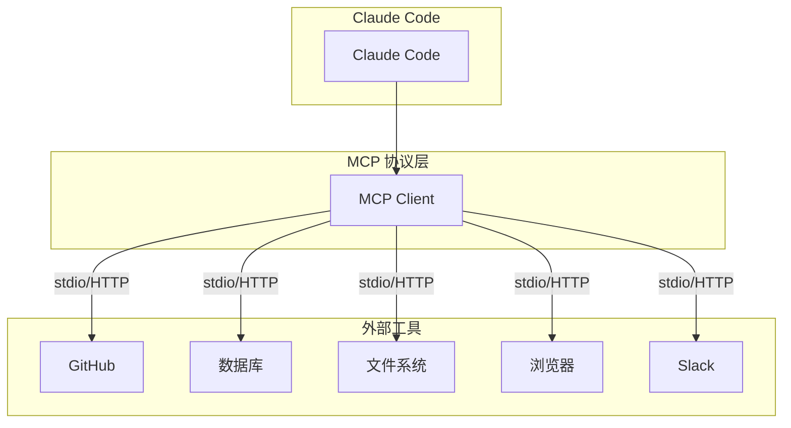

# Day 13: Claude Code + MCP 实战 — 让 AI 真正掌控你的开发环境

> MCP + Claude Code = 你的第二个大脑

## 昨日回顾

昨天我们学习了 [Day 12: AI 推理模型与 Agentic Reasoning](./day12-ai-reasoning-models.md)，了解了推理模型如何提升 Agent 能力。

## 明日预告

明天我们将总结整个系列，分享 AI Agent 开发的最佳实践与未来展望。敬请期待！

## 为什么需要 MCP？

想象一下：**没有 MCP 的 AI 编程助手 = 近视眼**。

- 它看得懂代码
- 但它看不到你的 GitHub Issues
- 不知道你的 Slack 消息
- 无法操作你的数据库
- 握不了浏览器

**MCP (Model Context Protocol)** 就是给 Claude Code 装上"眼睛"和"手脚"的协议。

## MCP 架构解析



## 实战：连接你的工具

### 1. 安装 Claude Code

```bash
# macOS / Linux
curl -fsSL https://claude.ai/install.sh | bash

# Windows
irm https://claude.ai/install.ps1 | iex
```

### 2. 添加 MCP 服务器

```bash
# GitHub MCP - 读写仓库
claude mcp add github --transport stdio -- npx -y @modelcontextprotocol/server-github

# 文件系统 - 读写本地文件
claude mcp add filesystem --transport stdio -- npx -y @modelcontextprotocol/server-filesystem

# Puppeteer - 浏览器自动化
claude mcp add puppeteer --transport stdio -- npx -y @modelcontextprotocol/server-puppeteer

# PostgreSQL - 数据库查询
claude mcp add postgres --transport stdio -- npx -y @modelcontextprotocol/server-postgres
```

### 3. 验证连接

```bash
claude mcp list  # 查看已连接的 MCP
```

## 场景实战

### 场景 1：自动创建 PR

```bash
# 告诉 Claude
"帮我把修复 auth bug 的代码提交，并创建一个 PR"
```

Claude Code 会：
1. 读取你的 git diff
2. 写 commit message
3. 推送到远程
4. 创建 Pull Request

### 场景 2：数据库调试

```bash
# 告诉 Claude
"查询 users 表中最近注册的用户，给他们发送欢迎消息"
```

Claude Code 会：
1. 连接数据库
2. 执行 SQL 查询
3. 格式化结果

### 场景 3：自动化测试

```bash
# 告诉 Claude
"运行测试，修复失败的用例，直到全部通过"
```

Claude Code 会：
1. 运行测试套件
2. 分析失败原因
3. 修改代码
4. 重新运行测试
5. 重复直到通过

## 高级技巧

### 1. 项目级别配置 (.mcp.json)

在项目根目录创建 `.mcp.json`：

```json
{
  "mcpServers": {
    "github": {
      "command": "npx",
      "args": ["-y", "@modelcontextprotocol/server-github"],
      "env": {
        "GITHUB_TOKEN": "your-token"
      }
    }
  }
}
```

### 2. CLAUDE.md 中定义工作流

```markdown
# CLAUDE.md

## 常用命令
- 运行测试: npm test
- 启动开发: npm run dev

## MCP 配置
- GitHub: 管理 PR 和 Issues
- Database: 本地 PostgreSQL

## 工作流程
1. 每次修改前先运行测试
2. commit 前确保 lint 通过
3. 创建 PR 时自动添加 changelog
```

### 3. Subagents 自动化复杂任务

```bash
# 创建专用 agent 处理 Code Review
/claude agent create code-reviewer
```

## 对比：有无 MCP

| 能力 | 无 MCP | 有 MCP |
|------|--------|--------|
| 读代码 | ✅ | ✅ |
| 写代码 | ✅ | ✅ |
| 运行测试 | ✅ | ✅ |
| 读 GitHub Issues | ❌ | ✅ |
| 查数据库 | ❌ | ✅ |
| 浏览器操作 | ❌ | ✅ |
| 发送 Slack | ❌ | ✅ |

## 最佳实践

1. **按需添加 MCP** - 不是越多越好，开多了会影响速度
2. **敏感 token 放环境变量** - 不要写死在配置文件里
3. **本地测试后再推送到团队** - MCP 配置会影响团队所有人
4. **利用 CLAUDE.md** - 把项目规范写进去，Claude 会自动遵守

## 总结

MCP 让 Claude Code 从一个"编程助手"进化成"开发伙伴"。

它不再只能读写代码，而是能真正理解你的整个开发流程，帮你自动化那些繁琐的重复劳动。

**下一步**：去 https://anthropic.com/mcp 探索更多 MCP 服务，把你的工具链武装起来！

---

*本文是「AI Agent 工程师学习笔记」系列第 13 篇。*
*关注我，每天学习一个 AI 开发知识点。*
