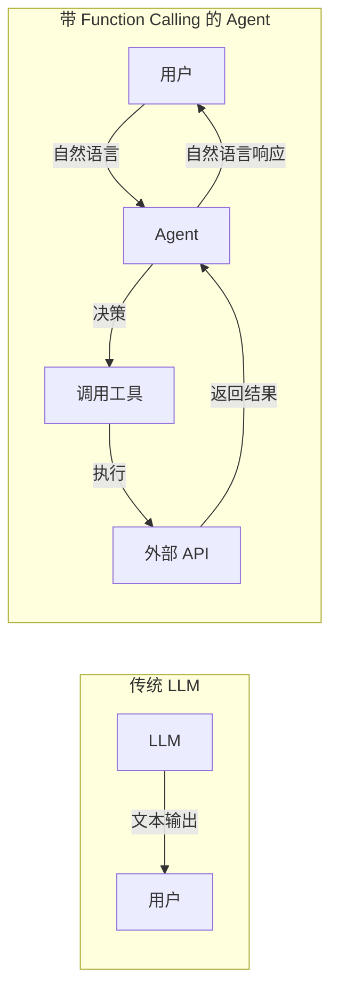
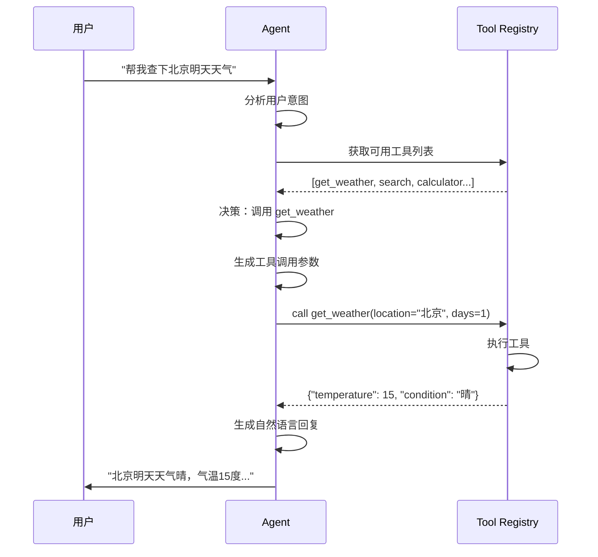
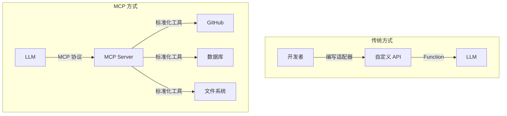

# Day 14: Function Calling 核心技术 — 让 AI Agent 真正"动手"做事

> 从"只会说话"到"会动手"：Function Calling 是 AI Agent 能力的分水岭

## 昨日回顾

昨天我们学习了 [Day 13: Claude Code + MCP 实战](./day13-claude-code-mcp.md)，掌握了如何让 AI 连接外部工具。

## 明日预告

明天我们将探讨 **AI Agent 安全与权限管理**，包括 OAuth 集成、工具权限控制、沙盒执行等。敬请期待！

## 什么是 Function Calling？

**Function Calling（函数调用）** 是 AI Agent 区别于普通 LLM 的核心技术。它让 AI 不仅能"说话"，还能真正调用外部工具完成实际任务。



### 为什么 Function Calling 如此重要？

| 能力 | 无 Function Calling | 有 Function Calling |
|------|-------------------|-------------------|
| 查实时信息 | ❌ 知识截止 | ✅ 实时搜索/数据库 |
| 执行操作 | ❌ 只说不做 | ✅ 真正执行 |
| 多步骤任务 | ❌ 一次性回复 | ✅ 循环迭代 |
| 复杂工作流 | ❌ 单轮对话 | ✅ 编排执行 |

## Function Calling 工作原理

### 1. 模型如何决定调用工具？



### 2. Tool Schema 的核心结构

```python
# OpenAI 风格的 Function Calling 定义
tools = [
    {
        "type": "function",
        "function": {
            "name": "get_weather",
            "description": "获取指定位置的天气信息",
            "parameters": {
                "type": "object",
                "properties": {
                    "location": {
                        "type": "string",
                        "description": "城市名称，如 北京、上海、Tokyo"
                    },
                    "days": {
                        "type": "integer",
                        "description": "预报天数",
                        "minimum": 1,
                        "maximum": 7
                    }
                },
                "required": ["location"]
            }
        }
    }
]
```

### 3. 完整调用流程示例

```python
from openai import OpenAI

client = OpenAI(api_key="your-api-key")

# 1. 定义工具
tools = [
    {
        "type": "function",
        "function": {
            "name": "get_weather",
            "description": "获取指定位置的天气预报",
            "parameters": {
                "type": "object",
                "properties": {
                    "location": {
                        "type": "string",
                        "description": "城市名称（支持中英文）"
                    },
                    "days": {
                        "type": "integer",
                        "description": "预报天数，1-7天",
                        "minimum": 1,
                        "maximum": 7
                    }
                },
                "required": ["location"]
            }
        }
    }
]

# 2. 模拟天气工具
def get_weather(location: str, days: int = 1):
    """实际的天气 API 调用"""
    weather_data = {
        "北京": {"temp": 15, "condition": "晴"},
        "上海": {"temp": 18, "condition": "多云"},
        "深圳": {"temp": 24, "condition": "晴"},
    }
    return weather_data.get(location, {"temp": 20, "condition": "未知"})

# 3. 对话循环
def chat_with_tools(user_message: str):
    messages = [{"role": "user", "content": user_message}]
    
    # 第一次调用：让模型决定是否调用工具
    response = client.chat.completions.create(
        model="gpt-4o",
        messages=messages,
        tools=tools
    )
    
    assistant_message = response.choices[0].message
    
    # 检查是否有工具调用
    if assistant_message.tool_calls:
        for tool_call in assistant_message.tool_calls:
            func_name = tool_call.function.name
            func_args = eval(tool_call.function.arguments)  # JSON string to dict
            
            print(f"🤖 调用工具: {func_name}")
            print(f"📝 参数: {func_args}")
            
            # 执行工具
            if func_name == "get_weather":
                result = get_weather(**func_args)
                print(f"📊 返回结果: {result}")
            
            # 将工具结果添加回对话
            messages.append({
                "role": "assistant",
                "content": assistant_message.content
            })
            messages.append({
                "role": "tool",
                "tool_call_id": tool_call.id,
                "content": str(result)
            })
        
        # 第二次调用：获取最终回复
        final_response = client.chat.completions.create(
            model="gpt-4o",
            messages=messages
        )
        
        return final_response.choices[0].message.content
    
    return assistant_message.content

# 测试
result = chat_with_tools("北京明天天气怎么样？")
print(f"💬 最终回复: {result}")
```

输出：
```
🤖 调用工具: get_weather
📝 参数: {'location': '北京', 'days': 1}
📊 返回结果: {'temp': 15, 'condition': '晴'}
💬 最终回复: 北京明天天气晴，气温15度，温度适宜，适合外出。
```

## 2025 Function Calling Benchmark 解析

根据最新的 [Berkeley Function Calling Leaderboard (BFCL)](https://gorilla.cs.berkeley.edu/leaderboard.html) 数据，主流模型表现如下：

```mermaid
bar
    title BFCL V4 主流模型得分
    axisTitle: 模型
    axisTitle: 得分 (%)
    barMode: grouped
    "模型": ["GPT-5-mini", "Qwen3.5-Flash", "Kimi-K2.5", "Claude-4-Sonnet", "Gemini-2.5"]
    "整体得分": [55.46, 81.76, 79.03, 75.19, 72.47]
    "并行调用": [69.85, 93.75, 84.50, 80.00, 75.00]
```

### 关键发现

1. **Qwen3.5-Flash** 并行调用能力最强（93.75%），适合需要同时调用多个工具的场景
2. **Kimi-K2.5** 在简单场景表现出色（84.50%）
3. 平均每个任务需要 **16.2 次工具调用**，体现真实场景的复杂性

## 高级 Patterns

### 1. 嵌套工具调用（Multi-Step）

```python
# 复杂场景：先搜索，再筛选，再调用
def search_and_book(user_request: str):
    """
    场景：帮我找一家北京评分4.5以上的日料店，然后预订座位
    """
    tools = [
        {
            "type": "function",
            "function": {
                "name": "search_restaurants",
                "description": "搜索餐厅",
                "parameters": {
                    "type": "object",
                    "properties": {
                        "city": {"type": "string"},
                        "cuisine": {"type": "string"},
                        "min_rating": {"type": "number"}
                    },
                    "required": ["city"]
                }
            }
        },
        {
            "type": "function",
            "function": {
                "name": "book_restaurant",
                "description": "预订餐厅座位",
                "parameters": {
                    "type": "object",
                    "properties": {
                        "restaurant_id": {"type": "string"},
                        "date": {"type": "string"},
                        "time": {"type": "string"},
                        "guests": {"type": "integer"}
                    },
                    "required": ["restaurant_id", "date", "time"]
                }
            }
        }
    ]
    
    # 第一轮：模型可能先调用 search_restaurants
    # 第二轮：根据搜索结果调用 book_restaurant
    # ... 循环直到任务完成
```

### 2. 并行工具调用

```python
# 同时获取多个不相关的信息
tools = [
    {
        "type": "function",
        "function": {
            "name": "get_stock_price",
            "description": "获取股票价格",
            "parameters": {
                "type": "object",
                "properties": {
                    "symbol": {"type": "string"}
                },
                "required": ["symbol"]
            }
        }
    },
    {
        "type": "function",
        "function": {
            "name": "get_weather",
            "description": "获取天气",
            "parameters": {
                "type": "object",
                "properties": {
                    "location": {"type": "string"}
                },
                "required": ["location"]
            }
        }
    }
]

# 模型可以同时调用这两个工具
# get_stock_price(symbol="AAPL") + get_weather(location="北京")
```

### 3. 工具错误处理

```python
def robust_tool_call(tool_name: str, args: dict, max_retries: int = 3):
    """带重试机制的工具调用"""
    
    tool_registry = {
        "get_weather": get_weather,
        "search": search_web,
        "calculator": calculate,
    }
    
    for attempt in range(max_retries):
        try:
            result = tool_registry[tool_name](**args)
            return {"success": True, "data": result}
        except Exception as e:
            if attempt == max_retries - 1:
                return {"success": False, "error": str(e)}
            print(f"⚠️ 工具调用失败，尝试 {attempt + 1}/{max_retries}")
    
    return {"success": False, "error": "Max retries exceeded"}
```

## MCP 中的 Function Calling

MCP 服务器本质上就是标准化了的 Function Calling：



### MCP 工具定义示例

```json
{
  "tools": [
    {
      "name": "github_search_repositories",
      "description": "Search for GitHub repositories",
      "inputSchema": {
        "type": "object",
        "properties": {
          "query": {
            "type": "string",
            "description": "Search query"
          },
          "max_count": {
            "type": "number",
            "description": "Maximum number of results",
            "default": 10
          }
        },
        "required": ["query"]
      }
    }
  ]
}
```

## 最佳实践

### 1. Tool Schema 设计原则

```python
# ✅ 好：清晰、无歧义
good_schema = {
    "name": "calculate_bmi",
    "description": "根据身高体重计算 BMI 指数",
    "parameters": {
        "type": "object",
        "properties": {
            "height_cm": {
                "type": "number",
                "description": "身高（厘米）"
            },
            "weight_kg": {
                "type": "number", 
                "description": "体重（公斤）"
            }
        },
        "required": ["height_cm", "weight_kg"]
    }
}

# ❌ 差：模糊、多义
bad_schema = {
    "name": "calc",
    "description": "Calculate something",
    "parameters": {
        "type": "object",
        "properties": {
            "x": {"type": "number"},
            "y": {"type": "number"}
        }
    }
}
```

### 2. 必加的关键字段

| 字段 | 重要性 | 说明 |
|------|--------|------|
| `description` | ⭐⭐⭐ | 工具用途描述，模型靠它决定是否调用 |
| `parameters.description` | ⭐⭐⭐ | 参数用途，模型靠它填充参数值 |
| `required` | ⭐⭐ | 必填参数列表 |
| `enum` | ⭐⭐ | 限制可选值，减少幻觉 |
| `minimum/maximum` | ⭐ | 数值范围限制 |

### 3. 错误处理流程

```python
def agent_loop(user_message: str, max_turns: int = 10):
    """Agent 对话循环，带工具调用和错误处理"""
    
    messages = [{"role": "user", "content": user_message}]
    tools = get_available_tools()
    
    for turn in range(max_turns):
        # 调用模型
        response = client.chat.completions.create(
            model="gpt-4o",
            messages=messages,
            tools=tools
        )
        
        msg = response.choices[0].message
        
        # 没有工具调用，任务完成
        if not msg.tool_calls:
            return msg.content
        
        # 处理工具调用
        for tool_call in msg.tool_calls:
            try:
                result = execute_tool(
                    tool_call.function.name,
                    eval(tool_call.function.arguments)
                )
            except Exception as e:
                result = f"工具执行失败: {str(e)}"
            
            # 添加结果到对话
            messages.append({
                "role": "tool",
                "tool_call_id": tool_call.id,
                "content": result
            })
    
    return "任务超时，请重试"
```

## 总结

Function Calling 是 AI Agent 能力的分水岭：

1. **它让 AI 从"会说"变成"会做"**
2. **JSON Schema 是工具定义的标准语言**
3. **2025 年的模型在复杂多轮调用上表现成熟**
4. **MCP 将 Function Calling 推向标准化**

**下一步**：
- 在 BFCL leaderboard 查看你所用模型的得分
- 尝试为你的项目定义自定义工具
- 学习 LangChain 的 Tool Calling 封装

---

*本文是「AI Agent 工程师学习笔记」系列第 14 篇。*
*关注我，每天学习一个 AI 开发知识点。*
