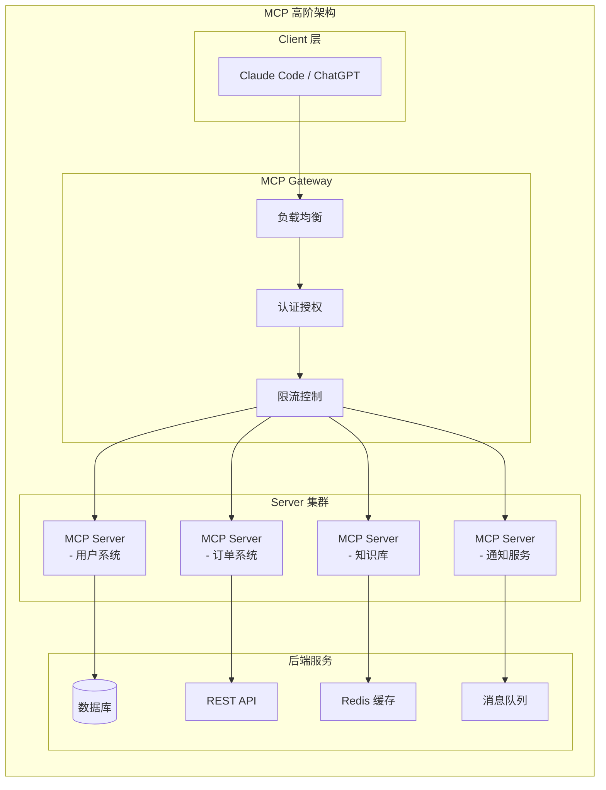
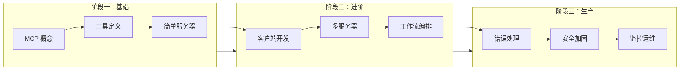

# Day 15: MCP 高阶实战 — 构建生产级 AI Agent 系统

> 从"玩具"到"产品"：掌握 MCP 在生产环境中的高级模式和最佳实践

## 昨日回顾

昨天我们学习了 [Day 14: Function Calling 核心技术](./day14-function-calling.md)，掌握了如何让 AI Agent 调用外部工具。

## 今日预告

明天我们将探讨 **AI Agent 评估与测试**，包括 Prompt 评估、输出质量检测、成本优化等。

## 什么是 MCP 高阶应用？

前面我们学习了 MCP 的基础概念和简单示例。今天我们要深入探讨**生产环境中真正能用**的 MCP 架构：



## MCP Server 进阶：构建企业级工具服务

### 1. 复杂工具定义模式

在实际生产中，工具往往需要更复杂的参数和返回值。来看看一个**订单管理系统**的 MCP Server：

```python
from mcp.server.fastmcp import FastMCP
from pydantic import BaseModel, Field
from typing import Optional, List
from enum import Enum

mcp = FastMCP("Enterprise Order System")

# ===== 数据模型定义 =====

class OrderStatus(str, Enum):
    PENDING = "pending"
    CONFIRMED = "confirmed"
    SHIPPED = "shipped"
    DELIVERED = "delivered"
    CANCELLED = "cancelled"

class OrderItem(BaseModel):
    """订单项模型"""
    product_id: str = Field(description="商品ID")
    product_name: str = Field(description="商品名称")
    quantity: int = Field(description="数量", ge=1)
    unit_price: float = Field(description="单价", ge=0)
    discount: float = Field(description="折扣金额", ge=0, default=0)

class Order(BaseModel):
    """订单完整模型"""
    order_id: str = Field(description="订单ID")
    user_id: str = Field(description="用户ID")
    items: List[OrderItem] = Field(description="订单项列表")
    total_amount: float = Field(description="订单总金额")
    status: OrderStatus = Field(description="订单状态")
    created_at: str = Field(description="创建时间")
    shipping_address: Optional[str] = Field(default=None, description="收货地址")

# ===== 复杂工具实现 =====

@mcp.tool()
async def create_order(
    user_id: str,
    items: List[dict],
    shipping_address: str
) -> dict:
    """创建新订单
    
    Args:
        user_id: 用户ID
        items: 订单项列表，每项包含 product_id, quantity
        shipping_address: 收货地址
    
    Returns:
        创建成功的订单信息
    """
    # 1. 验证用户
    user = await verify_user(user_id)
    if not user:
        return {"success": False, "error": "用户不存在"}
    
    # 2. 验证商品库存
    validated_items = []
    total = 0.0
    for item in items:
        product = await get_product(item["product_id"])
        if product["stock"] < item["quantity"]:
            return {
                "success": False, 
                "error": f"商品 {product['name']} 库存不足"
            }
        validated_items.append(OrderItem(
            product_id=product["id"],
            product_name=product["name"],
            quantity=item["quantity"],
            unit_price=product["price"],
            discount=item.get("discount", 0)
        ))
        total += product["price"] * item["quantity"] - item.get("discount", 0)
    
    # 3. 创建订单
    order = Order(
        order_id=generate_order_id(),
        user_id=user_id,
        items=validated_items,
        total_amount=total,
        status=OrderStatus.PENDING,
        created_at=get_current_timestamp(),
        shipping_address=shipping_address
    )
    
    await save_order(order)
    
    return {
        "success": True,
        "order": order.model_dump()
    }

@mcp.tool()
async def query_orders(
    user_id: str,
    status: Optional[str] = None,
    start_date: Optional[str] = None,
    end_date: Optional[str] = None,
    limit: int = Field(default=10, ge=1, le=100)
) -> dict:
    """查询用户订单
    
    Args:
        user_id: 用户ID
        status: 订单状态过滤
        start_date: 开始日期
        end_date: 结束日期
        limit: 返回数量限制
    
    Returns:
        订单列表
    """
    query = {"user_id": user_id}
    
    if status:
        query["status"] = status
    if start_date:
        query["created_at__gte"] = start_date
    if end_date:
        query["created_at__lte"] = end_date
    
    orders = await db.orders.find(query).limit(limit).to_list()
    
    return {
        "total": len(orders),
        "orders": [Order.model_validate(o).model_dump() for o in orders]
    }
```

### 2. 资源 (Resources) 的高级用法

资源不仅仅可以读文件，还可以提供**动态数据**：

```python
@mcp.resource("order://{order_id}")
async def get_order_resource(order_id: str) -> str:
    """动态获取订单详情资源"""
    order = await db.orders.find_one({"order_id": order_id})
    if not order:
        return "订单不存在"
    
    # 转换为友好格式
    return f"""
# 订单 {order_id}

## 基本信息
- 状态: {order['status']}
- 创建时间: {order['created_at']}
- 总金额: ¥{order['total_amount']}

## 商品清单
{chr(10).join([
    f"- {item['product_name']} x {item['quantity']} = ¥{item['unit_price'] * item['quantity']}"
    for item in order['items']
])}

## 收货地址
{order.get('shipping_address', '未提供')}
    """

@mcp.resource("user://{user_id}/dashboard")
async def get_user_dashboard(user_id: str) -> str:
    """用户仪表板资源 - 聚合多个数据源"""
    # 并行获取多个数据
    user, orders, stats = await asyncio.gather(
        db.users.find_one({"user_id": user_id}),
        db.orders.find({"user_id": user_id}).limit(5).to_list(),
        get_user_stats(user_id)
    )
    
    return f"""
# 用户仪表板

## 个人信息
- 昵称: {user['nickname']}
- 等级: {user['level']}
- 积分: {user['points']}

## 最近订单
{chr(10).join([
    f"- {o['order_id']}: {o['status']} - ¥{o['total_amount']}"
    for o in orders
]) or '暂无订单'}

## 统计信息
- 累计消费: ¥{stats['total_spent']}
- 订单数量: {stats['order_count']}
- 活跃天数: {stats['active_days']}
    """
```

### 3. 提示模板 (Prompts) 的高级模式

```python
@mcp.prompt()
def order_troubleshooting() -> str:
    """订单问题诊断提示模板"""
    return """
你是一个客服助手，负责诊断和解决用户的订单问题。

## 可用工具
- query_orders: 查询用户订单
- get_order_status: 获取订单详细状态
- cancel_order: 取消订单
- refund_order: 退款

## 诊断流程
1. 首先使用 query_orders 获取用户最近订单
2. 根据用户描述的问题，分析可能原因
3. 使用 get_order_status 获取详情
4. 根据诊断结果采取行动

## 输出格式
请按以下格式回复：
- 问题分析: [简要描述发现的问题]
- 建议操作: [可以采取的步骤]
- 用户需知: [需要告知用户的重要信息]

## 注意事项
- 如果需要用户确认，请先询问
- 涉及退款等敏感操作需要二次确认
- 如果无法解决，引导用户联系人工客服
"""

@mcp.prompt()
def bulk_order_processor() -> str:
    """批量订单处理提示"""
    return """
你是一个订单批量处理助手。

## 背景
用户需要处理大量订单，请帮助他们：
- 筛选符合条件的订单
- 批量更新状态
- 生成处理报告

## 工具
- query_orders: 高级查询，支持复杂条件
- update_order_status: 批量更新订单状态
- export_orders: 导出订单数据

## 处理原则
1. 先查询确认订单范围
2. 处理前显示预览
3. 确认后执行
4. 生成处理报告
"""
```

## MCP Client 进阶：编排复杂工作流

### 1. 多服务器连接管理

```python
from mcp import ClientSession, StdioServerParameters
from mcp.client.stdio import stdio_client
from contextlib import AsyncExitStack
from typing import Dict, List
import asyncio

class MCPClientManager:
    """MCP 客户端管理器 - 同时连接多个服务器"""
    
    def __init__(self):
        self.sessions: Dict[str, ClientSession] = {}
        self.exit_stack = AsyncExitStack()
    
    async def connect_server(self, name: str, server_params: StdioServerParameters):
        """连接单个 MCP 服务器"""
        stdio_transport = await self.exit_stack.enter_async_context(
            stdio_client(server_params)
        )
        stdio, write = stdio_transport
        session = await self.exit_stack.enter_async_context(
            ClientSession(stdio, write)
        )
        await session.initialize()
        
        self.sessions[name] = session
        print(f"✅ 已连接到 {name}")
    
    async def connect_all(self, configs: List[dict]):
        """批量连接多个服务器
        
        Args:
            configs: [{"name": "order", "command": "python", "args": ["server.py"]}, ...]
        """
        tasks = []
        for config in configs:
            params = StdioServerParameters(
                command=config["command"],
                args=config["args"],
                env=config.get("env")
            )
            tasks.append(self.connect_server(config["name"], params))
        
        await asyncio.gather(*tasks)
    
    async def call_tool(self, server_name: str, tool_name: str, **kwargs):
        """调用指定服务器的工具"""
        if server_name not in self.sessions:
            raise ValueError(f"未连接到服务器: {server_name}")
        
        session = self.sessions[server_name]
        result = await session.call_tool(tool_name, arguments=kwargs)
        return result
    
    async def list_tools(self, server_name: str):
        """列出指定服务器的工具"""
        if server_name not in self.sessions:
            raise ValueError(f"未连接到服务器: {server_name}")
        
        response = await self.sessions[server_name].list_tools()
        return response.tools
    
    async def read_resource(self, server_name: str, uri: str):
        """读取指定服务器的资源"""
        if server_name not in self.sessions:
            raise ValueError(f"未连接到服务器: {server_name}")
        
        response = await self.sessions[server_name].read_resource(uri)
        return response.contents
    
    async def close(self):
        """关闭所有连接"""
        await self.exit_stack.aclose()
        self.sessions.clear()
        print("🔌 所有 MCP 服务器连接已关闭")


# 使用示例
async def main():
    manager = MCPClientManager()
    
    # 配置多个服务器
    configs = [
        {
            "name": "order",
            "command": "python",
            "args": ["order_server.py"]
        },
        {
            "name": "user",
            "command": "python", 
            "args": ["user_server.py"]
        },
        {
            "name": "knowledge",
            "command": "python",
            "args": ["knowledge_server.py"]
        }
    ]
    
    await manager.connect_all(configs)
    
    # 调用不同服务器的工具
    orders = await manager.call_tool("order", "query_orders", user_id="user123")
    user_info = await manager.call_tool("user", "get_user_profile", user_id="user123")
    docs = await manager.read_resource("knowledge", "faq://shipping")
    
    await manager.close()
```

### 2. 智能工具选择与路由

```python
class SmartToolRouter:
    """智能工具路由器 - 根据任务自动选择合适的工具"""
    
    def __init__(self, client_manager: MCPClientManager):
        self.client = client_manager
        self.tool_index: Dict[str, dict] = {}
    
    async def build_index(self):
        """构建工具索引"""
        for server_name, session in self.client.sessions.items():
            tools = await self.client.list_tools(server_name)
            
            for tool in tools:
                # 提取关键词用于匹配
                keywords = self._extract_keywords(tool.name, tool.description)
                self.tool_index[tool.name] = {
                    "server": server_name,
                    "description": tool.description,
                    "input_schema": tool.inputSchema,
                    "keywords": keywords
                }
    
    def _extract_keywords(self, name: str, description: str) -> set:
        """从工具名称和描述中提取关键词"""
        text = f"{name} {description}".lower()
        # 简单分词
        import re
        words = re.findall(r'\w+', text)
        return set(words)
    
    async def find_best_tool(self, task: str) -> tuple[str, dict]:
        """根据任务描述找到最佳工具"""
        task_keywords = set(task.lower().split())
        
        scores = []
        for tool_name, tool_info in self.tool_index.items():
            # 计算关键词重叠
            overlap = len(task_keywords & tool_info["keywords"])
            scores.append((tool_name, tool_info, overlap))
        
        # 按得分排序
        scores.sort(key=lambda x: x[2], reverse=True)
        
        if scores[0][2] == 0:
            return None, {}
        
        best_tool, tool_info, score = scores[0]
        return best_tool, tool_info
    
    async def execute_task(self, task: str, **params):
        """执行任务 - 自动选择工具并执行"""
        tool_name, tool_info = await self.find_best_tool(task)
        
        if not tool_name:
            return {"error": "未找到合适的工具"}
        
        result = await self.client.call_tool(
            tool_info["server"],
            tool_name,
            **params
        )
        
        return {
            "tool_used": tool_name,
            "server": tool_info["server"],
            "result": result
        }
```

## 生产环境最佳实践

### 1. 错误处理与重试机制

```python
from functools import wraps
import asyncio

class MCPError(Exception):
    """MCP 相关错误基类"""
    pass

class ServerConnectionError(MCPError):
    """服务器连接错误"""
    pass

class ToolExecutionError(MCPError):
    """工具执行错误"""
    pass

class RetryConfig:
    """重试配置"""
    def __init__(
        self,
        max_retries: int = 3,
        base_delay: float = 1.0,
        max_delay: float = 30.0,
        exponential_base: float = 2.0
    ):
        self.max_retries = max_retries
        self.base_delay = base_delay
        self.max_delay = max_delay
        self.exponential_base = exponential_base

async def with_retry(coro, config: RetryConfig = None):
    """带重试的异步执行"""
    if config is None:
        config = RetryConfig()
    
    last_error = None
    for attempt in range(config.max_retries):
        try:
            return await coro
        except Exception as e:
            last_error = e
            if attempt < config.max_retries - 1:
                delay = min(
                    config.base_delay * (config.exponential_base ** attempt),
                    config.max_delay
                )
                print(f"⏳ 重试 ({attempt + 1}/{config.max_retries}), 等待 {delay}s...")
                await asyncio.sleep(delay)
    
    raise ToolExecutionError(f"重试 {config.max_retries} 次后仍然失败: {last_error}")


# 使用示例
async def robust_tool_call(client, tool_name, **kwargs):
    """可靠的工具调用"""
    retry_config = RetryConfig(max_retries=3, base_delay=1.0)
    
    return await with_retry(
        client.call_tool(tool_name, **kwargs),
        retry_config
    )
```

### 2. 安全性最佳实践

```python
class SecureMCPClient:
    """安全 MCP 客户端"""
    
    def __init__(self, api_key: str):
        self.api_key = api_key
        self.trusted_servers: set = set()
    
    async def connect_with_verification(self, server_params: StdioServerParameters):
        """连接服务器时进行安全验证"""
        # 1. 检查服务器是否可信
        server_cmd = " ".join(server_params.args)
        
        # 2. 验证服务器签名（生产环境应实现）
        # verify_server_signature(server_params)
        
        # 3. 限制工具权限
        session = await self._create_session(server_params)
        
        # 4. 只暴露必要的工具
        tools = await session.list_tools()
        allowed_tools = self._filter_allowed_tools(tools)
        
        return session, allowed_tools
    
    def add_trusted_server(self, fingerprint: str):
        """添加可信服务器指纹"""
        self.trusted_servers.add(fingerprint)
    
    def _filter_allowed_tools(self, tools) -> list:
        """过滤允许的工具列表"""
        # 生产环境可以配置白名单
        allowed = ["query_*", "get_*", "list_*"]
        # 危险工具默认禁用
        blocked = ["delete_*", "drop_*", "truncate_*"]
        
        # ... 实际实现过滤逻辑
        return tools
```

### 3. 监控与日志

```python
import logging
from datetime import datetime
from functools import wraps

logging.basicConfig(level=logging.INFO)
logger = logging.getLogger("mcp-client")

class MCPTelemetry:
    """MCP 遥测数据收集"""
    
    def __init__(self):
        self.metrics = {
            "tool_calls": [],
            "errors": [],
            "latencies": []
        }
    
    def record_tool_call(self, tool_name: str, server: str, latency_ms: float, success: bool):
        """记录工具调用"""
        self.metrics["tool_calls"].append({
            "tool": tool_name,
            "server": server,
            "latency_ms": latency_ms,
            "success": success,
            "timestamp": datetime.now().isoformat()
        })
    
    def record_error(self, error: Exception, context: dict):
        """记录错误"""
        self.metrics["errors"].append({
            "error_type": type(error).__name__,
            "message": str(error),
            "context": context,
            "timestamp": datetime.now().isoformat()
        })
    
    def get_stats(self) -> dict:
        """获取统计信息"""
        total_calls = len(self.metrics["tool_calls"])
        successful_calls = sum(1 for c in self.metrics["tool_calls"] if c["success"])
        
        return {
            "total_calls": total_calls,
            "success_rate": successful_calls / total_calls if total_calls > 0 else 0,
            "error_count": len(self.metrics["errors"]),
            "avg_latency_ms": sum(c["latency_ms"] for c in self.metrics["tool_calls"]) / total_calls if total_calls > 0 else 0
        }


def with_telemetry(telemetry: MCPTelemetry, tool_name: str, server: str):
    """遥测装饰器"""
    def decorator(func):
        @wraps(func)
        async def wrapper(*args, **kwargs):
            start = datetime.now()
            try:
                result = await func(*args, **kwargs)
                latency = (datetime.now() - start).total_seconds() * 1000
                telemetry.record_tool_call(tool_name, server, latency, True)
                return result
            except Exception as e:
                latency = (datetime.now() - start).total_seconds() * 1000
                telemetry.record_tool_call(tool_name, server, latency, False)
                telemetry.record_error(e, {"tool": tool_name, "server": server})
                raise
        return wrapper
    return decorator
```

## UI 工程师的学习路径

作为前端/UI 工程师，学习 MCP 可以按以下路径：



### 推荐学习资源

1. **官方文档**: [modelcontextprotocol.io](https://modelcontextprotocol.io)
2. **Python SDK**: `pip install mcp`
3. **示例项目**: [modelcontextprotocol/servers](https://github.com/modelcontextprotocol/servers)

### 实践建议

- 先用 FastMCP 写几个简单工具感受一下
- 尝试连接现有的 MCP 服务器（如 Sentry、GitHub）
- 用 MCP Client 封装自己的工具服务
- 逐步添加错误处理、监控等生产特性

## 总结

| 概念 | 关键点 |
|------|--------|
| MCP Server | 用 FastMCP 快速构建，支持 Tools/Resources/Prompts |
| MCP Client | 管理多连接，实现智能路由 |
| 生产实践 | 重试机制、安全加固、监控遥测 |
| 学习路径 | 基础 → 进阶 → 生产，循序渐进 |

**思考题**: 如果让你用 MCP 构建一个"AI 助手帮你点外卖"的系统，需要哪些工具和资源？

---

*下一期我们将探讨 AI Agent 评估与测试，敬请期待！*