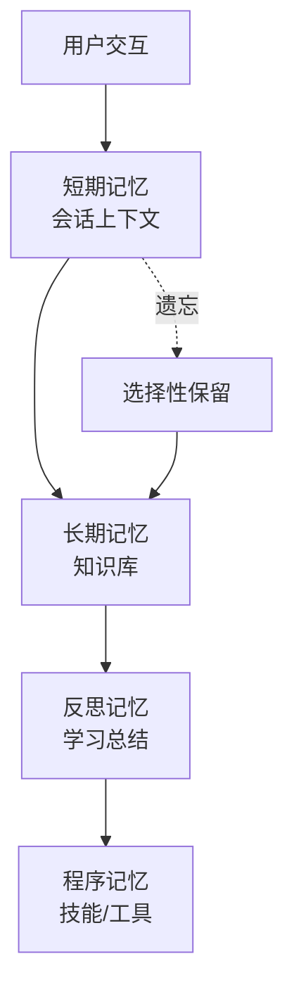
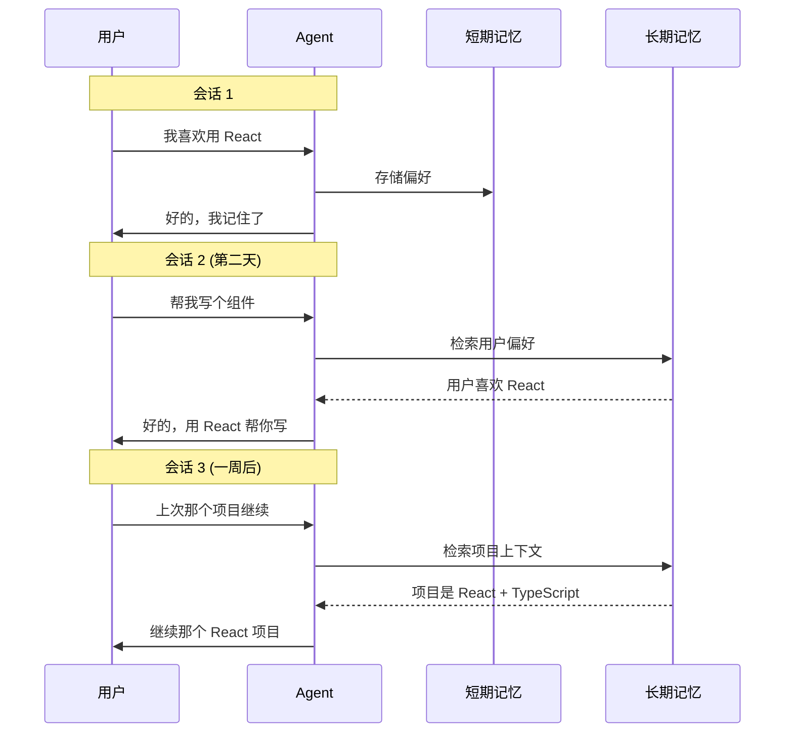

# Agent 内存与记忆系统：让 AI 拥有"记忆"的艺术

> 📅 2026-03-27
> 🏷️ #AI #Agent #LLM #Memory #Architecture

## 引言

想象一下：你每次和朋友聊天，他们都会问"你是谁？我们之前聊过什么？"。这正是大多数 AI Agent 的现状——它们没有真正的记忆。

作为前端工程师，你一定对"状态管理"的概念很熟悉：Redux、Vuex、React Context... 内存系统本质上是 Agent 的"状态管理"，但远比前端复杂得多。

今天，让我们深入探讨 Agent 内存与记忆系统。

---

## 为什么记忆如此重要？

### 传统 LLM 的局限性

```python
# 传统 LLM 对话示意
llm = ChatOpenAI()
response = llm.chat("我们上次聊到哪了？")  
# ❌ LLM 会困惑，因为它没有持久状态
# "抱歉，我不知道我们之前聊了什么"
```

LLM 本身是无状态的——每次请求都是独立的。为了让 Agent"记住"上下文，我们需要构建额外的记忆层。

### 记忆系统的价值



---

## 记忆系统的核心架构

### 三层记忆模型

```python
from dataclasses import dataclass
from typing import List, Optional
from datetime import datetime
import json

@dataclass
class Memory:
    """记忆单元"""
    id: str
    content: str
    memory_type: str  # "episodic", "semantic", "procedural"
    importance: float  # 0-1 重要性评分
    created_at: datetime
    last_accessed: datetime
    access_count: int = 0

class MemorySystem:
    """三层记忆架构"""
    
    def __init__(self):
        # 🧠 短期记忆：当前会话上下文（类似 React 的 useState）
        self.short_term: List[Memory] = []
        
        # 📚 长期记忆：持久化知识（类似数据库）
        self.long_term: List[Memory] = []
        
        # ⚙️ 程序记忆：技能和工具定义（类似技能库）
        self.procedural: List[Memory] = []
    
    def add(self, content: str, memory_type: str, importance: float = 0.5):
        """添加新记忆"""
        memory = Memory(
            id=f"mem_{len(self.short_term) + len(self.long_term)}",
            content=content,
            memory_type=memory_type,
            importance=importance,
            created_at=datetime.now(),
            last_accessed=datetime.now()
        )
        
        if memory_type == "short_term":
            self.short_term.append(memory)
        elif memory_type == "long_term":
            self.long_term.append(memory)
        else:
            self.procedural.append(memory)
        
        return memory
```

---

## 实战：构建完整的记忆系统

### 1. 短期记忆（会话上下文）

```python
from typing import Any, Dict
import tiktoken

class ShortTermMemory:
    """短期记忆：基于 token 限制的滑动窗口"""
    
    def __init__(self, max_tokens: int = 4000):
        self.max_tokens = max_tokens
        self.messages: List[Dict[str, Any]] = []
        self.encoder = tiktoken.get_encoding("cl100k_base")
    
    def add_message(self, role: str, content: str, metadata: Dict = None):
        """添加消息到短期记忆"""
        message = {
            "role": role,
            "content": content,
            "timestamp": datetime.now().isoformat(),
            "metadata": metadata or {}
        }
        self.messages.append(message)
        self._ensure_token_limit()
    
    def _ensure_token_limit(self):
        """确保不超过 token 限制"""
        while self._count_tokens() > self.max_tokens and len(self.messages) > 1:
            # 移除最旧的消息（保留系统提示）
            if self.messages[1]["role"] != "system":
                self.messages.pop(1)
            else:
                self.messages.pop(2)  # 跳过系统消息后移除
    
    def _count_tokens(self) -> int:
        """计算当前 token 数"""
        text = "\n".join([f"{m['role']}: {m['content']}" for m in self.messages])
        return len(self.encoder.encode(text))
    
    def get_context(self) -> List[Dict[str, str]]:
        """获取用于 LLM 上下文的格式化消息"""
        return [
            {"role": m["role"], "content": m["content"]} 
            for m in self.messages
        ]
    
    def compress_to_summary(self, llm) -> str:
        """将会话压缩为摘要"""
        if len(self.messages) < 4:
            return ""
        
        prompt = """请将以下对话压缩成简洁的摘要，保留关键信息：
{}
        
摘要格式：
- 用户主要意图：xxx
- 已讨论的关键点：xxx
- 待处理的事项：xxx""".format(
            "\n".join([f"{m['role']}: {m['content'][:200]}" for m in self.messages[1:]])
        )
        
        summary = llm.invoke(prompt)
        return summary.content
```

### 2. 长期记忆（向量存储）

```python
from langchain_openai import OpenAIEmbeddings
from langchain.vectorstores import Chroma
from langchain.text_splitter import RecursiveCharacterTextSplitter

class LongTermMemory:
    """长期记忆：基于向量检索"""
    
    def __init__(self, collection_name: str = "agent_memory"):
        self.embeddings = OpenAIEmbeddings()
        self.vectorstore = Chroma(
            collection_name=collection_name,
            embedding_function=self.embeddings
        )
        self.text_splitter = RecursiveCharacterTextSplitter(
            chunk_size=500,
            chunk_overlap=50
        )
    
    def add(self, content: str, metadata: Dict = None):
        """添加记忆到向量存储"""
        chunks = self.text_splitter.split_text(content)
        metadatas = [metadata or {} for _ in chunks]
        
        self.vectorstore.add_texts(
            texts=chunks,
            metadatas=metadatas
        )
    
    def retrieve(self, query: str, top_k: int = 3) -> List[Dict]:
        """基于语义相似度检索记忆"""
        docs = self.vectorstore.similarity_search(
            query, 
            k=top_k
        )
        
        return [
            {
                "content": doc.page_content,
                "metadata": doc.metadata,
                "score": doc.metadata.get("score", 1.0)
            }
            for doc in docs
        ]
    
    def retrieve_by_importance(self, query: str, min_importance: float = 0.3) -> List[Dict]:
        """结合重要性筛选的检索"""
        all_docs = self.vectorstore.similarity_search(query, k=10)
        
        results = []
        for doc in all_docs:
            importance = doc.metadata.get("importance", 0.5)
            if importance >= min_importance:
                results.append({
                    "content": doc.page_content,
                    "importance": importance,
                    "created_at": doc.metadata.get("created_at")
                })
        
        # 按重要性排序
        results.sort(key=lambda x: x["importance"], reverse=True)
        return results[:5]
```

### 3. 记忆反思（Self-Reflection）

```python
class MemoryReflection:
    """记忆反思：从经验中学习"""
    
    def __init__(self, short_term: ShortTermMemory, long_term: LongTermMemory):
        self.short_term = short_term
        self.long_term = long_term
    
    def should_remember(self, interaction: str, outcome: str) -> bool:
        """判断是否应该记住这次交互"""
        importance_indicators = [
            "重要", "关键", "记住", "下次", "偏好",
            "最喜欢的", "不要忘记", "必须"
        ]
        
        # 检查是否有重要指示词
        for indicator in importance_indicators:
            if indicator in interaction or indicator in outcome:
                return True
        
        # 多次重复的模式也应该记住
        return False
    
    async def reflect_and_store(self, llm):
        """反思并存储重要记忆"""
        messages = self.short_term.messages
        
        if len(messages) < 3:
            return
        
        # 生成反思
        reflection_prompt = f"""分析以下对话，提取需要长期记住的重要信息：

对话：
{chr(10).join([f"{m['role']}: {m['content'][:300]}" for m in messages[-5:]])}

请以 JSON 格式输出：
{{
    "key_insights": ["关键洞察1", "关键洞察2"],
    "user_preferences": ["用户偏好1", "用户偏好2"],
    "action_items": ["待办事项1", "待办事项2"],
    "importance_score": 0.0-1.0
}}
"""
        
        response = llm.invoke(reflection_prompt)
        
        try:
            # 解析 JSON 响应
            insights = json.loads(response.content)
            
            # 存储到长期记忆
            for insight in insights.get("key_insights", []):
                self.long_term.add(
                    content=insight,
                    metadata={
                        "type": "reflection",
                        "importance": insights.get("importance_score", 0.5),
                        "created_at": datetime.now().isoformat()
                    }
                )
            
            return insights
        except:
            return None
```

---

## 完整的 Agent 记忆集成

```python
from langchain_openai import ChatOpenAI
from langchain.agents import AgentExecutor, create_openai_functions_agent
from langchain.prompts import ChatPromptTemplate, MessagesPlaceholder

class MemoryAgent:
    """配备完整记忆系统的 Agent"""
    
    def __init__(self, model_name: str = "gpt-4"):
        self.llm = ChatOpenAI(model=model_name)
        
        # 初始化三层记忆
        self.short_term = ShortTermMemory(max_tokens=4000)
        self.long_term = LongTermMemory()
        self.reflection = MemoryReflection(self.short_term, self.long_term)
        
        # 初始化 Agent
        self._setup_agent()
    
    def _setup_agent(self):
        """设置 Agent"""
        prompt = ChatPromptTemplate.from_messages([
            ("system", """你是一个有帮助的 AI 助手。
            
你会话开始时，我会给你一些相关的老记忆，帮助你更好地理解用户。
在对话过程中，记住用户的重要偏好和信息。
            
当前时间：{current_time}"""),
            MessagesPlaceholder(variable_name="memory_context", optional=True),
            MessagesPlaceholder(variable_name="chat_history", optional=True),
            ("human", "{input}"),
            MessagesPlaceholder(variable_name="agent_scratchpad")
        ])
        
        # 工具：搜索记忆
        from langchain.tools import Tool
        
        memory_tool = Tool(
            name="search_memory",
            func=self.search_memory,
            description="搜索长期记忆中的相关内容"
        )
        
        tools = [memory_tool]
        
        agent = create_openai_functions_agent(self.llm, tools, prompt)
        self.agent_executor = AgentExecutor(
            agent=agent, 
            tools=tools,
            verbose=True
        )
    
    def search_memory(self, query: str) -> str:
        """搜索长期记忆"""
        results = self.long_term.retrieve(query, top_k=3)
        
        if not results:
            return "没有找到相关记忆"
        
        formatted = "相关记忆：\n"
        for i, r in enumerate(results, 1):
            formatted += f"\n{i}. {r['content']}"
            if 'importance' in r:
                formatted += f" (重要性: {r['importance']:.2f})"
        
        return formatted
    
    def run(self, user_input: str):
        """运行 Agent"""
        # 1. 检索相关记忆
        memory_context = self.long_term.retrieve(user_input, top_k=3)
        
        # 2. 格式化记忆上下文
        memory_msgs = []
        if memory_context:
            memory_msgs = [{
                "type": "system", 
                "data": {
                    "content": f"以下是之前对话中与当前问题相关的记忆：\n" + 
                              "\n".join([r['content'] for r in memory_context])
                }
            }]
        
        # 3. 执行 Agent
        result = self.agent_executor.invoke({
            "input": user_input,
            "memory_context": memory_msgs,
            "chat_history": self.short_term.get_context(),
            "current_time": datetime.now().isoformat()
        })
        
        # 4. 存储对话到短期记忆
        self.short_term.add_message("user", user_input)
        self.short_term.add_message("assistant", result["output"])
        
        return result["output"]
    
    def end_session(self):
        """会话结束时的反思"""
        # 触发记忆反思
        summary = self.short_term.compress_to_summary(self.llm)
        if summary:
            self.long_term.add(
                content=f"会话摘要：{summary}",
                metadata={"type": "session_summary"}
            )
```

---

## 记忆系统的实际应用案例

### 案例 1：个性化助手

```python
# 用户偏好记忆示例
preferences_memory = {
    "coding_style": "喜欢 TypeScript，严格类型",
    "communication": "喜欢简洁直接的回复",
    "tools": ["VS Code", "Git", "Docker"],
    "favorite_ frameworks": ["React", "Next.js"],
    "learning_style": "喜欢动手实践"
}

# 当用户说"帮我写个组件"时
# Agent 会自动使用 TypeScript + React 风格
```

### 案例 2：多会话连续性



---

## 记忆系统的最佳实践

### 1. 记忆分层策略

```python
# 记忆保留策略
MEMORY_STRATEGY = {
    "high_importance": {
        "retention": "forever",
        "storage": "long_term",
        "example": ["用户真名", "关键项目"]
    },
    "medium_importance": {
        "retention": "30 days",
        "storage": "long_term",
        "example": ["偏好设置", "工作习惯"]
    },
    "low_importance": {
        "retention": "session",
        "storage": "short_term",
        "example": ["当前任务细节", "临时查询"]
    }
}
```

### 2. 隐私与安全

```python
class SecureMemory:
    """安全记忆系统"""
    
    def __init__(self):
        self.encrypted_store = {}  # 加密存储
    
    def add_sensitive(self, content: str, user_consent: bool):
        """添加敏感信息（需用户同意）"""
        if not user_consent:
            raise ValueError("需要用户授权才能存储敏感信息")
        
        # 加密存储
        encrypted = self._encrypt(content)
        self.encrypted_store[content[:50]] = encrypted
    
    def _encrypt(self, content: str) -> str:
        # 实现加密逻辑
        import base64
        return base64.b64encode(content.encode()).decode()
    
    def retrieve(self, key: str) -> str:
        """解密检索"""
        encrypted = self.encrypted_store.get(key)
        if not encrypted:
            return ""
        
        import base64
        return base64.b64decode(encrypted.encode()).decode()
```

### 3. 记忆衰减策略

```python
import time
from dataclasses import dataclass

@dataclass
class MemoryWithTTL:
    content: str
    created_at: float
    ttl: int  # 秒
    
    def is_expired(self) -> bool:
        return time.time() - self.created_at > self.ttl
    
    def should_decay(self, decay_rate: float = 0.1) -> bool:
        """根据访问频率决定是否衰减"""
        age_days = (time.time() - self.created_at) / 86400
        return age_days > 30  # 30 天后开始衰减重要性
```

---

## 总结

| 记忆类型 | 存储位置 | 生命周期 | 用途 |
|---------|---------|---------|------|
| 短期记忆 | 内存/滑动窗口 | 会话内 | 当前对话上下文 |
| 长期记忆 | 向量数据库 | 持久 | 用户偏好、知识 |
| 程序记忆 | 技能定义 | 静态 | 工具/技能定义 |

### 核心要点

1. **三层记忆模型**：短期、长期、程序记忆各司其职
2. **向量检索**：让记忆可以被语义化地检索
3. **反思机制**：让 Agent 从历史中学习
4. **隐私优先**：敏感信息需要加密和授权

### 延伸阅读

- [LangChain Memory 文档](https://python.langchain.com/docs/modules/memory/)
- [MemGPT: Memory for AI Agents](https://memgpt.ai/)
- [Building Memory Systems for LLMs](https://arxiv.org/abs/2401.01256)

---

> 💡 **思考题**：作为前端工程师，你会如何利用 React 的状态管理经验来设计一个更好的 Agent 记忆系统？

欢迎评论区讨论！

---

*未完待续...*
