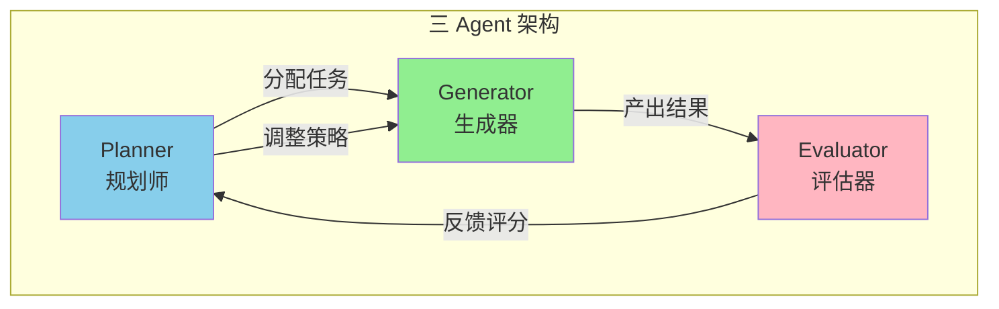
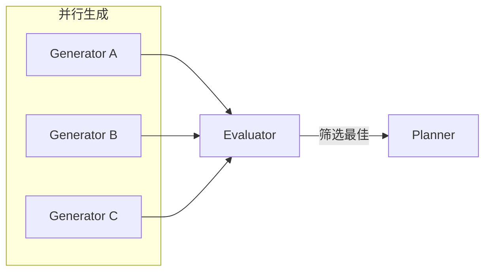

# Day 17: 三 Agent 架构 — Generator-Evaluator-Planner 模式深度解析

> 📅 2026-03-28
> 🏷️ #AI #Agent #Architecture #Self-Evaluation

## 昨日回顾

昨天我们学习了 [Day 16: Agent 内存与记忆系统](./day16-agent-memory-systems.md)，掌握了让 AI 拥有记忆的核心技术。

## 明日预告

明天我们将探讨 **Agent 安全与权限控制**，包括 Claude Code Auto Mode 解析、Agent 行为边界设置、生产环境安全策略。敬请期待！

## 引言：为什么需要三 Agent 架构？

想象一下让 AI 完成一个复杂的 UI 设计任务：
- **单 Agent**：生成→自我评估→继续优化... 结果往往自我感觉良好但实际平庸
- **三 Agent 架构**：Generator 生成 → Evaluator 严格评估 → Planner 规划下一步 → 循环迭代

Anthropic 的工程师在实验中发现：让 Agent 评估自己的作品时，它们倾向于"王婆卖瓜，自卖自夸"——即使质量一般也会给自己打高分。这就是 **自我评估失效问题**。

三 Agent 架构借鉴了 GAN（生成对抗网络）的思想，用独立的评估者打破这个困局。



---

## 核心概念解析

### 1. Generator（生成器）

负责根据任务要求生成具体输出（代码、设计、文本等）。

**核心特点**：
- 专注于高质量产出
- 接收评估反馈后迭代改进
- 不自我评判，只执行

```python
class GeneratorAgent:
    """生成器 Agent - 负责产出具体结果"""
    
    def __init__(self, model, tools):
        self.model = model
        self.tools = tools
        self.current_output = None
    
    def generate(self, task: str, context: dict) -> any:
        """根据任务生成输出"""
        prompt = f"""
        任务：{task}
        
        背景上下文：
        {context}
        
        请生成高质量的输出，确保：
        1. 完整实现所有需求
        2. 遵循最佳实践
        3. 代码清晰可维护
        """
        
        response = self.model.invoke(prompt)
        self.current_output = response
        return response
    
    def refine(self, feedback: str, criteria: dict) -> any:
        """根据评估反馈优化输出"""
        prompt = f"""
        当前输出：
        {self.current_output}
        
        评估反馈：
        {feedback}
        
        评估标准：
        {criteria}
        
        请根据反馈优化输出，解决所有问题。
        """
        
        response = self.model.invoke(prompt)
        self.current_output = response
        return response
```

### 2. Evaluator（评估器）

独立于生成器，负责严格评估输出质量。这是整个架构的关键——**分离生成与评估**。

**核心特点**：
- 独立于生成过程
- 使用明确的评分标准
- 提供具体可执行的改进建议
- 能够"铁面无私"地给出低分

```python
class EvaluatorAgent:
    """评估器 Agent - 负责严格评估输出质量"""
    
    def __init__(self, model, tools):
        self.model = model
        self.tools = tools
        self.criteria = None
    
    def set_criteria(self, criteria: dict):
        """设置评估标准"""
        self.criteria = criteria
    
    def evaluate(self, output: any, task: str) -> dict:
        """
        评估输出质量，返回结构化评分
        """
        prompt = f"""
        任务：{task}
        
        产出：{output}
        
        评估标准：
        {self._format_criteria(self.criteria)}
        
        请严格按照上述标准评估，对每个维度给出：
        1. 分数 (1-10)
        2. 具体问题描述
        3. 改进建议
        
        重要提醒：
        - 不要对 AI 生成的输出过于宽容
        - 质量问题要明确指出
        - 评分要客观公正
        """
        
        response = self.model.invoke(prompt)
        return self._parse_evaluation(response)
    
    def _format_criteria(self, criteria: dict) -> str:
        """格式化评估标准"""
        lines = []
        for name, desc in criteria.items():
            lines.append(f"- {name}: {desc}")
        return "\n".join(lines)
    
    def _parse_evaluation(self, response: str) -> dict:
        """解析评估结果为结构化数据"""
        # 实际实现中需要更复杂的解析逻辑
        return {
            "scores": {},        # 各维度分数
            "issues": [],        # 发现的问题
            "suggestions": [],    # 改进建议
            "pass": False        # 是否通过
        }
```

### 3. Planner（规划师）

负责协调整个工作流，决定下一步行动。

**核心特点**：
- 理解任务目标
- 决定是否需要继续迭代
- 调整策略方向
- 管理任务状态

```python
class PlannerAgent:
    """规划师 Agent - 负责协调整个工作流"""
    
    def __init__(self, model):
        self.model = model
        self.max_iterations = 10
    
    def plan(self, task: str, evaluation: dict, iteration: int) -> str:
        """
        根据当前评估结果规划下一步行动
        
        返回决策：
        - "continue": 继续迭代
        - "pivot": 改变方向
        - "complete": 任务完成
        - "fail": 无法完成
        """
        
        if iteration >= self.max_iterations:
            return "fail"
        
        if evaluation["pass"]:
            return "complete"
        
        # 分析评估结果，决定策略
        prompt = f"""
        任务：{task}
        
        当前迭代：{iteration}/{self.max_iterations}
        
        评估结果：
        - 通过：{evaluation['pass']}
        - 各维度评分：{evaluation['scores']}
        - 问题：{evaluation['issues']}
        - 建议：{evaluation['suggestions']}
        
        请决定下一步行动：
        1. "continue" - 在当前方向上继续优化
        2. "pivot" - 放弃当前方向，采用全新方案
        3. "complete" - 质量已经足够，任务完成
        4. "fail" - 多次尝试后仍无法达到标准
        
        分析建议的可行性，选择最佳行动。
        """
        
        response = self.model.invoke(prompt)
        return self._parse_decision(response)
    
    def _parse_decision(self, response: str) -> str:
        """解析决策文本"""
        # 简化的解析逻辑
        response_lower = response.lower()
        if "complete" in response_lower:
            return "complete"
        elif "pivot" in response_lower:
            return "pivot"
        elif "fail" in response_lower:
            return "fail"
        else:
            return "continue"
```

---

## 评估标准设计

评估器的核心是设计**可量化、可操作**的评分标准。以 UI 设计为例：

```python
# UI 设计评估标准
design_criteria = {
    "design_quality": """
        设计是否作为一个整体具有一致性？
        - 颜色、字体、布局、图像是否协调？
        - 是否创造了独特的氛围和身份？
        - 10分：完美融合，风格独特
        - 1分：各部分割裂，视觉混乱
    """,
    
    "originality": """
        是否有原创性设计决策？
        - 是否使用了模板布局？
        - 是否有 AI 生成的典型特征（如紫色渐变白色卡片）？
        - 10分：独特创意，原创设计
        - 1分：完全模板化，AI 典型风格
    """,
    
    "craft": """
        技术执行质量：
        - 字体层级是否清晰？
        - 间距是否一致？
        - 颜色是否和谐？
        - 对比度是否合适？
        - 10分：完美执行
        - 1分：基础问题频出
    """,
    
    "functionality": """
        功能可用性：
        - 用户能否理解界面用途？
        - 能否找到主要操作？
        - 完成任务是否需要猜测？
        - 10分：直观易用
        - 1分：完全无法使用
    """
}
```

**关键洞察**：
- 设计质量和原创性的权重应该高于技术和功能（因为 Claude 默认在这两项表现较好）
- 标准要明确惩罚"AI 生成痕迹"，如模板化设计、紫色渐变等

---

## 完整实现：AI 代码生成团队

下面是一个完整的三 Agent 架构实现，用于自动化代码生成：

```python
from dataclasses import dataclass
from typing import Optional
import json

@dataclass
class TaskResult:
    """任务执行结果"""
    success: bool
    output: any
    iterations: int
    final_evaluation: dict


class TripleAgentSystem:
    """三 Agent 架构系统"""
    
    def __init__(
        self,
        generator_model,
        evaluator_model,
        planner_model,
        tools: list,
        max_iterations: int = 10
    ):
        self.generator = GeneratorAgent(generator_model, tools)
        self.evaluator = EvaluatorAgent(evaluator_model, tools)
        self.planner = PlannerAgent(planner_model)
        self.max_iterations = max_iterations
        
        # 评估历史，用于追踪改进过程
        self.evaluation_history = []
    
    def execute(self, task: str, criteria: dict) -> TaskResult:
        """执行完整的三 Agent 工作流"""
        
        # 1. Planner 初始化
        context = {
            "task": task,
            "criteria": criteria,
            "history": []
        }
        
        # 2. 主循环
        for iteration in range(1, self.max_iterations + 1):
            print(f"\n=== 迭代 {iteration}/{self.max_iterations} ===")
            
            # 3. Generator 生成
            print("📝 Generator 正在生成...")
            output = self.generator.generate(task, context)
            
            # 4. Evaluator 评估
            print("🔍 Evaluator 正在评估...")
            self.evaluator.set_criteria(criteria)
            evaluation = self.evaluator.evaluate(output, task)
            
            # 记录历史
            self.evaluation_history.append(evaluation)
            context["history"].append({
                "iteration": iteration,
                "evaluation": evaluation
            })
            
            print(f"📊 评估得分: {evaluation['scores']}")
            print(f"✅ 是否通过: {evaluation['pass']}")
            
            # 5. Planner 决策
            decision = self.planner.plan(task, evaluation, iteration)
            print(f"🎯 Planner 决策: {decision}")
            
            if decision == "complete":
                return TaskResult(
                    success=True,
                    output=output,
                    iterations=iteration,
                    final_evaluation=evaluation
                )
            elif decision == "fail":
                return TaskResult(
                    success=False,
                    output=output,
                    iterations=iteration,
                    final_evaluation=evaluation
                )
            elif decision == "pivot":
                # 清空历史，改变方向
                context["history"] = []
                output = self.generator.generate(task, context)
            else:
                # continue - 反馈给 Generator 继续优化
                feedback = self._format_feedback(evaluation)
                output = self.generator.refine(feedback, criteria)
        
        return TaskResult(
            success=False,
            output=output,
            iterations=self.max_iterations,
            final_evaluation=evaluation
        )
    
    def _format_feedback(self, evaluation: dict) -> str:
        """将评估结果格式化为反馈"""
        parts = []
        for criterion, score_data in evaluation["scores"].items():
            parts.append(f"## {criterion}")
            parts.append(f"分数: {score_data['score']}/10")
            if score_data["issues"]:
                parts.append(f"问题: {score_data['issues']}")
            if score_data["suggestions"]:
                parts.append(f"建议: {score_data['suggestions']}")
            parts.append("")
        
        return "\n".join(parts)


# ========== 使用示例 ==========

# 假设使用 OpenAI API
# generator_model = ChatOpenAI(model="gpt-4o")
# evaluator_model = ChatOpenAI(model="gpt-4o")
# planner_model = ChatOpenAI(model="gpt-4o")

# 代码生成评估标准
code_criteria = {
    "correctness": """
        代码正确性：
        - 代码是否能正常运行？
        - 逻辑是否正确？
        - 边界情况是否处理？
    """,
    
    "performance": """
        性能表现：
        - 时间复杂度是否最优？
        - 是否有不必要的计算？
        - 资源使用是否合理？
    """,
    
    "readability": """
        代码可读性：
        - 命名是否清晰？
        - 注释是否充分？
        - 结构是否合理？
    """,
    
    "maintainability": """
        可维护性：
        - 是否易于扩展？
        - 是否有适当的抽象？
        - 测试是否友好？
    """
}

# 执行任务
# system = TripleAgentSystem(generator_model, evaluator_model, planner_model, [])
# result = system.execute("实现一个快速排序算法", code_criteria)
```

---

## 架构变体与扩展

### 变体 1：并行生成 + 评估筛选



适用于需要多种方案选择的场景。

### 变体 2：分层评估

```python
class HierarchicalEvaluator:
    """分层评估器 - 快速筛选 + 深度评估"""
    
    def __init__(self, fast_model, deep_model):
        self.fast_model = fast_model  # 快速初步筛选
        self.deep_model = deep_model  # 深度详细评估
    
    def evaluate(self, output: str, task: str) -> dict:
        # 第一层：快速筛选
        quick_result = self.fast_model.invoke(f"""
            快速评估：{output}
            只需要回答：通过/不通过
        """)
        
        if "通过" in quick_result:
            # 第二层：深度评估
            return self.deep_evaluate(output, task)
        else:
            return {"pass": False, "reason": "快速筛选失败"}
```

### 变体 3：自适应评分标准

```python
class AdaptiveCriteria:
    """自适应评估标准 - 根据模型表现动态调整"""
    
    def __init__(self, base_criteria: dict):
        self.base_criteria = base_criteria
        self.weights = {k: 1.0 for k in base_criteria.keys()}
    
    def adjust(self, evaluation_history: list):
        """根据历史评估调整权重"""
        if not evaluation_history:
            return
        
        # 找出模型最弱的维度，重点考察
        avg_scores = {}
        for eval_result in evaluation_history:
            for criterion, score_data in eval_result["scores"].items():
                if criterion not in avg_scores:
                    avg_scores[criterion] = []
                avg_scores[criterion].append(score_data["score"])
        
        # 降低得分高的权重，提高得分低的权重
        for criterion, scores in avg_scores.items():
            avg = sum(scores) / len(scores)
            if avg > 8:
                self.weights[criterion] *= 0.8  # 表现好，降低权重
            elif avg < 5:
                self.weights[criterion] *= 1.5  # 表现差，提高权重
    
    def get_weighted_criteria(self) -> dict:
        return {
            criterion: f"{desc} [权重: {weight}]"
            for criterion, desc in self.base_criteria.items()
            for weight in [self.weights[criterion]]
        }
```

---

## 与其他架构的对比

| 架构模式 | 优点 | 缺点 | 适用场景 |
|---------|------|------|---------|
| **单 Agent** | 简单、低延迟 | 自我评估不客观 | 简单任务 |
| **双 Agent (Generator+Evaluator)** | 分离生成与评估 | 缺少规划协调 | 需要迭代优化的任务 |
| **三 Agent (G+E+P)** | 完整的工作流控制 | 复杂、延迟较高 | 复杂长时任务 |
| **Multi-Agent 团队** | 专业分工、并行 | 通信开销大 | 复杂项目级任务 |

---

## 实战：构建 AI UI 设计系统

以下是一个使用三 Agent 架构的 UI 设计系统完整示例：

```python
import asyncio
from playwright.async_api import async_playwright

class AIDesignSystem:
    """AI UI 设计系统 - 三 Agent 架构"""
    
    def __init__(self, llm):
        self.llm = llm
        self.playwright = None
        self.browser = None
    
    async def init_browser(self):
        """初始化浏览器"""
        self.playwright = await async_playwright().start()
        self.browser = await self.playwright.chromium.launch()
    
    async def design(self, requirement: str) -> dict:
        """执行设计任务"""
        
        # ========== 1. Planner 定义设计标准 ==========
        design_criteria = await self._planner_define_criteria(requirement)
        
        # ========== 2. Generator 生成设计 ==========
        html = await self._generator_create(requirement)
        
        # ========== 3. 迭代优化循环 ==========
        best_html = html
        best_score = 0
        
        for iteration in range(5):
            # 保存到文件
            await self._save_html(best_html)
            
            # Evaluator 评估
            evaluation = await self._evaluator_assess(requirement, design_criteria)
            
            # 计算加权得分
            score = self._calculate_weighted_score(evaluation, design_criteria)
            
            if score > best_score:
                best_score = score
                best_html = evaluation.get("improved_html", best_html)
            
            # 判断是否通过
            if score >= 8:
                break
            
            # Planner 决定下一步
            if iteration < 4:
                feedback = self._format_feedback(evaluation)
                best_html = await self._generator_refine(best_html, feedback)
        
        return {"html": best_html, "score": best_score}
    
    async def _planner_define_criteria(self, requirement: str) -> dict:
        """Planner 定义设计标准"""
        prompt = f"""
        用户需求：{requirement}
        
        请定义 4 个维度的评估标准：
        1. design_quality - 设计质量
        2. originality - 原创性
        3. craft - 技术执行
        4. functionality - 功能性
        
        每个标准包含：
        - 描述
        - 10分制评分规则
        """
        
        response = await self.llm.agenerate([{"role": "user", "content": prompt}])
        return self._parse_criteria(response)
    
    async def _generator_create(self, requirement: str) -> str:
        """Generator 创建设计"""
        prompt = f"""
        任务：根据需求创建 HTML/CSS/JS 设计
        
        需求：{requirement}
        
        要求：
        - 使用现代设计风格
        - 完整可运行的代码
        - 响应式设计
        - 不要使用 AI 典型风格（如紫色渐变白色卡片）
        """
        
        response = await self.llm.agenerate([{"role": "user", "content": prompt}])
        return self._extract_html(response)
    
    async def _evaluator_assess(
        self, 
        requirement: str, 
        criteria: dict
    ) -> dict:
        """Evaluator 评估设计"""
        
        # 1. 用 Playwright 打开页面
        page = await self.browser.new_page()
        await page.goto("file:///tmp/design.html")
        
        # 2. 截图
        await page.screenshot(path="/tmp/design.png")
        
        # 3. 用视觉模型评估（或让 LLM 看截图描述）
        # 实际实现中可以使用视觉模型
        
        # 4. 生成评估报告
        prompt = f"""
        任务：评估以下设计
        
        需求：{requirement}
        
        评估标准：
        {criteria}
        
        请给出：
        1. 各维度分数 (1-10)
        2. 发现的问题
        3. 改进建议
        4. 如果需要改进，给出改进后的代码
        """
        
        response = await self.llm.agenerate([{"role": "user", "content": prompt}])
        return self._parse_evaluation(response)
    
    async def _generator_refine(self, html: str, feedback: str) -> str:
        """Generator 根据反馈优化"""
        prompt = f"""
        当前 HTML：
        {html}
        
        评估反馈：
        {feedback}
        
        请根据反馈优化代码。
        """
        
        response = await self.llm.agenerate([{"role": "user", "content": prompt}])
        return self._extract_html(response)
```

---

## 最佳实践总结

| 原则 | 说明 |
|------|------|
| **评估标准要具体** | 避免"是否好"这种模糊标准，要可量化 |
| **Generator 和 Evaluator 必须独立** | 同一个模型也要扮演不同角色 |
| **迭代次数要有限制** | 防止无限循环，浪费资源 |
| **Planner 要能做"放弃"决策** | 避免在错误方向上坚持 |
| **评估历史要保存** | 用于分析和改进系统 |

---

## 下一步

- 尝试用 Claude Agent SDK 实现三 Agent 架构
- 研究 Evaluator 的few-shot 示例调优
- 探索多维度评估标准的自动化生成

---

*本文是「AI Agent 工程师学习笔记」系列第 17 篇。*
*关注我，每天学习一个 AI 开发知识点。*