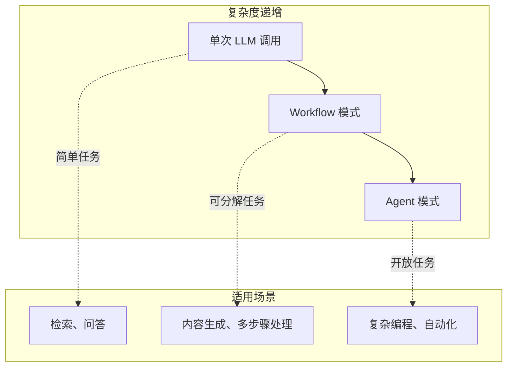
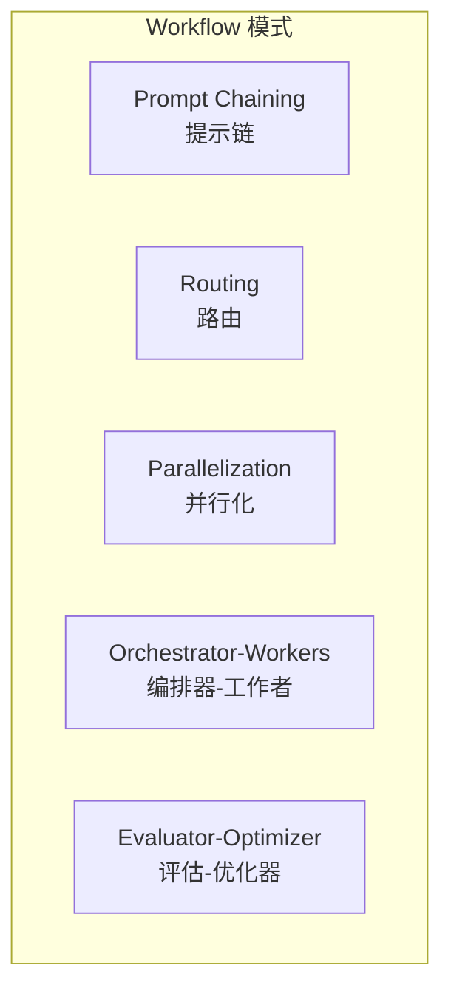
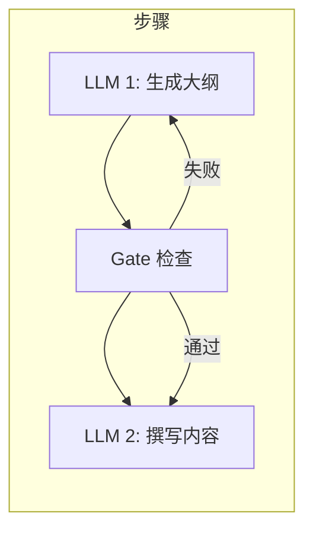
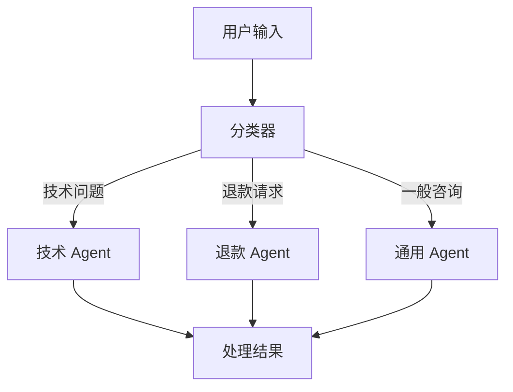
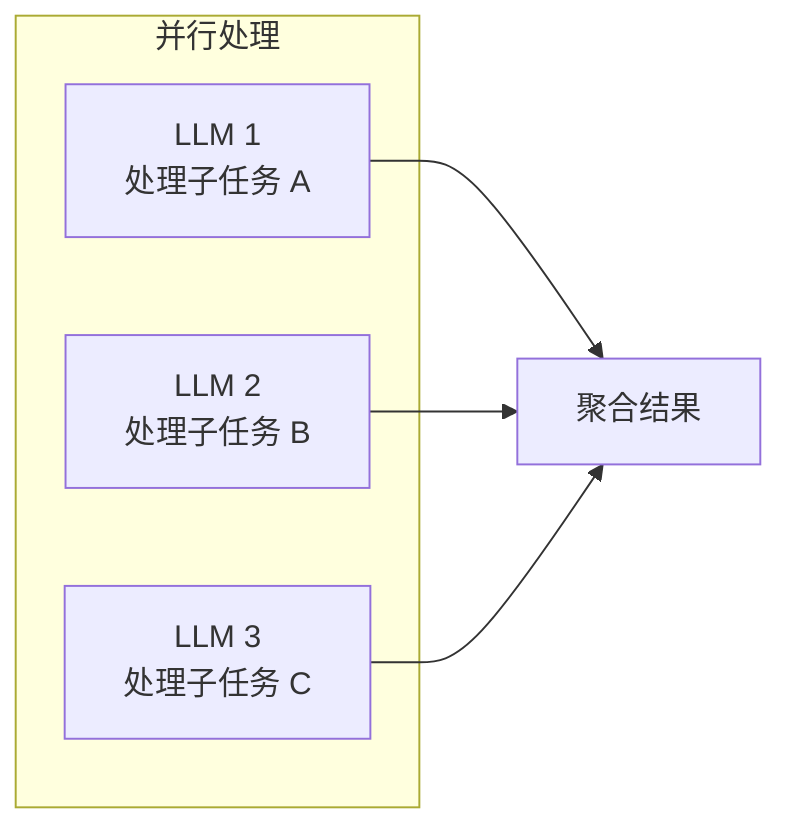
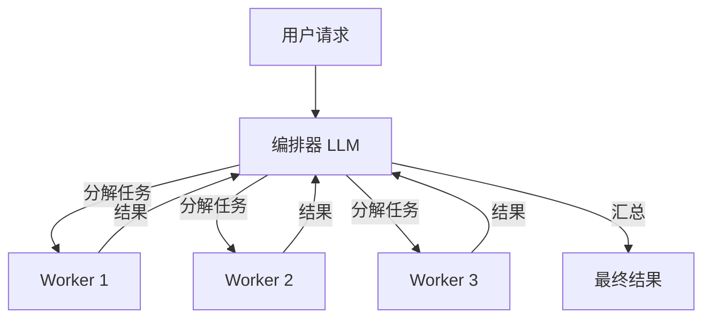
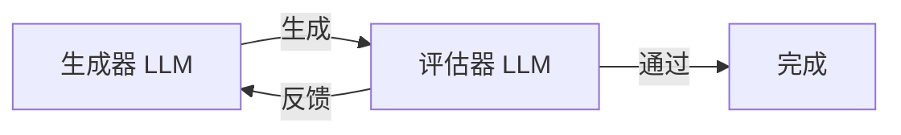
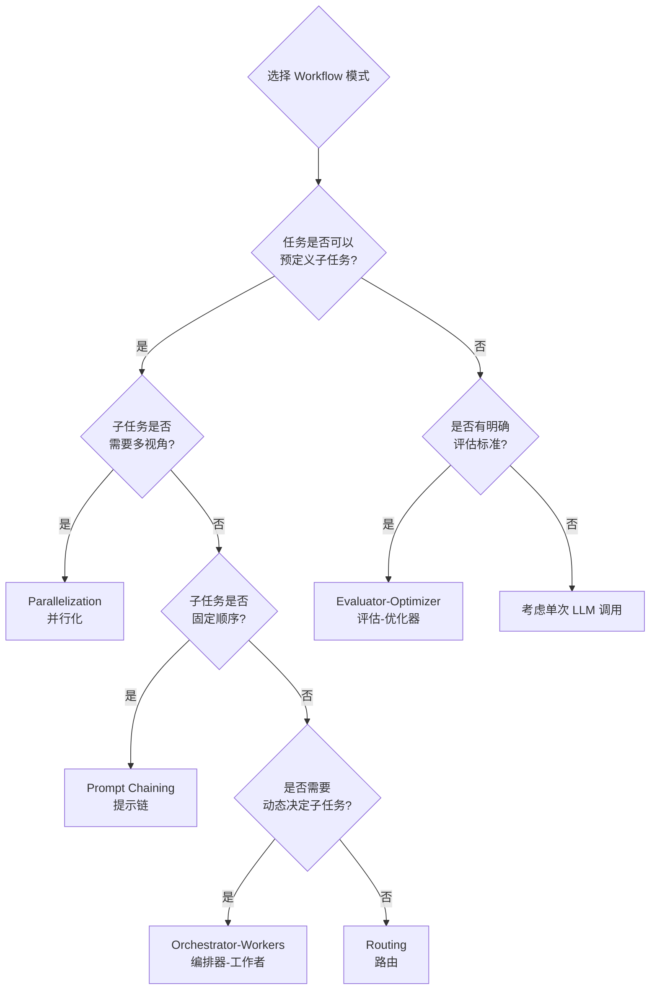

# Day 19: Agent Workflow 模式详解与实战 — 从原理到落地

> 五种核心模式详解 + 框架对比 + 完整代码示例

## 昨日回顾

昨天我们学习了 [Day 18: Agent 安全实践](./day18-agent-security.md)，掌握了 Agent 安全防护的核心策略。

## 今日预告

明天我们将探讨 **Agent 与 Human 协作** 模式，包括 Human-in-the-loop、主动确认、反馈循环等交互设计。

---

## 为什么需要 Workflow 模式？

在构建 AI 应用时，很多同学一上来就想着造一个"全能 Agent"，让它自主决策一切。

**Anthropic 的工程实践告诉我们**：大多数场景下，简单模式比复杂框架更有效。

> "We recommend finding the simplest solution possible, and only increasing complexity when needed."
> — Anthropic Engineering Blog



## 五种核心 Workflow 模式

根据 Anthropic 的实践经验，有五种经过验证的核心模式：



### 1. Prompt Chaining（提示链）

**核心思想**：把复杂任务拆成多个步骤，每个 LLM 处理前一个的输出。



**适用场景**：
- 营销文案生成 → 翻译
- 大纲生成 → 内容撰写 → 审核
- 任何可以清晰拆解的固定流程

**代码实现**：

```python
from openai import OpenAI
from pydantic import BaseModel

client = OpenAI()

# 定义输出结构
class Outline(BaseModel):
    sections: list[str]
    key_points: list[str]

class Article(BaseModel):
    title: str
    content: str
    word_count: int

def prompt_chaining(topic: str) -> Article:
    """
    提示链示例：生成文章大纲 → 撰写文章
    """
    # Step 1: 生成大纲
    outline_response = client.chat.completions.create(
        model="gpt-4o",
        messages=[
            {"role": "system", "content": "你是一位专业作家，擅长制定文章大纲。"},
            {"role": "user", "content": f"为以下主题生成文章大纲：{topic}"}
        ],
        response_format=Outline
    )
    outline = outline_response.choices[0].message.parsed
    
    # 可选：Gate 检查
    if len(outline.sections) < 3:
        raise ValueError("大纲章节不足，需要重新生成")
    
    # Step 2: 撰写文章
    article_response = client.chat.completions.create(
        model="gpt-4o",
        messages=[
            {"role": "system", "content": "你是一位专业作家，根据大纲撰写文章。"},
            {"role": "user", "content": f"根据以下大纲撰写文章：\n{outline.model_dump_json()}"}
        ],
        response_format=Article
    )
    
    return article_response.choices[0].message.parsed

# 使用示例
article = prompt_chaining("AI Agent 的最佳实践")
print(f"标题: {article.title}")
print(f"字数: {article.word_count}")
```

**关键点**：
- 每个步骤可以是不同的 LLM（成本优化）
- 可以在步骤之间添加程序化检查（Gate）
- 牺牲延迟，换取更高准确率

---

### 2. Routing（路由）

**核心思想**：先分类输入，然后分发给专门的处理器。



**适用场景**：
- 客服系统（不同类型问题 → 不同流程）
- 简单问题用小模型，复杂问题用大模型
- 内容审核 + 核心任务分离

**代码实现**：

```python
from openai import OpenAI
from enum import Enum

client = OpenAI()

class QueryType(str, Enum):
    """查询类型枚举"""
    TECHNICAL = "technical"
    REFUND = "refund"
    GENERAL = "general"

# 路由配置：不同类型 → 不同系统提示
SYSTEM_PROMPTS = {
    QueryType.TECHNICAL: """你是技术支持专家。
    - 优先提供技术解决方案
    - 如果需要代码，提供完整可运行的示例
    - 遇到不确定的问题，坦诚告知""",
    
    QueryType.REFUND: """你是退款处理专员。
    - 首先表达歉意
    - 了解订单情况和退款原因
    - 按照公司政策处理退款申请""",
    
    QueryType.GENERAL: """你是客服助手。
    - 友好、耐心地回答问题
    - 保持简洁，不要过度解释"""
}

def route_query(query: str, use_llm_routing: bool = False) -> str:
    """
    路由示例：根据输入类型分发到不同的处理流程
    """
    # 方式一：规则匹配（简单场景）
    if not use_llm_routing:
        query_lower = query.lower()
        if "bug" in query_lower or "error" in query_lower or "代码" in query_lower:
            query_type = QueryType.TECHNICAL
        elif "退款" in query_lower or "refund" in query_lower:
            query_type = QueryType.REFUND
        else:
            query_type = QueryType.GENERAL
    else:
        # 方式二：LLM 分类（复杂场景）
        classification_response = client.chat.completions.create(
            model="gpt-4o-mini",  # 用小模型做分类，成本低
            messages=[
                {"role": "system", "content": "将用户查询分类为：technical / refund / general"},
                {"role": "user", "content": query}
            ]
        )
        query_type = QueryType(classification_response.choices[0].message.content.lower())
    
    # 分发到对应的处理流程
    response = client.chat.completions.create(
        model="gpt-4o-mini" if query_type == QueryType.GENERAL else "gpt-4o",
        messages=[
            {"role": "system", "content": SYSTEM_PROMPTS[query_type]},
            {"role": "user", "content": query}
        ]
    )
    
    return response.choices[0].message.content

# 使用示例
query1 = "我的代码报错了，undefined is not a function"
query2 = "我想申请退款"
query3 = "你们公司做什么的？"

print(f"Query1 路由到: {route_query(query1, use_llm_routing=False)}")
print(f"Query2 路由到: {route_query(query2, use_llm_routing=False)}")
```

**关键点**：
- 分离关注点，每个处理器可以独立优化
- 可以用小模型处理简单任务，大模型处理复杂任务
- 分类准确性很关键

---

### 3. Parallelization（并行化）

**核心思想**：让多个 LLM 同时处理独立任务，然后聚合结果。



**两种变体**：
- **Sectioning**：把任务分成独立子任务并行处理
- **Voting**：同一任务用不同 prompt 运行多次，取多数/最佳

**适用场景**：
- 代码审查（多个视角）
- 内容审核（多个维度）
- 同时需要多方面信息

**代码实现**：

```python
import asyncio
from openai import OpenAI
from typing import list

client = OpenAI()

async def parallel_processing(code: str) -> dict:
    """
    并行化示例：代码审查
    同时运行多个审查维度
    """
    
    # 定义不同的审查维度
    review_prompts = {
        "security": """审查以下代码的安全漏洞：
```python
{}
```

列出所有可能的安全问题。""",
        
        "performance": """审查以下代码的性能问题：
```python
{}
```

列出所有可能的性能优化点。""",
        
        "best_practices": """审查以下代码是否符合最佳实践：
```python
{}
```

列出所有不符合最佳实践的地方。"""
    }
    
    # 并行执行所有审查
    tasks = [
        client.chat.completions.create(
            model="gpt-4o",
            messages=[
                {"role": "system", "content": "你是代码审查专家。"},
                {"role": "user", "content": prompt.format(code)}
            ]
        )
        for prompt in review_prompts.values()
    ]
    
    responses = await asyncio.gather(*tasks)
    
    # 聚合结果
    results = {}
    for key, response in zip(review_prompts.keys(), responses):
        results[key] = response.choices[0].message.content
    
    return results

# Voting 模式：代码漏洞检测
def voting_code_review(code: str, num_votes: int = 3) -> dict:
    """
    投票模式：用多个不同 prompt 审查，取多数意见
    """
    vote_prompts = [
        """严格审查以下代码，如果发现任何漏洞或潜在安全问题，返回 "VULNERABLE"。
否则返回 "SAFE"。
        
代码：```python
{}```""",
        
        """审查以下代码，关注常见的安全错误。如果发现问题，返回 "VULNERABLE"。
否则返回 "SAFE"。
        
代码：```python
{}```""",
        
        """从安全角度审查以下代码。如果有任何安全风险，返回 "VULNERABLE"。
否则返回 "SAFE"。
        
代码：```python
{}```"""
    ]
    
    votes = []
    for prompt_template in vote_prompts:
        response = client.chat.completions.create(
            model="gpt-4o",
            messages=[
                {"role": "system", "content": "你是一个严格的安全审查员。"},
                {"role": "user", "content": prompt_template.format(code)}
            ]
        )
        votes.append(response.choices[0].message.content.strip())
    
    # 统计投票结果
    safe_votes = votes.count("SAFE")
    vulnerable_votes = votes.count("VULNERABLE")
    
    return {
        "votes": votes,
        "result": "SAFE" if safe_votes > vulnerable_votes else "VULNERABLE",
        "confidence": max(safe_votes, vulnerable_votes) / len(votes)
    }

# 使用示例
sample_code = """
def get_user(user_id):
    # 直接拼接 SQL，存在注入风险
    query = f"SELECT * FROM users WHERE id = {user_id}"
    return db.execute(query)
"""

results = asyncio.run(parallel_processing(sample_code))
print("安全审查:", results["security"])
print("性能审查:", results["performance"])
print("最佳实践:", results["best_practices"])
```

**关键点**：
- 子任务必须真正独立才能并行
- Voting 模式可以提高准确性，但增加成本
- 适用于需要多视角的任务

---

### 4. Orchestrator-Workers（编排器-工作者）

**核心思想**：中央 LLM 动态决定子任务，分发给工作者，然后汇总结果。



**与并行化的区别**：
- 并行化：子任务是预定义的
- 编排器-工作者：子任务由 LLM 动态决定

**适用场景**：
- 复杂代码修改（需要分析多个文件）
- 多源搜索和信息聚合
- 无法预测子任务的场景

**代码实现**：

```python
from openai import OpenAI
import json

client = OpenAI()

class WorkerTask(BaseModel):
    """工作者任务"""
    task_id: str
    description: str
    tool: str  # 使用的工具

class OrchestratorWorkers:
    """编排器-工作者模式"""
    
    def __init__(self):
        self.tools = {
            "search": self._search,
            "code_analysis": self._analyze_code,
            "web_fetch": self._fetch_web,
        }
    
    def _search(self, query: str) -> str:
        """搜索工具"""
        response = client.chat.completions.create(
            model="gpt-4o",
            messages=[
                {"role": "system", "content": "你是一个搜索引擎，返回相关信息。"},
                {"role": "user", "content": f"搜索：{query}"}
            ]
        )
        return response.choices[0].message.content
    
    def _analyze_code(self, code: str) -> str:
        """代码分析工具"""
        response = client.chat.completions.create(
            model="gpt-4o",
            messages=[
                {"role": "system", "content": "分析以下代码并提供改进建议。"},
                {"role": "user", "content": code}
            ]
        )
        return response.choices[0].message.content
    
    def _fetch_web(self, url: str) -> str:
        """网页抓取工具"""
        # 简化示例
        return f"Fetched content from {url}"
    
    def run(self, task: str) -> str:
        """
        运行编排器-工作者流程
        """
        # Step 1: 编排器分解任务
        decompose_response = client.chat.completions.create(
            model="gpt-4o",
            messages=[
                {"role": "system", "content": """你是一个任务编排器。
分析用户请求，将其分解为可并行执行的子任务。
每个子任务需要指定：task_id, description, tool

返回 JSON 数组格式。"""},
                {"role": "user", "content": f"任务：{task}"}
            ],
            response_format=list[WorkerTask]
        )
        
        sub_tasks = decompose_response.choices[0].message.parsed
        
        # Step 2: 并行执行子任务
        results = {}
        for sub_task in sub_tasks:
            tool_func = self.tools.get(sub_task.tool)
            if tool_func:
                results[sub_task.task_id] = tool_func(sub_task.description)
        
        # Step 3: 编排器汇总结果
        synthesize_response = client.chat.completions.create(
            model="gpt-4o",
            messages=[
                {"role": "system", "content": "你是任务编排器，根据子任务结果生成最终答案。"},
                {"role": "user", "content": f"""
原始任务：{task}

子任务结果：
{json.dumps(results, ensure_ascii=False, indent=2)}

请生成最终结果。
"""}
            ]
        )
        
        return synthesize_response.choices[0].message.content

# 使用示例
orchestrator = OrchestratorWorkers()
result = orchestrator.run("分析这个项目的代码质量，并搜索类似项目的最佳实践")
print(result)
```

---

### 5. Evaluator-Optimizer（评估-优化器）

**核心思想**：一个 LLM 生成结果，另一个 LLM 评估并反馈，循环直到满意。



**适用场景**：
- 文学翻译（需要理解细微差别）
- 复杂搜索（多轮迭代直到找到最佳结果）
- 任何有明确评估标准的工作

**代码实现**：

```python
from openai import OpenAI

client = OpenAI()

class Evaluation(BaseModel):
    """评估结果"""
    score: int  # 1-10
    feedback: str
    is_acceptable: bool

def evaluator_optimizer(original_task: str, initial_content: str, max_iterations: int = 3) -> str:
    """
    评估-优化器模式
    """
    current_content = initial_content
    
    for iteration in range(max_iterations):
        print(f"\n=== 迭代 {iteration + 1} ===")
        
        # Step 1: 评估
        eval_response = client.chat.completions.create(
            model="gpt-4o",
            messages=[
                {"role": "system", "content": """你是一个严格的评估专家。
评估内容质量，给出 1-10 分，并提供具体反馈。

如果内容已经足够好（8分以上），返回 is_acceptable: true。
否则返回 is_acceptable: false 并提供改进建议。"""},
                {"role": "user", "content": f"""
任务：{original_task}
内容：
{current_content}
"""}
            ],
            response_format=Evaluation
        )
        
        evaluation = eval_response.choices[0].message.parsed
        
        print(f"评分: {evaluation.score}/10")
        print(f"反馈: {evaluation.feedback}")
        
        # 如果已经足够好，停止迭代
        if evaluation.is_acceptable:
            print("内容已达标！")
            break
        
        # Step 2: 优化
        optimize_response = client.chat.completions.create(
            model="gpt-4o",
            messages=[
                {"role": "system", "content": "你是内容生成专家，根据反馈优化内容。"},
                {"role": "user", "content": f"""
任务：{original_task}
当前内容：
{current_content}

评估反馈：
{evaluation.feedback}

请根据反馈优化内容。
"""}
            ]
        )
        
        current_content = optimize_response.choices[0].message.content
    
    return current_content

# 使用示例
task = "写一篇关于 AI Agent 的科普文章"
initial = "AI Agent 是人工智能代理，可以帮助人们完成各种任务。"

final_result = evaluator_optimizer(task, initial)
print("\n=== 最终结果 ===")
print(final_result)
```

---

## 模式对比与选择

| 模式 | 复杂度 | 延迟 | 适用场景 |
|------|--------|------|----------|
| Prompt Chaining | 低 | 高（串行） | 可清晰拆解的固定流程 |
| Routing | 低 | 低 | 分类明确的输入 |
| Parallelization | 中 | 低（并行） | 多视角任务 |
| Orchestrator-Workers | 高 | 中 | 动态子任务 |
| Evaluator-Optimizer | 中 | 中（迭代） | 有明确评估标准 |



---

## 框架对比：CrewAI vs LangGraph vs Claude SDK

### CrewAI

```python
# CrewAI 示例：使用流程模式
from crewai import Agent, Task, Crew, Process

# 定义 Agent
researcher = Agent(role="Researcher", goal="研究主题")
writer = Agent(role="Writer", goal="撰写内容")

# 定义任务
research_task = Task(description="研究 AI Agent", agent=researcher)
write_task = Task(description="撰写报告", agent=writer, context=[research_task])

# 创建 Crew（支持顺序和层级流程）
crew = Crew(
    agents=[researcher, writer],
    tasks=[research_task, write_task],
    process=Process.sequential  # 或 Process.hierarchical
)
```

**优点**：
- 上手简单
- 内置 Agent、Task、Crew 抽象
- 支持层级式流程

**缺点**：
- 抽象层较厚
- 调试相对困难

---

### LangGraph

```python
# LangGraph 示例：状态机模式
from langgraph.graph import StateGraph, END
from typing import TypedDict

class AgentState(TypedDict):
    messages: list
    task: str

def router_node(state: AgentState) -> AgentState:
    """路由节点"""
    # 根据任务类型路由
    return state

def worker_node(state: AgentState) -> AgentState:
    """工作节点"""
    return state

# 构建图
graph = StateGraph(AgentState)
graph.add_node("router", router_node)
graph.add_node("worker", worker_node)
graph.set_entry_point("router")
graph.add_edge("router", "worker")
graph.add_edge("worker", END)

app = graph.compile()
```

**优点**：
- 底层控制精细
- 支持复杂状态管理
- 内置内存和持久化

**缺点**：
- 学习曲线较陡
- 需要理解状态机概念

---

### Claude SDK（直接使用）

```python
# 直接使用 Anthropic SDK
from anthropic import Anthropic

client = Anthropic()

# 简单的 Agent 循环
def simple_agent(user_message: str, tools: list) -> str:
    messages = [{"role": "user", "content": user_message}]
    
    while True:
        response = client.messages.create(
            model="claude-sonnet-4-20250514",
            max_tokens=4096,
            messages=messages,
            tools=tools
        )
        
        # 检查是否需要调用工具
        if response.stop_reason == "tool_use":
            # 处理工具调用
            for tool_use in response.content:
                if hasattr(tool_use, 'input'):
                    result = execute_tool(tool_use.name, tool_use.input)
                    messages.append({
                        "role": "user",
                        "content": f"Tool result: {result}"
                    })
        else:
            return response.content[0].text
```

**优点**：
- 最直接的控制
- 调试最方便
- 无额外抽象层

**缺点**：
- 需要自己实现流程管理

---

## 实战：构建客服 Agent

结合多种模式：

```python
"""
客服 Agent 系统
结合 Routing + Evaluator-Optimizer + Human-in-the-loop
"""

from openai import OpenAI
from enum import Enum
from typing import Optional

client = OpenAI()

class Intent(str, Enum):
    """意图分类"""
    TECHNICAL = "technical"
    REFUND = "refund"
    BILLING = "billing"
    GENERAL = "general"

class Sentiment(str, Enum):
    """情感分析"""
    ANGRY = "angry"
    NEUTRAL = "neutral"
    HAPPY = "happy"

class CustomerServiceAgent:
    """客服 Agent"""
    
    def __init__(self):
        self.intent_prompts = {
            Intent.TECHNICAL: "你是一个技术支持专家...",
            Intent.REFUND: "你是一个退款专员...",
            Intent.BILLING: "你是一个账单专家...",
            Intent.GENERAL: "你是客服助手..."
        }
    
    def classify_intent(self, message: str) -> Intent:
        """路由：意图分类"""
        response = client.chat.completions.create(
            model="gpt-4o-mini",
            messages=[
                {"role": "system", "content": "分类用户意图：technical / refund / billing / general"},
                {"role": "user", "content": message}
            ]
        )
        return Intent(response.choices[0].message.content.lower())
    
    def detect_sentiment(self, message: str) -> Sentiment:
        """情感分析"""
        response = client.chat.completions.create(
            model="gpt-4o-mini",
            messages=[
                {"role": "system", "content": "分析用户情感：angry / neutral / happy"},
                {"role": "user", "content": message}
            ]
        )
        return Sentiment(response.choices[0].message.content.lower())
    
    def generate_response(self, message: str, intent: Intent) -> str:
        """生成初始响应"""
        response = client.chat.completions.create(
            model="gpt-4o",
            messages=[
                {"role": "system", "content": self.intent_prompts[intent]},
                {"role": "user", "content": message}
            ]
        )
        return response.choices[0].message.content
    
    def evaluate_response(self, response: str, user_message: str) -> dict:
        """评估响应质量"""
        evaluation = client.chat.completions.create(
            model="gpt-4o",
            messages=[
                {"role": "system", "content": """评估客服响应质量。
检查点：
1. 是否解决了用户问题
2. 语气是否合适
3. 是否有礼貌

返回 JSON：{"score": 1-10, "issues": [], "is_acceptable": bool}"""},
                {"role": "user", "content": f"用户问题：{user_message}\n客服回复：{response}"}
            ]
        )
        return evaluation.choices[0].message.parsed
    
    def run(self, user_message: str, require_human_for_angry: bool = True) -> str:
        """
        主流程：Routing → 生成 → 评估 → （可选）人工介入
        """
        # 1. 意图路由
        intent = self.classify_intent(user_message)
        print(f"意图分类: {intent.value}")
        
        # 2. 情感检测（如果是愤怒用户）
        sentiment = self.detect_sentiment(user_message)
        print(f"情感分析: {sentiment.value}")
        
        # 3. 愤怒用户可能需要人工介入
        if require_human_for_angry and sentiment == Sentiment.ANGRY:
            return "我理解您很生气。为了更好地解决问题，我将为您转接人工客服。"
        
        # 4. 生成响应
        response = self.generate_response(user_message, intent)
        
        # 5. 评估响应质量（Evaluator-Optimizer）
        eval_result = self.evaluate_response(response, user_message)
        print(f"质量评分: {eval_result['score']}/10")
        
        if not eval_result['is_acceptable']:
            # 6. 质量不达标，尝试优化
            # 这里可以添加优化循环
            print(f"问题: {eval_result['issues']}")
        
        return response

# 使用示例
agent = CustomerServiceAgent()
user_input = "我购买你们的会员后发现不能用，要求退款！"

result = agent.run(user_input)
print(f"\n最终回复: {result}")
```

---

## 总结

| 模式 | 核心价值 | UI 工程师转型点 |
|------|----------|-----------------|
| Prompt Chaining | 流程分解 | 可类比 UI 组件链 |
| Routing | 条件分发 | 可类比 React Router |
| Parallelization | 并行处理 | 可类比 Promise.all |
| Orchestrator-Workers | 动态编排 | 可类比微服务架构 |
| Evaluator-Optimizer | 迭代优化 | 可类比 CI/CD 循环 |

**核心理念**：不要过度设计，从最简单的方案开始，只有当简单方案不够用时才增加复杂度。

---

## 下一步

- 尝试在自己的项目中应用这些模式
- 学习 LangGraph 的低层实现
- 掌握 Human-in-the-loop 的设计方法

---

*本文是「AI Agent 工程师学习笔记」系列第 19 篇。*
*关注我，每天学习一个 AI 开发知识点。*
