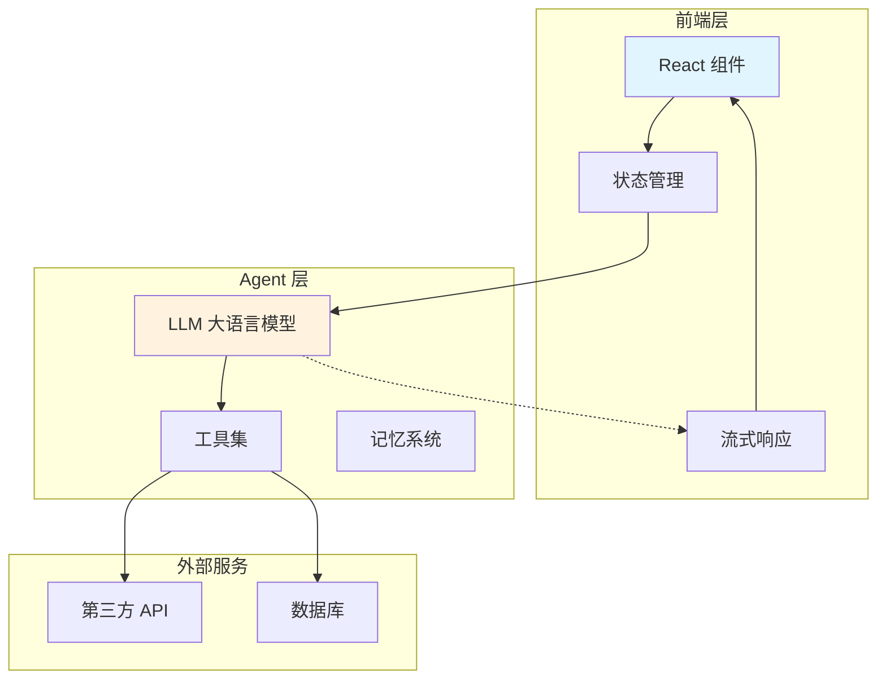
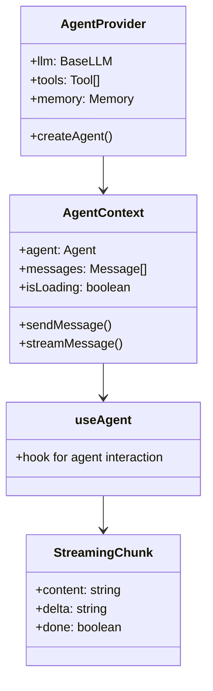
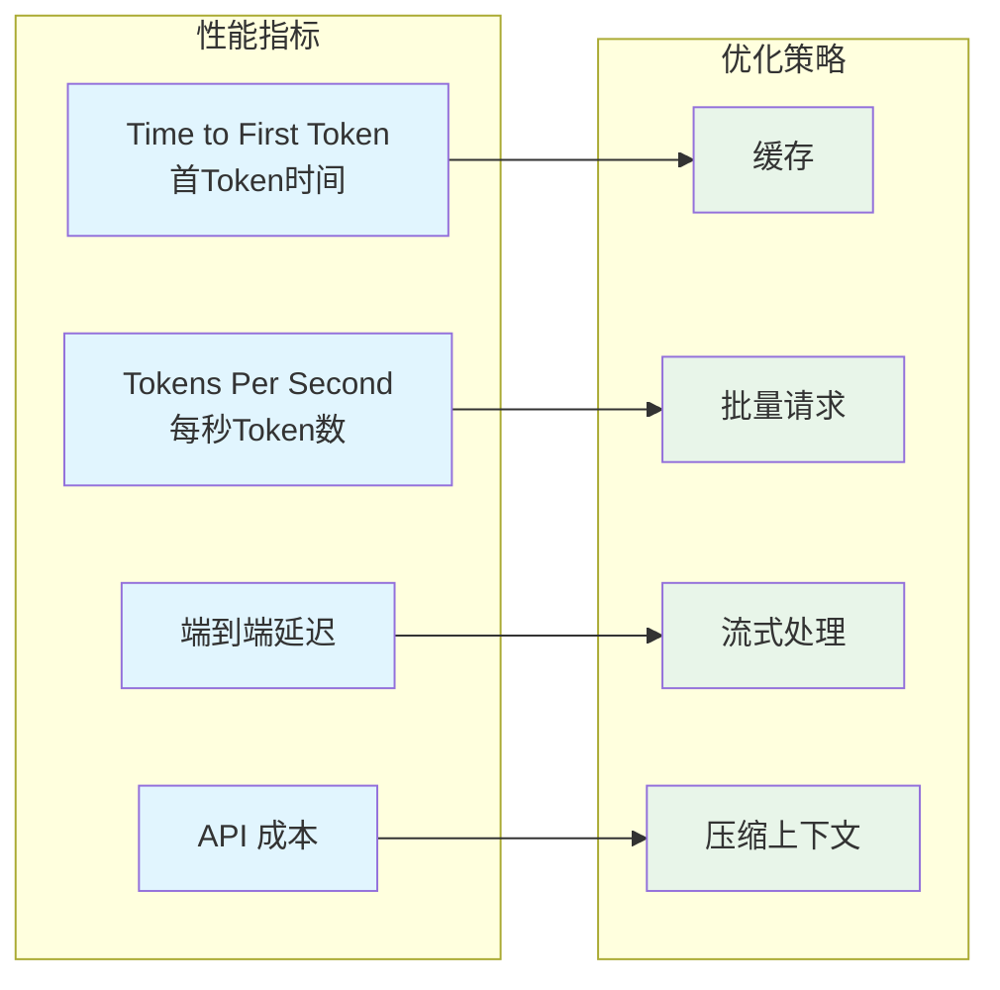

# Day 21: AI Agent 与前端结合 — React Agent 组件开发与实时交互实现

> 📅 2026-04-02
> 🏷️ #AI #Agent #React #Frontend #RealTime #WebDevelopment

## 昨日回顾

昨天我们学习了 [Day 20: AI Agent 工作流编排与工具调用优化](./day20-agent-workflow-optimization.md)，掌握了构建高效 Agent 系统的核心方法。

## 明日预告

明天我们将深入探讨 **AI Agent 的持久化与状态管理**，包括对话历史管理、跨会话状态恢复、长期记忆机制。敬请期待！

## 引言：当 AI 遇见 React

作为前端工程师，你可能已经熟悉 React 的组件化开发、状态管理、Hooks 等核心概念。但如何将强大的 AI Agent 能力引入 React 应用？

想象一下：
- 用户在聊天界面输入问题 → AI Agent 实时处理 → 流式返回答案
- 表单提交时 AI 自动补全和建议
- 复杂交互中 AI 理解用户意图并执行操作

**React + AI Agent = 更智能的前端应用**。



---

## 第一部分：React Agent 架构设计

### 1.1 核心组件架构

React Agent 应用的核心架构包括以下几个关键组件：



### 1.2 目录结构参考

对于一个成熟的 React Agent 项目，推荐的目录结构：

```plaintext
src/
├── agents/
│   ├── base/
│   │   ├── agent.ts          # Agent 基类
│   │   ├── tool.ts           # 工具定义
│   │   └── memory.ts         # 记忆系统
│   ├── implementations/
│   │   ├── chat-agent.ts     # 聊天 Agent
│   │   └── task-agent.ts     # 任务 Agent
│   └── registry.ts           # Agent 注册表
├── components/
│   ├── AgentChat/
│   │   ├── ChatWindow.tsx    # 聊天窗口
│   │   ├── MessageList.tsx   # 消息列表
│   │   ├── InputArea.tsx     # 输入区域
│   │   └── typing-indicator.tsx
│   ├── AgentPanel/
│   │   ├── AgentStatus.tsx   # Agent 状态
│   │   └── ToolCallLog.tsx  # 工具调用日志
│   └── common/
│       ├── StreamingText.tsx  # 流式文本组件
│       └── LoadingSpinner.tsx
├── hooks/
│   ├── useAgent.ts           # 核心 Agent Hook
│   ├── useStreaming.ts       # 流式响应 Hook
│   └── useAgentTools.ts      # 工具管理 Hook
├── services/
│   ├── agent-service.ts     # Agent 服务层
│   └── api-gateway.ts       # API 网关
├── stores/
│   └── agent-store.ts        # 状态管理
└── types/
    └── agent.ts             # 类型定义
```

---

## 第二部分：核心实现

### 2.1 Agent Provider 封装

这是整个 React Agent 应用的核心Provider，类似于 Redux 的 Provider：

```tsx
// src/providers/AgentProvider.tsx
import React, { createContext, useContext, useMemo, useState } from 'react';
import { createAgent, Agent } from '@/agents/base/agent';
import { Message, ToolCall } from '@/types/agent';

interface AgentContextValue {
  agent: Agent | null;
  messages: Message[];
  isLoading: boolean;
  error: Error | null;
  addMessage: (message: Message) => void;
  clearMessages: () => void;
  sendMessage: (content: string) => Promise<void>;
  streamMessage: (content: string) => AsyncGenerator<string, void, unknown>;
}

const AgentContext = createContext<AgentContextValue | null>(null);

interface AgentProviderProps {
  children: React.ReactNode;
  config: {
    model: string;
    temperature?: number;
    maxTokens?: number;
    tools?: any[];
    systemPrompt?: string;
  };
  onToolCall?: (toolCall: ToolCall) => void;
  onStreamChunk?: (chunk: string) => void;
}

export const AgentProvider: React.FC<AgentProviderProps> = ({
  children,
  config,
  onToolCall,
  onStreamChunk,
}) => {
  // 使用 useMemo 缓存 agent 实例，避免重复创建
  const agent = useMemo(() => {
    return createAgent({
      model: config.model,
      temperature: config.temperature ?? 0.7,
      maxTokens: config.maxTokens ?? 4096,
      tools: config.tools ?? [],
      systemPrompt: config.systemPrompt ?? 'You are a helpful AI assistant.',
    });
  }, [config.model, config.temperature, config.maxTokens, config.tools, config.systemPrompt]);

  const [messages, setMessages] = useState<Message[]>([]);
  const [isLoading, setIsLoading] = useState(false);
  const [error, setError] = useState<Error | null>(null);

  // 添加消息到对话历史
  const addMessage = (message: Message) => {
    setMessages(prev => [...prev, message]);
  };

  // 清空对话历史
  const clearMessages = () => {
    setMessages([]);
  };

  // 同步发送消息（等待完整响应）
  const sendMessage = async (content: string) => {
    setIsLoading(true);
    setError(null);

    try {
      // 添加用户消息
      const userMessage: Message = {
        id: crypto.randomUUID(),
        role: 'user',
        content,
        timestamp: new Date(),
      };
      addMessage(userMessage);

      // 调用 Agent
      const response = await agent.invoke({
        messages: [...messages, userMessage],
      });

      // 添加助手回复
      const assistantMessage: Message = {
        id: crypto.randomUUID(),
        role: 'assistant',
        content: response.content,
        toolCalls: response.toolCalls,
        timestamp: new Date(),
      };
      addMessage(assistantMessage);
    } catch (err) {
      setError(err as Error);
    } finally {
      setIsLoading(false);
    }
  };

  // 流式发送消息（实时返回 token）
  const streamMessage = async function* (content: string) {
    setIsLoading(true);
    setError(null);

    try {
      // 添加用户消息
      const userMessage: Message = {
        id: crypto.randomUUID(),
        role: 'user',
        content,
        timestamp: new Date(),
      };
      addMessage(userMessage);

      // 流式调用 Agent
      const stream = agent.stream({
        messages: [...messages, userMessage],
      });

      let fullContent = '';

      for await (const chunk of stream) {
        // 触发流式回调
        onStreamChunk?.(chunk.delta);

        // 累加内容
        fullContent += chunk.delta;

        // 如果有工具调用，触发回调
        if (chunk.toolCall) {
          onToolCall?.(chunk.toolCall);
        }

        yield chunk.delta;
      }

      // 添加完整的助手消息
      const assistantMessage: Message = {
        id: crypto.randomUUID(),
        role: 'assistant',
        content: fullContent,
        timestamp: new Date(),
      };
      addMessage(assistantMessage);
    } catch (err) {
      setError(err as Error);
    } finally {
      setIsLoading(false);
    }
  };

  const value: AgentContextValue = {
    agent,
    messages,
    isLoading,
    error,
    addMessage,
    clearMessages,
    sendMessage,
    streamMessage,
  };

  return (
    <AgentContext.Provider value={value}>
      {children}
    </AgentContext.Provider>
  );
};

// 自定义 Hook：使用 Agent 上下文
export const useAgent = () => {
  const context = useContext(AgentContext);
  if (!context) {
    throw new Error('useAgent must be used within an AgentProvider');
  }
  return context;
};
```

### 2.2 流式响应组件

实现实时流式输出是 React Agent 应用的关键：

```tsx
// src/components/AgentChat/StreamingText.tsx
import React, { useState, useEffect, useRef } from 'react';

interface StreamingTextProps {
  content: string;
  isStreaming?: boolean;
  showCursor?: boolean;
  typingSpeed?: number; // 每个字符的毫秒数
  onComplete?: () => void;
}

export const StreamingText: React.FC<StreamingTextProps> = ({
  content,
  isStreaming = false,
  showCursor = true,
  typingSpeed = 10,
  onComplete,
}) => {
  const [displayedContent, setDisplayedContent] = useState('');
  const [currentIndex, setCurrentIndex] = useState(0);
  const intervalRef = useRef<NodeJS.Timeout | null>(null);

  // 当内容变化时，重置索引
  useEffect(() => {
    if (!isStreaming && content !== displayedContent) {
      // 非流式模式：直接显示完整内容
      setDisplayedContent(content);
      setCurrentIndex(content.length);
      onComplete?.();
    } else if (isStreaming) {
      // 流式模式：从头开始
      setDisplayedContent('');
      setCurrentIndex(0);
    }
  }, [content, isStreaming]);

  // 流式输出逻辑
  useEffect(() => {
    if (isStreaming && currentIndex < content.length) {
      intervalRef.current = setInterval(() => {
        setCurrentIndex(prev => {
          const nextIndex = prev + 1;
          if (nextIndex >= content.length) {
            // 完成后清理
            if (intervalRef.current) {
              clearInterval(intervalRef.current);
            }
            onComplete?.();
          }
          return nextIndex;
        });
      }, typingSpeed);

      return () => {
        if (intervalRef.current) {
          clearInterval(intervalRef.current);
        }
      };
    }
  }, [isStreaming, currentIndex, content.length, typingSpeed, onComplete]);

  // 实际显示的内容
  const actualContent = isStreaming 
    ? content.slice(0, currentIndex) 
    : displayedContent;

  return (
    <div className="streaming-text">
      <span>{actualContent}</span>
      {showCursor && isStreaming && (
        <span className="cursor">▋</span>
      )}
      <style>{`
        .streaming-text {
          line-height: 1.6;
          word-break: break-word;
        }
        .cursor {
          animation: blink 1s infinite;
          color: #3b82f6;
        }
        @keyframes blink {
          0%, 50% { opacity: 1; }
          51%, 100% { opacity: 0; }
        }
      `}</style>
    </div>
  );
};
```

### 2.3 完整的聊天窗口组件

整合以上组件，构建完整的聊天界面：

```tsx
// src/components/AgentChat/ChatWindow.tsx
import React, { useState, useRef, useEffect } from 'react';
import { useAgent } from '@/providers/AgentProvider';
import { StreamingText } from './StreamingText';
import { Message, MessageRole } from '@/types/agent';

export const ChatWindow: React.FC = () => {
  const { messages, isLoading, sendMessage, streamMessage, error } = useAgent();
  const [input, setInput] = useState('');
  const [isStreaming, setIsStreaming] = useState(false);
  const [streamingContent, setStreamingContent] = useState('');
  const messagesEndRef = useRef<HTMLDivElement>(null);
  const inputRef = useRef<HTMLTextAreaElement>(null);

  // 自动滚动到底部
  useEffect(() => {
    messagesEndRef.current?.scrollIntoView({ behavior: 'smooth' });
  }, [messages, streamingContent]);

  // 处理表单提交
  const handleSubmit = async (e: React.FormEvent) => {
    e.preventDefault();
    if (!input.trim() || isLoading) return;

    const userInput = input.trim();
    setInput('');

    // 启用流式模式
    setIsStreaming(true);
    setStreamingContent('');

    try {
      for await (const chunk of streamMessage(userInput)) {
        setStreamingContent(prev => prev + chunk);
      }
    } catch (err) {
      console.error('Agent error:', err);
    } finally {
      setIsStreaming(false);
    }
  };

  // 渲染单条消息
  const renderMessage = (message: Message, index: number) => {
    const isUser = message.role === MessageRole.User;
    const isLastAssistant = !isUser && 
      index === messages.length - 1 && 
      isStreaming;

    return (
      <div
        key={message.id}
        className={`message ${isUser ? 'user' : 'assistant'}`}
        style={{
          display: 'flex',
          justifyContent: isUser ? 'flex-end' : 'flex-start',
          marginBottom: '16px',
        }}
      >
        <div
          style={{
            maxWidth: '70%',
            padding: '12px 16px',
            borderRadius: '12px',
            background: isUser ? '#3b82f6' : '#f3f4f6',
            color: isUser ? '#fff' : '#1f2937',
          }}
        >
          {isLastAssistant ? (
            <StreamingText
              content={streamingContent || message.content}
              isStreaming={isStreaming}
            />
          ) : (
            <p style={{ margin: 0 }}>{message.content}</p>
          )}
          
          {/* 显示工具调用记录 */}
          {message.toolCalls && message.toolCalls.length > 0 && (
            <div className="tool-calls" style={{ marginTop: '8px', fontSize: '12px' }}>
              <details>
                <summary style={{ cursor: 'pointer', color: '#6b7280' }}>
                  🔧 工具调用 ({message.toolCalls.length})
                </summary>
                <pre style={{ 
                  background: '#1f2937', 
                  color: '#10b981',
                  padding: '8px',
                  borderRadius: '4px',
                  overflow: 'auto',
                  fontSize: '11px',
                }}>
                  {JSON.stringify(message.toolCalls, null, 2)}
                </pre>
              </details>
            </div>
          )}
        </div>
      </div>
    );
  };

  return (
    <div style={{ 
      display: 'flex', 
      flexDirection: 'column', 
      height: '100vh',
      maxWidth: '800px',
      margin: '0 auto',
      padding: '20px',
    }}>
      {/* 消息列表区域 */}
      <div style={{ 
        flex: 1, 
        overflowY: 'auto', 
        padding: '20px 0',
      }}>
        {messages.length === 0 ? (
          <div style={{ 
            textAlign: 'center', 
            color: '#9ca3af',
            marginTop: '100px',
          }}>
            <h2>🤖 AI Agent 聊天</h2>
            <p>开始一段对话吧！</p>
          </div>
        ) : (
          messages.map(renderMessage)
        )}
        
        {/* 错误提示 */}
        {error && (
          <div style={{
            padding: '12px',
            background: '#fee',
            border: '1px solid #fcc',
            borderRadius: '8px',
            color: '#c00',
            marginBottom: '16px',
          }}>
            ❌ {error.message}
          </div>
        )}
        
        <div ref={messagesEndRef} />
      </div>

      {/* 输入区域 */}
      <form onSubmit={handleSubmit} style={{
        display: 'flex',
        gap: '12px',
        padding: '16px 0',
        borderTop: '1px solid #e5e7eb',
      }}>
        <textarea
          ref={inputRef}
          value={input}
          onChange={(e) => setInput(e.target.value)}
          onKeyDown={(e) => {
            if (e.key === 'Enter' && !e.shiftKey) {
              e.preventDefault();
              handleSubmit(e);
            }
          }}
          placeholder="输入消息... (Enter 发送, Shift+Enter 换行)"
          disabled={isLoading}
          style={{
            flex: 1,
            padding: '12px',
            borderRadius: '8px',
            border: '1px solid #d1d5db',
            fontSize: '14px',
            fontFamily: 'inherit',
            resize: 'none',
            minHeight: '44px',
            maxHeight: '120px',
          }}
        />
        <button
          type="submit"
          disabled={!input.trim() || isLoading}
          style={{
            padding: '12px 24px',
            background: isLoading ? '#9ca3af' : '#3b82f6',
            color: '#fff',
            border: 'none',
            borderRadius: '8px',
            cursor: isLoading ? 'not-allowed' : 'pointer',
            fontSize: '14px',
            fontWeight: '500',
          }}
        >
          {isLoading ? '处理中...' : '发送'}
        </button>
      </form>
    </div>
  );
};
```

---

## 第三部分：实战案例

### 3.1 带工具调用的智能助手

让我们构建一个可以调用真实工具的智能助手：

```tsx
// src/agents/implementations/weather-agent.ts
import { createAgent, Tool, AgentResponse } from '@/agents/base/agent';

// 定义天气查询工具
const weatherTool: Tool = {
  name: 'get_weather',
  description: '获取指定城市的天气信息',
  parameters: {
    type: 'object',
    properties: {
      city: {
        type: 'string',
        description: '城市名称，如 "北京"、"Shanghai"',
      },
      units: {
        type: 'string',
        enum: ['celsius', 'fahrenheit'],
        description: '温度单位',
        default: 'celsius',
      },
    },
    required: ['city'],
  },
  // 实际执行工具调用
  execute: async (params: { city: string; units?: string }) => {
    // 模拟 API 调用
    const weatherData = {
      Beijing: { temp: 22, condition: '晴', humidity: 45 },
      Shanghai: { temp: 25, condition: '多云', humidity: 68 },
      Shenzhen: { temp: 28, condition: '晴', humidity: 72 },
    };
    
    const cityData = weatherData[params.city as keyof typeof weatherData];
    if (!cityData) {
      return { error: `未找到城市 "${params.city}" 的天气数据` };
    }
    
    return {
      city: params.city,
      temperature: cityData.temp,
      condition: cityData.condition,
      humidity: cityData.humidity,
      units: params.units || 'celsius',
    };
  },
};

// 定义计算器工具
const calculatorTool: Tool = {
  name: 'calculate',
  description: '执行数学计算',
  parameters: {
    type: 'object',
    properties: {
      expression: {
        type: 'string',
        description: '数学表达式，如 "2 + 3 * 4"',
      },
    },
    required: ['expression'],
  },
  execute: async (params: { expression: string }) => {
    try {
      // ⚠️ 安全警告：实际项目中不要使用 eval！
      // 这里使用 Function 构造函数作为更安全的替代
      const result = new Function(`return ${params.expression}`)();
      return { result };
    } catch (error) {
      return { error: `计算错误: ${error}` };
    }
  },
};

// 创建天气 Agent
export const createWeatherAgent = () => {
  return createAgent({
    model: 'anthropic:claude-sonnet-4-6',
    temperature: 0.7,
    maxTokens: 4096,
    tools: [weatherTool, calculatorTool],
    systemPrompt: `你是一个智能天气助手和计算器。

当用户询问天气时，使用 get_weather 工具查询。
当用户要求计算时，使用 calculate 工具。
回答要简洁明了，带有表情符号。

示例：
- "北京天气怎么样" → 调用 get_weather(city: "北京")
- "帮我算一下 123 * 456" → 调用 calculate(expression: "123 * 456")`,
  });
};
```

### 3.2 在 React 中使用

```tsx
// src/App.tsx
import React from 'react';
import { AgentProvider } from './providers/AgentProvider';
import { ChatWindow } from './components/AgentChat/ChatWindow';
import { createWeatherAgent } from './agents/implementations/weather-agent';

const App: React.FC = () => {
  return (
    <AgentProvider
      config={{
        model: 'anthropic:claude-sonnet-4-6',
        temperature: 0.7,
        tools: [], // 动态传入
        systemPrompt: '你是一个智能助手。',
      }}
      onToolCall={(toolCall) => {
        console.log('Tool called:', toolCall.name, toolCall.params);
      }}
      onStreamChunk={(chunk) => {
        // 可以用于打字机效果
      }}
    >
      <div className="app">
        <header style={{
          padding: '16px',
          borderBottom: '1px solid #e5e7eb',
          background: '#fff',
        }}>
          <h1 style={{ margin: 0, fontSize: '20px' }}>
            🤖 AI Weather Assistant
          </h1>
        </header>
        <ChatWindow />
      </div>
    </AgentProvider>
  );
};

export default App;
```

---

## 第四部分：性能优化与最佳实践

### 4.1 关键性能指标



### 4.2 优化实践

```tsx
// src/hooks/useOptimizedAgent.ts
import { useCallback, useRef } from 'react';

interface OptimizeOptions {
  enableCache?: boolean;
  maxContextLength?: number;
  enableStreaming?: boolean;
}

export const useOptimizedAgent = (options: OptimizeOptions = {}) => {
  const { 
    enableCache = true, 
    maxContextLength = 8000,
    enableStreaming = true,
  } = options;

  // 使用 ref 缓存响应，避免重复请求
  const cacheRef = useRef<Map<string, string>>(new Map());

  // 优化后的消息处理
  const processMessages = useCallback((messages: any[]) => {
    // 1. 上下文压缩：保留关键信息
    if (messages.length > maxContextLength) {
      // 保留系统提示 + 最近的消息 + 关键中间节点
      const systemMessage = messages.find(m => m.role === 'system');
      const recentMessages = messages.slice(-10);
      
      return [
        systemMessage,
        { role: 'system', content: `[... ${messages.length - 12} 条消息已压缩 ...]` },
        ...recentMessages,
      ].filter(Boolean);
    }

    // 2. 缓存检查
    if (enableCache) {
      const lastUserMessage = messages.filter(m => m.role === 'user').pop();
      if (lastUserMessage) {
        const cacheKey = lastUserMessage.content;
        const cachedResponse = cacheRef.current.get(cacheKey);
        if (cachedResponse) {
          return { cached: true, response: cachedResponse };
        }
      }
    }

    return messages;
  }, [enableCache, maxContextLength]);

  return {
    processMessages,
  };
};
```

### 4.3 错误处理与重试

```tsx
// src/utils/agent-retry.ts
interface RetryConfig {
  maxRetries: number;
  initialDelay: number;
  maxDelay: number;
  backoffMultiplier: number;
}

const defaultRetryConfig: RetryConfig = {
  maxRetries: 3,
  initialDelay: 1000,
  maxDelay: 10000,
  backoffMultiplier: 2,
};

export const withRetry = async <T>(
  fn: () => Promise<T>,
  config: Partial<RetryConfig> = {}
): Promise<T> => {
  const { maxRetries, initialDelay, maxDelay, backoffMultiplier } = {
    ...defaultRetryConfig,
    ...config,
  };

  let lastError: Error | null = null;
  let delay = initialDelay;

  for (let attempt = 0; attempt <= maxRetries; attempt++) {
    try {
      return await fn();
    } catch (error) {
      lastError = error as Error;
      
      if (attempt < maxRetries) {
        console.warn(`Attempt ${attempt + 1} failed, retrying in ${delay}ms...`);
        await new Promise(resolve => setTimeout(resolve, delay));
        delay = Math.min(delay * backoffMultiplier, maxDelay);
      }
    }
  }

  throw new Error(`All ${maxRetries + 1} attempts failed: ${lastError?.message}`);
};
```

---

## 第五部分：UI 工程师的学习路径

作为前端工程师，如何快速转型为 AI Agent 工程师？

```mermaid
flowchart TB
    subgraph 阶段一：基础
        F1[React 深度掌握] --> F2[TypeScript 进阶]
        F2 --> F3[异步编程理解]
    end
    
    subgraph 阶段二：核心
        F3 --> A1[LLM 原理入门]
        A1 --> A2[Prompt Engineering]
        A2 --> A3[Function Calling]
    end
    
    subgraph 阶段三：实战
        A3 --> P1[LangChain/LangGraph]
        P1 --> P2[MCP 协议]
        P2 --> P3[Agent 架构设计]
    end
    
    subgraph 阶段四：进阶
        P3 --> M1[RAG 向量检索]
        M1 --> M2[多 Agent 系统]
        M2 --> M3[生产级部署]
    end
    
    style F1 fill:#e3f2fd
    style F2 fill:#e3f2fd
    style F3 fill:#e3f2fd
    style A1 fill:#fff3e0
    style A2 fill:#fff3e0
    style A3 fill:#fff3e0
    style P1 fill:#e8f5e9
    style P2 fill:#e8f5e9
    style P3 fill:#e8f5e9
    style M1 fill:#fce4ec
    style M2 fill:#fce4ec
    style M3 fill:#fce4ec
```

### 推荐学习资源

1. **LLM 基础**
   - [DeepLearning.AI: LLMs](https://www.deeplearning.ai/short-courses/)
   - [LangChain 官方文档](https://python.langchain.com/)

2. **实战项目**
   - 构建自己的 ChatGPT
   - 实现代码助手 Agent
   - 开发多模态 Agent

3. **社区与资讯**
   - [Hugging Face Agents Course](https://huggingface.co/learn)
   - [LangChain Blog](https://blog.langchain.dev/)
   - [Anthropic Developer Docs](https://docs.anthropic.com/)

---

## 总结

本文深入探讨了 AI Agent 与 React 前端结合的核心技术：

1. **架构设计**：Agent Provider + Context 的组件化设计
2. **核心实现**：流式响应、工具调用、状态管理
3. **实战案例**：完整的天气助手实现
4. **性能优化**：缓存、压缩、错误处理

对于前端工程师而言，转型 AI Agent 开发是一个自然的过程：
- React 的组件化思维 → Agent 的工具化设计
- Hooks 的状态管理 → Agent 的记忆系统
- 异步处理经验 → 流式响应处理

**下一步**：尝试构建一个自己的 React Agent 应用，从简单的聊天开始，逐步加入工具调用、记忆系统等功能。

---

> 📚 更多内容请访问 [AI Agent 工程师系列目录](./README.md)

*本文档使用 Mermaid 图表增强可视化理解，内容持续更新中...*