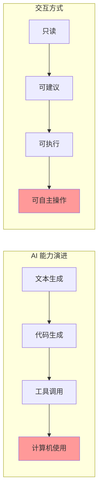
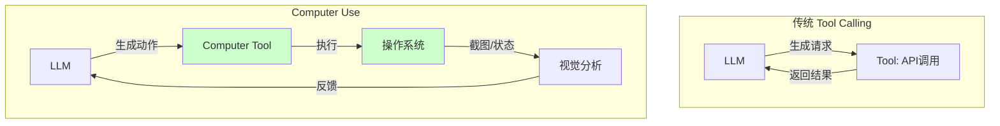
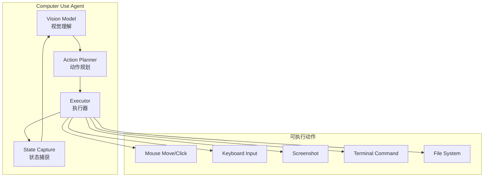
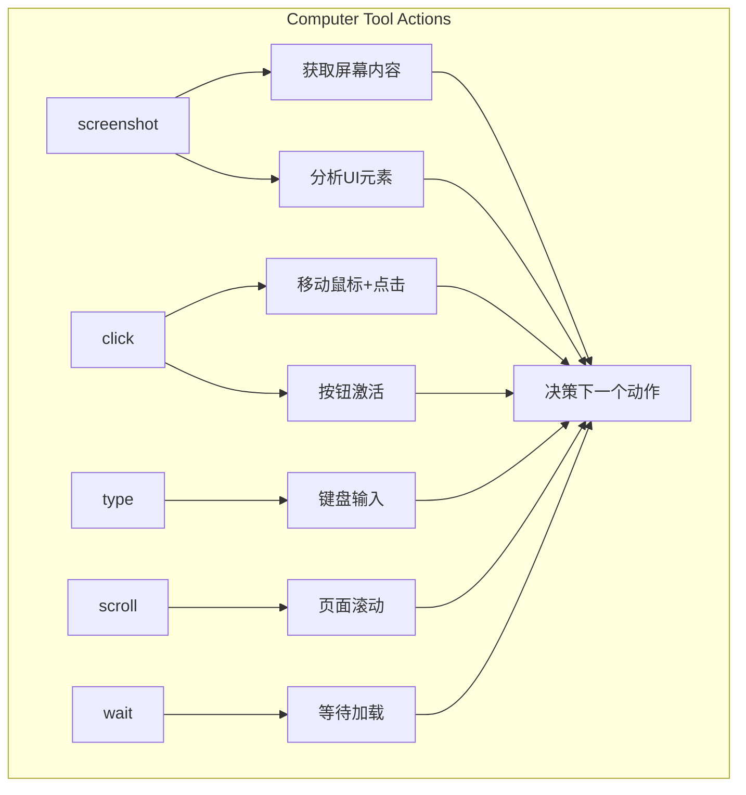
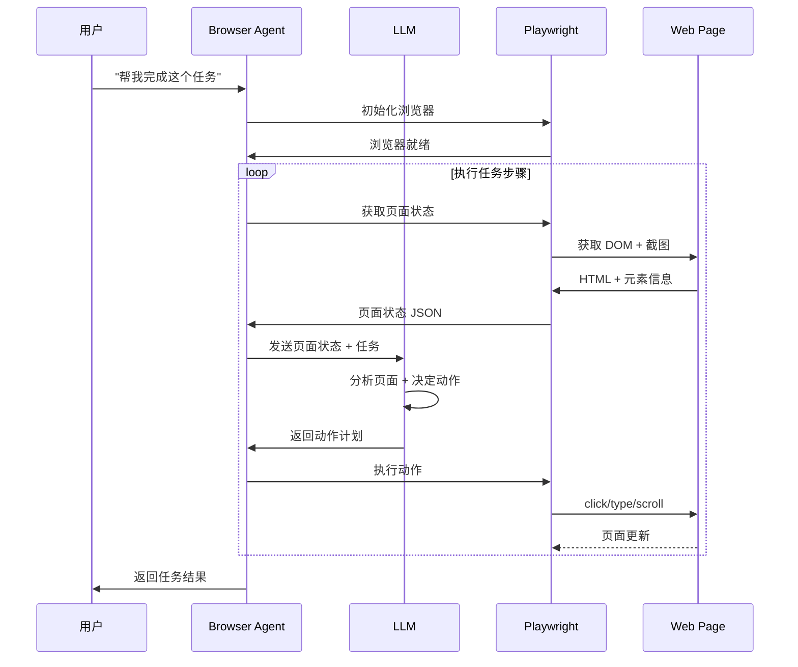
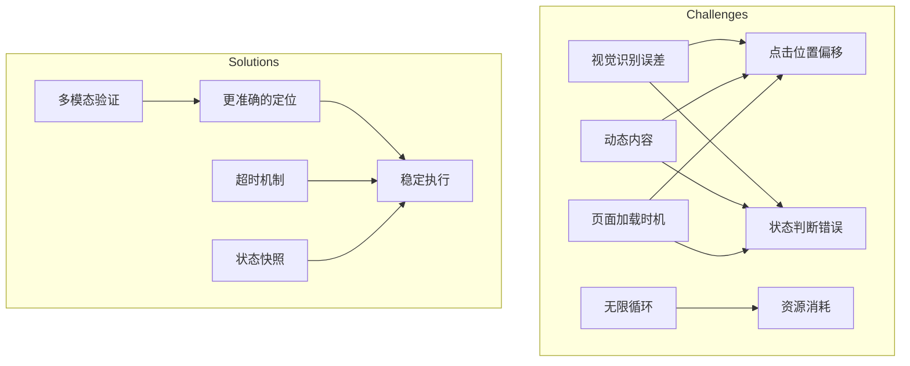

# Day 22: Computer Use Agent 实战 — 让 AI 真正掌控浏览器

> 📅 2026-04-03
> 🏷️ #AI #Agent #ComputerUse #Browser #Automation #Anthropic

## 昨日回顾

昨天我们学习了 [Day 21: AI Agent 与前端结合](./day21-react-agent-development.md)，掌握了 React Agent 组件开发与实时交互实现。

## 今日预告

明天我们将深入探讨 **AI Agent 部署与运维**，包括容器化部署、Kubernetes 编排、性能监控与自动扩缩容。敬请期待！

## 引言：AI 的"最后一次跨越"

从 GPT-3 到 ChatGPT，AI 跨越了"对话"到"推理"的鸿沟。

从 Claude Code 到 Computer Use，AI 正在跨越最后一道天堑：**从"阅读"到"操作"**。



**Computer Use（计算机使用）** 是 AI Agent 能力的质的飞跃 —— 它不再只是"建议"你做什么，而是真正去执行、去操作、去完成任务。

## 第一部分：Computer Use 核心技术原理

### 1.1 什么是 Computer Use？

Computer Use 是指 AI Agent 能够像人类一样操作计算机：
- 打开浏览器，访问网页
- 点击按钮、输入文本
- 滚动页面、截图分析
- 执行命令行操作文件系统



### 1.2 核心技术架构

Computer Use 的实现依赖于几个关键组件：



**关键能力：**
1. **视觉理解**：AI 能够"看懂"截图，理解 UI 元素的位置和功能
2. **动作空间**：定义 AI 可以执行的操作集合（点击、输入、滚动等）
3. **状态反馈**：每次操作后获取环境状态，形成闭环控制
4. **错误恢复**：操作失败时能够尝试替代方案

## 第二部分：Anthropic Computer Use 深度解析

### 2.1 Anthropic 的实现方案

Anthropic 在 Claude 3.5 Sonnet (new) 版本中引入了 Computer Use 能力：

```python
# 基础 Computer Use 配置
from anthropic import Anthropic

client = Anthropic()

# 启用 Computer Use
response = client.messages.create(
    model="claude-sonnet-4-20250514",
    max_tokens=1024,
    tools=[
        {
            "name": "computer",
            "description": "Use a virtual computer to perform actions",
            "input_schema": {
                "type": "object",
                "properties": {
                    "action": {
                        "type": "string",
                        "enum": ["screenshot", "click", "type", "scroll", "wait"],
                        "description": "The action to perform"
                    },
                    "coordinate": {
                        "type": "array",
                        "items": {"type": "integer"},
                        "description": "X, Y coordinates for mouse actions"
                    },
                    "text": {
                        "type": "string",
                        "description": "Text to type or search for"
                    }
                },
                "required": ["action"]
            }
        }
    ],
    messages=[
        {"role": "user", "content": "打开浏览器，搜索今天的天气"}
    ]
)
```

### 2.2 动作类型详解



**核心动作说明：**

| 动作 | 参数 | 说明 |
|------|------|------|
| `screenshot` | 可选 `output` | 获取当前屏幕截图，用于 AI 分析 |
| `click` | `coordinate: [x, y]` | 在指定坐标点击 |
| `type` | `text`, 可选 `coordinate` | 键盘输入，可指定聚焦位置 |
| `scroll` | `coordinate`, `direction` | 滚动页面 |
| `wait` | `seconds` | 等待页面加载 |

### 2.3 实战代码：构建完整的 Computer Use Agent

```python
import anthropic
import base64
import json
import time
from pathlib import Path
from dataclasses import dataclass
from typing import Optional, List, Dict, Any

@dataclass
class ComputerState:
    """计算机状态快照"""
    screenshot: Optional[str]  # Base64 编码的截图
    cursor_position: tuple[int, int]
    active_window: str
    viewport_size: tuple[int, int]

class ComputerUseAgent:
    """Computer Use Agent 实现"""
    
    def __init__(
        self,
        model: str = "claude-sonnet-4-20250514",
        api_key: Optional[str] = None
    ):
        self.client = anthropic.Anthropic(api_key=api_key)
        self.model = model
        self.max_iterations = 50  # 防止无限循环
        self.history: List[Dict[str, Any]] = []
        
    def get_screenshot(self) -> str:
        """获取屏幕截图（Base64 编码）"""
        import subprocess
        # macOS: 使用 screencapture
        result = subprocess.run(
            ["screencapture", "-x", "-t", "png", "/tmp/screen.png"],
            capture_output=True
        )
        with open("/tmp/screen.png", "rb") as f:
            return base64.b64encode(f.read()).decode()
    
    def build_tools(self) -> List[Dict]:
        """构建工具定义"""
        return [
            {
                "name": "computer",
                "description": "控制计算机执行各种操作",
                "input_schema": {
                    "type": "object",
                    "properties": {
                        "action": {
                            "type": "string",
                            "enum": [
                                "screenshot",
                                "click", 
                                "double_click",
                                "type",
                                "scroll",
                                "wait",
                                "open_app",
                                "key_combo"
                            ],
                        },
                        "coordinate": {
                            "type": "array",
                            "items": {"type": "integer"},
                            "description": "[x, y] 坐标"
                        },
                        "text": {"type": "string"},
                        "app": {"type": "string"},
                        "keys": {"type": "string"},
                    },
                    "required": ["action"]
                }
            }
        ]
    
    def execute_action(self, action: str, **kwargs) -> Dict:
        """执行具体的计算机动作"""
        import subprocess
        
        result = {"success": False, "output": ""}
        
        if action == "screenshot":
            # 截图并返回
            result["screenshot"] = self.get_screenshot()
            result["success"] = True
            
        elif action == "click":
            x, y = kwargs.get("coordinate", [0, 0])
            # 使用 clicl 或 osascript 模拟点击
            subprocess.run([
                "osascript", "-e", 
                f'tell app "System Events" to click at {{{x}, {y}}}'
            ])
            result["success"] = True
            
        elif action == "type":
            text = kwargs.get("text", "")
            subprocess.run(["osascript", "-e", f'tell app "System Events" to keystroke "{text}"'])
            result["success"] = True
            
        elif action == "key_combo":
            keys = kwargs.get("keys", "")
            # 处理修饰键组合如 "cmd+shift+t"
            parts = keys.split("+")
            modifiers = []
            key = parts[-1]
            for p in parts[:-1]:
                if p.lower() == "cmd":
                    modifiers.append("command")
                elif p.lower() == "shift":
                    modifiers.append("shift")
                elif p.lower() == "ctrl":
                    modifiers.append("control")
                elif p.lower() == "opt":
                    modifiers.append("option")
            
            script = 'tell app "System Events" to keystroke "{key}"'
            if modifiers:
                mod_str = ", ".join(modifiers)
                script = f'tell app "System Events" to keystroke "{key}" using {{mod_str}}}'
            
            subprocess.run(["osascript", "-e", script])
            result["success"] = True
            
        elif action == "scroll":
            x, y = kwargs.get("coordinate", [500, 500])
            direction = kwargs.get("direction", "down")
            delta = 300 if direction == "down" else -300
            subprocess.run([
                "osascript", "-e",
                f'tell app "System Events" to scroll wheel {delta}'
            ])
            result["success"] = True
            
        elif action == "open_app":
            app = kwargs.get("app", "")
            subprocess.run(["open", "-a", app])
            result["success"] = True
            
        elif action == "wait":
            seconds = kwargs.get("seconds", 1)
            time.sleep(seconds)
            result["success"] = True
            
        return result
    
    def run(self, task: str) -> str:
        """运行 Agent 执行任务"""
        messages = [{"role": "user", "content": task}]
        
        for i in range(self.max_iterations):
            # 调用模型
            response = self.client.messages.create(
                model=self.model,
                max_tokens=4096,
                tools=self.build_tools(),
                messages=messages
            )
            
            # 检查是否有工具调用
            if not response.content:
                break
                
            # 处理响应
            for block in response.content:
                if hasattr(block, "type") and block.type == "tool_use":
                    tool_name = block.name
                    tool_input = block.input
                    
                    # 执行动作
                    action = tool_input.get("action")
                    result = self.execute_action(action, **tool_input)
                    
                    # 添加到消息历史
                    messages.append({
                        "role": "assistant",
                        "content": f"使用工具: {tool_name}"
                    })
                    messages.append({
                        "role": "user",
                        "content": f"工具执行结果: {json.dumps(result)}"
                    })
                    
                elif hasattr(block, "type") and block.type == "text":
                    # 文本响应，任务完成
                    if i > 0:  # 不是第一轮
                        return block.text
            
            # 检查是否需要更多迭代
            if len(messages) > 20:
                # 压缩历史记录
                messages = messages[:5] + messages[-15:]
        
        return "任务达到最大迭代次数或无法完成"

# 使用示例
if __name__ == "__main__":
    agent = ComputerUseAgent()
    
    # 示例任务
    task = """打开浏览器，访问 google.com，在搜索框中输入 "AI Agent 
    development"，然后截图保存结果。"""
    
    result = agent.run(task)
    print(f"任务完成: {result}")
```

## 第三部分：UI 工程师的 Browser Agent 实战

### 3.1 使用 Playwright + AI 构建 Browser Agent

对于 UI 工程师来说，最熟悉的就是浏览器自动化。让我们结合 Playwright 和 AI 构建一个强大的 Browser Agent：

```python
# browser_agent.py
import asyncio
import base64
from playwright.async_api import async_playwright, Page, Browser
from openai import AsyncOpenAI
from typing import Optional, Dict, Any
import json

class BrowserAgent:
    """基于 Playwright 的 AI Browser Agent"""
    
    def __init__(self, api_key: str, model: str = "gpt-4o"):
        self.client = AsyncOpenAI(api_key=api_key)
        self.model = model
        self.browser: Optional[Browser] = None
        self.page: Optional[Page] = None
        self.conversation_history = []
        
    async def init_browser(self, headless: bool = False):
        """初始化浏览器"""
        playwright = await async_playwright().start()
        self.browser = await playwright.chromium.launch(headless=headless)
        self.page = await self.browser.new_page()
        # 设置更大的视口
        await self.page.set_viewport_size({"width": 1920, "height": 1080})
        
    async def close(self):
        """关闭浏览器"""
        if self.browser:
            await self.browser.close()
    
    async def get_page_state(self) -> Dict[str, Any]:
        """获取页面状态"""
        if not self.page:
            return {}
        
        # 获取页面 HTML
        html = await self.page.content()
        
        # 获取可交互元素
        elements = await self.page.evaluate("""
            () => {
                const allElements = document.querySelectorAll('a, button, input, select, textarea');
                return Array.from(allElements).map((el, idx) => ({
                    tag: el.tagName.toLowerCase(),
                    text: el.innerText?.substring(0, 50) || '',
                    placeholder: el.placeholder || '',
                    id: el.id || '',
                    classes: el.className || '',
                    rect: el.getBoundingClientRect()
                }));
            }
        """)
        
        # 截取屏幕截图
        screenshot_b64 = await self.page.screenshot(format="png")
        
        return {
            "html": html[:5000],  # 限制长度
            "elements": elements[:50],  # 限制元素数量
            "url": self.page.url,
            "title": await self.page.title(),
            "screenshot": base64.b64encode(screenshot_b64).decode()
        }
    
    def build_prompt(self, task: str, page_state: Dict) -> str:
        """构建提示词"""
        elements_desc = "\n".join([
            f"{i+1}. <{e['tag']}> {e['text'] or e['placeholder']} (id: {e['id']}, class: {e['classes']})"
            for i, e in enumerate(page_state.get("elements", [])[:20])
        ])
        
        return f"""你是一个浏览器自动化助手。当前页面状态：

URL: {page_state.get('url', 'N/A')}
标题: {page_state.get('title', 'N/A')}

可交互元素：
{elements_desc}

任务: {task}

请确定下一步操作。返回 JSON 格式：
{{
    "action": "click|type|scroll|wait|navigate|done",
    "selector": "CSS选择器或坐标 [x,y]",
    "value": "要输入的文本（如果适用）",
    "reason": "你为什么选择这个动作"
}}

如果任务完成，返回 {{"action": "done", "result": "任务结果描述"}}"""
    
    async def execute_action(self, action_plan: Dict) -> bool:
        """执行动作"""
        if not self.page:
            return False
            
        action = action_plan.get("action")
        
        if action == "navigate":
            url = action_plan.get("selector")
            await self.page.goto(url, wait_until="domcontentloaded")
            await self.page.wait_for_load_state("networkidle")
            return True
            
        elif action == "click":
            selector = action_plan.get("selector", "")
            if selector.startswith("["):
                # 坐标格式 [x, y]
                import ast
                x, y = ast.literal_eval(selector)
                await self.page.mouse.click(x, y)
            else:
                # CSS 选择器
                await self.page.click(selector)
            return True
            
        elif action == "type":
            selector = action_plan.get("selector")
            value = action_plan.get("value", "")
            if selector.startswith("["):
                import ast
                x, y = ast.literal_eval(selector)
                await self.page.mouse.click(x, y)
                await self.page.keyboard.type(value)
            else:
                await self.page.fill(selector, value)
            return True
            
        elif action == "scroll":
            selector = action_plan.get("selector", "")
            if selector:
                await self.page.evaluate(f'document.querySelector("{selector}").scrollIntoView()')
            else:
                await self.page.mouse.wheel(0, 500)
            return True
            
        elif action == "wait":
            await self.page.wait_for_load_state("networkidle")
            return True
            
        elif action == "done":
            return True
            
        return False
    
    async def run(self, task: str, max_steps: int = 30) -> str:
        """运行 Browser Agent"""
        if not self.browser:
            await self.init_browser()
        
        self.conversation_history = [
            {"role": "system", "content": "你是一个浏览器自动化助手，能够控制浏览器完成各种任务。"}
        ]
        
        for step in range(max_steps):
            # 获取页面状态
            page_state = await self.get_page_state()
            
            # 构建提示
            prompt = self.build_prompt(task, page_state)
            self.conversation_history.append({
                "role": "user", 
                "content": f"页面状态:\n{json.dumps(page_state, ensure_ascii=False)[:2000]}\n\n{prompt}"
            })
            
            # 调用 AI 决定下一步
            response = await self.client.chat.completions.create(
                model=self.model,
                messages=self.conversation_history,
                temperature=0.7,
                max_tokens=1000
            )
            
            content = response.choices[0].message.content
            
            # 解析动作计划
            try:
                # 尝试提取 JSON
                import re
                json_match = re.search(r'\{[^{}]*\}', content, re.DOTALL)
                if json_match:
                    action_plan = json.loads(json_match.group())
                else:
                    action_plan = json.loads(content)
            except:
                continue
            
            # 执行动作
            if action_plan.get("action") == "done":
                return action_plan.get("result", "任务完成")
            
            success = await self.execute_action(action_plan)
            if not success:
                self.conversation_history.append({
                    "role": "assistant",
                    "content": content
                })
                self.conversation_history.append({
                    "role": "user",
                    "content": "动作执行失败，请重试"
                })
        
        return "达到最大步骤限制，任务未完成"

# 使用示例
async def main():
    agent = BrowserAgent(api_key="your-api-key")
    
    try:
        await agent.init_browser(headless=False)
        result = await agent.run("打开百度，搜索 'AI Agent'，点击第一个搜索结果")
        print(f"任务结果: {result}")
    finally:
        await agent.close()

if __name__ == "__main__":
    asyncio.run(main())
```

### 3.2 架构图：Browser Agent 工作流程



## 第四部分：Computer Use 的进阶应用场景

### 4.1 自动化测试场景

```python
class AutomationTestAgent:
    """自动化测试 Agent"""
    
    def __init__(self, browser_agent: BrowserAgent):
        self.browser = browser_agent
        
    async def test_login_flow(self, credentials: Dict[str, str]) -> Dict:
        """测试登录流程"""
        steps = [
            {"action": "navigate", "selector": "https://example.com/login"},
            {"action": "wait", "selector": ""},
            {"action": "type", "selector": "#username", "value": credentials["username"]},
            {"action": "type", "selector": "#password", "value": credentials["password"]},
            {"action": "click", "selector": "button[type=submit]"},
            {"action": "wait", "selector": ""},
            {"action": "screenshot", "selector": ""},
        ]
        
        results = []
        for step in steps:
            await self.browser.execute_action(step)
            state = await self.browser.get_page_state()
            results.append({
                "step": step,
                "url": state["url"],
                "screenshot": state.get("screenshot")
            })
        
        return {
            "passed": "dashboard" in state["url"] or "home" in state["url"],
            "steps": results,
            "final_url": state["url"]
        }
```

### 4.2 数据抓取场景

```python
class WebScraperAgent:
    """网页数据抓取 Agent"""
    
    def __init__(self, browser_agent: BrowserAgent):
        self.browser = browser_agent
        
    async def scrape_product_list(self, url: str, max_items: int = 20) -> List[Dict]:
        """抓取商品列表"""
        await self.browser.execute_action({"action": "navigate", "selector": url})
        await self.browser.execute_action({"action": "wait", "selector": ""})
        
        items = []
        while len(items) < max_items:
            state = await self.browser.get_page_state()
            
            # AI 分析页面结构
            prompt = f"""分析当前页面，提取商品信息。
            当前页面URL: {state['url']}
            可交互元素: {state['elements'][:10]}
            
            返回 JSON 格式:
            {{
                "products": [
                    {{"name": "商品名称", "price": "价格", "link": "商品链接"}}
                ],
                "next_page": "下一页按钮的CSS选择器，如果没有则为空"
            }}"""
            
            # 调用 AI 分析（简化版）
            # ... 分析逻辑 ...
            
            # 翻页
            if not next_page_selector:
                break
                
            await self.browser.execute_action({
                "action": "click",
                "selector": next_page_selector
            })
        
        return items
```

### 4.3 表单自动化场景

```python
class FormFillingAgent:
    """表单填写 Agent"""
    
    def __init__(self, browser_agent: BrowserAgent):
        self.browser = browser_agent
        
    async def fill_form(self, url: str, form_data: Dict) -> bool:
        """自动填写表单"""
        await self.browser.execute_action({"action": "navigate", "selector": url})
        await self.browser.execute_action({"action": "wait", "selector": ""})
        
        state = await self.browser.get_page_state()
        
        # AI 分析表单结构并填写
        for field_name, value in form_data.items():
            # 智能匹配字段
            selector = self._find_field_selector(state["elements"], field_name)
            if selector:
                await self.browser.execute_action({
                    "action": "type",
                    "selector": selector,
                    "value": str(value)
                })
        
        # 提交表单
        await self.browser.execute_action({
            "action": "click", 
            "selector": "button[type=submit]"
        })
        
        await self.browser.execute_action({"action": "wait", "selector": ""})
        final_state = await self.browser.get_page_state()
        
        # 检查是否成功
        return "success" in final_state["url"].lower() or "thank" in final_state["title"].lower()
    
    def _find_field_selector(self, elements: List[Dict], field_name: str) -> Optional[str]:
        """智能匹配字段选择器"""
        field_lower = field_name.lower()
        
        for elem in elements:
            # 检查各种可能匹配的属性
            if (field_lower in elem.get("text", "").lower() or
                field_lower in elem.get("placeholder", "").lower() or
                field_lower in elem.get("id", "").lower()):
                # 返回坐标形式（简化版）
                rect = elem.get("rect", {})
                x = int(rect.get("x", 0) + rect.get("width", 0) / 2)
                y = int(rect.get("y", 0) + rect.get("height", 0) / 2)
                return f"[{x}, {y}]"
        
        return None
```

## 第五部分：Computer Use 的挑战与解决方案

### 5.1 主要挑战



### 5.2 解决方案

```python
class RobustBrowserAgent:
    """增强鲁棒性的 Browser Agent"""
    
    def __init__(self, *args, **kwargs):
        super().__init__(*args, **kwargs)
        self.retry_count = 3
        self.step_timeout = 30
        
    async def safe_execute_action(self, action_plan: Dict) -> bool:
        """安全执行动作（带重试）"""
        for attempt in range(self.retry_count):
            try:
                # 设置超时
                await asyncio.wait_for(
                    self.execute_action(action_plan),
                    timeout=self.step_timeout
                )
                
                # 验证动作效果
                state = await self.get_page_state()
                if self._verify_action(action_plan, state):
                    return True
                    
            except asyncio.TimeoutError:
                print(f"步骤超时，重试 {attempt + 1}/{self.retry_count}")
            except Exception as e:
                print(f"执行错误: {e}")
                
        return False
    
    def _verify_action(self, action_plan: Dict, state: Dict) -> bool:
        """验证动作是否成功执行"""
        action = action_plan.get("action")
        
        if action == "navigate":
            return action_plan.get("selector", "") in state.get("url", "")
        
        if action == "click" or action == "type":
            # 检查页面是否发生了变化
            return True  # 简化版
        
        if action == "wait":
            return True
            
        return True
```

## 总结与展望

**今天我们学到了：**

1. **Computer Use 核心概念**：AI 从"阅读"到"操作"的飞跃
2. **Anthropic 实现方案**：Computer Use 的技术架构
3. **Playwright + AI 实战**：UI 工程师熟悉的浏览器自动化
4. **进阶应用场景**：自动化测试、数据抓取、表单填写
5. **鲁棒性增强**：重试机制、超时控制、状态验证

**下节预告：**

明天我们将深入探讨 **AI Agent 部署与运维**，包括容器化部署、Kubernetes 编排、性能监控与自动扩缩容。敬请期待！

---

*本系列文章将持续更新，欢迎关注。一起成为 AI Agent 工程师！*
