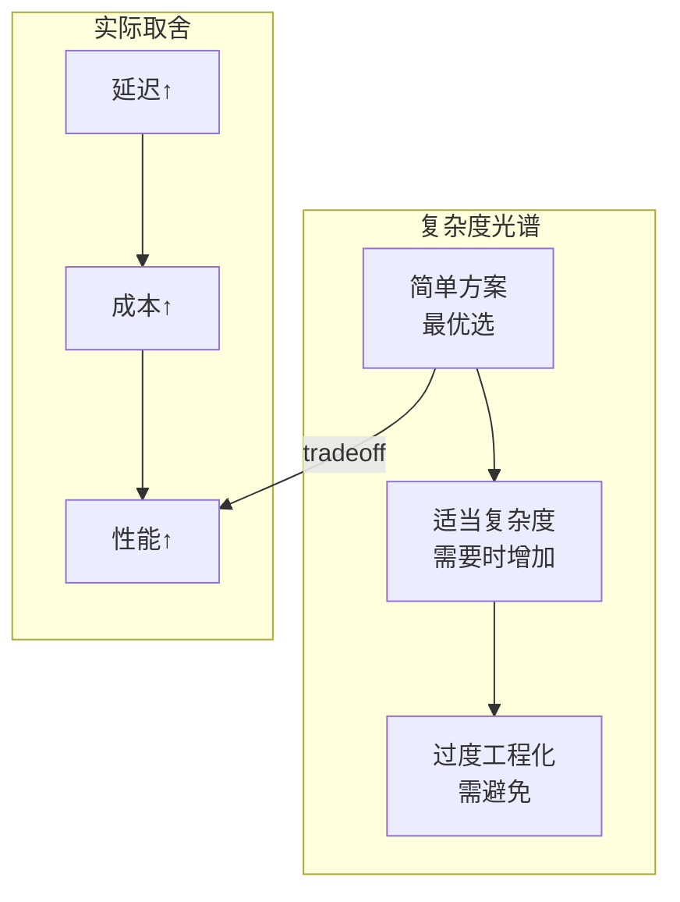
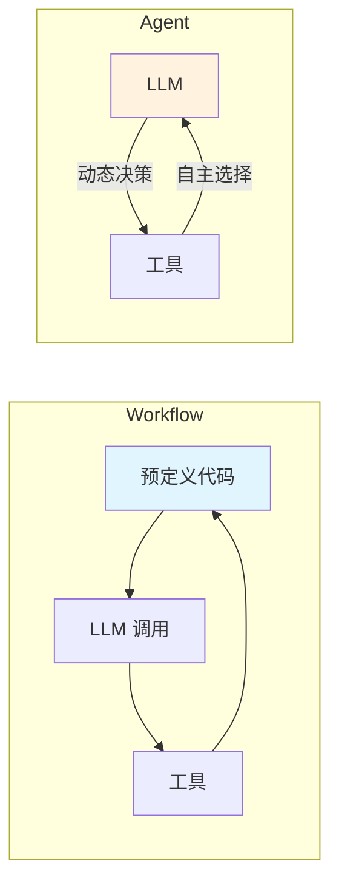
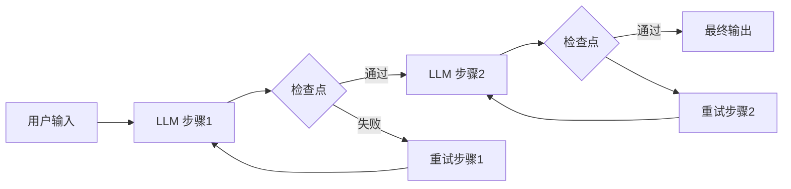
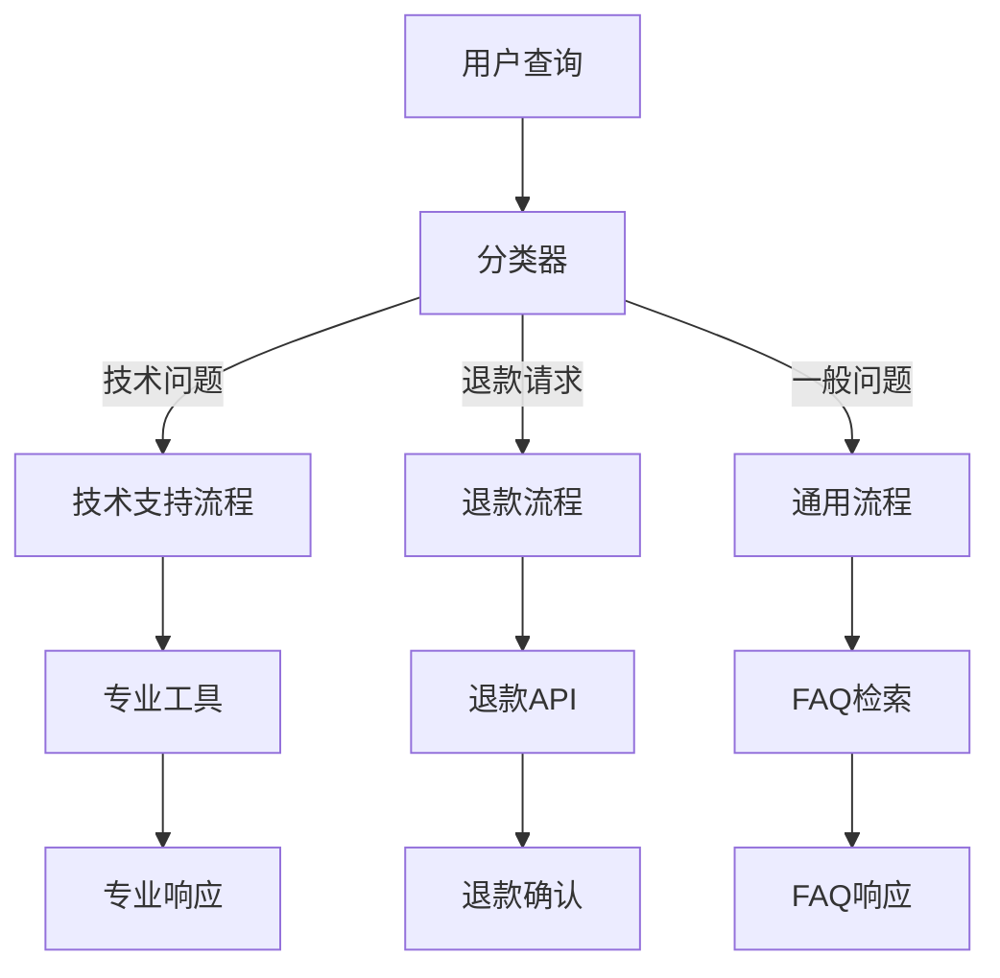
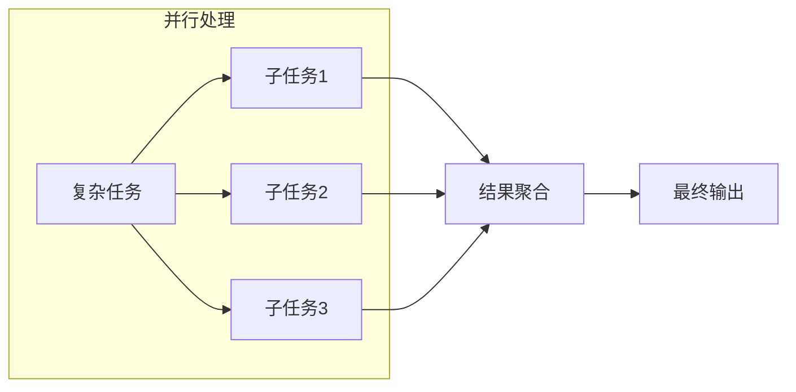
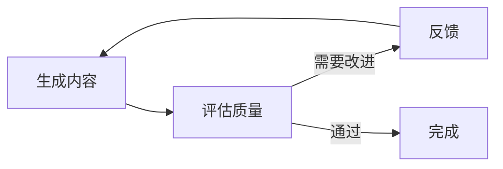
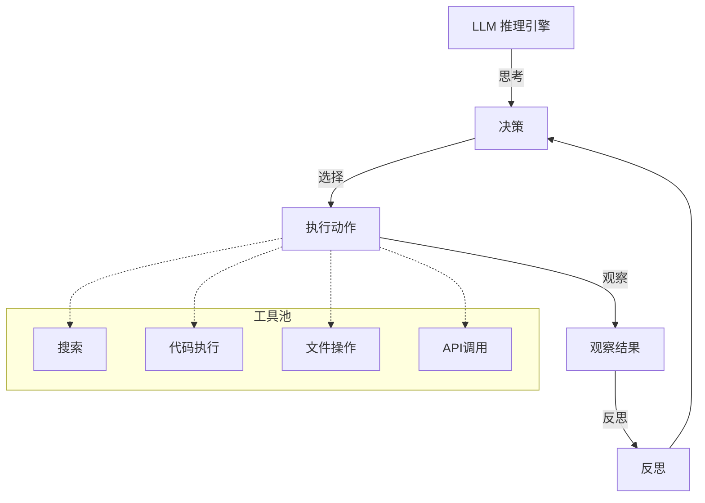
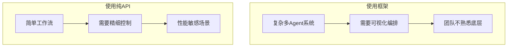
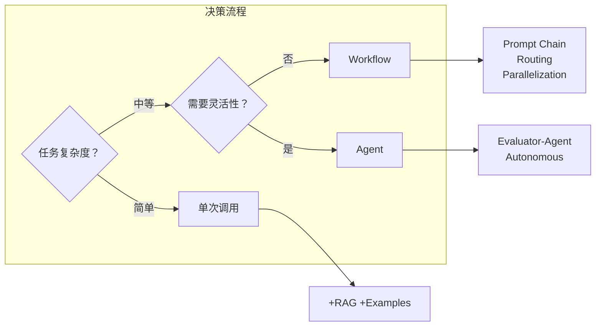

# Day 23: 生产环境 Agent 设计模式 — 来自 Anthropic 的最佳实践

> 📅 2026-04-04
> 🏷️ #AI #Agent #DesignPatterns #Production #Anthropic

## 昨日回顾

昨天我们学习了 [Day 22: Computer Use Agent 实战](./day22-computer-use-agent.md)，掌握了 AI 操控计算机的核心技术。

## 今日预告

明天我们将深入探讨 **Agent 安全性与防护机制**，包括提示注入攻击防御、权限控制与审计。敬请期待！

## 引言：从理论到生产的桥梁

过去一年，Anthropic 与数十个团队合作构建 LLM Agent，积累了丰富的生产经验。

**核心发现：最成功的实现往往不是最复杂的。**

本文将分享 Anthropic 在生产环境中验证有效的 Agent 设计模式，帮助 UI 工程师转型 AI Agent 工程师。



---

## 第一部分：理解 Agent 与 Workflow 的本质区别

### 1.1 核心定义

| 概念 | 定义 | 控制方式 |
|------|------|----------|
| **Workflow** | 通过预定义代码路径编排 LLM 和工具 | 代码控制 |
| **Agent** | LLM 动态指导自己的流程和工具使用 | 模型驱动 |



### 1.2 何时使用 Agent？

**推荐优先级：**
1. 优化单次 LLM 调用（检索 + 上下文示例）
2. 使用 Workflow（可预测、一致）
3. 升级为 Agent（需要灵活性、模型驱动决策）

```python
# 简单方案优先 - 单次 LLM 调用示例
def answer_user_question(question: str) -> str:
    # 1. 检索相关上下文
    context = retrieval.search(question)
    
    # 2. 构建带示例的提示
    prompt = f"""问题: {question}
    
参考上下文:
{context}

示例回答:
Q: 如何注册？
A: 点击右上角注册按钮...
    
请根据上下文回答:"""
    
    # 3. 调用 LLM
    return llm.complete(prompt)
```

---

## 第二部分：五大核心设计模式

### 2.1 模式一：Prompt Chaining（提示链）

**原理：** 将任务分解为序列步骤，每个 LLM 调用处理前一个的输出。



**代码实现：**

```python
from typing import TypedDict
from langgraph.graph import StateGraph

# 定义状态
class BlogPostState(TypedDict):
    topic: str
    outline: str
    content: str
    approved: bool

# 步骤1: 生成大纲
def generate_outline(state: BlogPostState) -> BlogPostState:
    prompt = f"为主题 '{state['topic']}' 生成文章大纲"
    outline = llm.complete(prompt)
    return {**state, "outline": outline}

# 步骤2: 检查大纲质量
def check_outline(state: BlogPostState) -> BlogPostState:
    prompt = f"""评估以下大纲是否完整:
{state['outline']}

检查要点:
- 结构清晰
- 主题覆盖全面
- 逻辑连贯

返回: approved (true/false)"""
    result = llm.complete(prompt)
    approved = "true" in result.lower()
    return {**state, "approved": approved}

# 步骤3: 生成内容
def generate_content(state: BlogPostState) -> BlogPostState:
    if not state["approved"]:
        raise ValueError("大纲未通过审核")
    
    prompt = f"""根据大纲生成文章:
{state['outline']}"""
    content = llm.complete(prompt)
    return {**state, "content": content}

# 构建工作流
graph = StateGraph(BlogPostState)
graph.add_node("outline", generate_outline)
graph.add_node("check", check_outline)
graph.add_node("content", generate_content)

graph.add_edge("__root__", "outline")
graph.add_edge("outline", "check")
graph.add_conditional_edges("check", 
    lambda s: "content" if s["approved"] else "outline")
graph.add_edge("content", "__root__")
```

**适用场景：**
- 营销文案生成 → 翻译
- 文档大纲 → 检查 → 撰写
- 多阶段审核流程

---

### 2.2 模式二：Routing（路由）

**原理：** 分类输入并定向到专门的后续任务。



**代码实现：**

```python
from enum import Enum
from typing import Union

class QueryType(Enum):
    TECHNICAL = "technical"
    REFUND = "refund"
    GENERAL = "general"

def classify_query(query: str) -> QueryType:
    """使用 LLM 或传统分类器"""
    # 方法1: 小模型快速分类
    if contains_keywords(query, ["bug", "error", "crash"]):
        return QueryType.TECHNICAL
    if contains_keywords(query, ["退款", "退货", "取消订单"]):
        return QueryType.REFUND
    
    # 方法2: LLM 分类（复杂场景）
    prompt = f"""分类这个用户查询:
{query}

可选类型: technical, refund, general"""
    result = llm.complete(prompt)
    return QueryType(result.strip())

# 路由逻辑
def route_query(query: str) -> str:
    query_type = classify_query(query)
    
    if query_type == QueryType.TECHNICAL:
        return handle_technical(query)
    elif query_type == QueryType.REFUND:
        return handle_refund(query)
    else:
        return handle_general(query)

# 模型选择路由（成本优化）
def route_by_complexity(query: str) -> str:
    """简单问题用小模型，复杂问题用大模型"""
    complexity = assess_complexity(query)
    
    if complexity == "simple":
        # Haiku: 快速、便宜
        return llm.complete(query, model="claude-haiku")
    else:
        # Sonnet: 高性能
        return llm.complete(query, model="claude-sonnet")
```

**适用场景：**
- 客户服务分流
- 问题复杂度评估 + 模型选择
- 多渠道输入处理

---

### 2.3 模式三：Parallelization（并行化）

**原理：** LLM 同时处理任务，结果聚合。



**两种变体：**

```python
import asyncio
from typing import List

# 变体1: Sectioning - 独立子任务并行
async def process_sections_parallel(text: str, sections: List[str]) -> List[str]:
    """不同部分并行处理"""
    tasks = [
        process_section(text, section) 
        for section in sections
    ]
    results = await asyncio.gather(*tasks)
    return results

# 变体2: Voting - 同一任务多次执行获取多样性
def generate_with_voting(prompt: str, n: int = 3) -> str:
    """多次生成，投票选择最佳结果"""
    responses = [
        llm.complete(prompt, temperature=0.8)  # 高随机性
        for _ in range(n)
    ]
    
    # 使用 LLM 选择最佳答案
    selection_prompt = f"""以下哪个答案最准确?

A: {responses[0]}
B: {responses[1]}
C: {responses[2]}

返回字母:"""
    return llm.complete(selection_prompt)

# 实际应用：Guardrails 并行检查
async def parallel_guardrails(content: str) -> dict:
    """同时检查多个安全维度"""
    checks = await asyncio.garth(
        check_toxicity(content),
        check_pii_leakage(content),
        check_copyright(content),
        check_hate_speech(content)
    )
    
    return {
        "passed": all(checks),
        "details": checks
    }
```

**适用场景：**
- 安全审查（多维度同时检查）
- 代码审查（多个视角）
- 复杂决策（多方案投票）

---

### 2.4 模式四：Evaluator-Optimizer（评估优化）

**原理：** LLM 生成内容，另一个 LLM 评估，然后迭代优化。



**代码实现：**

```python
class EvaluatorOptimizerAgent:
    def __init__(self, generator_llm, evaluator_llm):
        self.generator = generator_llm
        self.evaluator = evaluator_llm
    
    def generate_with_feedback(self, prompt: str, max_iterations: int = 3) -> str:
        current_output = self.generator.complete(prompt)
        
        for i in range(max_iterations):
            # 评估
            evaluation = self.evaluate(current_output, prompt)
            
            if evaluation["score"] >= evaluation["threshold"]:
                return current_output
            
            # 生成改进反馈
            feedback = self.generate_feedback(evaluation)
            
            # 应用反馈重新生成
            current_output = self.generator.complete(
                f"""{prompt}

上次输出:
{current_output}

改进建议:
{feedback}"""
            )
        
        return current_output
    
    def evaluate(self, output: str, original_prompt: str) -> dict:
        eval_prompt = f"""评估以下输出是否满足要求:

原始需求: {original_prompt}

输出: {output}

评估维度:
1. 准确性 (1-10)
2. 完整性 (1-10)
3. 可读性 (1-10)

JSON格式返回:
{{"score": 8.5, "issues": ["..."], "threshold": 8}}"""
        
        result = self.evaluator.complete(eval_prompt)
        return json.loads(result)
```

**适用场景：**
- 代码生成 → 代码审查循环
- 文案生成 → 质量评估
- 复杂任务迭代优化

---

### 2.5 模式五：Agent（自主决策）

**原理：** LLM 完全控制任务执行流程，自主选择工具和策略。



**代码实现：**

```python
from typing import List, Callable
from dataclasses import dataclass

@dataclass
class Tool:
    name: str
    description: str
    function: Callable

class AutonomousAgent:
    def __init__(self, llm, tools: List[Tool], max_steps: int = 20):
        self.llm = llm
        self.tools = {t.name: t for t in tools}
        self.max_steps = max_steps
    
    def run(self, task: str) -> str:
        context = [{"role": "user", "content": task}]
        
        for step in range(self.max_steps):
            # 1. LLM 决定下一步行动
            decision = self.llm.complete(
                self._build_prompt(context),
                tools=self._get_tool_schemas()
            )
            
            # 2. 执行工具调用
            if decision.tool_calls:
                for call in decision.tool_calls:
                    tool = self.tools[call.name]
                    result = tool.function(**call.arguments)
                    
                    # 3. 将结果添加到上下文
                    context.append({
                        "role": "assistant",
                        "content": None,
                        "tool_calls": [call]
                    })
                    context.append({
                        "role": "tool",
                        "name": call.name,
                        "content": result
                    })
            
            # 4. 检查是否完成
            if decision.finish_reason == "stop":
                return decision.content
        
        return "达到最大步数限制"
    
    def _build_prompt(self, context: List[dict]) -> str:
        # 构建系统提示，包含可用工具描述
        system = """你是一个自主Agent，可以:
- 搜索信息
- 执行代码
- 读取/写入文件
- 调用API

逐步思考，选择最佳行动。"""
        # ... 拼接上下文
```

**适用场景：**
- 复杂研究任务
- 端到端自动化流程
- 需要灵活适应的情况

---

## 第三部分：框架 vs 纯 API

### 3.1 何时使用框架？



**常见框架：**
- Claude Agent SDK
- LangGraph
- AWS Strands Agents
- Rivet（可视化）
- Vellum（可视化）

### 3.2 推荐的起步方式

```python
# 从简单实现开始 - 很多模式可以用少量代码实现

# Prompt Chaining（纯API）
output1 = llm.complete(step1_prompt)
output2 = llm.complete(step2_prompt.format(output1))

# Routing（纯API）
query_type = classify(query)
response = route(query, query_type)

# Parallelization（asyncio）
results = await asyncio.gather(*[process(x) for x in items])

# 只有当纯API方案变得复杂时，才考虑框架
```

---

## 第四部分：UI 工程师转型路径

### 4.1 技能映射

| UI 技能 | Agent 技能 | 相似点 |
|---------|------------|--------|
| React 组件 | Agent 工具定义 | 组件化思维 |
| 状态管理 | Agent 上下文 | 状态传递 |
| API 设计 | Tool Schema | 接口定义 |
| 单元测试 | Agent 评估 | 质量保证 |

### 4.2 实践建议

```bash
# 1. 从简单模式开始
# 优先优化单次 LLM 调用

# 2. 逐步增加复杂度
# Prompt Chain → Routing → Parallelization → Agent

# 3. 理解底层原理
# 阅读框架源码，不要被抽象层迷惑

# 4. 建立评估体系
# 任何 Agent 都应该可测量、可评估
```

### 4.3 学习资源

- [Anthropic: Building Effective Agents](https://www.anthropic.com/engineering/building-effective-agents)
- [Claude Code 文档](https://docs.anthropic.com/en/docs/claude-code/overview)
- [LangGraph 教程](https://langchain.github.io/langgraph/)

---

## 总结

**核心要点：**

1. **简单优先**：从单次 LLM 调用开始，只在需要时增加复杂度
2. **模式选择**：根据需求选择合适的设计模式
3. **理解 tradeoff**：复杂度增加意味着延迟和成本增加
4. **评估重要**：没有评估的 Agent = 盲人骑瞎马



---

## 明日预告

明天我们将深入探讨 **Agent 安全性与防护机制**，包括提示注入攻击防御、权限控制与审计。敬请期待！

## 参考资料

- Anthropic Engineering Blog: Building Effective Agents
- Claude Code 官方文档
- LangGraph 文档
